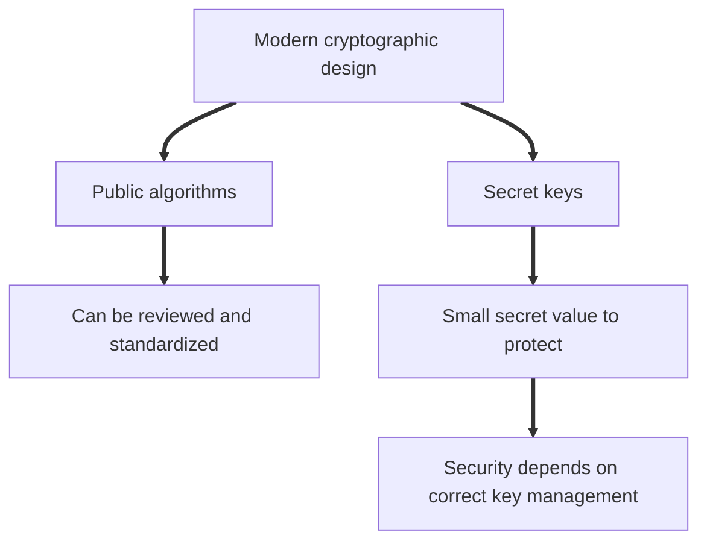
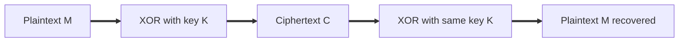
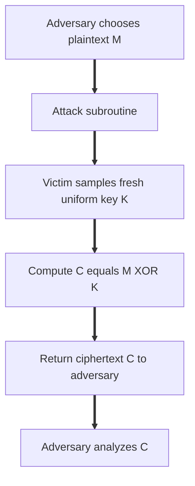
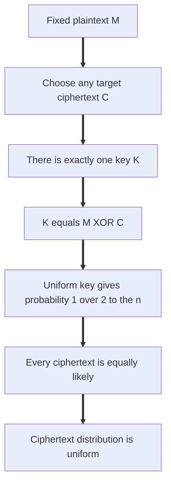
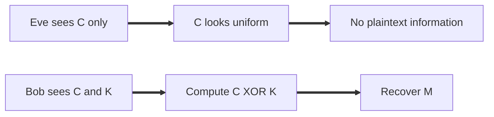
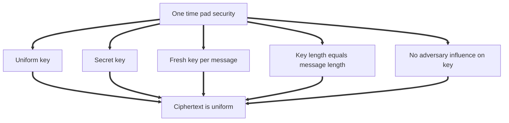
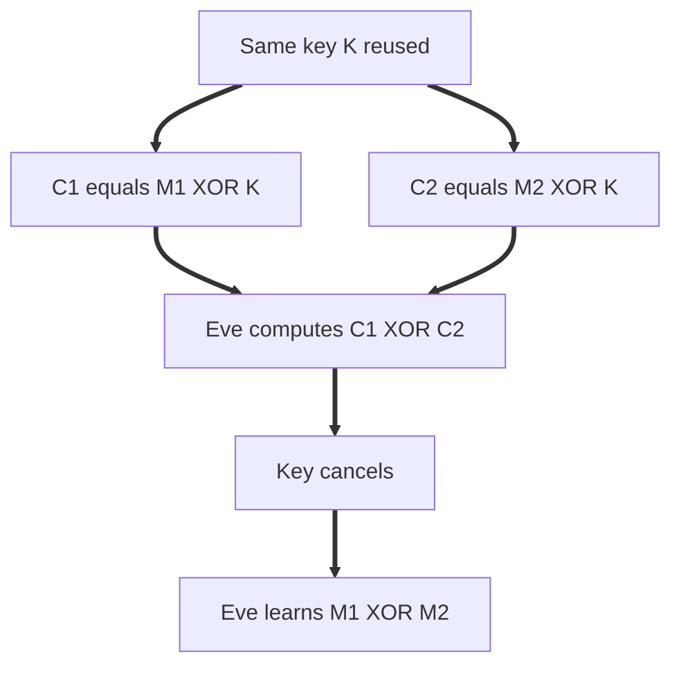
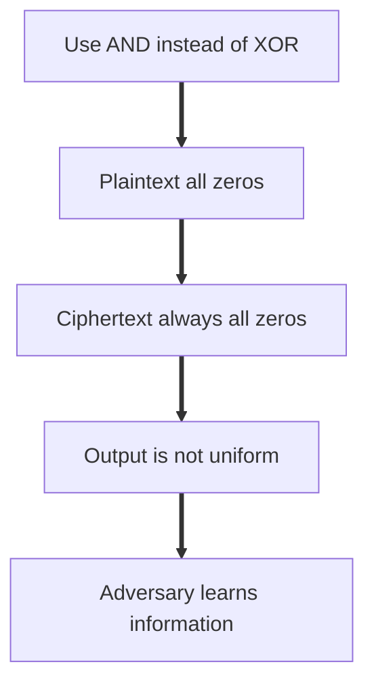
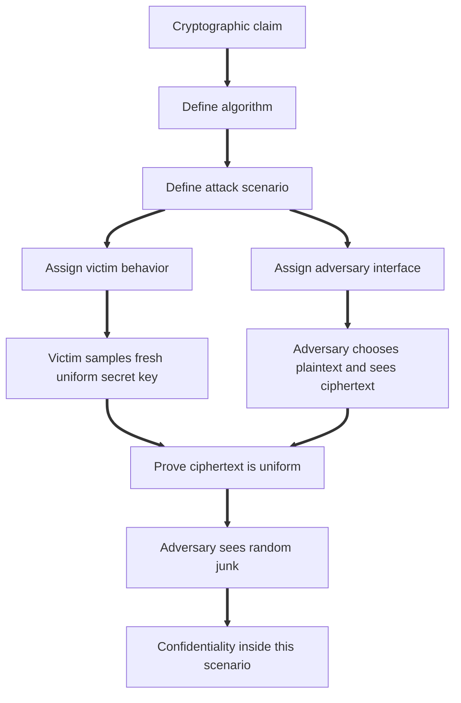

# Topic 1.2: The Provable Security Mindset

## Assessment Window
- Midterm track

## Overview
Perfect secrecy, one-time pad guarantees and limitations, and Kerckhoff's principle.

## Required Readings
- The Joy of Cryptography, Chapter 0: Review of Concepts & Notation.
- The Joy of Cryptography, Chapter 1: The Provable Security Mindset.

## Optional Readings
- Add optional reading links here.

## Materials
- [ ] Slides
- [ ] Quiz


# Slide Notes


## Applied Cryptography Notes

**Slides:** *Applied Cryptography, Summer 2026, Part 1: Provable Security, 1.2: The Provable Security Mindset*
**Author:** Nadim Kobeissi
**Source:** Symbolic Software
**Main topic:** How to think about cryptographic security through precise models, adversaries, assumptions, proofs, and the gap between mathematical guarantees and deployed systems. 

---

## 1. Core Idea

The slides introduce the **provable security mindset**.

The main idea is:

```text id="b9n6lt"
Do not say a cryptographic system is secure in an informal way.

Define exactly what security means.

Define exactly what the attacker can do.

Define exactly what assumptions must hold.

Then prove that the attacker cannot win except with negligible or impossible advantage.
```

Cryptography is not only about designing an algorithm. It is about defining a security game, defining the attacker model, proving a property inside that model, and then understanding where the model stops matching reality.

## Note

A security proof is not a magical certificate of real world security.

A proof says:

```text id="ss9nbx"
If these assumptions hold,
and the attacker is limited in this specific way,
then this security property follows.
```

The engineering task is to verify whether the assumptions actually hold in the deployed system.

---

## 2. Math Foundations

The first section reviews mathematical notation needed for provable security.

Important concepts:

1. Exponents.

2. Logarithms.

3. Modular arithmetic.

4. Binary strings.

5. Probability distributions.

6. Uniform sampling.

7. Pseudocode notation. 

Important exponent identities:

```text id="sdttqq"
(x^a)(x^b) = x^(a+b)

(x^a)^b = x^(ab)

log_x(ab) = log_x(a) + log_x(b)
```

The slides warn against a common mistake:

```text id="y7vatm"
(x^a)(x^b) is not x^(ab)
```

## Note

This matters because cryptographic reasoning is extremely sensitive to algebraic mistakes.

One wrong exponent identity can completely invalidate a proof, a protocol analysis, or a security reduction.

---

## 3. Modular Arithmetic

The slides define modular arithmetic as the operation that returns the remainder after division.

```text id="asq58h"
a mod n gives the remainder when a is divided by n
```

The result is always in:

```text id="70pk1x"
{0, 1, ..., n minus 1}
```

Example:

```text id="by52g2"
21 mod 7 = 0

20 mod 7 = 6
```

The slides also use clock arithmetic to explain modular arithmetic. A 12 hour clock is arithmetic modulo 12. If it is 9 o’clock and 7 hours pass, the result is 4 o’clock because the value wraps around. 

## Note

Modular arithmetic is foundational in cryptography.

It appears in:

1. RSA.

2. Diffie Hellman.

3. Elliptic curve cryptography.

4. Finite fields.

5. Group operations.

6. Hash based constructions.

7. Protocol counters and sequence numbers.

The important engineering point is that modulo behavior must be explicit. Silent overflow, language dependent integer behavior, and inconsistent encoding can create implementation bugs.

---

## 4. Binary Strings

The slides define binary strings using:

```text id="o8plwo"
{0, 1}^n
```

This means the set of all binary strings of length `n`.

Examples:

```text id="rwrt3b"
{0, 1}^1 = {0, 1}

{0, 1}^2 = {00, 01, 10, 11}
```

The notation:

```text id="9f5ukn"
|x|
```

means the length of string `x`.

The notation:

```text id="m8xelr"
0^n
```

means a string of `n` zero bits.

The notation:

```text id="fe55x4"
1^n
```

means a string of `n` one bits. 

## Note

Cryptographic definitions are usually stated over bitstrings.

This is important because real implementations must serialize everything into bytes and bits.

A proof may reason about abstract bitstrings, but production systems must define:

1. Encoding.

2. Endianness.

3. Padding.

4. Length prefixes.

5. Domain separation tags.

6. Version bytes.

7. Error behavior for malformed inputs.

A secure proof does not automatically solve serialization ambiguity.

---

## 5. Probability Basics

The slides define a probability distribution as an assignment of probabilities to outcomes.

For every outcome `x`:

```text id="hpzq7t"
0 ≤ Pr[x] ≤ 1
```

The sum of all probabilities must be:

```text id="7l5sxn"
1
```

A uniform distribution assigns equal probability to every item in a set.

If set `X` has `m` items, then:

```text id="flidnl"
Pr[x] = 1 / m
```

for every `x` in `X`. 

## Note

Uniformity is one of the most important assumptions in cryptography.

If a key is supposed to be sampled uniformly but is biased, predictable, or attacker influenced, the proof may no longer apply.

Common real world failures:

1. Weak random number generators.

2. Low entropy boot environments.

3. Reused randomness.

4. Biased nonce generation.

5. Deterministic test keys accidentally deployed.

6. Virtual machines cloned with the same entropy state.

7. Embedded devices generating keys before enough entropy is available.

---

## 6. Pseudocode Notation

The slides use three important notations:

```text id="jgq9c6"
x ↞ X
```

means sample `x` uniformly from set `X`.

```text id="l61318"
x := 5
```

means assign value `5` to `x`.

```text id="ywuo6d"
x ?= y
```

means check whether `x` equals `y`.

## Note

This notation is not cosmetic. It separates assignment, sampling, and comparison.

That distinction matters because cryptographic proofs depend on whether a value is chosen randomly, computed deterministically, or checked by an adversary visible condition.

For example:

```text id="d4b60d"
K ↞ {0, 1}^n
```

means the key is sampled uniformly.

This is much stronger than saying:

```text id="l0w2g8"
K := user password
```

The first may satisfy a proof assumption. The second almost certainly does not.

---

## 7. The Provable Security Mindset

The second section begins by connecting the lecture to the broader problem of bringing cryptography from research into products.

The slide on page 11 includes the ecosystem diagram from the USENIX Security 2024 paper about moving cryptography from research papers to products. The diagram highlights that cryptography starts near research, proofs, and cryptanalysis, but must eventually pass through standards, libraries, products, product security review, and end users. 

## Note

This is the right mental model:

```text id="a4m5sh"
Provable security gives mathematical discipline.

Product security requires engineering discipline.

Real security requires both.
```

A proof can tell us what is guaranteed under a model.

Engineering determines whether the implementation and deployment actually satisfy that model.

---

## 8. Thinking About Secrecy

The slides introduce encryption with three basic objects:

```text id="jrssb7"
Plaintext M

Encryption Enc

Ciphertext C

Decryption Dec
```

The basic flow is:

```text id="akeku6"
M → Enc → C → Dec → M
```

The goal is that plaintext `M` can be recovered by the legitimate receiver, but not learned by an attacker who only sees the ciphertext. 

## Note

This basic diagram hides many hard questions:

1. Who has the key?

2. How was the key generated?

3. How was the key distributed?

4. Is the ciphertext authenticated?

5. Can the attacker modify the ciphertext?

6. Does the encryption leak metadata?

7. Is the same key reused?

8. Does the implementation leak timing information?

9. Is the decryption error behavior safe?

10. Is the plaintext exposed before authentication succeeds?

Encryption alone is not a complete secure messaging system.

---

## 9. Do Not Keep the Design Secret

The slides ask whether we should keep the whole cipher or system design secret.

The apparent advantage is that the attacker does not know how the system works.

But the disadvantages are severe:

1. If the attacker reverse engineers the design, secrecy collapses.

2. The design cannot receive public scrutiny.

3. Everyone is forced to invent custom cryptography.

4. Hidden design flaws remain undiscovered.

5. Users cannot evaluate the security claim. 

## Note

Secret design creates fragile security.

Real cryptography should not depend on the attacker being ignorant of the algorithm.

Attackers often recover designs through:

1. Reverse engineering.

2. Firmware extraction.

3. Insider leaks.

4. Binary analysis.

5. Protocol observation.

6. Side channel behavior.

7. Documentation mistakes.

8. Legal discovery or breach disclosures.

The only safe long term assumption is that the attacker knows the design.

---

## 10. Kerckhoffs’ Principle

The slides state Kerckhoffs’ principle:

```text id="zsvrup"
A cryptosystem should be secure even if everything about the system, except the key, is public knowledge.
```

The consequences are:

1. No security through obscurity.

2. The key is the only secret.

3. The design can be audited.

4. The design can be tested.

5. The design can become a public standard.

6. The design can receive peer review. 

## Note

Kerckhoffs’ principle is one of the most important rules in applied cryptography.

The design may be public.

The implementation may be public.

The protocol may be public.

The test vectors may be public.

The attacker may know everything except the secret key.

Security should still hold.

---

## 11. Concentrate Secrecy in the Key

The slides then refine the encryption model:

```text id="j9r7wr"
Key K

Plaintext M

Ciphertext C

Enc(K, M)

Dec(K, C)
```

The design is public, but the key is secret.

This is how modern cryptography is usually designed. The algorithm can be scrutinized by everyone, while the security claim depends on the secrecy and quality of the key. 

## Note

This is an engineering simplification with major operational consequences.

Instead of protecting an entire algorithm, we protect key material.

That shifts the security problem to:

1. Key generation.

2. Key storage.

3. Key access control.

4. Key rotation.

5. Key destruction.

6. Key backup.

7. Key recovery.

8. Key compromise detection.

9. Hardware backed storage.

10. Secrets management.

A cryptographic system with poor key management is insecure even if the primitive is strong.

---

## 12. One Time Pad

The slides introduce the one time pad as the first symmetric cipher.

Encryption:

```text id="ji1ft9"
Enc(K, M):

C := K XOR M

return C
```

Decryption:

```text id="jllm8g"
Dec(K, C):

M := K XOR C

return M
```

The message and key are encoded as bits. The ciphertext is produced by XORing the message with the key. Decryption works because XOR is self inverse. 

## Note

The one time pad is conceptually simple but operationally extreme.

It gives perfect secrecy only if strict assumptions hold:

1. Key is uniformly random.

2. Key is as long as the message.

3. Key is used exactly once.

4. Key remains secret.

5. Attacker cannot modify ciphertext if integrity is required.

6. Key generation is not biased.

7. Key distribution is secure.

If any assumption fails, the security story changes completely.

---

## 13. XOR Operation

The slides define XOR as exclusive OR.

XOR behavior:

```text id="rhjenu"
0 XOR 0 = 0

0 XOR 1 = 1

1 XOR 0 = 1

1 XOR 1 = 0
```

XOR returns `1` when the inputs differ and `0` when the inputs are the same.

Important identities:

```text id="k8pr6c"
x XOR x = 0

x XOR 0 = x

(M XOR K) XOR K = M
```

This is why one time pad decryption works. 

## Note

XOR is not just a convenient operator.

It has the algebraic property needed for correctness:

```text id="3pwvkv"
K XOR K cancels to zero
```

So:

```text id="3dd9ux"
(K XOR M) XOR K = M
```

This cancellation property is also why key reuse is catastrophic. If the same key appears twice, the key can cancel out in attacker computations too.

---

## 14. Key Derivation and Uniform Distribution

The slides explain that the key should ideally be random.

In practice, true randomness is difficult, so systems use pseudorandom generation.

The key requirement is that bits should be:

1. Random.

2. Unpredictable.

3. Uniformly distributed.

The notation for sampling a key is:

```text id="ijdc2g"
K ↞ {0, 1}^n
```

This means sample `K` uniformly from all `n` bit strings. 

## Note

In real systems, `K ↞ {0, 1}^n` expands into a large engineering requirement.

You need:

1. A cryptographically secure random number generator.

2. Sufficient entropy.

3. Safe seeding.

4. Protection against rollback.

5. Protection against state duplication.

6. No attacker influence over entropy.

7. Secure key derivation when deriving keys from passwords or shared secrets.

8. Strong separation between raw entropy, seed material, derived keys, and protocol keys.

The proof assumes uniform sampling. The implementation must actually deliver it.

---

## 15. Correctness Proof of One Time Pad

The slides prove correctness:

```text id="95na2u"
Dec(K, Enc(K, M)) = M
```

Detailed derivation:

```text id="89yxb2"
Dec(K, Enc(K, M))
= Dec(K, K XOR M)
= K XOR (K XOR M)
= (K XOR K) XOR M
= 0^n XOR M
= M
```

This proves that decrypting the ciphertext with the same key recovers the original message. 

## Note

Correctness is not the same as security.

Correctness answers:

```text id="wo41s9"
Does decryption recover the original plaintext?
```

Security answers:

```text id="ed7im4"
What can an attacker learn or modify?
```

A scheme can be correct and insecure.

For example, plain XOR encryption with key reuse remains correct but becomes insecure.

---

## 16. Security Proof Model

The slides then ask how to prove security.

The model is:

1. The victim chooses a key.

2. The adversary chooses a message.

3. The victim encrypts the message.

4. The adversary receives the ciphertext.

5. The attacker cannot see the key.

This is described as access to an encryption oracle. 

Pseudocode:

```text id="4qqckm"
Attack(M):

K ↞ {0, 1}^n

C := Enc(K, M)

return C
```

## Note

The security model matters as much as the algorithm.

This model assumes:

1. Fresh key for every message.

2. Passive observation.

3. Correct random sampling.

4. No key leakage.

5. No tampering.

6. No side channels.

7. No implementation errors.

The proof is only about this game.

It does not automatically cover active attackers, corrupted endpoints, timing leaks, reused keys, or bad randomness.

---

## 17. Encryption Oracle

The slides describe the adversary as having access to an encryption oracle.

The adversary can choose plaintexts and receive ciphertexts.

For the one time pad model, each encryption uses a fresh key, so encrypting the same plaintext twice produces different ciphertexts. 

## Note

Oracle based reasoning is central in modern cryptography.

Security definitions often ask whether an adversary can distinguish between two worlds:

```text id="qo24e7"
World 1: real cryptographic construction

World 2: ideal random behavior
```

If no efficient adversary can distinguish them, the construction satisfies the security notion under the stated assumptions.

---

## 18. Security Guarantee of One Time Pad

The slides summarize the guarantee:

If one time pad is used according to the attack scenario, with uniformly sampled keys and each key used for only one message, then no matter how plaintexts are chosen, the ciphertext gives the adversary a certain security guarantee. 

The formal intuition:

```text id="hyyxhl"
The ciphertext looks uniformly random to the attacker.
```

## Note

The phrase “used according to the attack scenario” is critical.

One time pad security is not a general property of the code.

It is a property of the code plus the usage constraints.

In production terms:

```text id="g7iyc5"
The API must enforce the assumptions or make violations impossible.
```

If the API allows key reuse, the proof cannot save the system.

---

## 19. Real Or Random

The slides define security as indistinguishability.

A cipher is secure if the adversary cannot distinguish the output of the real attack oracle from random junk.

Real oracle:

```text id="5juy10"
Attack(M):

K ↞ {0, 1}^n

C := K XOR M

return C
```

Random oracle style comparison:

```text id="p75x31"
Junk(M):

C ↞ {0, 1}^n

return C
```

From the adversary’s perspective, the outputs are indistinguishable. 

## Note

This is the heart of many modern confidentiality definitions.

The attacker should not learn meaningful information from ciphertext.

For one time pad, the ciphertext is perfectly uniform.

For practical encryption schemes, we usually settle for computational indistinguishability, meaning no efficient attacker can distinguish the real ciphertext from an idealized distribution with meaningful advantage.

---

## 20. Why XOR Works

The slides show that for any fixed message `M`, if `K` is uniform, then:

```text id="est2ha"
C = K XOR M
```

is also uniform.

For every possible ciphertext `C`, there is exactly one key `K` that maps `M` to `C`.

Since `K` is chosen uniformly from `2^n` possible keys, every ciphertext occurs with probability:

```text id="c41ai1"
1 / 2^n
```

Therefore, ciphertext distribution is uniform. 

## Note

This is a perfect secrecy argument.

The ciphertext distribution does not depend on the plaintext.

That means seeing the ciphertext gives no information about which plaintext was encrypted.

Formally:

```text id="45rc9l"
For all M and C:

Pr[Attack(M) = C] = 1 / 2^n
```

The ciphertext is statistically independent of the message under the model.

---

## 21. Why AND Fails

The slides ask what happens if XOR is replaced with AND.

Attack oracle:

```text id="yo38k6"
Attack(M):

K ↞ {0, 1}^n

C := K AND M

return C
```

This does not produce uniform output.

For example, if a message bit is `0`, then the ciphertext bit must be `0`, regardless of the key.

So the ciphertext leaks information about the plaintext. 

## Note

This example shows why proofs matter.

Two operations may look superficially similar in code, but have completely different security behavior.

XOR with uniform key preserves uniformity.

AND with uniform key does not.

A tiny algebraic change can destroy the security proof.

---

## 22. Modular Addition Variant

The slides ask what happens if XOR is replaced with addition modulo `n`.

Construction:

```text id="oin9xk"
Attack(M):

K ↞ Z_n

C := (K + M) mod n

return C
```

This still works if `K` is uniformly sampled from `Z_n`.

For every fixed `M` and target ciphertext `C`, there is exactly one key:

```text id="2nskyy"
K = (C minus M) mod n
```

So every ciphertext occurs with equal probability. 

## Note

The deeper pattern is group translation.

If keys are sampled uniformly from a finite group, adding or combining a fixed message with a uniform key can preserve uniformity.

This is why algebraic structure matters in cryptographic proofs.

---

## 23. Breaking One Time Pads

The third section explains how one time pads fail when assumptions are violated.

The most important failure is key reuse.

If Alice encrypts two messages with the same key:

```text id="ck5rho"
C1 = M1 XOR K

C2 = M2 XOR K
```

Then an attacker can compute:

```text id="oyy7om"
C1 XOR C2
= (M1 XOR K) XOR (M2 XOR K)
= M1 XOR M2 XOR (K XOR K)
= M1 XOR M2
```

The key cancels out completely. 

## Note

Key reuse converts perfect secrecy into a statistical attack surface.

The attacker may not immediately recover both messages, but they get a strong relation between them.

That relation is often enough to recover plaintext using structure, known formats, headers, language statistics, or protocol templates.

---

## 24. Two Time Pad Attack

The slides call the reused key case a two time pad.

The attacker learns:

```text id="7zfr6a"
M1 XOR M2
```

This enables statistical attacks because real messages are not random.

Natural language and structured data contain patterns:

1. Common words.

2. Common headers.

3. Predictable file formats.

4. Repeated fields.

5. ASCII structure.

6. JSON syntax.

7. Protocol magic bytes.

8. Spaces and punctuation.

9. Known templates.

10. Human readable phrases. 

## Note

In real systems, plaintext is usually highly redundant.

That redundancy is exploitable.

Examples:

1. HTTP headers.

2. Email headers.

3. JSON keys.

4. JWT structure.

5. File signatures.

6. Database rows.

7. Transaction templates.

8. Log messages.

9. API request formats.

The two time pad problem generalizes to many stream cipher misuse cases where the same keystream is reused.

---

## 25. Crib Dragging

The slides mention crib dragging.

The idea:

1. Guess a likely word or phrase at a position in one plaintext.

2. XOR that guess with the known `M1 XOR M2` segment.

3. Check whether the result looks like valid text in the other plaintext.

Example:

```text id="3gknay"
If we guess "the" at position i in M1:

(M1 XOR M2)[i : i + 3] XOR "the"

If the result looks like valid text, the guess may be correct.
```

## Note

Crib dragging is practical because humans, protocols, and file formats are predictable.

The important lesson is not only about one time pad.

It also applies to reused keystreams in stream ciphers and nonce misuse in certain encryption modes.

Never reuse a stream cipher key and nonce pair.

---

## 26. Malleability of One Time Pad

The slides explain that one time pad provides confidentiality but not integrity.

Given:

```text id="hm0ppi"
C = M XOR K
```

An attacker can create:

```text id="oo2x1t"
C' = C XOR Δ
```

Decryption gives:

```text id="631obs"
C' XOR K
= (M XOR K XOR Δ) XOR K
= M XOR Δ
```

So the attacker can predictably modify the plaintext by modifying the ciphertext, even without knowing the key. 

## Note

Confidentiality does not imply integrity.

This is one of the most important applied cryptography lessons.

Encryption that hides plaintext may still allow attacker controlled modification.

Modern systems should normally use authenticated encryption, such as AEAD constructions, not raw encryption alone.

---

## 27. Bit Flipping Attack

The slides give a bank transfer example.

Original message:

```text id="izxdgt"
Transfer $0100.00 to Account 12345
```

The attacker knows the position of the amount field.

The attacker flips a bit so that ASCII character `1` becomes `9`.

ASCII values:

```text id="8cp8he"
1 = 00110001

9 = 00111001
```

Difference:

```text id="phdcz7"
00110001 XOR 00111001 = 00001000
```

Applying that difference at the right ciphertext position changes the decrypted plaintext to:

```text id="g0gdba"
Transfer $0900.00 to Account 12345
```

The attacker does not need the key. 

## Note

This is exactly why unauthenticated encryption is dangerous.

If the receiver decrypts and acts on unauthenticated plaintext, the attacker may alter commands, payment amounts, roles, flags, or serialized objects.

Safe rule:

```text id="s1v5el"
Never process decrypted plaintext until authentication has succeeded.
```

---

## 28. Limitations of Security Proofs

The fourth section explains that security proofs have limits.

Security proofs are rigorous, but they usually address a specific property inside a specific mathematical model.

The slides list real world questions that proofs may not answer:

1. How do Alice and Bob obtain a shared secret key?

2. How do they keep the key secret?

3. How does a computer sample uniformly?

4. How is ciphertext transmitted reliably?

5. How is metadata hidden?

6. How does Alice know she is communicating with Bob?

7. How do we incentivize people to use encryption?

8. Should governments have lawful access to encrypted communications? 

## Note

Proofs give local guarantees.

Systems require global security.

A proof may cover:

```text id="in777p"
Confidentiality of ciphertext under passive observation
```

But the product may also need:

1. Authentication.

2. Integrity.

3. Replay protection.

4. Metadata privacy.

5. Identity binding.

6. Key agreement.

7. Account recovery.

8. Device enrollment.

9. Compromise recovery.

10. Usability.

11. Compliance.

12. Abuse prevention.

The proof is necessary but not sufficient.

---

## 29. Security Proofs Are Model Bound

The slides emphasize that security proofs are about specific properties within specific models.

That means real world security depends on many factors beyond the model. 

## Note

When reading a cryptographic proof, ask:

```text id="rs9obh"
What is the exact security game?

What is the adversary allowed to do?

What is the adversary not allowed to do?

What probability is being bounded?

What assumptions are required?

What is excluded from the model?

Does the implementation satisfy the assumptions?

Does the deployment environment satisfy the assumptions?
```

A proof that excludes side channels does not protect against timing attacks.

A proof that assumes nonce uniqueness does not protect against nonce reuse.

A proof that assumes authentication does not protect an unauthenticated key exchange.

---

## 30. Value of Security Proofs

The slides are not dismissing proofs. They explain why proofs are valuable.

Security proofs provide:

1. Precise guarantees.

2. Confidence against obvious attacks.

3. A foundation for composition.

4. Precise terminology.

5. Clear boundaries of security.

6. Explicit assumptions.

7. A way to distinguish addressed and unaddressed threats. 

## Note

The best way to use a proof is as a boundary marker.

It tells you:

```text id="ej3jvr"
Inside this model, the construction achieves this property.

Outside this model, you need additional engineering and analysis.
```

A mature cryptographic review should preserve this distinction.

---

## 31. Building With Provable Security in Mind

The slides define the provable security mindset as building systems with clear goals and analyzable structure.

Key principles:

1. Start with clear security goals.

2. Define the adversary model.

3. Design systems that can be formally analyzed.

4. Identify and document necessary assumptions.

5. Distinguish between proven properties and conjectures.

6. Combine rigorous proofs with practical engineering. 

## Note

This is the correct design sequence:

```text id="nzklvp"
Security goal
→ adversary model
→ formal definition
→ construction
→ proof
→ implementation constraints
→ deployment assumptions
→ operational controls
```

Do not start from an algorithm and then retroactively claim it is secure.

Start from the property you need.

---

## 32. One Time Pad Assumptions

The slides explicitly list assumptions for the one time pad proof.

Assumptions include:

1. Keys are never intentionally reused.

2. The adversary passively observes ciphertext.

3. The adversary does not tamper with ciphertext.

4. Message choice is independent of the key.

5. The adversary learns nothing about the key.

6. The adversary cannot influence how the key is sampled. 

## Note

These assumptions are not optional.

If the attacker can modify ciphertext, one time pad is malleable.

If the key is reused, the attacker learns relationships between messages.

If the key is biased, ciphertext may leak information.

If the key leaks through side channels, the proof collapses.

If message choice depends on the key, the proof may not apply.

---

## 33. Side Channels Violate the Model

The slides explain that side channel attacks violate the proof model.

The proof assumes the adversary cannot observe execution details such as:

1. CPU timing.

2. Memory access patterns.

3. Cache hits and misses.

4. Power consumption.

5. Execution behavior.

6. Algorithm substitution.

The real world may expose these signals. 

## Note

Side channels are often outside clean mathematical models, but inside real attacker capability.

A production cryptographic implementation must consider:

1. Constant time execution.

2. Secret independent memory access.

3. Cache attack resistance.

4. Power analysis resistance where relevant.

5. Fault injection resistance where relevant.

6. Compiler optimization hazards.

7. Microarchitectural leakage.

8. Branch prediction effects.

9. Shared hardware environments.

10. Remote timing measurement.

A primitive can be proven secure and still leak keys through implementation behavior.

---

## 34. Key Distribution Problem

The slides call key distribution the elephant in the room.

One time pad requires a key as long as the message.

But Alice and Bob must somehow share that key securely.

The paradox:

```text id="6v0czm"
If you can securely send the key,
why not securely send the message?
```

Historical solutions include:

1. Diplomatic pouches.

2. Trusted couriers.

3. Preset codebooks.

The slides note that this is impractical at internet scale. 

## Note

One time pad is theoretically beautiful but operationally poor for general communication.

It shifts the hard problem from encryption to key distribution.

Modern cryptography exists largely to solve this scaling problem with tools such as:

1. Public key encryption.

2. Key exchange.

3. Digital signatures.

4. Certificates.

5. Authenticated key agreement.

6. Key derivation.

7. Forward secrecy.

8. Secure channels.

But these introduce new assumptions and new attack surfaces.

---

## 35. Theory and Practice

The final slides contrast theory and practice.

Theory provides:

1. Precise security definitions.

2. Mathematical guarantees.

3. Clear assumptions.

Practice reveals:

1. Implementation vulnerabilities.

2. Usability constraints.

3. Side channel attacks.

4. Human factors.

The ideal target is the sweet spot:

```text id="fefx6l"
Provably secure and practically usable
```


## Note

The right goal is not merely a proof.

The right goal is:

```text id="g1c8xd"
A construction with a clear proof,
implemented under the proof assumptions,
exposed through a safe API,
deployed with correct operational controls,
and usable enough that people do not bypass it.
```

---

## 36. Practical Engineering Checklist

When reviewing a cryptographic design, use this checklist.

### 36.1 Security Goal

```text id="j7m3ds"
What property are we trying to prove?

Confidentiality?

Integrity?

Authenticity?

Forward secrecy?

Replay resistance?

Metadata privacy?

Key compromise recovery?

Post compromise security?
```

### 36.2 Adversary Model

```text id="b0ybph"
Can the attacker only observe?

Can the attacker modify messages?

Can the attacker choose plaintexts?

Can the attacker choose ciphertexts?

Can the attacker corrupt devices?

Can the attacker influence randomness?

Can the attacker measure timing?

Can the attacker cause faults?

Can the attacker replay old messages?

Can the attacker force downgrade?
```

### 36.3 Assumptions

```text id="na0saj"
Is randomness uniform?

Are keys secret?

Are keys unique?

Are nonces unique?

Are messages independent of keys?

Is authentication available?

Is the implementation constant time?

Is the transport reliable?

Are endpoints trusted?

Is serialization unambiguous?
```

### 36.4 Proof Boundary

```text id="qudjto"
What exactly is proven?

What is not proven?

What attacks are excluded?

What assumptions are required?

What happens if an assumption fails?

Is the proof information theoretic or computational?

Does the proof cover composition?

Does the proof cover implementation behavior?
```

### 36.5 Implementation

```text id="vafw1d"
Does the code enforce assumptions?

Can keys be reused accidentally?

Can nonces be reused accidentally?

Can unauthenticated plaintext be processed?

Are errors fail closed?

Is parsing safe?

Is memory handled safely?

Are secrets zeroized when needed?

Are side channels tested?

Are test vectors included?
```

### 36.6 Product Reality

```text id="hvy8iz"
How are keys generated?

How are keys stored?

How are keys distributed?

How are devices enrolled?

How is account recovery handled?

How are users authenticated?

How are upgrades handled?

How are old algorithms retired?

How are failures surfaced?

Will users bypass the system?
```

---

## 37. Common Mistakes This Lecture Helps Prevent

1. Confusing correctness with security.

2. Treating encryption as integrity.

3. Ignoring key distribution.

4. Assuming random sampling without checking entropy.

5. Reusing one time pad keys.

6. Reusing stream cipher keystreams.

7. Ignoring malleability.

8. Treating a proof as covering all real world threats.

9. Forgetting that side channels violate the model.

10. Depending on secret algorithms.

11. Designing before defining the adversary.

12. Implementing primitives without enforcing assumptions.

13. Processing unauthenticated plaintext.

14. Ignoring usability and operational constraints.

---

## 38. Final Note

The strongest lesson from these slides is:

```text id="yscazf"
Cryptographic security is a claim inside a model.

Engineering security is making reality match the model closely enough.
```

The one time pad demonstrates both extremes.

It has a beautiful proof under strict assumptions.

But it fails badly if keys are reused.

It provides confidentiality but not integrity.

It has a severe key distribution problem.

It does not address side channels, authentication, usability, or internet scale deployment.

The provable security mindset is therefore not “proofs solve everything.”

The correct mindset is:

```text id="pz8cz1"
Define the goal.

Define the attacker.

Define the assumptions.

Prove the property.

Identify what the proof does not cover.

Engineer the system so the assumptions actually hold.

Add controls for everything outside the proof.
```


# Joy of Cryptography, Chapter 1: The Provable Security Mindset

Based on the uploaded cryptography chapter, here are detailed English notes explaining the full concept of the one time pad, provable security, attack scenarios, and the limits of formal proofs. 

# 1. The core cryptography problem

The classical story is:

Alice wants to send a private message to Bob.

Eve can observe the communication channel.

Alice has a plaintext:

```text
M
```

Alice encrypts it into a ciphertext:

```text
C
```

Bob decrypts the ciphertext and recovers the original plaintext.

The basic flow is:


The main security question is:

What can Eve learn from seeing the ciphertext?

A cryptographic scheme is useful only if Bob can recover the message while Eve learns nothing meaningful about it.

# 2. What should be secret?

There are two different questions that are easy to confuse.

## Real system secrecy

In a real system, hiding more information can sometimes help. For example, you might keep implementation details, network topology, logs, metadata, and operational procedures private.

## Provable security secrecy

In a proof, every secret assumption weakens the generality of the guarantee.

The stronger design goal is:

The algorithm may be public.
The attacker may know exactly how encryption and decryption work.
Only the key must remain secret.

This is the modern cryptographic mindset.

# 3. Kerckhoffs’s principle

Kerckhoffs’s principle says that a cryptographic system should remain secure even if the adversary knows the full design of the system.

The only thing that should need to remain secret is the key.

In modern terms:

```text
Security should come from secret key material, not from secret algorithms.
```

This is critical because secret algorithms do not scale well.

If every pair of users needs a different secret algorithm, deployment becomes impossible.

If the algorithm leaks, the whole system must be redesigned.

If the algorithm is secret, it cannot receive public scientific review.

A good cryptographic primitive should survive public scrutiny.



# 4. One time pad overview

The one time pad is one of the simplest encryption schemes.

It operates on equal length bit strings.

The key, plaintext, and ciphertext all have length n.

```text
K ∈ {0,1}^n
M ∈ {0,1}^n
C ∈ {0,1}^n
```

Encryption is:

```text
C = M ⊕ K
```

Decryption is:

```text
M = C ⊕ K
```

Here, ⊕ means XOR.

XOR has three important properties:

```text
A ⊕ A = 0
A ⊕ 0 = A
A ⊕ B = B ⊕ A
```

Because of these properties, decryption works:

```text
C ⊕ K = (M ⊕ K) ⊕ K
      = M ⊕ (K ⊕ K)
      = M ⊕ 0
      = M
```

So correctness is guaranteed.



# 5. Correctness of the one time pad

Correctness means:

If Alice encrypts a message and Bob decrypts it using the same key, Bob gets the original message.

Formally:

```text
Dec(K, Enc(K, M)) = M
```

For the one time pad:

```text
Enc(K, M) = M ⊕ K
Dec(K, C) = C ⊕ K
```

Therefore:

```text
Dec(K, Enc(K, M))
= Dec(K, M ⊕ K)
= (M ⊕ K) ⊕ K
= M
```

This proof is algebraic. It does not depend on probability. It only depends on the XOR operation.

# 6. Uniform distribution

The one time pad is secure only when the key is sampled uniformly at random.

Uniform means every possible key is equally likely.

For n bit keys, there are:

```text
2^n
```

possible keys.

So every key must have probability:

```text
1 / 2^n
```

For example, if n = 3, possible keys are:

```text
000
001
010
011
100
101
110
111
```

Each must occur with probability:

```text
1 / 8
```

The security proof collapses if the key is biased, predictable, reused, leaked, or influenced by the adversary.

# 7. The attack scenario mindset

Modern cryptography does not usually say:

The attacker cannot do X.

Instead, it defines an exact game or scenario and then proves what the attacker can or cannot learn inside that scenario.

For the one time pad, the attack scenario is:

The adversary chooses plaintext M.

The victim samples a fresh uniform key K.

The victim computes C = M ⊕ K.

The adversary receives C.

The adversary does not see K.

This can be modeled as a subroutine:

```text
ATTACK(M):
    K ← uniform random value from {0,1}^n
    C = M ⊕ K
    return C
```

The adversary controls M and receives C.

The victim controls K.



The important thing is that the adversary may choose M however they want.

This is intentional.

Cryptographers want security in the worst case.

If the system is secure even when Eve chooses the plaintext, then it is secure in weaker scenarios where Eve has less control.

# 8. What security means here

For this chapter, security means:

The ciphertext should look like uniform random junk to the adversary.

More precisely:

For every plaintext M, the ciphertext C should be uniformly distributed over all n bit strings.

That means:

```text
Pr[C = c] = 1 / 2^n
```

for every possible ciphertext c.

The ciphertext distribution must not depend on the plaintext.

This is the core security statement:

```text
If K is uniform, secret, fresh, and used once, then C = M ⊕ K is uniform for every M.
```

# 9. Why the one time pad ciphertext is uniform

Fix any plaintext M.

Fix any ciphertext value C.

We ask:

What key K makes this ciphertext happen?

Since:

```text
C = M ⊕ K
```

we can solve for K:

```text
K = M ⊕ C
```

There is exactly one key that maps M to C.

Because K is chosen uniformly from 2^n possible keys, the probability of getting that exact key is:

```text
1 / 2^n
```

Therefore:

```text
Pr[output equals C] = 1 / 2^n
```

This is true for every C.

So the output is uniform.



# 10. Why this means Eve learns nothing

The attack subroutine behaves like this:

```text
ATTACK(M):
    K ← uniform random value from {0,1}^n
    C = M ⊕ K
    return C
```

But from Eve’s perspective, this is indistinguishable from:

```text
ATTACK(M):
    C ← uniform random value from {0,1}^n
    return C
```

The second version ignores M completely.

So if Eve only sees C, she sees a value whose distribution does not depend on M.

That is the intuition behind perfect secrecy.

The ciphertext can be decrypted by Bob only because Bob also has K.

Without K, C alone gives no statistical preference toward any plaintext.

# 11. Bob’s view versus Eve’s view

This is subtle but important.

From Eve’s view:

```text
C is uniform.
K is hidden.
M cannot be inferred from C.
```

From Bob’s view:

```text
C is known.
K is known.
M = C ⊕ K.
```

There is no contradiction.

The ciphertext alone is useless.

The ciphertext plus the key is sufficient.

In probability terms:

C alone has a uniform marginal distribution.

K alone has a uniform marginal distribution.

But the pair (C, K) reveals M because they are correlated.



# 12. Why the adversary is allowed to choose plaintexts

This is a deliberate worst case design.

If a proof only worked when the adversary had no influence over plaintexts, it would be much weaker.

In real systems, plaintexts often depend on external inputs.

Examples:

A server encrypts a response to a user request.

A protocol encrypts messages influenced by network traffic.

An application encrypts files selected by a user.

A database encrypts records created through public APIs.

So cryptography often assumes the adversary may influence or choose plaintexts.

The goal is to prove security no matter how the plaintext is chosen.

# 13. The no matter how principle

The chapter introduces a very important mindset:

When the attack scenario lets the adversary choose a value, security must hold no matter how that value is chosen.

When the attack scenario lets the adversary see a value, security must hold no matter how that value is used later.

For one time pad:

Eve may choose M.

Eve may see C.

Eve may compute anything from C.

Still, C is uniform if the key is fresh, uniform, secret, and used once.

# 14. The role of key management

Cryptography turns many security problems into key management problems.

For the one time pad, correct key management means:

The key must be truly random.

The key must be as long as the plaintext.

The key must be secret.

The key must be independent of the plaintext.

The key must be used for only one encryption.

The receiver must have the same key.

The adversary must not influence key generation.

The adversary must not learn partial information about the key.

This is why the one time pad is theoretically perfect but operationally difficult.



# 15. Why key reuse breaks the one time pad

Suppose Alice encrypts two messages with the same key:

```text
C1 = M1 ⊕ K
C2 = M2 ⊕ K
```

Eve computes:

```text
C1 ⊕ C2
= (M1 ⊕ K) ⊕ (M2 ⊕ K)
= M1 ⊕ M2 ⊕ K ⊕ K
= M1 ⊕ M2
```

The key cancels out.

So Eve learns the XOR of the two plaintexts.

That is a serious leak.

If one plaintext is known, the other is recovered:

```text
M2 = M1 ⊕ C1 ⊕ C2
```

This is why the scheme is called one time pad.

The key is for one use only.



# 16. Why excluding the zero key breaks uniformity

Someone might worry:

If K is all zeros, then:

```text
C = M ⊕ 0 = M
```

So the plaintext appears directly.

A naive fix is:

Do not allow the all zero key.

But that destroys uniformity.

If keys are sampled from all n bit strings except zero, there are:

```text
2^n minus 1
```

possible keys.

Then for a fixed M, there is one ciphertext that can never happen:

```text
C = M
```

because that would require:

```text
K = 0
```

which was excluded.

So the ciphertext is not uniformly distributed over all n bit strings.

This shows a key lesson:

Changing the key distribution can invalidate the proof.

# 17. Why encrypting M = K does not contradict the proof

If plaintext equals the key, then:

```text
C = M ⊕ K = K ⊕ K = 0
```

So ciphertext is always zero.

At first this seems to contradict the theorem.

But the theorem assumes the adversary chooses M before K is sampled and cannot make M depend on K.

The plaintext M must be fixed independently of the random key.

The scenario M = K is outside that attack scenario because M depends on the secret key.

So there is no contradiction.

This is a central lesson:

A proof is only valid inside the exact scenario it defines.

# 18. Why trying every key does not break the one time pad

An adversary can try every key:

```text
For every K candidate:
    compute M candidate = C ⊕ K candidate
```

But this produces every possible plaintext.

For any candidate plaintext M, there is exactly one candidate key K that explains C.

So exhaustive key search does not identify the correct plaintext.

It gives a list of all possible plaintexts, each consistent with some key.

Without extra information, Eve cannot distinguish the real plaintext from the others.

This is very different from computational encryption schemes, where exhaustive search may eventually identify a meaningful plaintext because keys are shorter than messages or messages have redundancy.

With the ideal one time pad, every plaintext of the same length remains possible.

# 19. Biased keys break security

Suppose key bits are not uniform.

For example:

```text
Each key bit is 0 with probability 0.4
Each key bit is 1 with probability 0.6
```

Then ciphertext bits are biased depending on the plaintext bits.

For one bit:

```text
C = M ⊕ K
```

If M = 0:

```text
C = K
```

So:

```text
Pr[C = 1] = 0.6
```

If M = 1:

```text
C = 1 ⊕ K
```

So:

```text
Pr[C = 1] = Pr[K = 0] = 0.4
```

The ciphertext distribution depends on M.

Therefore Eve learns information.

Uniform randomness is not a cosmetic requirement. It is essential.

# 20. Why XOR is special

XOR works because for every fixed plaintext M and ciphertext C, there is exactly one key K satisfying:

```text
C = M ⊕ K
```

That uniqueness creates uniform ciphertexts when K is uniform.

The key property is not only XOR itself.

The deeper requirement is that combining with a uniform key must permute the message space.

For XOR, every key maps plaintexts to ciphertexts bijectively.

For fixed M:

```text
K ↦ M ⊕ K
```

is a one to one mapping.

That is why uniform K produces uniform C.

# 21. Why bitwise AND fails

Consider replacing XOR with bitwise AND:

```text
C = M AND K
```

If:

```text
M = 00...0
```

then:

```text
C = 00...0
```

for every key.

So the output is not uniform.

The ciphertext leaks information.

For example, if Eve sees a nonzero ciphertext, she knows the plaintext was not all zeros.

That violates the security goal.



# 22. Modular addition can work

Another variant uses modular addition.

Let messages, keys, and ciphertexts be elements of:

```text
Z_n
```

Encryption:

```text
C = M + K mod n
```

Decryption:

```text
M = C minus K mod n
```

For fixed M and C, there is exactly one key:

```text
K = C minus M mod n
```

So if K is uniform over Z_n, then C is uniform over Z_n.

This means XOR is not the only possible operation.

The reason XOR is common in binary cryptography is practical:

It is fast.

It is native to computer hardware.

Encryption and decryption are the same operation.

# 23. Double encryption with two independent one time pad keys

Suppose Alice encrypts with two independent keys:

```text
C1 = M ⊕ K1
C2 = C1 ⊕ K2
```

Then:

```text
C2 = M ⊕ K1 ⊕ K2
```

If K1 and K2 are independent and uniform, then:

```text
K1 ⊕ K2
```

is also uniform.

So C2 is uniform.

Security still holds.

But it does not become meaningfully stronger than one correct one time pad encryption.

# 24. Double encryption with the same key

If the same key is used twice:

```text
C1 = M ⊕ K
C2 = C1 ⊕ K
```

Then:

```text
C2 = M ⊕ K ⊕ K
C2 = M
```

The plaintext comes back.

So double encryption with the same XOR key cancels itself.


# 25. What the proof does not cover

A formal proof is powerful but limited.

The one time pad proof does not answer:

How Alice and Bob obtain the shared key.

How they store the key securely.

How a computer generates truly uniform randomness.

How the ciphertext is delivered reliably.

How Alice authenticates Bob.

How Bob authenticates Alice.

How to prevent Eve from modifying the ciphertext.

How to hide communication metadata.

How to prevent timing leakage.

How to prevent cache leakage.

How to prevent power analysis.

How to prevent malware from stealing the key.

The proof only says:

Assuming a fresh, uniform, secret key shared by Alice and Bob, and assuming the adversary only sees the ciphertext, the ciphertext reveals no information about the plaintext.

# 26. Tampering is outside this basic proof

The one time pad provides confidentiality.

It does not provide integrity.

If Eve flips a bit in the ciphertext, the same bit flips in the decrypted plaintext.

Because:

```text
C = M ⊕ K
```

If Eve changes C to:

```text
C' = C ⊕ Δ
```

Then Bob decrypts:

```text
M' = C' ⊕ K
   = C ⊕ Δ ⊕ K
   = M ⊕ Δ
```

So Eve can control changes to the plaintext without knowing the plaintext.

This is malleability.

The basic one time pad does not prevent it.

Confidentiality and integrity are different security goals.

# 27. Side channel attacks are outside the simple model

The proof assumes Eve sees only the ciphertext.

Real systems may leak through:

Timing

Cache behavior

Memory access patterns

Power usage

Electromagnetic emissions

Error messages

Logging

Crashes

These leaks are not part of the simple ATTACK subroutine.

If a real implementation leaks key bits through timing or power usage, the mathematical proof does not save the system.

# 28. The broader lesson about proofs

A security proof has three parts:

The construction.

The attack scenario.

The theorem proven inside that scenario.

For the one time pad:

Construction:

```text
C = M ⊕ K
M = C ⊕ K
```

Attack scenario:

```text
Adversary chooses M.
Victim samples fresh uniform K.
Adversary receives C.
```

Theorem:

```text
C is uniformly distributed for every M.
```

Interpretation:

```text
The adversary learns nothing about M from C alone.
```

But if the real system differs from the scenario, the proof may not apply.

# 29. The full mental model



# 30. Practical takeaway

The one time pad gives perfect secrecy only under strict conditions:

The key must be truly random.

The key must be secret.

The key must be at least as long as the message.

The key must be used once.

The key must be independent of the plaintext.

The adversary must not learn or influence the key.

The implementation must not leak key material through side channels.

The ciphertext must be protected by a separate integrity mechanism if tampering matters.

The one time pad is mathematically beautiful because its security proof is exact, not computational.

But it is hard to deploy because the key management requirements are severe.

# 31. Final condensed summary

The one time pad encrypts by XORing a plaintext with a fresh uniform secret key.

Because each possible ciphertext corresponds to exactly one possible key, and because every key is equally likely, every ciphertext is equally likely.

Therefore, the ciphertext distribution is independent of the plaintext.

This gives perfect secrecy in the defined attack scenario.

However, the proof only applies when the key is uniform, secret, independent, and never reused.

If the key is reused, biased, leaked, influenced, or used in a scenario outside the proof, the guarantee may fail.
