# Topic 1.3: Provable Security & Computational Cryptography

## Assessment Window
- Midterm track

## Overview
Security definitions, adversarial models, reductions, indistinguishability, bad events, and probability intuition.

## Required Readings
- The Joy of Cryptography, Chapter 2: Rudiments of Provable Security.
- The Joy of Cryptography, Chapter 4: Modern Computational Cryptography.

## Optional Readings
- Add optional reading links here.

## Materials
- [ ] Slides
- [ ] Quiz

# Slide Notes
## Applied Cryptography Notes

**Slides:** *Applied Cryptography, Summer 2026, Part 1: Provable Security, 1.3: Provable Security and Computational Cryptography*
**Author:** Nadim Kobeissi
**Source:** Symbolic Software
**Main topic:** How provable security is formalized using libraries, adversaries, distinguishers, computational limits, asymptotic reasoning, negligible probability, birthday bounds, and the bad event proof technique. 

---

## 1. Core Idea

The lecture moves from perfect information theoretic security, such as the one time pad, toward modern computational cryptography.

The main transition is:

```text
Perfect security:

No attacker can distinguish real from ideal behavior.

Computational security:

No efficient attacker can distinguish real from ideal behavior except with negligible advantage.
```

This distinction is essential because most real cryptographic systems are not perfectly secure in the one time pad sense. Instead, they are secure because every practical attack requires infeasible computation or succeeds with extremely small probability.

## Note

Modern cryptographic security is usually not absolute.

It is a quantified claim:

```text
Given a security parameter λ,
every polynomial time adversary
has only negligible advantage
in distinguishing the real system from the ideal system.
```

That sentence contains the key ingredients:

1. Security parameter.

2. Efficient adversary.

3. Real library.

4. Ideal library.

5. Distinguishing advantage.

6. Negligible probability.

---

## 2. Attack Scenarios as Libraries

The slides introduce the idea that attack scenarios can be modeled as libraries.

A library has:

1. Internal variables.

2. Initialization logic.

3. Public subroutines callable by the adversary.

4. Hidden state the adversary cannot directly read.

Example from the slides:

```text
Library dice guess:

D ↞ {1, 2, 3, 4, 5, 6}

guess(G):
    return D ?= G

reroll():
    D ↞ {1, 2, 3, 4, 5, 6}
```

The attacker can call `guess` and `reroll`, but cannot directly inspect `D`.

## Note

This is a powerful abstraction.

A cryptographic construction is modeled as a library.

An adversary is modeled as a program that calls the library.

Security is analyzed by observing what the adversary can infer from the library’s outputs.

The adversary does not get magical access to internal variables unless the model explicitly grants it.

---

## 3. Programs and Libraries

The slides define an adversarial program `A` that interacts with a library.

Important restrictions:

1. The program can call library functions.

2. The program can see function outputs.

3. The program cannot directly read private library variables.

4. The program cannot measure execution time unless the model allows it.

5. The program cannot observe internal randomness directly.

Example:

```text
A:

if guess(6):
    return true

reroll()

return guess(6)
```

This program interacts with the dice guessing library and returns a boolean.

## Note

The model boundary is explicit.

If timing is not exposed, timing attacks are outside the model.

If memory access patterns are not exposed, cache attacks are outside the model.

If internal variables are hidden, the attacker cannot read them.

This is why cryptographic proofs must always be read together with their model assumptions.

---

## 4. Real or Random

The lecture revisits the one time pad.

Real one time pad library:

```text
otp.enc(M):

K ↞ {0, 1}^n

C := K XOR M

return C
```

Random library:

```text
otp.enc(M):

R ↞ {0, 1}^n

return R
```

From the adversary’s perspective, these two libraries are indistinguishable if the key is fresh, uniform, secret, and used once.

## Note

This is the central pattern:

```text
Real construction ≈ ideal behavior
```

For encryption, the ideal behavior is usually random looking ciphertext.

For authentication, the ideal behavior might be unforgeability.

For key exchange, the ideal behavior might be a uniformly random shared secret known only to honest parties.

For a pseudorandom function, the ideal behavior is a truly random function.

---

## 5. Library Interchangeability

The slides define when two libraries are interchangeable.

Two libraries are interchangeable when:

1. They expose the same interface.

2. Every adversarial program sees the same output distribution.

Formally:

```text
Pr[A ⋄ L1 ⇒ true] = Pr[A ⋄ L2 ⇒ true]
```

for every adversarial program `A`.

The symbol `⋄` means the program is linked with the library.

## Note

Interchangeability is stronger than similar behavior.

It means no adversary can tell which library it is interacting with.

In perfect security, the probabilities are exactly equal.

In computational security, they only need to be negligibly close.

---

## 6. Same Interface Requirement

Two libraries can only be compared if they have the same interface.

For example, both libraries must expose the same function names, input types, and output types.

If one library exposes:

```text
otp.enc(M)
```

and the other exposes:

```text
encrypt(K, M)
```

then they are not directly interchangeable in the formal sense because the adversary interacts with different APIs.

## Note

Interface equality matters because cryptographic security is defined operationally.

The adversary interacts with an API.

Changing the API changes the game.

In product engineering, this maps directly to API security:

```text
The security properties of a primitive are inseparable from how callers are allowed to use it.
```

---

## 7. Unreachable Code Does Not Matter

The slides show two libraries that differ only in unreachable code.

Example pattern:

```text
X ↞ {1, ..., n}

if X < 0:
    return something
```

Since `X` is sampled from positive values, the branch `X < 0` is unreachable.

Therefore, differences inside that branch do not affect observable behavior.

## Note

This is a common proof technique.

If a code path can never execute, it cannot affect the adversary’s view.

However, in real software engineering, unreachable code should still be treated carefully because:

1. The implementation may not match the model.

2. Compiler behavior may differ.

3. Integer overflow may make impossible states possible.

4. Type confusion may invalidate assumptions.

5. Future refactoring may make the branch reachable.

In proofs, unreachable means mathematically unreachable. In production, that must be enforced by types, tests, and invariants.

---

## 8. Unused Variables Do Not Matter

The slides show that if two libraries differ only in the value assigned to a variable that is never used, they are interchangeable.

Example idea:

```text
foo(A, B):
    Y ↞ {0, 1}^n
    C := bar(A)
    return Y
```

versus:

```text
foo(A, B):
    Y ↞ {0, 1}^n
    C := bar(B)
    return Y
```

If `C` is never returned or used, the difference does not affect outputs.

## Note

This illustrates observational equivalence.

Security proofs care about what the adversary can observe.

But in real implementations, unused computations can still matter if they affect:

1. Timing.

2. Memory access.

3. Cache state.

4. Power consumption.

5. Fault behavior.

6. Logs.

7. Exceptions.

8. Resource consumption.

So again, the proof model must match the implementation leakage model.

---

## 9. Random Concatenation

The slides show that concatenating two independent uniform random strings is equivalent to sampling one longer uniform random string.

Library 1:

```text
sample():

X ↞ {0, 1}^n

Y ↞ {0, 1}^m

return X || Y
```

Library 2:

```text
sample():

R ↞ {0, 1}^{n+m}

return R
```

These are interchangeable.

## Note

This is a distributional equivalence.

The output space has size:

```text
2^n × 2^m = 2^{n+m}
```

Each output appears with equal probability.

This kind of reasoning appears constantly in cryptographic proofs, especially when replacing structured random choices with simpler idealized sampling.

---

## 10. OTP Key Reuse Breaks Interchangeability

The slides show a bad one time pad library:

```text
K ↞ {0, 1}^n

otp.enc(M):

C := K XOR M

return C
```

This samples the key once globally and reuses it across encryptions.

Compare with ideal random behavior:

```text
otp.enc(M):

C ↞ {0, 1}^n

return C
```

These are not interchangeable.

## Note

This is the precise formal reason key reuse is catastrophic.

If the adversary encrypts the same message twice, the reused key library returns the same ciphertext.

The random library returns two equal ciphertexts only with probability:

```text
1 / 2^n
```

So the adversary can distinguish the libraries.

---

## 11. Distinguisher for Key Reuse

The slides construct a distinguisher:

```text
A:

C1 := otp.enc(0^n)

C2 := otp.enc(0^n)

return C1 ?= C2
```

Against the reused key library:

```text
C1 = K XOR 0^n = K

C2 = K XOR 0^n = K
```

So:

```text
Pr[A ⋄ L_reused_key ⇒ true] = 1
```

Against the random library:

```text
Pr[A ⋄ L_random ⇒ true] = 1 / 2^n
```

## Note

A distinguisher is an adversarial program that proves two libraries are not equivalent.

It does not necessarily recover the key.

It only needs to produce different behavior with detectably different probability.

This is important:

```text
Breaking indistinguishability is often easier than full key recovery.
```

---

## 12. OTP Key Reuse Algebra

The slides also show the classic key reuse equation.

If:

```text
Ci = K XOR Mi

Cj = K XOR Mj
```

Then:

```text
Ci XOR Cj
= (K XOR Mi) XOR (K XOR Mj)
= K XOR K XOR Mi XOR Mj
= 0^n XOR Mi XOR Mj
= Mi XOR Mj
```

The key cancels completely.

## Note

Key reuse leaks a relation between plaintexts.

If plaintexts have structure, the attacker can exploit that relation.

This applies beyond textbook one time pad.

It also applies to stream cipher misuse:

```text
Reusing the same keystream is equivalent to reusing a one time pad key.
```

For example, reusing the same key and nonce pair in many stream cipher based schemes can become catastrophic.

---

## 13. Hybrid Proofs

The slides introduce a hybrid proof style.

Goal:

```text
Transform L_xor_samp_1 into L_xor_samp_2 step by step.
```

Original library:

```text
sample(M):

X ↞ {0, 1}^n

Y := X XOR M

return (X, Y)
```

Target library:

```text
sample(M):

Y ↞ {0, 1}^n

X := Y XOR M

return (X, Y)
```

The proof shows that each transformation preserves behavior.

## Note

Hybrid proofs are one of the core techniques in modern cryptography.

The idea:

```text
L0 ≡ L1 ≡ L2 ≡ ... ≡ Ln
```

or in computational proofs:

```text
L0 ≈ L1 ≈ L2 ≈ ... ≈ Ln
```

If each adjacent step is justified, the first and last libraries are equivalent or indistinguishable.

---

## 14. Hybrid Proof Step Logic

The slides transform the library by introducing a new variable:

```text
X' := Y XOR M
```

Since:

```text
Y = X XOR M
```

then:

```text
X' = Y XOR M
   = (X XOR M) XOR M
   = X
```

So returning `(X', Y)` is the same as returning `(X, Y)`.

## Note

This is local equivalence reasoning.

A proof does not need to make a giant leap.

It can use small transformations:

1. Add redundant variables.

2. Rename variables.

3. Inline functions.

4. Replace a real subroutine with an equivalent ideal subroutine.

5. Remove unused code.

6. Move sampling when independence allows.

Each step must preserve the adversary’s observable behavior.

---

## 15. Linking Libraries

The slides then link the library with the one time pad real library.

The first lines:

```text
X ↞ {0, 1}^n

Y := X XOR M
```

are equivalent to:

```text
Y := otp.enc(M)
```

where:

```text
otp.enc(M):

K ↞ {0, 1}^n

C := K XOR M

return C
```

Then the proof replaces the real OTP library with the random OTP library because they are interchangeable.

## Note

This is modular proof composition.

If a subroutine has already been proven equivalent to an ideal behavior, the proof can replace that subroutine with its ideal version.

This is why proving primitives matters.

Once a primitive has a clean security property, larger proofs can use it as a building block.

---

## 16. Result of the Hybrid Proof

After replacement and inlining, the library becomes:

```text
sample(M):

Y ↞ {0, 1}^n

X := Y XOR M

return (X, Y)
```

which is exactly the target library.

Therefore:

```text
L_xor_samp_1 ≡ L_xor_samp_2
```

## Note

The lesson is not only about XOR.

The lesson is proof discipline.

To prove equivalence:

1. Define the starting library.

2. Define the target library.

3. Transform step by step.

4. Justify every transformation.

5. Ensure each step preserves the adversary’s view.

This is the mindset behind many cryptographic reductions.

---

## 17. Cryptographic Primitives

The slides define a cryptographic primitive as a useful abstraction such as an encryption scheme.

A primitive is not just an algorithm.

It needs three things:

1. Syntax.

2. Correctness.

3. Security.

## Note

This is a very important engineering distinction.

A cryptographic primitive is not fully specified by code alone.

It requires:

```text
Interface
Input domains
Output domains
Correctness condition
Security definition
Adversary model
Failure behavior
Randomness requirements
```

Without these, the primitive is underspecified.

---

## 18. Syntax of Symmetric Key Encryption

The slides define a symmetric key encryption scheme `Σ` with three algorithms.

Key generation:

```text
Σ.KeyGen() = K
```

Input:

```text
none
```

Output:

```text
K ∈ Σ.K
```

Encryption:

```text
Σ.Enc(K, M) = C
```

Inputs:

```text
K ∈ Σ.K

M ∈ Σ.M
```

Output:

```text
C ∈ Σ.C
```

Decryption:

```text
Σ.Dec(K, C) = M
```

Inputs:

```text
K ∈ Σ.K

C ∈ Σ.C
```

Output:

```text
M ∈ Σ.M
```

## Note

Syntax defines the raw interface.

In production, syntax must become a safe API.

A good implementation should also specify:

1. Valid key sizes.

2. Valid message sizes.

3. Valid ciphertext sizes.

4. Encoding.

5. Error types.

6. Randomness source.

7. Nonce behavior.

8. Authentication behavior.

9. Version compatibility.

10. Deprecated parameter rejection.

---

## 19. Correctness of Symmetric Key Encryption

The slides define correctness:

```text
Pr[Σ.Dec(K, Σ.Enc(K, M)) = M] = 1
```

for all:

```text
M ∈ Σ.M

K ∈ Σ.K
```

The probability is included because encryption may be randomized.

## Note

Correctness means decryption recovers the original plaintext.

It says nothing about confidentiality.

It says nothing about integrity.

It says nothing about authentication.

It says nothing about side channels.

A scheme can be correct and still insecure.

Example:

```text
Enc(K, M) = M
Dec(K, C) = C
```

This is perfectly correct but provides no secrecy.

---

## 20. One Time Secrecy

The slides define one time secrecy for symmetric key encryption.

Real library:

```text
ots.enc(M):

K ↞ Σ.K

C := Σ.Enc(K, M)

return C
```

Random library:

```text
ots.enc(M):

C ↞ Σ.C

return C
```

A scheme has one time secrecy if these libraries are interchangeable.

This means ciphertexts are uniformly distributed when keys are uniformly sampled, kept secret, and used for only one encryption.

## Note

One time secrecy is a very strong but limited security notion.

It does not allow key reuse.

It does not provide integrity.

It does not cover chosen ciphertext attacks.

It does not cover side channels.

It only says:

```text
A single ciphertext produced under a fresh secret uniform key looks random.
```

---

## 21. AND Fails One Time Secrecy

The slides revisit the AND example.

Construction:

```text
C := K AND M
```

Real library:

```text
ots.enc(M):

K ↞ {0, 1}^n

C := K AND M

return C
```

Random library:

```text
ots.enc(M):

C ↞ {0, 1}^n

return C
```

Distinguisher:

```text
A:

M := 0^n

C := ots.enc(M)

return C ?= 0^n
```

Against the AND construction:

```text
Pr[A ⋄ L_real ⇒ true] = 1
```

Against the random library:

```text
Pr[A ⋄ L_rand ⇒ true] = 1 / 2^n
```

## Note

This is a clean example of a distinguishing attack.

When `M = 0^n`, the real construction always outputs zero.

Random output equals zero only with probability `1 / 2^n`.

Therefore, the adversary can tell real from random.

This shows why intuition is not enough. Formal games reveal leakage.

---

## 22. Computational Cryptography

The second major section explains why perfect security is often too strict.

Theoretical definitions that require no attack to succeed at all can be impractical because they count:

1. Attacks requiring a trillion years.

2. Attacks with astronomically small probability.

3. Attacks that exist only in principle.

Modern cryptography takes a more practical approach.

Instead of proving:

```text
No attack can succeed.
```

It proves:

```text
Every feasible attack either costs too much or succeeds with negligible probability.
```

## Note

This is the practical foundation of modern cryptography.

We do not need to defeat mathematically possible attacks that require more computation than the universe can support.

We need to defeat realistic attackers under realistic resource assumptions.

But those assumptions must be explicit.

---

## 23. Concrete Security

The slides describe the concrete approach to provable security.

Instead of saying:

```text
This algorithm is secure.
```

we say something like:

```text
Any attack that uses at most 2^80 effort
succeeds with probability no better than 2^-64.
```

This gives users a quantitative basis for judging risk.

## Note

Concrete security is extremely useful in engineering.

It helps answer:

1. Is 128 bit security enough?

2. What key size should we use?

3. How many messages can be safely encrypted?

4. How many tags can be verified before risk becomes unacceptable?

5. How large should nonces be?

6. How many users can share a system before collision probability matters?

7. How expensive is the best known attack?

Concrete bounds are what engineers need for parameter selection.

---

## 24. Cost of Huge Computations

The slides include a table on page 36 estimating rough monetary cost for computations involving `2^n` CPU cycles.

The table illustrates that computation grows rapidly:

```text
2^50 cycles: small cost

2^65 cycles: already very expensive

2^85 cycles: national GDP scale

2^128 cycles: absurdly beyond practical reach
```

The exact examples are illustrative, not universal constants.

## Note

Security bits are economic friction.

Every added bit doubles brute force cost.

This is why a jump from 80 bits to 128 bits is enormous:

```text
2^128 / 2^80 = 2^48
```

That is about 281 trillion times more work.

So bit lengths matter.

---

## 25. Exponential Growth

The slides compare:

1. Linear growth.

2. Polynomial growth.

3. Exponential growth.

Key identity:

```text
2^(n+1) = 2 × 2^n
```

Each additional bit doubles the computational cost.

Examples:

```text
2^51 = 2 × 2^50

2^128 = 2^64 × 2^64
```

## Note

This is why cryptography relies so heavily on exponential search spaces.

A brute force key search over `λ` bit keys costs about:

```text
2^λ
```

If `λ` is large enough, brute force becomes infeasible.

But this only helps if the best attack is close to brute force. If the construction has a structural weakness, the effective security may be much lower.

---

## 26. Tiny Probabilities

The slides explain why probabilities like `2^-40`, `2^-64`, and `2^-128` are tiny.

The notation means:

```text
2^-x = 1 / 2^x
```

Example:

```text
2^-40 = 1 / 2^40
```

which is approximately one in a trillion.

## Note

Small probabilities matter in cryptography because systems run many times.

A probability that is tiny for one event may become meaningful across:

1. Billions of users.

2. Trillions of messages.

3. Repeated verification attempts.

4. Massive distributed systems.

5. Long lived protocols.

6. High value targets.

Risk must be evaluated over the total number of trials.

---

## 27. Computational Scale and Incentives

The slides use Bitcoin mining as an example of enormous computation driven by economic incentives.

The lecture states that proof of work systems incentivize users to perform massive numbers of SHA 256 computations.

## Note

The deeper lesson is that attacker cost must be evaluated economically.

If the reward is high enough, adversaries can coordinate enormous resources.

A security estimate must consider:

1. Attacker budget.

2. Parallelism.

3. Hardware acceleration.

4. Cloud cost.

5. Specialized chips.

6. Botnets.

7. Nation state resources.

8. Market incentives.

9. Reusable attack infrastructure.

10. Expected payoff.

A theoretical cost that sounds huge may become feasible if the target is valuable enough.

---

## 28. Asymptotic Security

The slides introduce the asymptotic approach.

The concrete approach is quantitative but can be tedious.

The asymptotic approach simplifies by studying behavior as the security parameter approaches infinity.

It makes qualitative statements such as:

```text
The scheme is secure against all polynomial time adversaries.
```

or:

```text
Any successful attack requires exponential time.
```

This is similar to algorithm analysis with Big O notation.

## Note

Asymptotic security is elegant but hides constants and concrete thresholds.

A scheme may be asymptotically secure but still have poor concrete parameters.

Engineering needs both:

```text
Asymptotic proof for structure.

Concrete security for deployment.
```

---

## 29. AES Example

The slides use AES as an example.

AES variants include:

1. AES 128.

2. AES 192.

3. AES 256.

In asymptotic language, one might say AES is secure against polynomial time adversaries and successful attacks require exponential time in key length.

The slides also mention concrete best known attack complexities for AES 128 and AES 256 as extremely high.

## Note

Asymptotic language can blur important engineering differences.

AES 128 and AES 256 may both be considered computationally secure, but they provide different brute force margins.

Choice depends on:

1. Security lifetime.

2. Threat model.

3. Performance constraints.

4. Quantum considerations.

5. Compliance requirements.

6. Key management architecture.

7. Protocol compatibility.

---

## 30. Why 128 Bit Keys Mean 2^128 Keys

The slides explain:

Each bit has two possible values:

```text
0 or 1
```

A 128 bit key has:

```text
2 × 2 × ... × 2
```

for 128 positions.

So the number of possible keys is:

```text
2^128
```

This is approximately:

```text
3.4 × 10^38
```

## Note

This assumes keys are uniformly sampled from the full key space.

A 128 bit field does not provide 128 bit security if:

1. Keys come from weak passwords.

2. Randomness is biased.

3. Some bits are fixed.

4. Keys are derived incorrectly.

5. The implementation rejects many keys.

6. The protocol leaks partial key information.

7. Side channels reduce the search space.

Security bits come from entropy, not just field size.

---

## 31. Polynomial Running Time

The slides define polynomial time.

An algorithm runs in polynomial time if there is a polynomial `p` such that the algorithm takes at most:

```text
O(p(n))
```

steps on inputs of length `n`.

In cryptography, the security parameter `λ` controls the security level.

Examples:

```text
AES 128 uses λ = 128

AES 256 uses λ = 256
```

## Note

In asymptotic cryptography, the attacker is usually restricted to polynomial time.

This does not mean every polynomial is practically feasible.

For example:

```text
λ^100
```

is polynomial but absurdly large for realistic `λ`.

Asymptotic definitions are clean theory. Concrete security is still needed for engineering decisions.

---

## 32. Security Parameter

The security parameter `λ` determines the security level.

It is often the length of secret keys in bits.

All algorithms may access `λ` as a global parameter.

Increasing `λ` should make attacks harder and failure probabilities smaller.

## Note

A good cryptographic scheme should scale with `λ`.

Typical expectations:

```text
Honest computation: polynomial in λ

Adversary success probability: negligible in λ

Brute force cost: exponential in λ
```

Engineering translation:

1. Larger keys should improve security.

2. Larger parameters should not make honest use impractical.

3. Failure probabilities should shrink fast enough.

4. Parameter choices must be documented.

---

## 33. Negligible Functions

The slides define negligible functions.

A function `f` is negligible if it approaches zero faster than:

```text
1 / p(λ)
```

for every polynomial `p`.

Intuition:

```text
Negligible means essentially zero for practical purposes when λ is large enough.
```

## Note

Typical negligible functions include:

```text
2^-λ

2^(-λ/2)

λ^2 / 2^λ
```

Typical non negligible functions include:

```text
1 / λ

1 / λ^2

1 / 1000
```

Cryptography wants attacker advantage to be negligible, not merely small looking.

---

## 34. Computational Indistinguishability

The slides define distinguishing advantage:

```text
|Pr[A ⋄ L1 ⇒ true] − Pr[A ⋄ L2 ⇒ true]|
```

Two libraries are computationally indistinguishable if every polynomial time calling program has only negligible advantage in distinguishing them.

Notation:

```text
L1 ≊ L2
```

Previously, equivalence required probabilities to be identical.

Now, computational indistinguishability only requires probabilities to be negligibly close.

## Note

This is one of the most important definitions in modern cryptography.

Perfect equivalence:

```text
Pr difference = 0
```

Computational indistinguishability:

```text
Pr difference ≤ negligible(λ)
```

The second is realistic for practical cryptography.

---

## 35. Distinguishing Advantage

Advantage measures how much better the adversary does in one world than another.

If:

```text
Pr[A ⋄ L1 ⇒ true] = 0.5000000001

Pr[A ⋄ L2 ⇒ true] = 0.5
```

then the advantage is:

```text
0.0000000001
```

If that gap is negligible in `λ`, the adversary does not meaningfully distinguish the libraries.

## Note

Security is not about whether the adversary can output true sometimes.

It is about whether the adversary’s output distribution differs between real and ideal worlds.

That is why advantage is a difference between probabilities.

---

## 36. Birthday Paradox

The slides introduce the birthday paradox.

Question:

```text
In a classroom of 50 students,
what is the probability that at least two share a birthday?
```

Many people guess low, but the actual probability is about 97 percent.

With 23 people, the probability exceeds 50 percent.

The reason is that we are not looking for a specific birthday. We are looking for any match among all possible pairs.

For 50 students, the number of pairs is:

```text
C(50, 2) = 1225
```

## Note

The birthday paradox is critical in cryptography because collisions happen much sooner than intuition expects.

For a space of size `N`, collisions become likely around:

```text
sqrt(N)
```

not around `N`.

This affects hash functions, nonces, identifiers, random salts, session IDs, and many randomized protocols.

---

## 37. Birthday Probability Formula

The slides give the birthday probability formula.

For `n` people:

```text
P = 1 − 365! / ((365 − n)! × 365^n)
```

More generally, for `q` independent uniform samples from a set of size `N`, the probability of at least one repeated value is:

```text
birthday(q, N)
= 1 − product from i = 1 to q−1 of (1 − i / N)
```

With:

```text
q ≈ 1.2 × sqrt(N)
```

the collision probability is about 0.5.

## Note

Birthday bounds create practical limits.

If a nonce space has `N = 2^64`, collisions become likely around:

```text
2^32
```

samples.

That may sound large, but high throughput systems can reach it.

So nonce size must be chosen based on total system usage, not only per user intuition.

---

## 38. Cryptographic Impact of Birthday Bounds

The slides state that many cryptographic algorithms fail if two executions sample the same random value.

Examples where collisions can be dangerous:

1. Nonces.

2. IVs.

3. Session identifiers.

4. Random salts.

5. Random keys.

6. Hash outputs.

7. Commitment randomness.

8. Signature randomness.

9. Protocol challenges.

10. Unique message identifiers.

## Note

The engineering rule is:

```text
If uniqueness is required, do not rely blindly on random sampling unless the space is large enough for the expected number of samples.
```

Safer options:

1. Use counters when uniqueness is enough and unpredictability is not required.

2. Use large random nonces when counters are hard.

3. Combine counters with random prefixes.

4. Use misuse resistant schemes where possible.

5. Enforce per key usage limits.

6. Monitor nonce exhaustion.

7. Rotate keys before collision risk becomes meaningful.

---

## 39. Bad Event Proof Technique

The slides introduce the bad event proof technique.

Two libraries each include a boolean variable:

```text
bad
```

Once `bad` becomes true, it remains true forever.

If two libraries have identical source code except for statements reachable only when `bad` is true, then the adversary’s distinguishing advantage is bounded by the probability that the bad event occurs.

Formal idea:

```text
Advantage ≤ Pr[bad is triggered]
```

## Note

This is one of the most useful proof techniques in computational cryptography.

Instead of proving two libraries always behave the same, we prove:

```text
They behave the same unless something bad happens.

The bad thing happens with negligible probability.

Therefore, the libraries are indistinguishable.
```

This maps well to engineering too.

Many systems are secure unless a rare collision, guess, or repeated random value occurs.

---

## 40. Bad Event Key Insight

The slides summarize the method:

1. Define a sequence of hybrid libraries.

2. Identify bad events between consecutive hybrids.

3. Show the bad events occur with negligible probability.

4. Bound the adversary’s advantage by the probability of those bad events.

## Note

This technique is especially useful when analyzing:

1. Random collisions.

2. Guessing attacks.

3. Nonce repeats.

4. Hash collisions.

5. MAC forgery.

6. PRF replacement.

7. Random oracle simulations.

8. Hybrid encryption.

9. Key derivation.

10. Protocol transcripts.

The proof focuses attention on the exact failure condition.

---

## 41. Bad Event Example

The slides compare two libraries.

Library 1:

```text
predict(X):

R ↞ {0, 1}^λ

return R ?= X
```

Library 2:

```text
predict(X):

return false
```

These are computationally indistinguishable because a random `λ` bit value equals an adversary chosen `X` with probability:

```text
1 / 2^λ
```

which is negligible.

## Note

The libraries are not perfectly identical.

There is a tiny chance that `R = X`.

But that chance is negligible.

Therefore, no efficient adversary can meaningfully distinguish them.

This is the computational security mindset in miniature.

---

## 42. Adding the Bad Variable

The slides rewrite the libraries with explicit bad event logic.

Library 1 prime:

```text
predict(X):

R ↞ {0, 1}^λ

if R ?= X:
    bad := true
    return true

return false
```

Library 2 prime:

```text
predict(X):

R ↞ {0, 1}^λ

if R ?= X:
    bad := true
    return false

return false
```

The only behavioral difference happens when `bad` is triggered.

## Note

This rewrite isolates the exact difference between the libraries.

The proof becomes:

```text
The libraries differ only if R = X.

The probability that R = X is negligible.

Therefore, the libraries are computationally indistinguishable.
```

This style is clean, explicit, and reusable.

---

## 43. Probability of the Bad Event

The bad event occurs when:

```text
R ?= X
```

Since `R` is sampled uniformly from `{0, 1}^λ`, for any fixed `X`:

```text
Pr[R = X] = 1 / 2^λ
```

If the adversary makes `q` attempts, a simple upper bound is:

```text
q / 2^λ
```

If `q` is polynomial in `λ`, then:

```text
q / 2^λ
```

is negligible.

## Note

This is a common security argument.

A random `λ` bit secret cannot be guessed by a polynomial time adversary except with negligible probability.

But the condition is important:

```text
q must be polynomial in λ.
```

If the adversary could make `2^λ` attempts, the probability would no longer be negligible.

---

## 44. End of Time Strategy

The slides introduce the end of time strategy for bad events.

Sometimes bad event analysis is complex, especially when values are chosen by the adversary.

The strategy:

1. Postpone all bad event logic to the end of library execution.

2. Collect information during normal execution.

3. Check for bad events only at the end.

Advantages:

1. Separates normal behavior from failure analysis.

2. Makes bad event probability easier to bound.

3. Simplifies complex cryptographic proofs.

## Note

End of time reasoning is useful when the bad event depends on the full transcript.

Examples:

1. Did any nonce repeat?

2. Did any query collide with a hidden random value?

3. Did the adversary ever guess a secret?

4. Did two hash queries collide?

5. Did a forged tag match any valid tag?

Instead of checking continuously, collect the transcript and analyze the probability after the fact.

---

## 45. Concrete Versus Asymptotic Thinking

The lecture covers both concrete and asymptotic views.

Concrete view:

```text
An attack using at most 2^80 work succeeds with probability at most 2^-64.
```

Asymptotic view:

```text
Every polynomial time adversary has negligible advantage in λ.
```

## Note

Both are needed.

Asymptotic security gives clean theory.

Concrete security gives deployment guidance.

A proof without concrete parameters may be hard to use.

Concrete numbers without a proof may be unjustified.

Strong applied cryptography needs both.

---

## 46. Practical Meaning of Negligible Advantage

In engineering terms, negligible advantage means:

```text
The gap between real and ideal behavior is too small to exploit within realistic resources.
```

But this depends on:

1. Security parameter size.

2. Number of users.

3. Number of operations.

4. System lifetime.

5. Attacker budget.

6. Parallelism.

7. Value of the target.

8. Allowed failure probability.

## Note

Never interpret negligible as automatically safe without parameter analysis.

A proof may say:

```text
Advantage ≤ q^2 / 2^λ
```

If `q` is huge and `λ` is too small, this may not be acceptable.

That is why birthday bounds and concrete usage limits matter.

---

## 47. Security Proof Workflow

The lecture implicitly teaches this workflow:

```text
Define libraries.

Define adversary interface.

Define real behavior.

Define ideal behavior.

Construct distinguisher or prove none exists.

Use hybrids to transform real into ideal.

Bound each transformation gap.

Use negligible functions or concrete bounds.
```

## Note

This is the proof engineering version of threat modeling.

For a real product, translate it into:

1. What API does the attacker see?

2. What state is hidden?

3. What randomness is sampled?

4. What output distribution should look ideal?

5. What would count as a win for the attacker?

6. What bad events break the proof?

7. How likely are those bad events?

8. Does the implementation enforce the required conditions?

---

## 48. Common Mistakes This Lecture Prevents

1. Thinking correctness implies security.

2. Thinking encryption implies random looking output.

3. Reusing one time pad keys.

4. Ignoring the adversary’s interface.

5. Comparing systems with different APIs without adapting the model.

6. Treating unreachable code as harmless in real implementations without checking assumptions.

7. Forgetting that unused computations can leak through side channels.

8. Ignoring distinguishing attacks that do not recover keys.

9. Confusing perfect equivalence with computational indistinguishability.

10. Ignoring birthday collision risks.

11. Assuming small probability remains small after many trials.

12. Ignoring the need for concrete parameters.

13. Saying “secure” without defining adversary advantage.

14. Treating negligible as a magic word without checking λ and q.

15. Forgetting that bad events define proof failure conditions.

---

## 49. Practical Review Checklist

Use this checklist when reading or designing a cryptographic proof.

### 49.1 Library Model

```text
What is the real library?

What is the ideal library?

Do they expose the same interface?

What internal state is hidden?

What randomness is sampled?

What does the adversary observe?

What does the adversary not observe?
```

### 49.2 Adversary

```text
Is the adversary computationally bounded?

Is it polynomial time?

How many queries can it make?

Can it adapt queries based on previous outputs?

Can it choose messages?

Can it choose ciphertexts?

Can it observe timing?

Can it corrupt state?

Can it force randomness reuse?
```

### 49.3 Distinguishing Advantage

```text
What boolean event does A output?

What is Pr[A ⋄ L_real ⇒ true]?

What is Pr[A ⋄ L_ideal ⇒ true]?

What is the absolute difference?

Is the difference zero?

Is the difference negligible?

Is there a concrete bound?
```

### 49.4 Hybrid Proof

```text
What is the sequence of hybrids?

Why is each step valid?

Which steps are exact equivalences?

Which steps are computational replacements?

What assumptions justify each replacement?

What is the accumulated advantage?
```

### 49.5 Bad Events

```text
What bad event can make libraries differ?

Can bad become true only once or remain true forever?

What is the probability of bad?

Does probability depend on number of queries?

Is the bound birthday style?

Is the bound negligible in λ?

Is it acceptable concretely?
```

### 49.6 Deployment Reality

```text
Does implementation match the proof interface?

Are keys sampled uniformly?

Are nonces unique?

Are collisions bounded?

Are query limits enforced?

Are errors hidden or observable?

Are timing channels outside the proof?

Are side channels mitigated?

Are parameter sizes large enough?

Are usage limits documented?
```

---

## 50. Final Note

The strongest lesson from these slides is:

```text
Modern cryptographic security is indistinguishability under resource bounds.
```

Perfect security asks:

```text
Can any adversary distinguish real from ideal?
```

Computational security asks:

```text
Can any efficient adversary distinguish real from ideal with non negligible advantage?
```

The lecture builds the mental model step by step:

```text
Programs interact with libraries.

Libraries represent attack scenarios.

Security means real libraries behave like ideal libraries.

Distinguishers prove insecurity.

Hybrid proofs prove equivalence or indistinguishability.

Computational security allows negligible gaps.

Birthday bounds quantify collision risk.

Bad event proofs isolate rare failure cases.
```

The practical engineering lesson is:

```text
A cryptographic system is secure only relative to its model,
its parameters,
its failure probabilities,
its usage limits,
and its implementation behavior.
```

A proof gives a disciplined security claim.

Engineering makes sure reality does not violate the proof assumptions.


# Joy of Cryptography, Part 1, Lecture 3, Section 1.3: Provable Security and Computational Cryptography

Based on the uploaded chapter, here are detailed English notes explaining the full concept of rudiments of provable security, attack scenario libraries, interchangeable libraries, distinguishing attacks, hybrid proofs, abstract primitives, modular constructions, and the real or random versus left or right security paradigms. 

# 1. Main idea of the chapter

The previous chapter modeled an attack scenario using a single subroutine.

This chapter generalizes that idea.

Instead of describing an attack scenario as one subroutine, we describe it as a library.

A library is a collection of subroutines plus private state.

This is useful because real cryptographic attack scenarios often involve:

Multiple victim actions

Persistent secret keys

Counters

Dictionaries

Sets

State that survives across calls

For example, an adversary may ask the victim to encrypt one message, decrypt another message, reset state, verify a tag, or answer a challenge.

A single subroutine is not enough to model these richer scenarios.

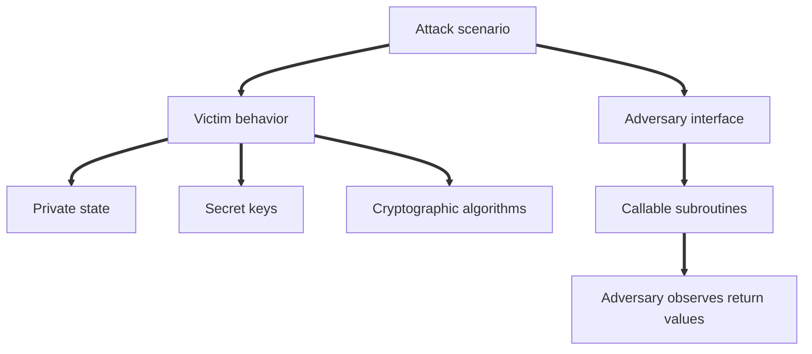

# 2. Attack scenarios as libraries

A library is a formal object that contains:

Global variables

Subroutines

Initialization code

Private state

Rules for what the adversary can call

The adversary is modeled as a calling program.

The library is the victim environment.

The calling program can invoke the library subroutines, but it cannot directly read the library variables.

```text
Library L:
    private global variables

    subroutine A(...)
        ...

    subroutine B(...)
        ...
```

The adversary can call:

```text
L.A(...)
L.B(...)
```

But the adversary cannot directly access:

```text
L.secret_key
L.private_counter
L.private_dictionary
```

The only information that leaves the library is what a subroutine explicitly returns.

# 3. Library scope rules

The chapter uses a precise scoping model.

Variables inside a library are private to that library.

All subroutines in the same library can access the same global variables.

Code outside a subroutine runs at the beginning of time.

Some variable types have default initial values.

Typical defaults are:

Boolean variables start as false

Integer counters start at zero

Sets start empty

Dictionaries start empty

This lets security games be written more compactly.

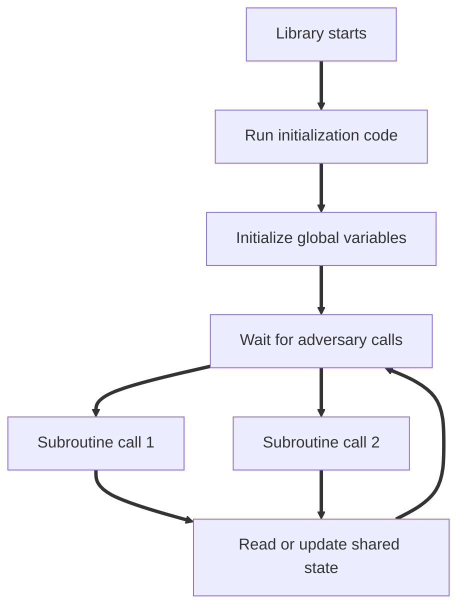

# 4. Example mental model with a die

Imagine a victim has a private six sided die value D.

At the beginning of time, the victim rolls the die.

The adversary can do two things:

Guess the die value

Ask the victim to reroll privately

The adversary learns whether a guess was correct, but does not directly see D.

Pseudocode:

```text
Library Dice:
    D ← random value from {1,2,3,4,5,6}

    subroutine guess(x):
        return x equals D

    subroutine reroll():
        D ← random value from {1,2,3,4,5,6}
        return nothing
```

The adversary can learn only through the return values.

This is the same mindset as cryptography.

The secret key exists inside the library, and the adversary sees only outputs exposed by subroutines.

# 5. Linking adversaries and libraries

The chapter defines the idea of linking.

A calling program A is linked to a library L.

The combined execution is written conceptually as:

```text
A linked with L
```

The calling program can invoke the library subroutines.

If either the adversary or the library is randomized, then the final output is a random variable.

Most often, the adversary outputs a boolean value:

```text
true
```

or

```text
false
```

The main quantity of interest is:

```text
Pr[A linked with L outputs true]
```

Security definitions compare this probability across two different libraries.

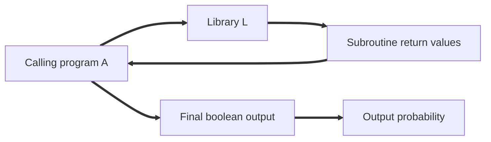

# 6. Why adversaries are not written directly in definitions

Security definitions usually show only the library code.

The adversary is arbitrary.

That means the proof must hold for every possible calling program.

The adversary may be clever.

The adversary may call subroutines many times.

The adversary may choose inputs adaptively.

The adversary may compute anything using the outputs.

Because the adversary is unspecified, the library is the formal object that defines what the adversary is allowed to observe and influence.

# 7. Interchangeable libraries

The central concept of the chapter is interchangeable libraries.

Two libraries are interchangeable if no calling program can behave differently when linked to one versus the other.

They must have the same interface:

Same subroutine names

Same argument types

Same return types

Then we say the libraries are interchangeable if every adversary has the same output probability in both worlds.

Conceptually:

```text
For every adversary A:

Pr[A linked with L1 outputs true]
=
Pr[A linked with L2 outputs true]
```

This is stronger than saying the code looks similar.

It means the two libraries are observationally identical to all adversaries.

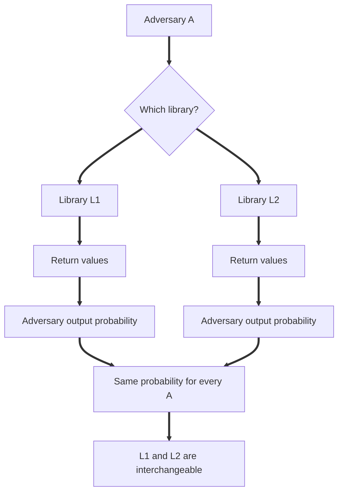

# 8. Interchangeability and security

Many cryptographic security definitions have this structure:

Real library

Ideal library

The real library models the actual cryptographic construction.

The ideal library models what the adversary should see if the construction were perfectly secure.

If the real and ideal libraries are interchangeable, then the construction satisfies that security definition.

For encryption, the ideal library often returns uniform random strings.

For authentication, the ideal library might reject forged tags.

For pseudorandom functions, the ideal library might behave like a truly random function.

The important mindset is:

Security means the real world is indistinguishable from a carefully chosen ideal world.

# 9. What information can pass from library to adversary

Only explicit return values pass from the library to the calling program.

The adversary cannot access private variables.

The adversary cannot observe hidden state.

The adversary cannot observe timing unless timing is explicitly modeled.

The adversary cannot observe cache behavior unless cache behavior is explicitly modeled.

The adversary cannot observe power consumption unless power leakage is explicitly modeled.

This is a mathematical abstraction.

Real systems may leak through side channels, but those leaks are not automatically part of the formal model.

To prove security against side channels, the library must explicitly expose those channels.

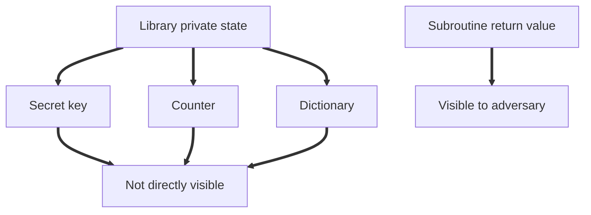

# 10. Rephrasing one time pad security using libraries

The previous chapter proved that one time pad ciphertexts are uniform when the key is fresh, uniform, secret, and used once.

This can be rephrased as two interchangeable libraries.

Real one time pad library:

```text
subroutine encrypt(M):
    K ← uniform random value from {0,1}^n
    C = M ⊕ K
    return C
```

Ideal random library:

```text
subroutine encrypt(M):
    C ← uniform random value from {0,1}^n
    return C
```

These are interchangeable because, for every fixed M, the output of the real library is uniform.

The ideal library ignores M completely.

So no adversary can distinguish real one time pad ciphertexts from random n bit strings.

# 11. Important nuance about independent executions

When comparing two libraries, we do not run both libraries in the same execution.

We do not let the adversary query both worlds.

We do not swap libraries in the middle of execution.

Instead, we compare two separate experiments:

Experiment one:

```text
A linked with L1
```

Experiment two:

```text
A linked with L2
```

Then we compare output probabilities.

This matters because security is defined statistically over repeated independent executions, not by dynamically replacing code during one run.

# 12. Simple reasons two libraries can be interchangeable

Two libraries may be interchangeable even if the code is not textually identical.

Examples:

A difference occurs only in unreachable code.

A variable is assigned a different value but never used.

A loop is unrolled.

A subroutine call is inlined.

A variable is renamed consistently.

A value is sampled earlier instead of later, as long as it is sampled before first use.

Two independently uniform strings are sampled and concatenated instead of directly sampling a longer uniform string.

The adversary sees behavior, not source code execution details.

# 13. Interchangeability with randomness

Randomized libraries can be interchangeable in less obvious ways.

Example one:

Sampling X uniformly from n bits and Y uniformly from m bits, then returning X concatenated with Y, is equivalent to sampling one uniform string of length n plus m.

Example two:

A value can be sampled eagerly at initialization or lazily right before first use, as long as the distribution and dependencies remain identical.

Example three:

Sampling uniformly and rejecting undesirable values is equivalent to sampling uniformly from the desirable subset, provided the rejection process is correctly defined.

These transformations are common in proofs.

# 14. Kerckhoffs’s principle in library language

The adversary may know the source code of the libraries.

Even then, the library may contain runtime secrets.

Knowing that the code samples a secret key does not reveal which key was sampled.

For example:

```text
K ← uniform random key
```

The adversary may know this line exists.

But the adversary does not know the sampled value of K.

The secrecy comes from private runtime state, not from hiding the algorithm.

# 15. How to prove insecurity

To show a construction is insecure, we show that two libraries are not interchangeable.

The recipe is:

Identify the two libraries.

Write one adversary program that behaves differently in the two worlds.

Compute the output probability in each world.

If the probabilities differ, the adversary distinguishes the libraries.

That is a formal attack.

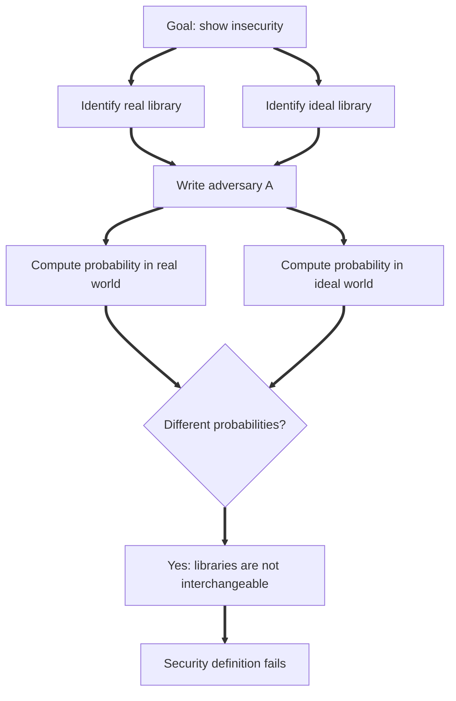

# 16. Reused one time pad key attack

Suppose a flawed library samples one key once and reuses it.

Real flawed library:

```text
K ← uniform random value from {0,1}^n

subroutine encrypt(M):
    return M ⊕ K
```

Ideal random library:

```text
subroutine encrypt(M):
    C ← uniform random value from {0,1}^n
    return C
```

These are not interchangeable.

An adversary can call encryption twice on the same plaintext:

```text
A:
    C1 = encrypt(0^n)
    C2 = encrypt(0^n)
    return C1 equals C2
```

In the real flawed library:

```text
C1 = K
C2 = K
```

So:

```text
Pr[true] = 1
```

In the ideal library, C1 and C2 are independent uniform strings.

So:

```text
Pr[C1 equals C2] = 1 / 2^n
```

The probabilities differ.

Therefore, the libraries are not interchangeable.

The scheme is insecure when the key is reused.

# 17. Same plaintext repeated attack

A more general version uses any plaintext M.

```text
A:
    C1 = encrypt(M)
    C2 = encrypt(M)
    return C1 equals C2
```

In the reused key world:

```text
C1 = M ⊕ K
C2 = M ⊕ K
```

So C1 always equals C2.

In the random world, C1 and C2 are independent uniform strings.

They are equal only with probability:

```text
1 / 2^n
```

This shows there is nothing special about the all zero plaintext.

The issue is key reuse.

# 18. XOR cancellation strategy

The chapter highlights a common attack method.

Write the observed values algebraically.

Look for a shared XOR term.

XOR the values together to cancel the shared term.

For reused one time pad:

```text
C1 = M1 ⊕ K
C2 = M2 ⊕ K
```

Then:

```text
C1 ⊕ C2
= M1 ⊕ K ⊕ M2 ⊕ K
= M1 ⊕ M2
```

The key disappears.

The adversary learns a relation between plaintexts.

This strategy appears throughout cryptographic attacks.

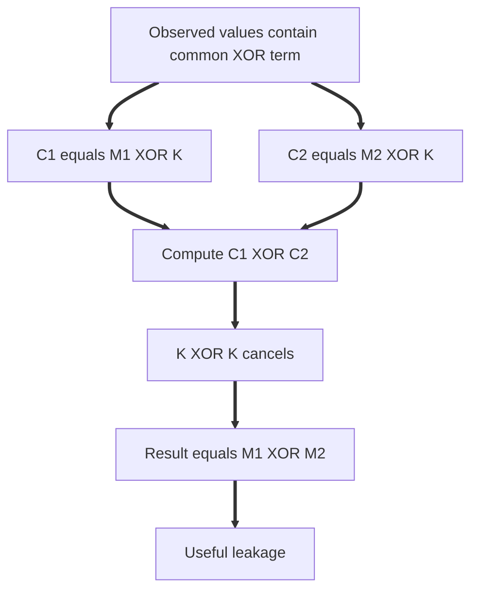

# 19. How to prove interchangeability

To prove two libraries are interchangeable directly can be difficult.

The chapter introduces the hybrid proof technique.

Instead of proving:

```text
L0 is interchangeable with Lt
```

directly, prove a chain:

```text
L0 is interchangeable with L1
L1 is interchangeable with L2
L2 is interchangeable with L3
...
Lt minus 1 is interchangeable with Lt
```

Then by transitivity:

```text
L0 is interchangeable with Lt
```

Each step should be small and easy to justify.

```mermaid
flowchart LR
    A[L0] ==> B[L1]
    B ==> C[L2]
    C ==> D[L3]
    D ==> E[Lt]
    A -. by transitivity .=> E
```

# 20. Hybrid proof technique

A hybrid proof is a sequence of small transformations.

Each transformation preserves adversary behavior.

Common transformations include:

Introducing an unused variable

Replacing an expression with an algebraically equal expression

Factoring code into a sublibrary

Using a known security theorem to replace one sublibrary with another

Inlining a subroutine call

Renaming variables

Moving sampling earlier or later when dependencies allow

The skill is to choose intermediate libraries that bridge the real world and the ideal world.

# 21. Chain rule for libraries

The chain rule says:

If two libraries L1 and L2 are interchangeable, then they remain interchangeable even when placed inside a larger surrounding library.

In other words, interchangeable components can be substituted modularly.

Conceptually:

```text
If L1 is interchangeable with L2,

then for any surrounding library Lstar:

Lstar using L1 is interchangeable with Lstar using L2.
```

This is a compositional reasoning principle.

It allows proofs to replace one internal component at a time.

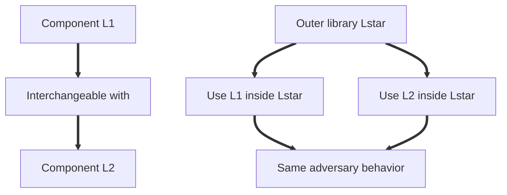

# 22. Convenient property of XOR

The chapter proves an important XOR distribution fact.

Suppose we want two values X and Y such that:

```text
X ⊕ Y = M
```

There are two equivalent ways to generate them.

Method one:

```text
X ← uniform
Y = X ⊕ M
return X, Y
```

Method two:

```text
Y ← uniform
X = Y ⊕ M
return X, Y
```

These induce the same distribution.

Plain English:

If two values must XOR to M, it does not matter which one you sample uniformly and which one you solve for.

The pair distribution is the same.

This fact becomes a reusable proof tool.

# 23. Why that XOR property is true

For any fixed M, choosing X uniformly determines exactly one Y:

```text
Y = X ⊕ M
```

Likewise, choosing Y uniformly determines exactly one X:

```text
X = Y ⊕ M
```

Both methods generate exactly the same set of pairs:

```text
(X, Y) such that X ⊕ Y = M
```

Each valid pair has the same probability.

Therefore, the two libraries are interchangeable.

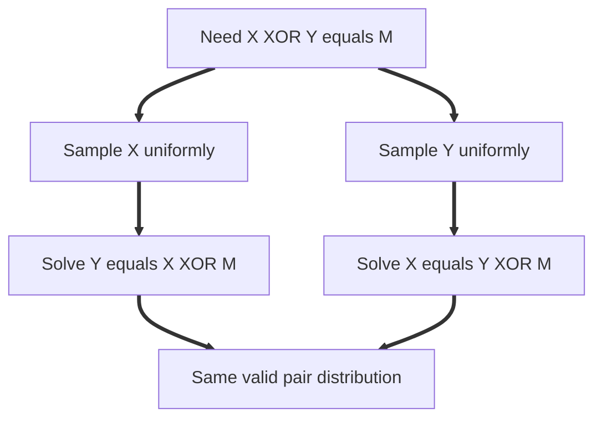

# 24. The three hop maneuver

The three hop maneuver is a common pattern inside hybrid proofs.

It has three steps.

Step one:

Factor out part of the library into a known sublibrary.

Step two:

Replace that sublibrary with an interchangeable one.

Step three:

Inline the new sublibrary back into the main library.

This is useful when a known theorem applies only to a small piece of a larger library.


In short:

Factor out.

Swap.

Inline.

This pattern is heavily used in cryptographic proofs.

# 25. Abstract cryptographic primitives

The chapter then moves from concrete schemes such as one time pad to abstract primitives.

A cryptographic primitive is a formal building block.

Examples include:

Encryption schemes

Message authentication codes

Pseudorandom functions

Hash functions

Commitment schemes

Digital signatures

A primitive definition usually has three parts:

Syntax

Correctness

Security

# 26. Syntax, correctness, and security

Syntax defines the raw interface.

For encryption, syntax says which algorithms exist, what inputs they take, and what outputs they produce.

Correctness defines expected functionality in the absence of an adversary.

For encryption, decryption should recover the encrypted message.

Security defines adversarial guarantees under a specific attack scenario.

For encryption, the adversary should not learn meaningful information about the plaintext.

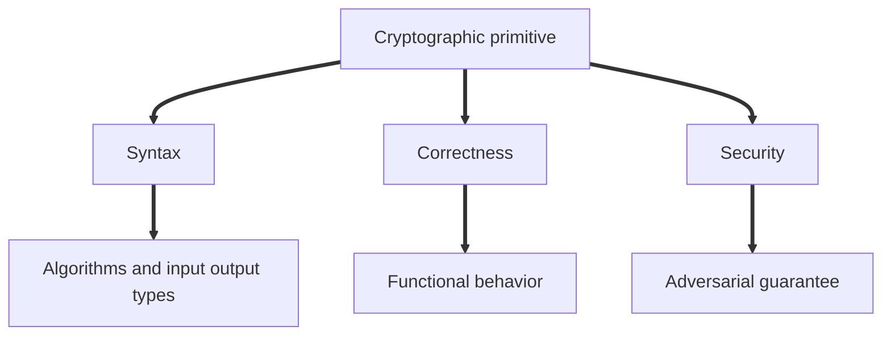

# 27. Symmetric key encryption syntax

A symmetric key encryption scheme has two algorithms.

Encryption:

```text
Enc(K, M) returns C
```

Decryption:

```text
Dec(K, C) returns M
```

There are three spaces:

Key space:

```text
K
```

Plaintext space:

```text
M
```

Ciphertext space:

```text
C
```

The key is shared by sender and receiver.

Encryption may be randomized.

Decryption is deterministic.

Randomized encryption means encrypting the same plaintext under the same key may produce different ciphertexts.

# 28. Correctness for symmetric key encryption

Correctness says:

If we encrypt a plaintext and then decrypt the resulting ciphertext with the same key, we recover the original plaintext.

Formally:

```text
Dec(K, Enc(K, M)) = M
```

If encryption is randomized, correctness must hold with probability one over the encryption randomness.

This property is not about attackers.

It is about basic functionality.

A scheme that cannot decrypt correctly is not a useful encryption scheme, regardless of whether it has some statistical security property.

# 29. One time secrecy as a security definition

The chapter defines one time secrecy for a symmetric key encryption scheme.

Real library:

```text
subroutine encrypt(M):
    K ← uniform random key
    C = Enc(K, M)
    return C
```

Ideal library:

```text
subroutine encrypt(M):
    C ← uniform random ciphertext
    return C
```

The scheme has one time secrecy if these two libraries are interchangeable.

Plain English:

Ciphertexts must look uniformly random when the key is uniform, secret, and used for only one encryption, no matter how the plaintext is chosen.

This is the real or random style of security.

# 30. Applying one time secrecy to the one time pad

For one time pad:

```text
Key space = {0,1}^n
Plaintext space = {0,1}^n
Ciphertext space = {0,1}^n
Enc(K, M) = K ⊕ M
Dec(K, C) = K ⊕ C
```

Plugging this into the one time secrecy definition gives:

Real library:

```text
subroutine encrypt(M):
    K ← uniform random value from {0,1}^n
    return K ⊕ M
```

Ideal library:

```text
subroutine encrypt(M):
    C ← uniform random value from {0,1}^n
    return C
```

These are interchangeable.

Therefore, the one time pad has one time secrecy.

# 31. Insecure AND variant

Consider the bad variant:

```text
Enc(K, M) = K AND M
```

This fails correctness in general.

For example, if K is all zeros, every plaintext encrypts to all zeros, so decryption cannot recover the plaintext.

It also fails one time secrecy.

Adversary:

```text
A:
    C = encrypt(0^n)
    return C equals 0^n
```

In the real AND library:

```text
0^n AND K = 0^n
```

So the adversary outputs true with probability one.

In the ideal random library, C is uniform.

So:

```text
Pr[C equals 0^n] = 1 / 2^n
```

The probabilities differ.

Therefore, the libraries are not interchangeable.

The AND variant is insecure.

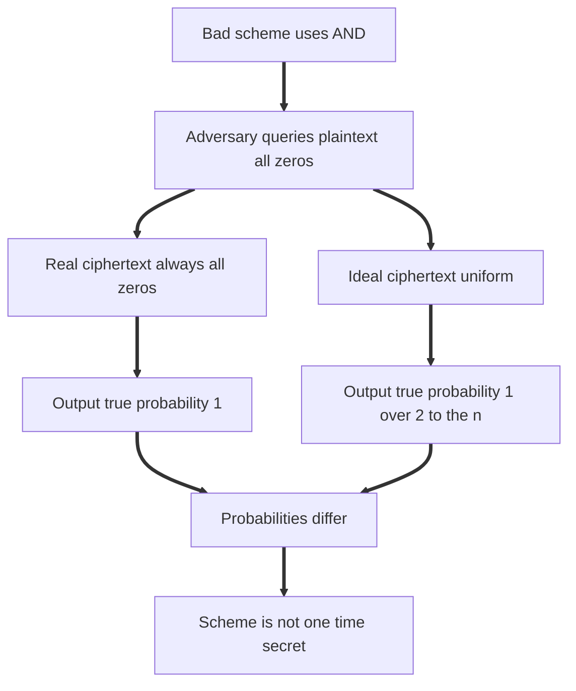

# 32. Modular cryptographic constructions

A major goal of provable security is modular reasoning.

We want to build larger constructions from smaller primitives.

If the smaller primitives satisfy defined security properties, we want to prove that the larger construction also satisfies a desired property.

The chapter gives a modular encryption construction using two encryption schemes.

There are two schemes:

```text
Sigma1
Sigma2
```

Sigma1 can encrypt keys for Sigma2.

The combined scheme Sigma star works like this.

Encryption:

Sample a fresh temporary key K prime for Sigma2.

Encrypt K prime using Sigma1 under the long term key K.

Use K prime to encrypt the actual message M using Sigma2.

Return both ciphertexts.

```text
C1 = Sigma1.Enc(K, K prime)
C2 = Sigma2.Enc(K prime, M)
return (C1, C2)
```

Decryption:

Use K to decrypt C1 and recover K prime.

Use K prime to decrypt C2 and recover M.

```text
K prime = Sigma1.Dec(K, C1)
M = Sigma2.Dec(K prime, C2)
return M
```

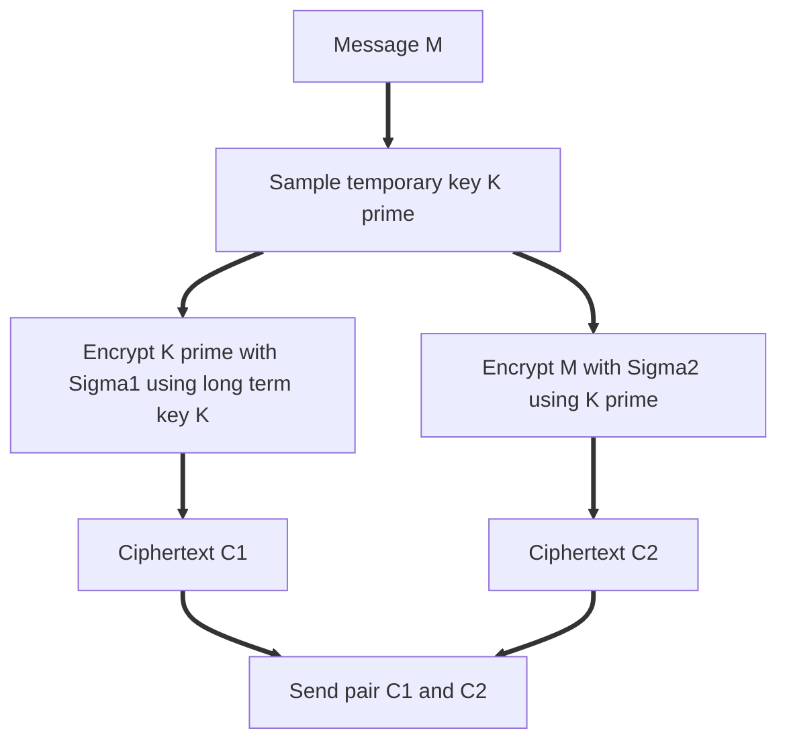

# 33. Why the modular construction is randomized

The combined encryption algorithm samples K prime each time.

So even if the same message is encrypted twice under the same long term key, the output may differ.

This is important because randomized encryption becomes essential in later security notions.

Randomness can prevent repeated plaintexts from producing repeated ciphertexts.

In this construction, the temporary key K prime functions as fresh encryption randomness.

# 34. Security of the modular construction

The chapter proves:

If Sigma1 has one time secrecy and Sigma2 has one time secrecy, then the combined scheme Sigma star also has one time secrecy.

This is an example of a preservation theorem.

The property is preserved under the construction.

Plain English:

If both components produce ciphertexts that look random under one time use, then the combined pair of ciphertexts also looks random under one time use.

The proof uses hybrids.

First, replace the Sigma1 encryption of K prime with a random ciphertext.

Then replace the Sigma2 encryption of M under K prime with a random ciphertext.

At the end, both C1 and C2 are random, which matches the ideal library.


# 35. Why this proof is modular

The proof does not need to know how Sigma1 or Sigma2 are implemented.

It only uses their security definitions.

This is the power of abstraction.

Once a primitive satisfies a formal property, it can be used as a black box inside larger constructions.

This is how cryptographic systems are built at scale.

You prove small components.

Then you prove that compositions of those components preserve security.

# 36. Real or random security

The chapter uses real or random as the default security paradigm.

In real or random security, the adversary interacts with one of two libraries.

Real library:

Returns real cryptographic outputs.

Random library:

Returns uniformly random outputs of the correct type.

Security means the adversary cannot distinguish them.

For encryption:

Real world:

```text
C = Enc(K, M)
```

Random world:

```text
C ← uniform random ciphertext
```

The ciphertext should look like random junk.

# 37. Left or right security

The chapter also introduces left or right security.

Instead of comparing real ciphertexts with random ciphertexts, left or right security compares encryptions of two chosen plaintexts.

The adversary submits two plaintexts:

```text
ML
MR
```

One library always encrypts the left plaintext.

The other library always encrypts the right plaintext.

The adversary should not be able to distinguish which one is being encrypted.

Left library:

```text
subroutine encrypt(ML, MR):
    K ← uniform random key
    return Enc(K, ML)
```

Right library:

```text
subroutine encrypt(ML, MR):
    K ← uniform random key
    return Enc(K, MR)
```

The scheme satisfies left or right one time secrecy if these two libraries are interchangeable.

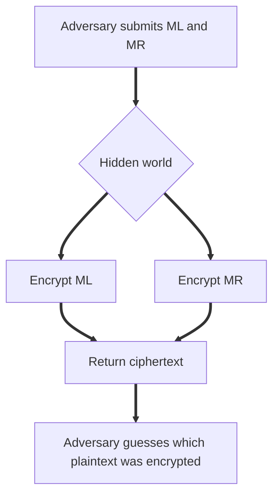

# 38. Real or random versus left or right

These are two different ways to formalize secrecy.

Real or random asks:

Does the ciphertext look uniformly random?

Left or right asks:

Do encryptions of different plaintexts look indistinguishable?

Real or random is stronger.

Any scheme satisfying real or random security also satisfies left or right security.

But not every left or right secure scheme satisfies real or random security.

The gap exists because a ciphertext distribution may hide which plaintext was encrypted without being uniform over the whole ciphertext space.

# 39. Why real or random is stronger

Real or random requires ciphertexts to match a specific distribution:

Uniform over the ciphertext space.

Left or right only requires that the ciphertext distribution for ML matches the ciphertext distribution for MR.

A scheme could produce ciphertexts with a weird but plaintext independent distribution.

Then encryptions of ML and MR may look the same, so left or right holds.

But ciphertexts may not look uniform, so real or random fails.

This is why real or random implies left or right, but not necessarily the reverse.

# 40. Why left or right is traditional

Left or right is common in cryptographic literature because it captures a natural confidentiality intuition:

The adversary should not be able to tell whether the ciphertext hides this message or that message.

This feels directly connected to privacy.

For example:

Can Eve tell whether the encrypted message was yes or no?

Can Eve tell whether the encrypted salary was high or low?

Can Eve tell whether the encrypted command was allow or deny?

If not, the scheme provides strong secrecy in the left or right sense.

# 41. Why real or random is useful

Real or random often gives cleaner proofs.

The proof usually aims to transform real outputs into random outputs.

For many primitives beyond encryption, real or random is the natural definition.

Examples:

Pseudorandom functions

Pseudorandom generators

Random oracles

Key derivation functions

For encryption, real or random can also make proofs shorter.

A left or right proof often has two symmetric halves:

Move from left encryption to random.

Then move from random to right encryption.

A real or random proof stops at the random middle point.

# 42. Benign transformations and the gap between definitions

Some transformations preserve left or right security but break real or random security.

For example:

Appending zeros to every ciphertext

Repeating every ciphertext bit

Changing the declared ciphertext space

These transformations may not reveal which plaintext was encrypted.

So left or right security can survive.

But the ciphertexts no longer look uniform over the enlarged or modified ciphertext space.

So real or random security fails.

This demonstrates that security definitions are modeling choices.

Neither definition is universally correct.

Each formalizes a different expectation.

# 43. Practical interpretation

In practice, most natural encryption schemes people care about satisfy both definitions when used correctly.

The gap between real or random and left or right is real but often artificial.

However, understanding the difference is important because proofs are only meaningful relative to the definition being proven.

A scheme is not simply secure in the abstract.

It is secure according to a specific definition, in a specific model, under specific assumptions.

# 44. Full conceptual map

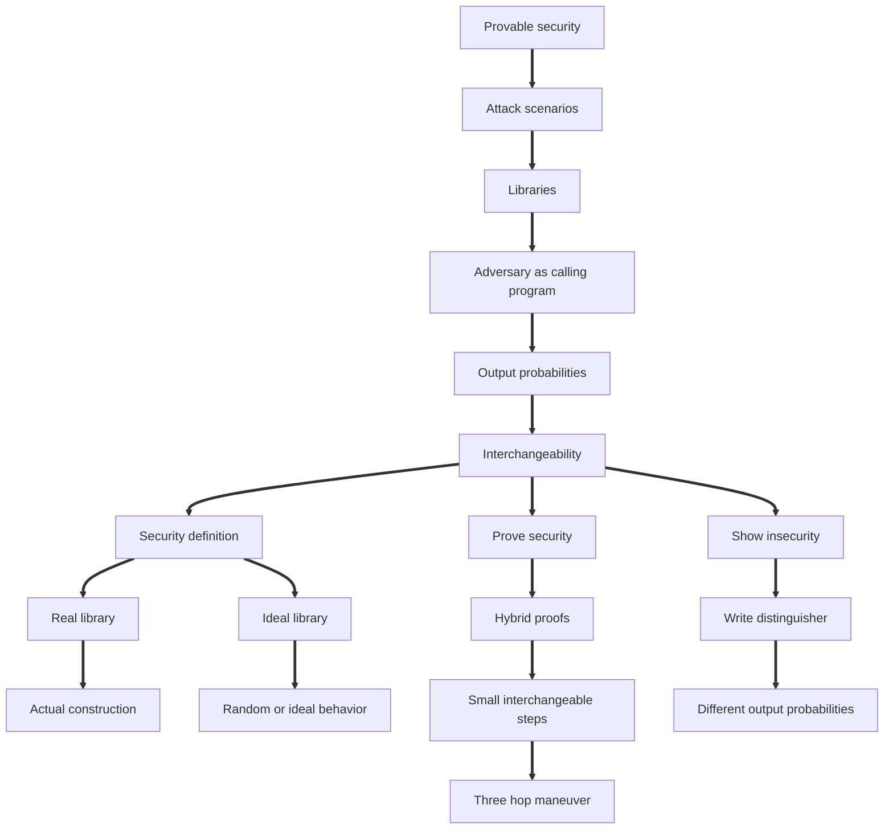

# 45. How to think when reading a security proof

When you see a security proof using libraries, ask:

What is the real library?

What is the ideal library?

What does the adversary get to call?

What does the library keep private?

What is the final output probability being compared?

Which transformations are used in the hybrid proof?

Which step uses the security of an underlying primitive?

Which steps are just code rewriting?

Which assumptions are required?

Which real world behaviors are outside the model?

This checklist prevents confusion.

# 46. How to think when attacking a scheme

When asked to show insecurity, do not argue informally only.

Construct a distinguisher.

The distinguisher should:

Call the library subroutines.

Use returned values.

Output true or false.

Then calculate:

```text
Pr[true in real world]
```

and:

```text
Pr[true in ideal world]
```

If these are different, the attack is valid.

For example, reused one time pad key:

```text
A:
    C1 = encrypt(M)
    C2 = encrypt(M)
    return C1 equals C2
```

Real world probability:

```text
1
```

Ideal world probability:

```text
1 / 2^n
```

Therefore insecure.

# 47. Key lessons from the chapter

Libraries provide a precise way to model attack scenarios with state and multiple adversary actions.

Interchangeability means no adversary can distinguish two libraries by interacting through their public subroutine interface.

Security definitions are usually expressed by comparing a real library to an ideal library.

Insecurity is shown by writing one adversary that distinguishes the two libraries.

Hybrid proofs show interchangeability through a sequence of small behavior preserving changes.

The chain rule lets interchangeable components be replaced inside larger constructions.

The three hop maneuver is a reusable proof pattern: factor out, swap, inline.

Abstract primitives are defined by syntax, correctness, and security.

One time secrecy can be defined as real ciphertexts being indistinguishable from uniform random ciphertexts.

Modular constructions allow larger schemes to inherit security from smaller schemes.

Real or random and left or right are different secrecy paradigms.

Real or random is stronger, but left or right is more traditional for encryption.

# 48. Final condensed summary

This chapter teaches the mechanics of provable security.

An attack scenario is modeled as a library.

The adversary is a calling program.

Security means the real library and ideal library are interchangeable for every adversary.

To prove security, build a hybrid sequence from real to ideal.

To prove insecurity, write a distinguisher whose output probability differs between the two libraries.

This framework lets cryptographers reason modularly: once a primitive satisfies a formal definition, it can be used inside larger constructions, and its guarantee can be invoked through hybrid proofs.
