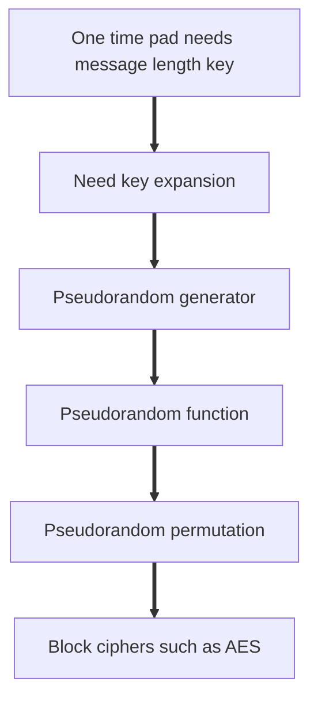

# Topic 1.4: Pseudorandomness

## Assessment Window
- Midterm track

## Overview
PRGs, PRFs, PRPs, GGM construction, Feistel networks, and the PRF-PRP switching perspective.

## Required Readings
- The Joy of Cryptography, Chapter 5: Pseudorandom Generators.
- The Joy of Cryptography, Chapter 6: Pseudorandom Functions.
- The Joy of Cryptography, Chapter 7: Pseudorandom Permutations.

## Optional Readings
- Michael Luby and Charles Rackoff, How to Construct Pseudorandom Permutations from Pseudorandom Functions, SIAM, 1988.

## Materials
- [ ] Slides
- [ ] Quiz


# Slides note

# Notes

Reviewed file: *Applied Cryptography, Summer 2026, Part 1: Provable Security, 1.4: Pseudorandomness* 

## 1. Main theme of the file

The slides explain how modern symmetric cryptography replaces true randomness with computationally secure pseudorandomness.

The core progression is:



The lecture starts from the limitation of the one time pad, then introduces pseudorandom generators, pseudorandom functions, pseudorandom permutations, Feistel networks, DES, 3DES, and AES.

The cryptographic message is simple: we cannot get true uniform randomness from deterministic expansion, but we can aim for outputs that no efficient adversary can distinguish from uniform randomness.

---

## 2. One time pad limitation

The file begins by explaining why the one time pad is theoretically perfect but practically unusable.

A one time pad encrypts as:

```text
C = K xor M
```

For perfect secrecy, the key must satisfy three conditions:

• It must be uniformly random
• It must be as long as the message
• It must never be reused

The problem is the key length. To privately send `n` bits, both parties must already share `n` random secret bits. This creates the classic key distribution problem.

The lecture correctly frames this as the motivation for modern stream ciphers. In practice, HTTPS, messaging protocols, payment systems, and VPNs do not share a message length key in advance. They share or derive a compact secret and expand it into a longer keystream.

---

## 3. Key expansion and why true uniformity is impossible

The slides define the desired expansion as a deterministic function:

```text
G : {0,1}^n -> {0,1}^{n + l}
```

This function takes a short seed and outputs a longer string.

The important impossibility result is:

```text
A deterministic function cannot expand a short uniform seed into a longer truly uniform output.
```

Reason:

• There are only `2^n` possible seeds
• Therefore there are at most `2^n` possible outputs
• But a truly uniform distribution over `n + l` bits has `2^{n + l}` possible outputs
• Since `2^n < 2^{n + l}`, most output strings are unreachable

So deterministic expansion cannot produce true uniform randomness over the larger output space.

This is why cryptography uses pseudorandomness rather than true randomness after expansion.

---

## 4. Pseudorandom generator

A pseudorandom generator is presented as:

```text
G : {0,1}^lambda -> {0,1}^{lambda + l}
```

It takes a short seed and produces a longer output.

The security definition compares two libraries:

```text
Real library:
S sampled uniformly from {0,1}^lambda
return G(S)

Random library:
Y sampled uniformly from {0,1}^{lambda + l}
return Y
```

The generator is secure if no efficient adversary can distinguish the real library from the random library with more than negligible advantage.

The key phrase is computational indistinguishability.

This does not mean the PRG output is truly uniform. It means every feasible test behaves almost the same whether it sees `G(S)` or a truly random string.

---

## 5. PRG based encryption

The file then shows how PRG based encryption imitates a one time pad:

```text
K sampled from {0,1}^lambda
Y = G(K)
C = Y xor M
```

If `G(K)` is indistinguishable from a uniform pad, then `C` is indistinguishable from a one time pad ciphertext.

This gives one time secrecy under the condition that the key or seed is used only once.

Important implementation note:

This construction is not safe if the same `K` is reused for two messages.

If:

```text
C1 = G(K) xor M1
C2 = G(K) xor M2
```

Then:

```text
C1 xor C2 = M1 xor M2
```

The keystream cancels. This is the same catastrophic failure mode as reusing a one time pad.

In real systems, stream ciphers therefore require nonce based input, for example:

```text
keystream = StreamCipher(key, nonce, counter)
```

The nonce must not repeat under the same key.

---

## 6. Broken PRG construction example

The slides analyze this construction:

```text
H(S):
A || B = G(S)
C || D = G(B)
return A || B || C || D
```

Even if `G` is secure, `H` is not secure.

Reason:

The output contains `B`, and then later contains `G(B)` as part of the output. An adversary can parse:

```text
A || B || C || D
```

Then test whether:

```text
G(B) = C || D
```

In the real construction, this is always true.

In the random library, this happens with probability around:

```text
1 / 2^{2 lambda}
```

So the distinguishing advantage is overwhelming.

The deeper lesson is that secure components do not automatically compose securely. Exposing internal state that later becomes input to the generator creates a detectable structural relation.

---

## 7. RC4 as historical PRG example

The file presents RC4 as a stream cipher that generates bytes from a key initialized state.

The algorithm has two conceptual phases:

• Key scheduling initializes and scrambles a 256 byte permutation array
• Pseudorandom generation repeatedly updates indices, swaps values, and outputs bytes

The slides correctly mark RC4 as broken.

Main issues:

• Early keystream bytes have statistical bias
• Output bytes can correlate with key material
• Protocols such as WEP made these weaknesses exploitable
• RC4 should not be used in new designs

Modern alternative: ChaCha20 is the right example for software oriented stream encryption.

Important note: RC4 is useful pedagogically because it is simple, but simplicity alone is not a security argument.

---

## 8. Pseudorandom function

The PRF definition in the slides is:

```text
F : {0,1}^lambda × {0,1}^n -> {0,1}^m
```

Where:

• `lambda` is the key size
• `n` is the input length
• `m` is the output length

The real library chooses a secret key:

```text
K sampled from {0,1}^lambda
query(X) returns F(K, X)
```

The random library implements a lazy random function:

```text
If X has not been seen:
    choose fresh random Y
    store L[X] = Y
return L[X]
```

The lazy dictionary is important. It guarantees consistency: the same input always returns the same output, just like a deterministic function.

A secure PRF must look like this lazy random function to every efficient adversary.

---

## 9. PRG versus PRF

The file distinguishes PRGs and PRFs well.

A PRG produces a long monolithic output:

```text
G(seed) = long pseudorandom string
```

A PRF gives indexed access:

```text
F(K, X) = pseudorandom value for input X
```

PRF advantages:

• You can request pseudorandom values on demand
• You do not need to generate a full stream first
• The same input gives the same output
• Different inputs should appear unrelated
• PRFs are core building blocks for MACs, KDFs, stream modes, block cipher modes, and protocol key derivation

Example intuition:

```text
F(K, 0001), F(K, 0002), F(K, 0003)
```

should look like independent random outputs, even though they are generated deterministically from the same key.

---

## 10. Hash functions and PRFs

The slides discuss hash functions after PRFs. This needs careful interpretation.

A plain cryptographic hash function such as SHA256 is not a keyed PRF by itself because it has no secret key.

However, keyed constructions based on hash functions can be PRFs. The canonical example is HMAC SHA256.

Hash functions provide:

• Fixed size digest
• Deterministic output
• Efficient computation
• Avalanche behavior
• Collision resistance
• Preimage resistance
• Second preimage resistance

The slide examples:

```text
SHA256(hello)
SHA256(hullo)
```

illustrate avalanche behavior: tiny input changes produce completely different outputs.

Important distinction:

• Hash function security properties are not identical to PRF security
• Collision resistance does not automatically imply PRF security
• HMAC adds a secret key and a robust construction around the hash function

So the statement “PRFs in the real world: hash functions” should be read as “keyed hash based constructions such as HMAC can act as PRFs,” not “plain SHA256 is a PRF.”

---

## 11. Insecure PRF construction using a PRG

The file gives this construction:

```text
F(K, X) = G(K) xor X
```

This is not a secure PRF.

For two queries:

```text
Y1 = G(K) xor X1
Y2 = G(K) xor X2
```

Then:

```text
Y1 xor Y2 = X1 xor X2
```

The secret mask cancels.

In a true random function, two independently sampled outputs would almost never satisfy that relation.

This is a classic example of why “random looking mask plus xor” does not automatically produce a secure multi query primitive.

The construction behaves like a reused stream cipher pad. Reuse creates algebraic leakage.

---

## 12. Another insecure PRF construction

The file analyzes:

```text
H(K1 || K2, X1 || X2) =
F(K1, X1) xor F(K2, X2)
```

Even if `F` is a secure PRF, this construction is not secure.

The adversary queries four inputs:

```text
A  || B
A  || B'
A' || B
A' || B'
```

Outputs:

```text
Y1 = F(K1, A)  xor F(K2, B)
Y2 = F(K1, A)  xor F(K2, B')
Y3 = F(K1, A') xor F(K2, B)
Y4 = F(K1, A') xor F(K2, B')
```

Now compute:

```text
Y1 xor Y2 = F(K2, B) xor F(K2, B')
Y3 xor Y4 = F(K2, B) xor F(K2, B')
```

So:

```text
Y1 xor Y2 = Y3 xor Y4
```

with probability 1 in the real construction.

For a truly random function, this relation holds with probability about:

```text
1 / 2^m
```

This gives a strong distinguisher.

The deeper rule: never combine PRF outputs in a way that creates predictable linear cancellation.

---

## 13. Golden rule of PRF composition

The file gives a useful practical rule:

```text
Security often depends on ensuring distinct inputs to the underlying PRF.
```

When reviewing a PRF based design, inspect:

• Are domain separation labels used
• Are nonces unique
• Are counters unique
• Are context strings included
• Can two protocol paths accidentally call the same PRF input with different meanings
• Can an attacker force repeated inputs
• Can input parsing be ambiguous
• Are variable length fields encoded safely

A robust PRF input often looks like:

```text
F(K, label || context || nonce || counter || length encoded data)
```

Bad input design often looks like:

```text
F(K, A || B)
```

when `A || B` can be parsed ambiguously.

Example ambiguity:

```text
A = "ab", B = "c"
A = "a",  B = "bc"
```

Both produce `"abc"` unless lengths or separators are encoded.

---

## 14. Pseudorandom permutation

A pseudorandom permutation is a keyed invertible function:

```text
F_K : {0,1}^n -> {0,1}^n
```

It has three essential properties:

• Input and output length are equal
• Every input maps to exactly one output
• Every output has exactly one input

So it is bijective.

The real library uses the keyed permutation:

```text
return F(K, X)
```

The random library is a lazy random permutation:

```text
If X is new:
    choose Y not used before
    store L[X] = Y
return L[X]
```

The difference from a PRF is output uniqueness.

A random function can collide. A random permutation cannot collide.

---

## 15. PRF versus PRP

A PRF maps:

```text
X -> Y
```

The domain and range can have different sizes. Collisions are possible and often inevitable.

A PRP maps:

```text
X -> X
```

The domain and range are the same set. Collisions are impossible because the function is bijective.

In practical terms:

• AES is modeled as a PRP over 128 bit blocks
• HMAC SHA256 is modeled as a PRF when keyed correctly
• A secure PRP can often be used where a PRF is needed
• A PRF cannot trivially be used as a PRP because it is not naturally invertible

Important nuance:

A block cipher alone only encrypts one fixed size block. To encrypt longer messages, we need a secure mode such as CTR, CBC with authentication, GCM, or another AEAD construction.

---

## 16. Lazy dictionary versus lazy permutation

The slides compare the ideal PRF and ideal PRP.

Ideal PRF:

```text
For each new input X:
    sample a random output Y
```

Collisions may happen.

Ideal PRP:

```text
For each new input X:
    sample a random output Y that has not appeared before
```

Collisions are forbidden.

This distinction matters for distinguishing attacks. If an adversary can query enough values and observe collisions, it may distinguish a random function from a random permutation. But with large block sizes such as 128 bits, collision based distinguishing is infeasible for normal query volumes.

---

## 17. Feistel ciphers

The file introduces Feistel networks as a method to build permutations from arbitrary round functions.

A Feistel round takes two halves:

```text
X0 || X1
```

and computes:

```text
X2 = X0 xor F1(X1)
```

The next state is:

```text
X1 || X2
```

General form:

```text
For i = 1 to r:
    X_{i+1} = X_{i-1} xor F_i(X_i)
return X_r || X_{r+1}
```

Important property:

A Feistel network is always invertible even if the round function is not invertible.

The inverse uses:

```text
X_{i-1} = X_{i+1} xor F_i(X_i)
```

This works because xor is its own inverse.

This is a central design insight. The round function can be a PRF, compression like function, or other non invertible transformation, but the overall Feistel network remains a permutation.

---

## 18. Keyed Feistel networks

The keyed version uses round keys:

```text
F_i(K_i, X_i)
```

The sequence of round keys is the key schedule.

Good design requires:

• Different effective round keys
• Strong domain separation between rounds
• No accidental symmetry
• Sufficient number of rounds
• Round functions that resist differential and linear patterns
• Careful key schedule design

Using the same key in every round can create structural weaknesses. The slides mention meet in the middle attacks as a motivation for key scheduling.

---

## 19. Breaking a 2 round Feistel cipher

The file shows that a 2 round Feistel cipher is not a secure PRP.

For input:

```text
A || B
```

the first output half after two rounds is:

```text
Y1 = A xor F(K1, B)
```

For another input:

```text
A' || B
```

the first output half is:

```text
Y1' = A' xor F(K1, B)
```

Now xor them:

```text
Y1 xor Y1' = A xor A'
```

The round function term cancels.

An adversary can query two inputs sharing the same right half and test this relation.

In a true random permutation, this relation would occur only with negligible probability.

This proves 2 rounds are insufficient.

---

## 20. On the slide claim that 3 plus round Feistel is fine

The file says a 3 plus round Feistel cipher is fine.

This needs nuance.

Classical Luby Rackoff results say, roughly:

• 3 rounds with independent secure PRFs give a pseudorandom permutation against chosen plaintext queries
• 4 rounds are needed for stronger security when the adversary can query both forward and inverse directions

So “3 plus rounds is fine” is acceptable in a basic PRP setting, but for strong PRP security, 4 rounds is the safer theoretical statement.

Real block ciphers use many more rounds because practical cryptanalysis considers far more structure than the clean ideal PRF model.

---

## 21. DES

The slides present DES as a practical Feistel cipher.

Properties listed:

• 16 Feistel rounds
• 56 bit effective key
• 64 bit block size
• Standardized in 1977

The key weakness is the 56 bit key. Exhaustive search became practical.

DES also has a small 64 bit block size by modern standards. Even if the key were larger, 64 bit blocks are problematic for high volume encryption because birthday bound effects appear around `2^32` blocks.

This is why modern systems should not use DES.

---

## 22. 3DES

The file explains 3DES as:

```text
C = E_K3(D_K2(E_K1(P)))
```

This is encrypt, decrypt, encrypt.

The decrypt step in the middle preserves compatibility with legacy DES when all keys are equal.

Important nuance:

3DES does not provide the full naive security of three independent 56 bit keys because meet in the middle attacks reduce the effective security. In practice, 3DES is legacy only and should not be chosen for new systems.

AES replaced it because AES is faster, cleaner, has larger block size, and supports stronger key sizes.

---

## 23. EFF Deep Crack

The slides discuss EFF Deep Crack, which demonstrated practical DES key search.

Main point:

Theoretical brute force became practical engineering.

Deep Crack showed that 56 bit keys were not merely academically weak. They could be broken by a purpose built machine within a short time.

The lesson for cryptographic engineering:

• Security margins must account for hardware progress
• Key sizes must remain safe against parallel exhaustive search
• Public demonstrations can accelerate migration away from obsolete algorithms

This historical case is still relevant when evaluating modern parameter sizes.

---

## 24. AES as a PRP

The file presents AES as the dominant real world PRP.

Properties:

• 128 bit block size
• 128, 192, or 256 bit keys
• Efficient encryption and decryption
• Each key defines a permutation over all 128 bit blocks
• Widely analyzed for more than two decades

AES is not a Feistel cipher. It is a substitution permutation network.

AES round structure includes:

• SubBytes: non linear substitution
• ShiftRows: byte position permutation
• MixColumns: linear mixing
• AddRoundKey: xor with round key

The final round omits MixColumns.

AES is best understood as a strong keyed permutation over 128 bit blocks. Real encryption security depends heavily on using the right mode and authentication.

---

## 25. AES attacks and practical risk

The slides mention attacks such as biclique cryptanalysis and side channel attacks.

Important distinction:

• Cryptanalytic attacks on full AES are not practical today
• Side channel attacks are very practical in poor implementations

A mathematically secure primitive can fail through implementation leakage.

Common side channels:

• Cache timing
• Branch dependent timing
• Power analysis
• Electromagnetic leakage
• Fault injection
• Microarchitectural leakage

Practical AES engineering should use:

• Hardware AES instructions when available
• Constant time software when hardware support is unavailable
• Authenticated encryption modes
• Proper nonce management
• Key separation
• Side channel resistant libraries

---

## 26. Quantum note

The file says Grover’s algorithm reduces AES 128 security to roughly `2^64` operations.

The right interpretation:

Grover gives a quadratic speedup for brute force key search in an idealized quantum model.

Approximate implication:

• AES 128 gives about 64 bit post quantum brute force security
• AES 256 gives about 128 bit post quantum brute force security

For long term post quantum conservative designs, AES 256 is preferred.

However, practical large scale quantum attacks against AES are not currently available. The point is about future security margins.

---

## 27. Design review checklist from the file

When reviewing a construction based on this lecture, ask:

1. Randomness and seeds

• Is the seed uniformly random
• Is it long enough
• Is it secret when required
• Is it ever reused unsafely

2. PRG usage

• Is keystream reuse impossible
• Is there a nonce or counter
• Is nonce uniqueness enforced
• Is the generated stream long enough
• Is old or broken RC4 avoided

3. PRF usage

• Are PRF inputs unique where required
• Is domain separation explicit
• Are labels used for different protocol purposes
• Is input encoding unambiguous
• Can attacker chosen inputs force cancellation patterns

4. PRP usage

• Is the block cipher mode secure
• Is encryption authenticated
• Are nonces unique in AEAD modes
• Is block volume below safe limits
• Are legacy ciphers avoided

5. Feistel design

• Are there enough rounds
• Are round keys independent or well separated
• Are round functions strong
• Are symmetry and meet in the middle risks addressed

6. Implementation

• Is the implementation constant time where needed
• Are keys erased where appropriate
• Are random sources reliable
• Are errors handled without leakage
• Are standard vetted libraries used

---

## 28. Key corrections and cautions

1. Plain hash functions are not PRFs

SHA256 alone is not a PRF because it is not keyed. HMAC SHA256 is the correct keyed PRF example.

2. 3 rounds Feistel needs context

3 rounds can give PRP security in the chosen plaintext setting under ideal assumptions. Strong PRP security needs 4 rounds.

3. AES security is not only about the primitive

Most AES failures in practice come from bad modes, nonce reuse, padding oracles, missing authentication, weak key handling, or side channels.

4. Stream cipher security depends on nonce discipline

A secure stream cipher can fail completely if the same key and nonce pair is reused.

5. PRF composition is fragile

Even secure PRFs become insecure if combined with xor in ways that create algebraic cancellation.

---

## 29. Mental model summary

```text
True randomness:
    Perfect but expensive and hard to distribute

PRG:
    Expands short secret seed into long pseudorandom stream

PRF:
    Gives random looking values indexed by input under a secret key

PRP:
    Gives random looking invertible mapping under a secret key

Feistel:
    Turns round functions into an invertible permutation

AES:
    Practical high confidence PRP over 128 bit blocks
```

The file’s core lesson is that modern cryptography is built by replacing impossible or impractical true randomness with carefully defined pseudorandom objects, then proving that breaking the construction would imply distinguishing those objects from ideal randomness.

# Notes

The file is a cryptography textbook style extract covering three connected primitives: pseudorandom generators, pseudorandom functions, and pseudorandom permutations. The central theme is indistinguishability: when true randomness is impossible or inefficient, the construction should look random to every efficient adversary. 

## 1. Core idea: indistinguishable is the usable replacement for impossible randomness

The file starts from the limitation of the one time pad. A one time pad needs a key as long as the plaintext, which creates the key distribution problem. The document then asks whether a short key can be expanded into a longer string and used like a one time pad key.

A deterministic expansion function cannot produce a truly uniform distribution over a larger output space. If the input has `n` bits and the output has `n plus ℓ` bits, there are only `2^n` possible outputs but `2^(n plus ℓ)` possible strings. So exact uniformity is impossible.

The replacement goal is computational indistinguishability from uniform randomness. This is the foundation of pseudorandomness in the file.

Important mental model:

```text
Perfect randomness:
The output is actually uniform.

Pseudorandomness:
The output is not actually uniform, but no efficient adversary can tell the difference.
```

This distinction matters because cryptography usually cannot prove that practical primitives are secure from first principles. Instead, it proves conditional statements of the form: if primitive A is secure, then construction B is secure.

## 2. Pseudorandom generators

A pseudorandom generator, abbreviated PRG, is a deterministic function that expands a short random seed into a longer output. The file defines a secure PRG as one whose output is indistinguishable from a truly uniform string of the same length, assuming the seed is sampled uniformly, kept secret, and used only once. 

The security contract is strict:

1. The seed must be uniformly sampled.

2. The seed must remain secret.

3. The seed must not be reused.

4. The adversary sees only the output.

5. Each PRG call in the security game uses a fresh seed.

The most important engineering lesson is that a PRG is not a magic randomness source. It is secure only inside the exact usage model captured by its definition.

## 3. Why PRG security is subtle

The file emphasizes that the PRG output distribution is sparse inside the full output space. For example, if a PRG maps 128 bit seeds to 256 bit outputs, only a tiny fraction of all 256 bit strings are possible outputs. Globally, the distribution is obviously not uniform.

But an efficient adversary does not see the global distribution. It sees only polynomially many samples. The security question is not whether the support is smaller, but whether an efficient algorithm can detect that fact.

This is a key point:

```text
A PRG can be statistically far from uniform,
while still computationally indistinguishable from uniform.
```

That is the difference between information theoretic security and computational security.

## 4. PRG existence and assumptions

The file correctly notes that we cannot currently prove the existence of secure practical PRGs from first principles. A proof of that kind would resolve deep complexity theoretic questions related to P versus NP. Instead, cryptography works with assumptions and reductions.

The proof methodology is:

```text
Assume G is a secure PRG.
Build H using G.
Prove that any attack on H would imply an attack on G.
Conclude that H is secure if G is secure.
```

This is the meaning of provable security in this context. It does not mean unconditional security. It means security reduced to a simpler assumption.

## 5. Pseudo OTP

The pseudo OTP construction replaces the long truly uniform one time pad key with `G(K)`, where `G` is a PRG and `K` is a short key. The ciphertext has the shape:

```text
C equals M ⊕ G(K)
```

The security claim is computational one time secrecy. It is not perfect secrecy because `G(K)` is not truly uniform. But if `G(K)` is indistinguishable from uniform, then the ciphertext is indistinguishable from a true one time pad ciphertext.

The proof idea is a classic hybrid argument:

1. Start with pseudo OTP using `G(K)`.

2. Replace `G(K)` with a truly uniform string using PRG security.

3. Now the construction is exactly ordinary one time pad.

4. Ordinary one time pad gives secrecy.

This is a clean example of how a primitive is used as a drop in replacement for randomness, but only through an indistinguishability proof.

Critical warning:

```text
Pseudo OTP is still one time.
Reusing the same key repeats the same mask.
Two ciphertexts then leak M1 ⊕ M2.
```

So the construction is not safe for multiple messages under the same key.

## 6. Extending PRG stretch

The file then studies how to build a longer stretch PRG from a shorter stretch PRG. For a length doubling PRG, the feedback construction invokes the PRG twice in sequence.

The secure pattern is conceptually:

```text
Start with seed S.
Compute G(S) and split it as A ∥ B.
Compute G(B) and split it as C ∥ D.
Output A ∥ C ∥ D.
```

The subtle point is that the second PRG input `B` is not literally uniform in the original construction. It is pseudorandom. The proof first replaces `A ∥ B` with truly uniform values using the security of the first PRG call. After that replacement, `B` is truly uniform, so the second PRG call can be replaced by uniform output too.

This proof teaches an important rule:

```text
You can apply PRG security only when the PRG input is uniform and hidden.
If the input is merely derived from another primitive, you must first justify replacing it with uniform.
```

## 7. Attack on an incorrect PRG extension

The file gives an insecure variant where a value is both revealed and used as a PRG seed. This breaks the PRG contract.

The attack logic is simple:

```text
Output includes B.
Output also includes G(B).
Adversary sees B.
Adversary computes G(B).
Adversary checks whether the later output block equals G(B).
```

In the real construction, the check always passes. In a truly uniform output, it passes only with negligible probability.

This illustrates one of the strongest lessons in the file:

```text
Do not attack the secure primitive directly.
Attack the way the construction misuses the primitive.
```

In practical cryptographic review, this is exactly how many design failures appear. The primitive may be fine, but the surrounding mode or composition violates the primitive security assumptions.

## 8. Pseudorandom functions

A pseudorandom function, abbreviated PRF, generalizes the PRG idea. Instead of expanding a seed into one long string, it gives keyed access to a huge virtual table. For each distinct input, the output should look like an independent uniform value, while repeated queries to the same input return the same value. 

The ideal object is a lazy random dictionary:

```text
If X has never been queried:
    sample Y uniformly
    store L[X] equals Y
return L[X]
```

A secure PRF should be indistinguishable from that lazy random dictionary when the key is secret and uniform.

The adversary controls the PRF input. This is different from a PRG, where the adversary usually only sees the output and has no input to choose.

Security contract for PRFs:

1. The key is uniform.

2. The key is secret.

3. The same key is reused across many PRF calls.

4. The adversary may choose inputs adaptively.

5. Outputs on distinct inputs should look independent and uniform.

6. Repeated inputs must repeat outputs, and this is not an attack.

## 9. PRFs and key derivation

The file highlights key derivation as a major PRF application. A master key should not be reused directly across unrelated algorithms. Instead, derive purpose specific keys:

```text
Key for encryption equals F(K, "encryption")
Key for MAC equals F(K, "authentication")
Key for storage equals F(K, "storage")
```

The security promise is that these derived keys look like independent uniform keys, assuming the labels are distinct and the PRF is secure.

Important engineering note:

```text
Domain separation is mandatory.
Every purpose needs a distinct input label.
```

Without domain separation, different protocol components can accidentally reuse the same derived key material.

## 10. Attacking bad PRFs

The file gives two examples of insecure PRF constructions.

The first bad construction has the form:

```text
F(K, X) equals G(K) ⊕ X
```

Every output contains the same hidden mask `G(K)`. Querying two distinct inputs cancels the mask:

```text
Y1 ⊕ Y2 equals X1 ⊕ X2
```

That deterministic relation should not hold for a random dictionary except with negligible probability.

The second bad construction combines PRF outputs with XOR in a way that causes repeated internal terms. By querying four carefully chosen inputs, the adversary cancels all repeated terms and detects a relation that random outputs should not satisfy.

The common attack pattern is cancellation:

```text
Find repeated hidden terms.
XOR several outputs.
Repeated terms vanish.
A deterministic relation remains.
Compare that relation against random behavior.
```

This is a standard review technique for XOR based cryptographic constructions.

## 11. Golden rule for PRFs

The most important PRF rule in the file is:

```text
A PRF behaves like random only on distinct inputs.
```

When a construction uses a PRF internally, the proof usually needs to show that internal PRF inputs do not repeat, except with negligible probability.

When attacking such a construction, look for adversarial inputs that force repeated internal PRF inputs.

This is central to reviewing modes built from PRFs, MACs, block ciphers, and compression functions.

## 12. Cascading PRFs

The file proves that composing two PRFs with independent keys can produce another secure PRF:

```text
H(K1, K2, X) equals F(K2, F(K1, X))
```

The proof challenge is collision control. The intermediate values `F(K1, X)` must be distinct for distinct `X`, otherwise the second PRF sees repeated inputs.

The proof structure is:

1. Replace the first PRF with a random dictionary.

2. Intermediate values become uniform.

3. Uniform values collide only with birthday probability.

4. Conditioned on no collision, the second PRF is queried on distinct inputs.

5. Replace the second PRF with a random dictionary.

This is a standard pattern:

```text
Replace with ideal object.
Define bad collision event.
Show bad event is negligible.
Simplify to target ideal object.
```

## 13. CTR construction from PRF to PRG

The CTR construction uses a PRF as a PRG by evaluating the PRF on counter values:

```text
G(S) equals F(S, 1) ∥ F(S, 2) ∥ ... ∥ F(S, k)
```

Because the counter values are distinct, the PRF outputs look independently uniform.

The proof has a mismatch to handle:

```text
PRG security uses fresh seed per PRG output.
PRF security uses one fixed key across many input queries.
```

The file resolves this with a sequence of hybrids, changing one PRG instance at a time.

Practical interpretation:

```text
CTR mode turns a block cipher or PRF into a stream of pseudorandom blocks.
Counter uniqueness is essential.
```

If the same key and counter sequence are reused, the same keystream repeats, which creates the same class of failure as reusing a one time pad.

## 14. GGM construction from PRG to PRF

The GGM construction builds a PRF from a length doubling PRG using a binary tree. The PRF input bits determine a path from the root to a leaf. Each PRG call expands a node seed into two child seeds.

Conceptual view:

```text
Root seed K
Input bit 1 chooses left or right child
Input bit 2 chooses left or right child
Continue for n levels
Final node value is the PRF output
```

The tree is not computed fully. Only one path is computed per query. This matters because a full tree of depth `n` has exponential size.

The proof uses hybrids that replace levels of the tree with uniformly sampled node values. The lazy dictionary idea avoids computing the entire tree.

Main lesson:

```text
PRGs can theoretically build PRFs.
The construction is elegant but not how efficient practical systems are usually built.
```

## 15. CBC MAC as a PRF for fixed input length

The file then studies CBC MAC as a way to build a PRF for long inputs from a PRF on one block. For a fixed number of blocks, CBC MAC is secure as a PRF if the underlying function is a secure PRF. 

The proof again uses the PRF golden rule. It must show that internal inputs to the underlying PRF do not repeat except with negligible probability.

For two block CBC MAC, the important internal value has the form:

```text
Y1 ⊕ X2
```

The proof tracks when these internal values collide. It uses a bad event and moves the bad event analysis to the end of time, which makes probability calculation easier.

Important distinction:

```text
Fixed input length CBC MAC:
Secure when every message under a key has exactly the same block length.

Variable input length CBC MAC:
Not secure in plain form.
```

## 16. CBC MAC variable length failure

The file explicitly states that plain CBC MAC is not secure as a variable input length PRF. 

The attack is a splicing attack. The adversary queries two shorter messages, then constructs a longer message whose CBC MAC computation internally connects pieces from the previous computations. The forged relation causes an output equality that should occur only with negligible probability for a random dictionary.

Practical rule:

```text
Never use plain CBC MAC on variable length messages without a secure length handling method.
```

Safe variants include designs that encode the length, derive separate keys per length, or use standardized MACs such as CMAC.

## 17. Pseudorandom permutations

A pseudorandom permutation, abbreviated PRP, is a keyed permutation over fixed size blocks. Unlike a PRF, a PRP is invertible. The file also notes that PRPs are commonly called block ciphers. 

A keyed permutation has two algorithms:

```text
Forward direction:
F(K, X) equals Y

Reverse direction:
F inverse(K, Y) equals X
```

Correctness requires that the reverse direction undo the forward direction.

The ideal object is a lazy random permutation rather than a lazy random dictionary. It samples outputs without replacement so that no two inputs map to the same output.

## 18. PRF versus PRP and the switching lemma

The PRF ideal samples with replacement. The PRP ideal samples without replacement.

For long enough blocks, an efficient adversary cannot usually distinguish these two worlds unless it sees a collision. The chance of collision is governed by the birthday bound. This is the PRF PRP switching lemma. 

Consequences:

1. A secure PRP with large block size can often be used where a secure PRF is required.

2. PRP security implies forward direction pseudorandomness.

3. The inverse property matters to users who know the key, but not necessarily to an adversary who sees only forward queries.

Practical interpretation:

```text
AES is a PRP.
In many modes, AES forward calls are treated like PRF calls because of the switching lemma.
```

## 19. Feistel construction

The file explains how to build a permutation from functions that may not themselves be invertible. This is the Feistel idea.

A Feistel round updates two halves of a block using a round function and XOR. The key property is that decryption does not require the round function to be invertible. It only requires evaluating the same round function in the forward direction.

This is powerful because it turns arbitrary functions into an invertible block permutation.

The file states that three rounds are sufficient for PRP security under ideal theoretical assumptions where the round function is a secure PRF. The proof again uses the PRF golden rule and bad event analysis.

Main proof intuition:

```text
Outputs look like one time pad masked values.
The masks come from PRF outputs.
Those PRF inputs must not repeat.
If repeats are negligible, the output is pseudorandom.
```

## 20. Theory versus practice for Feistel ciphers

The file is careful to distinguish theoretical Feistel proofs from practical block cipher design.

In theory:

1. Round functions are assumed to be secure PRFs.

2. Round keys are often independent.

3. Three rounds can be enough for basic PRP security.

In practice:

1. Round functions are not perfect PRFs.

2. More rounds are used.

3. Round keys are derived from one master key.

4. Concrete security matters, not only asymptotic security.

The file uses DES as a practical Feistel example, while noting that DES is obsolete because of its 56 bit key. It then identifies AES as the default modern PRP choice, with 128 bit block size and 128, 192, or 256 bit keys. 

## 21. Meet in the middle attack

The file explains meet in the middle as a concrete security attack when a cipher decomposes into two independent phases controlled by separate halves of the key.

Attack structure:

```text
Given one input and output pair.
Compute all possible middle values from the input side.
Compute all possible middle values from the output side.
Look for matching middle values.
Recover candidate key halves.
Use more samples to remove false candidates.
```

The attack can reduce work from roughly `2^λ` to roughly `2^(λ divided by 2)` in vulnerable structures.

Main design lesson:

```text
Do not allow independent brute force over different key parts.
```

This is a concrete security issue. It may not violate asymptotic security proofs, but it makes real parameters unsafe.

## 22. Strong pseudorandom permutations

The basic PRP security definition gives the adversary access only to the forward direction. Strong PRP security gives the adversary access to both forward and inverse directions.

The file states that modern block ciphers are designed to be secure strong PRPs. 

This matters when a protocol exposes both encryption and decryption behavior to an adversary. If the adversary can choose inputs to both directions, ordinary PRP security may be insufficient.

## 23. Proof techniques used throughout the file

The file repeatedly uses several proof methods.

### 23.1 Hybrid arguments

A hybrid proof changes one small part of a construction at a time until the real library becomes the ideal library.

Typical pattern:

```text
Real construction
Replace one primitive call with ideal randomness
Simplify
Replace another primitive call with ideal randomness
Simplify
Reach ideal security game
```

### 23.2 Three hop maneuver

This is the repeated proof pattern for replacing a secure primitive with its ideal counterpart. The maneuver works only when the construction uses the primitive exactly according to its security definition.

If the attempted replacement fails because some secret internal variable is still needed outside the primitive boundary, that often reveals a real security flaw.

### 23.3 Bad events

A bad event captures the rare condition where the proof simplification might be invalid, usually a collision or repeated internal input.

The proof then shows:

```text
Real library and modified library differ only if bad event happens.
Bad event probability is negligible.
Therefore the libraries are indistinguishable.
```

### 23.4 End of time analysis

Instead of checking bad events during execution, the proof moves bad event logic to the end. This makes probability analysis cleaner because all adversary queries and sampled values are fixed.

### 23.5 Birthday bound

Many constructions rely on the fact that random long strings rarely collide after polynomially many samples. The typical bound is proportional to:

```text
q squared divided by 2^λ
```

where `q` is the number of adversary queries.

## 24. Practical review checklist extracted from the file

1. For PRGs, verify seed uniformity.

2. For PRGs, verify no seed reuse.

3. For stream style encryption, verify no keystream reuse.

4. For PRFs, verify domain separation.

5. For PRFs, verify internal inputs do not repeat unexpectedly.

6. For XOR based constructions, search for cancellation relations.

7. For CBC MAC, verify all messages under one key have fixed length, or use a secure variable length variant.

8. For PRPs, verify whether the adversary sees only forward direction or both forward and inverse direction.

9. For block ciphers, consider concrete security, not only asymptotic proofs.

10. For key schedules, check whether different key parts can be brute forced independently.

## 25. Issues in the pasted text itself

1. There are formatting losses. Several mathematical definitions and library programs are missing or partially blank. This likely happened because the pasted text lost equations or images.

2. The heading contains a spelling error: `PSUEDORANDOM GENERATOR` should be `PSEUDORANDOM GENERATOR`.

3. Some section titles and proof references rely on diagrams that are not visible in the pasted text.

4. The conceptual content is still clear, but exact formal verification of every construction would require the original PDF or source with formulas intact.

## 26. Condensed mental model

```text
PRG:
Short seed to long pseudorandom string.
Adversary sees output only.
Seed is used once.

PRF:
Secret key plus adversary chosen input to pseudorandom output.
Same key is reused.
Distinct inputs should look independently random.

PRP:
Secret key selects an invertible permutation over blocks.
Forward direction should look like random permutation.
Strong PRP also protects inverse direction access.
```

## 27. Main takeaway

The file is fundamentally about secure composition. The primitives are not judged in isolation. Each proof and attack asks whether the construction uses the primitive within its security contract.

The strongest design lesson is:

```text
A secure primitive can become insecure immediately when its input conditions, key usage rules, or collision assumptions are violated.
```


# Notes

## 1. Core result

The paper proves that a pseudorandom invertible permutation generator can be built efficiently from a pseudorandom function generator. In modern language, it shows that a Feistel construction using suitable pseudorandom round functions gives a pseudorandom permutation. Since Goldreich, Goldwasser, and Micali already showed how to build pseudorandom functions from pseudorandom bit generators, this paper completes the chain:

pseudorandom bits → pseudorandom functions → pseudorandom permutations

The practical implication is that a pseudorandom bit generator can theoretically lead to a block private key cryptosystem secure against chosen plaintext attack, assuming the underlying pseudorandomness assumptions hold. 

## 2. Why this paper matters

Before this work, many block cipher design rules, especially DES style Feistel structure, were based mostly on engineering intuition. Luby and Rackoff formalize one of those rules and prove that it can give security, provided the round functions are truly pseudorandom or computationally indistinguishable from random functions. The paper does not prove DES itself is secure. It explicitly says DES round functions are not pseudorandom in the formal sense, so the result is a justification of the Feistel design rule, not of DES as deployed. 

## 3. Basic objects

The paper works over bit strings. For length n, the set `{0,1}ⁿ` contains all n bit strings. `Fₙ` is the set of all functions from `{0,1}ⁿ` to `{0,1}ⁿ`. `Pₙ` is the subset of `Fₙ` containing only permutations, meaning functions that are one to one and onto. A random function from `Fₙ` is selected uniformly from all such functions, while a random permutation from `Pₙ` is selected uniformly from all permutations. 

This distinction is central. A random function is usually not invertible. A block cipher must be invertible, because decryption must recover the original plaintext. The paper’s problem is therefore: how can we start from pseudorandom functions, which need not be invertible, and obtain pseudorandom permutations, which are invertible.

## 4. Connection to block ciphers

A block private key cryptosystem maps fixed length plaintext blocks to ciphertext blocks of the same length. The paper highlights two practical benefits: ciphertext length equals plaintext length, and loss of one block does not necessarily prevent decryption of other blocks. It also points out a fundamental weakness: repeated plaintext blocks produce repeated ciphertext blocks when the same key and deterministic block encryption are used. 

The paper models DES as a family of keyed permutations over 64 bit blocks. Each key selects one permutation for encryption and its inverse for decryption. Security is then connected to a black box test: an adversary should not be able to distinguish access to the keyed cipher from access to a random function or random permutation, within polynomial resources and non negligible advantage. 

## 5. Chosen plaintext security

The chosen plaintext attack model lets an adversary choose plaintext blocks and observe their encryptions. The adversary can choose each new plaintext adaptively, based on previous answers. The cipher is secure if this interaction does not let the adversary predict unseen plaintext or distinguish the cipher from an ideal random object with significant advantage. 

In modern terms, the paper is moving toward indistinguishability under chosen plaintext queries. For permutations, this is pseudorandom permutation security. For stronger attack models where the adversary can also query decryption, the paper defines a stronger property called super pseudorandomness. 

## 6. Pseudorandom bit generators

A pseudorandom bit generator expands a short random seed into a longer string that no polynomial size circuit can distinguish from a truly random string with non negligible advantage. The paper uses the circuit family formulation instead of only probabilistic algorithms, but it notes that the two views are equivalent for the results being discussed. 

The paper does not prove that pseudorandom bit generators exist unconditionally. It references prior constructions based on hardness assumptions such as discrete logarithm and factoring. This is important: the whole chain is conditional on computational hardness assumptions. 

## 7. Pseudorandom function generators

A pseudorandom function generator is a keyed family of efficiently computable functions. For key k, the function `fₖ` maps n bit inputs to n bit outputs. The security definition says that no polynomial size oracle circuit can distinguish oracle access to `fₖ`, with k random, from oracle access to a truly random function from `Fₙ`, even when the oracle queries are adaptive. 

This is stronger than simply saying outputs look random on independent inputs. The adversary controls the input points and can use previous input output pairs to decide future queries. That adaptivity is essential for modeling real cryptographic attacks.

## 8. Pseudorandom permutation generators

A permutation generator is a function generator where every keyed function is a permutation. It is invertible if the inverse permutation can also be computed efficiently. A pseudorandom invertible permutation generator is one that is indistinguishable from a random function or equivalently, in this setting, from a random permutation under the paper’s oracle circuit definition. 

The key engineering constraint is that the construction must make encryption and decryption efficient. A random function cannot directly serve as a block cipher because it usually has collisions and no inverse. Feistel solves this.

## 9. Super pseudorandomness

Super pseudorandomness strengthens the model by giving the distinguisher two oracle types: a normal oracle for the permutation and an inverse oracle for its inverse. The adversary can ask encryption and decryption queries. The construction must remain indistinguishable from a truly random permutation with its true inverse. 

This corresponds to chosen plaintext and chosen ciphertext style access. The paper states that every super pseudorandom permutation generator is pseudorandom, but not every pseudorandom permutation generator is super pseudorandom. 

## 10. The Feistel round

The construction uses the DES style Feistel transformation. Split a 2n bit input into two n bit halves:

`L || R`

For a round function `fₖ`, define one Feistel round as:

`gₖ(L || R) = R || (L ⊕ fₖ(R))`

This is always invertible, even if `fₖ` itself is not invertible. The inverse is:

`gₖ⁻¹(A || B) = (B ⊕ fₖ(A)) || A`

The crucial point is that the round function only needs to be computable, not invertible. This is the structural reason Feistel networks are powerful. 

## 11. Why one Feistel round is not enough

After one round, the left output is exactly the old right input. That leaks a full half of the input structure. A distinguisher can immediately tell this is not a random permutation by checking whether the first output half equals the second input half.

So one round gives invertibility, but it gives almost no pseudorandomness.

## 12. Why two Feistel rounds are not enough

The paper shows that two rounds are distinguishable. If two inputs share the same right half but have different left halves:

`L₁ || R`

`L₂ || R`

then after two Feistel rounds, the xor of the first output halves preserves `L₁ ⊕ L₂`. A random function would satisfy this relation only with probability about `1 / 2ⁿ`. Therefore, two rounds are structurally distinguishable. 

This is a very important cryptographic lesson: adding a second round removes the obvious one round leakage, but a hidden algebraic invariant remains.

## 13. Three rounds and the operator H

For three rounds, the paper defines an operator H using three functions `f₀`, `f₁`, and `f₂`. For input `L || R`:

`α = f₀(R)`

`β = f₁(L ⊕ α)`

`γ = f₂(R ⊕ β)`

Output:

`H(f₂, f₁, f₀)(L || R) = (R ⊕ β) || (L ⊕ γ)`

This is exactly three Feistel rounds written in expanded form. The main theorem says that if the round functions come from a pseudorandom function generator, then the resulting three round Feistel construction is a pseudorandom invertible permutation generator. 

## 14. Main lemma intuition

The main lemma is the technical core. It compares two worlds:

World 1: the oracle is a truly random function on 2n bit strings.

World 2: the oracle is the three round Feistel permutation H built from three truly random n bit functions.

For any oracle circuit making m non repeated queries, the distinguishing advantage is at most:

`m² / 2ⁿ`

This is an information theoretic statement. It does not depend on computational hardness assumptions. 

The intuition is collision control. As long as the internal values created during the Feistel computation do not collide in certain bad ways, the transcript seen by the adversary looks exactly like independent random answers. Bad collisions happen with birthday style probability around `m² / 2ⁿ`. 

## 15. The proof structure of the main lemma

The proof constructs a shared probability space with random variables that simulate both the truly random function experiment and the Feistel experiment. It then defines a preserving condition. When the preserving condition holds, both experiments produce the same oracle transcript and therefore the same output bit from the circuit. 

The only way the two experiments differ is if a bad internal collision occurs. The paper bounds two kinds of bad events, called bad X and bad Y in the proof. Each has probability bounded by a birthday style term, and the union bound gives the final `m² / 2ⁿ` advantage bound. 

## 16. From truly random functions to pseudorandom functions

The main lemma proves security for three Feistel rounds when each round function is truly random. Theorem 1 then lifts this to pseudorandom round functions using a hybrid argument.

The proof assumes there is a distinguisher against the three round construction. Then it replaces the round functions one at a time: pseudorandom, pseudorandom, pseudorandom; then random, pseudorandom, pseudorandom; then random, random, pseudorandom; then random, random, random. If the total distinguishing gap is non negligible, at least one replacement step has a non negligible gap. That gap gives a distinguisher against the underlying pseudorandom function generator, contradicting its assumed security. 

## 17. Theorem 1

Theorem 1 states:

`h = g composed with g composed with g`

is a pseudorandom invertible permutation generator, assuming the underlying function generator is pseudorandom. 

This is the classic Luby Rackoff result: three Feistel rounds are enough for pseudorandom permutation security against forward oracle queries.

## 18. Theorem 2

Theorem 2 states that four Feistel rounds give super pseudorandomness:

`h = g composed with g composed with g composed with g`

This means the construction remains secure even when the adversary has access to both the permutation and its inverse. 

In modern terminology, three rounds give PRP security, while four rounds give strong PRP security.

## 19. Why three rounds are not super pseudorandom

The paper also shows that three rounds do not satisfy the stronger definition. With both forward and inverse queries, an adversary can build a relation involving two forward queries and one inverse query that always holds for the three round Feistel construction, but holds for a random permutation only with probability about `1 / 2ⁿ`. 

So the exact number of rounds matters:

1. One round: invertible but visibly non random

2. Two rounds: distinguishable with forward queries

3. Three rounds: pseudorandom against forward queries

4. Four rounds: secure even with inverse queries

## 20. DES relevance

The paper abstracts the DES Feistel idea. DES uses 16 rounds and a 56 bit master key, while the paper discusses a modified DES style abstraction where independent round keys are assumed. The authors emphasize that their result is not a full proof of DES security because DES round functions are not pseudorandom functions in the formal definition. 

This is a key engineering distinction. The theorem validates the Feistel paradigm under strong assumptions about round functions. It does not validate every instantiation of that paradigm.

## 21. Security bound interpretation

The main lemma’s `m² / 2ⁿ` term is birthday shaped. Since the full block size is 2n bits, the bound depends on the half block size. This means that for a Feistel network over 2n bit blocks, security degradation appears around roughly `2ⁿᐟ²` style query regimes for the internal n bit collision space, depending on how the advantage target is set.

This is why block size matters. A small half block creates collision risk earlier. For a 64 bit block Feistel cipher, n is 32, so birthday style effects appear much earlier than for a 128 bit block cipher.

## 22. Engineering consequences

Use independent or domain separated round keys. The proof treats each round function as independently keyed. Reusing the same round key without domain separation is outside the proof model.

Do not use weak round functions. Feistel invertibility does not create pseudorandomness from a bad function. The proof requires the round functions to be pseudorandom.

Do not confuse PRP security with complete message security. A deterministic block cipher used directly on repeated blocks leaks equality. Secure encryption of messages needs a proper mode of operation, usually with a nonce, IV, authentication, and misuse considerations.

Do not treat the theorem as side channel security. The proof is about black box oracle behavior. Timing leakage, power leakage, cache leakage, fault attacks, and implementation bugs are outside the model.

## 23. What the paper proves cleanly

The paper gives a rigorous bridge from pseudorandom functions to pseudorandom permutations.

It explains why Feistel is special: it turns arbitrary functions into invertible permutations.

It proves three rounds are enough for forward query pseudorandomness.

It proves four rounds are enough for forward and inverse query pseudorandomness.

It shows two rounds fail and three rounds fail under inverse access.

It gives a partial formal justification for DES style Feistel structure, while being explicit that real DES security is not proven by this result.
