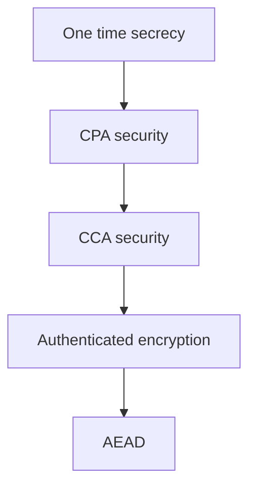
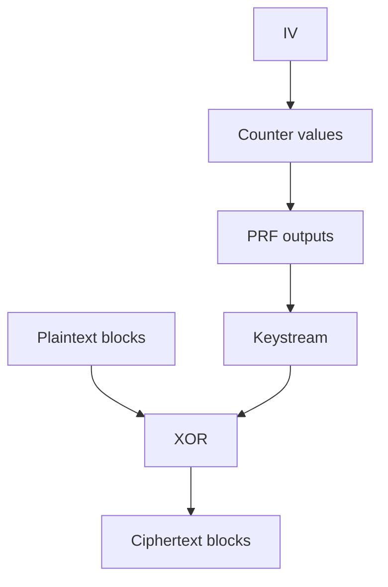
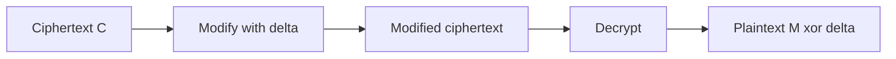
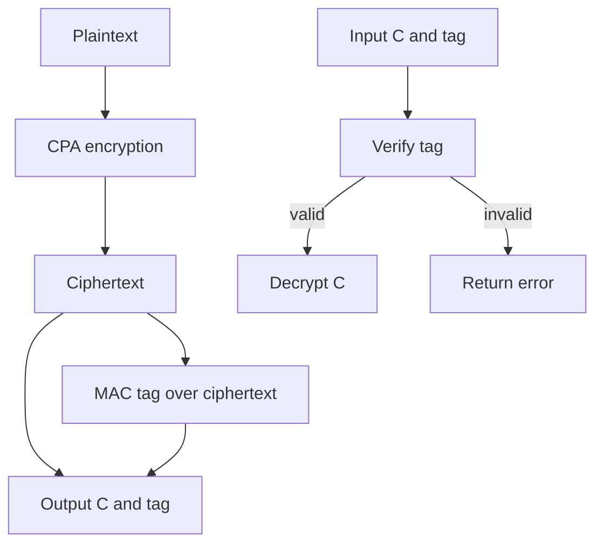
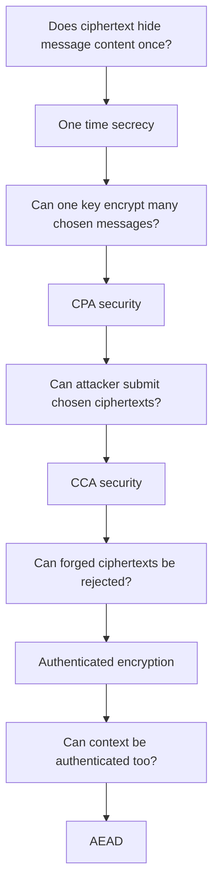

# Topic 1.5: Chosen-Plaintext & Chosen-Ciphertext Attacks

## Assessment Window
- Midterm track

## Overview
CPA and CCA security, deterministic encryption limitations, secure modes of operation, malleability, and oracle attacks.

## Required Readings
- The Joy of Cryptography, Chapter 8: Chosen-Plaintext Attacks.
- The Joy of Cryptography, Chapter 9: Chosen-Ciphertext Attacks.

## Optional Readings
- Add optional reading links here.

## Materials
- [ ] Slides
- [ ] Quiz


# Notes

## 1. Main theme

The file explains why confidentiality alone is not enough. It starts with chosen plaintext security, then shows how chosen ciphertext access breaks otherwise reasonable encryption schemes, then builds toward MACs, Encrypt then MAC, authenticated encryption, AEAD, and modern constructions such as AES GCM and ChaCha20 Poly1305. 

## 2. CPA security

CPA security means an attacker may ask for encryptions of messages they choose, but still cannot distinguish real encryptions from random ciphertexts of the same length. The only permitted leakage is message length. This is why deterministic encryption is unacceptable for ordinary confidentiality: if the same plaintext always gives the same ciphertext, equality of messages leaks immediately. 

A simple distinguisher against deterministic encryption is:

```text
Ask for Enc(M)
Ask again for Enc(M)
If both ciphertexts are equal, guess real encryption
Otherwise guess random library
```

In a real deterministic scheme, equality happens every time. In the ideal random library, equality is overwhelmingly unlikely.

## 3. Length leakage still matters

The slides correctly emphasize that CPA security does not hide message length. Length can reveal website identity, command type, content type, or language patterns in encrypted voice traffic. Padding to fixed sizes or standard size buckets is the usual mitigation, but padding trades bandwidth for privacy. 

Engineering note: many systems claim “encrypted” while still leaking highly actionable metadata through length, timing, ordering, sender, receiver, and retry behavior. CPA security is only about ciphertext content indistinguishability under chosen encryption queries.

## 4. AES alone is not an encryption scheme for arbitrary messages

AES is a block cipher. It maps one fixed size block to one fixed size block under a key. The slides state AES uses a 16 byte input and output, with 16, 24, or 32 byte keys. Encrypting multiple blocks by applying raw AES independently to each block leaks structure. The page 8 image demonstrates this visually: the desired result is random looking noise, but the naive block based result still shows the penguin outline. 

The key point is:

```text
AES(K, M) is deterministic
Therefore repeated plaintext blocks produce repeated ciphertext blocks
Therefore structure leaks
```

This is the classic ECB failure pattern.

## 5. Modes of operation

The file compares common block cipher modes. CBC chains each block with the previous ciphertext block and needs an unpredictable IV. CTR turns a block cipher into a stream cipher by encrypting nonce plus counter values and XORing that keystream with plaintext. CTR is parallelizable, but the nonce must never repeat under the same key. 

CBC encryption shape:

```text
C0 is random IV
C1 = F(K, C0 XOR M1)
C2 = F(K, C1 XOR M2)
C3 = F(K, C2 XOR M3)
```

CTR encryption shape:

```text
S1 = F(K, N plus 0)
S2 = F(K, N plus 1)
S3 = F(K, N plus 2)

C1 = M1 XOR S1
C2 = M2 XOR S2
C3 = M3 XOR S3
```

CTR is elegant and fast, but reuse of the same nonce recreates the same keystream. If two messages use the same keystream, then `C1 XOR C2 = M1 XOR M2`, which is often enough to recover both messages.

## 6. Golden rule of PRFs

The slides give a strong rule: when a PRF is used inside a larger construction, security usually depends on whether the construction gives distinct inputs to the PRF. A secure PRF can still be used insecurely if the surrounding construction repeats PRF inputs. 

This is the central design lesson behind CBC, CTR, GCM, and many MAC constructions. The primitive may be secure, but the composition can still fail.

Bad pattern:

```text
F(K, same input) appears again and again
Attacker observes relations between outputs
Construction leaks structure
```

Good pattern:

```text
Every PRF input is unique under a key
Outputs can be modeled as independent pseudorandom blocks
Construction has a chance to be provably secure
```

## 7. CCA security

CCA security gives the attacker both encryption access and decryption access, except for direct decryption of the challenge ciphertext. The slides show that this models real systems where attackers can submit chosen ciphertexts and observe errors, crashes, timing, or application behavior. 

CPA answers:

```text
Can the attacker learn from chosen encryptions?
```

CCA answers:

```text
Can the attacker learn from chosen encryptions and chosen decryptions?
```

The difference is critical because many real attacks come from decryption behavior, not encryption behavior.

## 8. Format oracle attacks

The file’s core CCA example is a null oracle against CTR mode. The oracle decrypts a ciphertext and returns whether the plaintext contains a null byte. The slides stress that even one bit of leakage can be enough when the encryption mode is malleable. 

CTR malleability:

```text
C = M XOR S
C XOR Δ decrypts to M XOR Δ
```

So an attacker can flip chosen bits in the ciphertext and cause predictable flips in the plaintext, without knowing the key.

The attack idea:

```text
Target one byte of M
Guess a byte value g
Modify the matching byte of C by XORing g
Ask the null oracle
If the modified plaintext contains 00 at that position, the guess is correct
Repeat for each byte
```

The slides estimate at most 255 oracle queries per byte, so a 16 byte message needs about 4080 queries, while full plaintext brute force would need about 256¹⁶ trials. 

Important nuance: the oracle as written returns true if any plaintext byte is null. If the original plaintext already contains null bytes elsewhere, naive recovery can get false positives. A rigorous exploit needs a way to isolate the target byte, control surrounding format, or use a more specific oracle. The lesson remains valid: malleability plus observable decryption behavior is dangerous.

## 9. Operational mitigations are not enough

The slides discuss rate limiting and correctly say it only slows exploitation. It does not remove the cryptographic flaw. Attackers can wait, distribute requests, use multiple accounts, or target low volume high value secrets. The correct fix is to make invalid ciphertexts fail before dangerous decryption behavior occurs. 

Practical rule:

```text
Do not rely on hiding errors
Do not rely only on rate limits
Do not decrypt unauthenticated ciphertexts
Verify authenticity before exposing plaintext behavior
```

## 10. Real format oracle families

The file lists padding oracles, timing side channels, Apple iMessage gzip format behavior, and XML format oracles. The shared pattern is the same: a system decrypts attacker supplied ciphertext and reveals something about the resulting plaintext. 

The vulnerable shape is:

```text
Receive untrusted ciphertext
Decrypt it
Parse or process plaintext
Return different errors, timing, crashes, or behavior
Attacker learns a predicate about plaintext
```

The secure shape is:

```text
Receive ciphertext and tag
Verify tag first
If verification fails, return one generic error
Only then decrypt and parse
```

## 11. CCA real and CCA random libraries

The CCA random library models ideal behavior. Encryption returns random ciphertexts but remembers which plaintext belongs to each generated ciphertext. Decryption returns plaintext only for ciphertexts created by the library. For other ciphertexts, the CCA definition may still let decryption return something, which is why authenticated encryption later becomes stronger. 

This distinction matters:

```text
CPA: random ciphertexts hide plaintexts
CCA: random ciphertexts still resist decryption oracle abuse
AE: attacker generated ciphertexts must be rejected
```

## 12. CPA secure does not mean CCA secure

The slides revisit a CPA secure construction:

```text
R random
S = F(K, R) XOR M
Ciphertext = R || S
```

This is CPA secure because `R` changes each encryption and the PRF output acts like a fresh pad. But it is malleable. If an attacker changes `S` to `S XOR Δ`, decryption returns `M XOR Δ`. The attacker can distinguish real from ideal by asking for an encryption, modifying the second component, and checking if decryption changes the plaintext predictably. 

This is the design lesson:

```text
Randomized encryption can hide plaintexts
But without integrity it may still allow controlled plaintext modification
```

## 13. Frankenstein attack

The file gives a stronger example using a PRP style construction:

```text
S = F(K, R) XOR F(K, M)
Ciphertext = R || S
```

The attack requests two encryptions of the same message and swaps ciphertext parts. In the real library, the two Frankenstein ciphertexts decrypt to the same value because XOR is commutative and the shared `F(K, M)` term remains. In the random library, equality happens only with negligible probability. 

Attack shape:

```text
Ask for R1 || S1 = Enc(M)
Ask for R2 || S2 = Enc(M)

Ask Dec(R1 || S2)
Ask Dec(R2 || S1)

If outputs are equal, guess real
Otherwise guess random
```

This shows that not every failure is simple bit flipping. Sometimes the exploit comes from algebraic structure across multiple ciphertexts.

## 14. MACs

The slides introduce MACs as keyed functions that produce tags. A verifier with the same key can check whether the message was produced by someone holding the key. Unlike ordinary hashes, MACs require a secret key and provide authenticity plus integrity. 

A PRF can be used as a MAC:

```text
Tag = F(K, message)
Verify by recomputing F(K, message)
```

Security goal:

```text
Even after seeing tags for chosen messages
The attacker cannot produce a valid tag for a new message
```

This is exactly the primitive needed to stop malleability.

## 15. Encrypt then MAC

The deck presents Encrypt then MAC as the safe generic way to combine CPA secure encryption with a secure MAC. Encrypt the message, compute a MAC over the ciphertext, send ciphertext plus tag, and verify the tag before decrypting. If the tag is invalid, return error. 

Construction:

```text
C = Enc(Ke, M)
T = F(Km, C)
Send C || T

On receive:
Check T equals F(Km, C)
If not, return err
Otherwise decrypt C
```

Why it works:

```text
Attacker cannot forge a valid tag for a modified ciphertext
So the decryption oracle becomes useless on attacker created ciphertexts
So malleability is blocked before decryption
```

## 16. Other MAC and encryption combinations

The file compares three approaches. Encrypt then MAC is CPA secure and CCA secure. Encrypt and MAC is not even CPA secure because the tag is computed over plaintext, so equal plaintexts produce equal tags. MAC then encrypt may be CPA secure, but CCA security depends on the exact encryption scheme and implementation behavior. 

Safe default:

```text
Use Encrypt then MAC
Or use a standard AEAD mode
Do not invent a custom composition
```

## 17. Authenticated encryption

Authenticated encryption strengthens CCA security. CCA security says attacker generated ciphertexts should not reveal useful information. AE says attacker generated ciphertexts should be rejected. In the AE random library, only ciphertexts created by the encryption oracle decrypt successfully. Everything else returns error. 

Security properties:

```text
Confidentiality: ciphertexts hide plaintexts
Integrity: ciphertexts cannot be modified successfully
Authenticity: valid ciphertexts must come from a key holder
```

The slides state that AE implies CCA, but CCA does not necessarily imply AE. 

## 18. AES GCM

AES GCM combines AES CTR for confidentiality with GHASH for authentication. The inputs are key, nonce, associated data, and plaintext. The tag authenticates both ciphertext and associated data. It is efficient because it is single pass, parallelizable, and widely hardware accelerated. 

Conceptual flow:

```text
CTR part:
C = M XOR AES generated keystream

GHASH part:
Authenticate associated data and ciphertext

Final tag:
T = GHASH result XOR AES(K, nonce block zero)
```

Critical implementation requirements from the slides:

```text
Never reuse a nonce with the same key
Prefer 96 bit nonces
Use 128 bit authentication tags
Verify before decrypt
```

The file explicitly warns that nonce reuse in AES GCM can cause complete loss of confidentiality and authentication. 

## 19. GHASH

GHASH is a keyed universal hash function over the finite field GF(2¹²⁸). It treats blocks as polynomial coefficients and evaluates them at a secret point derived from AES. The deck explains that GHASH is fast, parallelizable, and hardware friendly, while HMAC SHA256 would require more sequential work. 

Important limitation:

```text
GHASH is not a general public hash
It is keyed
It is linear
It is unsuitable for public collision resistance
It is appropriate inside GCM where the key is secret
```

So GHASH and SHA2 serve different purposes. GHASH is for fast keyed authentication inside AEAD. SHA2 or SHA3 is for public hashing needs such as signatures, certificates, Git objects, proof of work, and public integrity checking. 

## 20. Key commitment

The file notes that most AEAD schemes, including AES GCM, do not guarantee key commitment. Key commitment means a ciphertext should decrypt validly only under the key that generated it. Without this property, a crafted ciphertext may decrypt to one plaintext under key `K1` and another plaintext under key `K2`. 

This matters in multi recipient encrypted files, messaging systems, content distribution, and forensic workflows. AEAD authenticates relative to a key, but it does not always prove that a ciphertext is bound uniquely to one key identity.

Engineering note: when key commitment matters, use a commitment aware scheme or bind key identity, recipient identity, protocol version, and context into associated data.

## 21. ChaCha20 Poly1305

ChaCha20 Poly1305 is a modern AEAD. ChaCha20 provides stream cipher encryption and Poly1305 provides authentication. The slides highlight its strong performance on systems without AES hardware and better timing attack resistance because it avoids table lookup style AES implementations. It is used in TLS 1.3, Signal, and WireGuard. 

Conceptual flow:

```text
Derive one time Poly1305 key from ChaCha20 block zero
Encrypt plaintext using ChaCha20 starting at block one
MAC associated data, ciphertext, and lengths using Poly1305
Return ciphertext and tag
```

Engineering preference:

```text
Use AES GCM when AES hardware is reliable and nonce management is strong
Use ChaCha20 Poly1305 when portability and constant time software performance matter
```

## 22. AEAD comparison

The file compares AES GCM, ChaCha20 Poly1305, and AES CBC plus HMAC. AES GCM is fast with hardware acceleration and parallelizable, but nonce sensitive. ChaCha20 Poly1305 is excellent without AES hardware and has strong side channel resistance. AES CBC plus HMAC is older, two pass, not parallel for CBC encryption, but can still be secure when implemented as Encrypt then MAC. 

Practical ranking:

```text
Modern default for most systems: AES GCM or ChaCha20 Poly1305
Legacy compatible option: AES CBC plus HMAC with Encrypt then MAC
Avoid: unauthenticated CBC, unauthenticated CTR, ECB, custom modes
```

## 23. Replay attacks

Authenticated encryption does not automatically prevent replay. The slides show Alice encrypting a command to display a file. Later, an attacker reuses the same valid ciphertext in a delete context. Since the ciphertext is authentic, Bob accepts it unless the context is also authenticated. 

Failure pattern:

```text
Ciphertext is genuine
Ciphertext is old or used in the wrong context
Receiver checks only cryptographic validity
Receiver ignores semantic context
Replay succeeds
```

AE prevents forgery, not misuse of a legitimate old ciphertext.

## 24. Associated data

Associated data fixes context binding. It is not encrypted, but it is authenticated. Both sender and receiver provide the same associated data during encryption and decryption. If the attacker replays the ciphertext under different associated data, decryption fails. 

Example from the slides:

```text
Enc(K, display, family recipes file)
Dec(K, display, C) succeeds
Dec(K, delete, C) fails
```

Good associated data choices:

```text
Protocol name
Protocol version
Message type
Session identifier
Sender identity
Receiver identity
Sequence number
Timestamp or epoch
Conversation transcript hash
Operation name such as display or delete
```

Use associated data aggressively because it does not increase plaintext size and it prevents cross context ciphertext reuse.

## 25. AEAD

AEAD means authenticated encryption with associated data. The formal library stores plaintexts under both associated data and ciphertext. Decryption succeeds only if both match. This gives confidentiality, authenticity, and context binding. 

AEAD security goal:

```text
Attacker cannot learn plaintexts
Attacker cannot forge valid ciphertexts
Attacker cannot move a valid ciphertext into a different context
```

This is the most practical target for modern symmetric encryption APIs.

## 26. Fujisaki Okamoto transform

The final optional slide introduces the Fujisaki Okamoto transform for public key encryption. The stated purpose is to convert CPA secure public key encryption into CCA secure public key encryption by deriving randomness from the message and adding consistency checks during decryption. Invalid ciphertexts fail verification. 

Inspection note: the slide presents a simplified transform. Do not treat that pseudocode as production ready. Real FO style constructions are scheme specific and require exact hash domain separation, consistency checks, randomness handling, and proof assumptions.

## 27. Main engineering takeaways

1. Never use raw AES as message encryption.

2. Never use ECB.

3. For CTR, CBC, and GCM, nonce or IV rules are security critical.

4. CPA security is necessary but insufficient for real systems with decryption endpoints.

5. Any observable difference after decryption can become an oracle.

6. Malleability plus an oracle can fully recover plaintext.

7. Verify authenticity before decryption and before parsing.

8. Prefer standard AEAD APIs over manual encryption plus MAC composition.

9. Bind all protocol context through associated data.

10. Design replay protection separately with sequence numbers, epochs, timestamps, nonce tracking, or receiver side state.

11. Treat nonce reuse in AES GCM as catastrophic.

12. Remember that AEAD does not automatically provide key commitment.

## 28. Short mental model

```text
CPA protects against chosen encryption observation

CCA protects against chosen decryption abuse

AE rejects attacker created ciphertexts

AEAD rejects attacker created ciphertexts and wrong context ciphertexts
```

The progression of the file is therefore:

```text
Encryption confidentiality
Malleability problem
Decryption oracle problem
MAC based integrity
Authenticated encryption
Context binding with associated data
```
# Notes

The file contains textbook notes on two major themes: Chapter 8 covers chosen plaintext attacks against encryption, and Chapter 9 moves to chosen ciphertext attacks, MACs, authenticated encryption, and AEAD. 

## 1. Main thesis

The document builds the security ladder for symmetric encryption:

1. One time secrecy is too weak for real systems because real systems reuse one short key many times.

2. CPA security is the first realistic confidentiality goal. It says ciphertexts should reveal nothing except plaintext length.

3. CPA security is still not enough when attackers can submit ciphertexts for decryption.

4. CCA security adds protection against chosen ciphertext behavior.

5. AE and AEAD are the practical modern goals because they provide both confidentiality and authenticity.

The conceptual path is:



## 2. CPA security and plaintext length

CPA security is introduced as a multi use encryption goal: the same key may encrypt many plaintexts, and the attacker can choose plaintexts to be encrypted. The important subtlety is plaintext length leakage. Ciphertexts cannot completely hide length, because ciphertext size necessarily reveals at least some length information. The best realistic goal is therefore: ciphertexts leak no information beyond plaintext length. 

In the real or random formulation, the encryption of message `M` should look like a uniformly sampled ciphertext from the set of ciphertexts that correspond to plaintexts of the same length as `M`. This avoids the impossible demand that encryptions of short and long messages look identical in size.

Practical implication: even strong encryption does not hide traffic patterns. The file mentions that length and timing can reveal web pages, streamed videos, or even spoken phrases in encrypted audio. This is a side channel outside the usual ciphertext content model. 

## 3. Left or right CPA security

The left or right definition says the attacker submits two messages `ML` and `MR`, and receives an encryption of one of them. The attacker should not be able to tell which one was encrypted.

The definition only makes sense when `ML` and `MR` have equal length. Otherwise the ciphertext length itself may reveal which plaintext was chosen.

The text maps the common names as follows:

1. Left or right CPA security: `IND CPA`

2. Real or random CPA security: `IND$ CPA`

The engineering lesson is simple: any security experiment involving message comparison must control for length. Otherwise the test is invalid.

## 4. Deterministic encryption cannot be CPA secure

A deterministic encryption scheme always returns the same ciphertext for the same key and plaintext. The file proves that this cannot satisfy CPA security because an attacker can request encryption of the same message twice. If the ciphertexts are equal, the attacker detects determinism. In the random world, two independently sampled ciphertexts collide only with negligible probability. 

This explains why raw ECB mode and textbook deterministic constructions fail. CPA security must hide not only message contents, but also whether two plaintexts are equal.

## 5. Randomized PRF based encryption

The file introduces a randomized construction:

1. Choose fresh random `R`.

2. Compute a pad using `F(K, R)`.

3. Encrypt as `S = F(K, R) xor M`.

4. Output `R || S`.

The intuition is that `R` selects a fresh pseudorandom one time pad for each encryption. If `R` values do not repeat, then the PRF outputs behave like fresh pads. Repetition probability is bounded by the birthday bound, so with sufficiently large `λ`, repeats are negligible. 

```mermaid
flowchart LR
    M[Plaintext M] --> X[XOR]
    R[Random R] --> F[PRF F K R]
    F --> X
    X --> S[Ciphertext body S]
    R --> C[Output R || S]
    S --> C
```

Important distinction: `R` is controlled by the encryption algorithm, while `M` is controlled by the attacker in a CPA game. That distinction is central to the security proof.

## 6. Example CPA attack caused by swapping roles

The document shows a near miss construction where the designer swaps the role of `R` and `M`. Instead of computing something like `F(K, R) xor M`, the insecure version lets the attacker controlled message become the PRF input.

That breaks the Golden Rule of PRFs: avoid repeated PRF inputs when outputs are used as masks. Since the attacker controls `M`, the attacker can force repeated PRF inputs and detect algebraic relations among ciphertexts.

The engineering lesson: randomness should feed the PRF input, not attacker chosen structured data unless the proof explicitly supports that design.

## 7. Block cipher modes

The file then moves from fixed length encryption to variable length plaintexts via block cipher modes.

### ECB mode

ECB encrypts each block independently:

`Ci = F(K, Mi)`

It is deterministic and leaks equality of blocks. Identical plaintext blocks become identical ciphertext blocks. The file uses the classic ECB penguin example to show that visual structure survives encryption. 

Do not use ECB for confidentiality.

### CBC mode

CBC chains blocks:

`C0 = IV`

`Ci = F(K, Mi xor C i minus 1)`

The first ciphertext block is a random IV. CBC is CPA secure when the IV is uniformly random and unpredictable, and the block cipher behaves like a secure PRP. The proof idea is to show that PRP inputs do not repeat except with negligible birthday probability. 

CBC encryption is sequential because each block depends on the previous ciphertext block.

### CTR mode

CTR creates a keystream:

`F(K, IV plus 1), F(K, IV plus 2), ...`

Then XORs the keystream with plaintext blocks.

CTR encryption and decryption are parallelizable after the IV is known. It does not need the inverse block cipher operation. It is usually easier to adapt to arbitrary plaintext length because the last keystream block can be truncated. 



Critical warning: CTR fails catastrophically if the same IV is reused with the same key. Reuse reveals the XOR of the two plaintexts. CBC is not safe under IV misuse either, but CTR misuse is especially severe. 

## 8. Non block aligned plaintexts and padding

CTR handles arbitrary length naturally by truncating the final keystream block.

CBC requires padding because the block cipher input must be a complete block. The file defines padding as a reversible encoding that maps any string into a block aligned string.

Null padding is rejected because it is not reversible. For example, a message that genuinely ends with null bytes becomes ambiguous after unpadding.

PKCS#7 works by appending `d` copies of byte value `d`, where `d` is the number of padding bytes needed. ANSI X.923 is similar but uses zero bytes followed by the final length byte. 

Important edge case: if the plaintext is already a multiple of the block length, a full padding block must still be added. Otherwise unpadding is ambiguous.

Security warning: behavior on invalid padding matters. Padding validation errors later become a source of chosen ciphertext attacks.

## 9. Nonce based encryption

The file distinguishes randomized encryption from nonce based encryption.

Randomized encryption depends on fresh unpredictable randomness.

Nonce based encryption depends only on nonce uniqueness. The nonce may be predictable or even attacker chosen, as long as it is never reused.

This distinction is important in engineering because getting high quality randomness right is harder than maintaining a counter or packet sequence number. 

However, the file explicitly warns that the IVs in the earlier CBC and CTR definitions cannot simply be treated as nonces. Their proofs rely on random unpredictable IVs, while nonce based security allows adversarially chosen nonces. 

## 10. Chosen ciphertext attacks

Chapter 9 starts with the main problem: real systems decrypt attacker supplied ciphertexts. If system behavior leaks anything about the resulting plaintext, attackers may exploit it.

The file presents format oracle attacks. A victim decrypts a ciphertext and exposes one bit of information, such as whether the plaintext contains a null byte, has valid padding, is valid XML, or has valid gzip format. That small signal can be enough to recover full plaintexts. 

CPA security does not model this because CPA only gives the attacker encryption access. It says nothing about attacker chosen decryption queries.

## 11. CTR malleability

CTR mode is malleable. If an attacker flips bits in a ciphertext block, the corresponding plaintext bits flip after decryption.

Conceptually:

`Dec(C xor Δ) = M xor Δ`

This does not mean the attacker knows `M`, but it means the attacker can create controlled changes to `M`.



This enables the null oracle attack. The attacker changes one byte at a time and asks whether the decrypted plaintext contains a null byte. That turns a single bit oracle into a byte recovery process. The attack is linear in the plaintext length, not exponential in the full message size. 

## 12. CCA security

The first attempt at CCA security fails because an attacker can ask for an encryption of `M`, then immediately submit that exact ciphertext for decryption. The real library returns `M`, while the random library likely returns unrelated data.

The real CCA definition fixes this by treating challenge ciphertexts specially. The library records ciphertexts generated by encryption and answers their decryption consistently. For all other ciphertexts, the attacker should learn nothing useful. 

The intuition: decryption access should not help the attacker learn anything about challenge ciphertexts beyond what is already allowed.

## 13. CCA attack strategies

The file gives two attack patterns.

First, malleability strategy:

1. Request encryption of a chosen plaintext.

2. Modify the ciphertext in a predictable way.

3. Ask the decryption oracle to decrypt the modified ciphertext.

4. Use the output relation to distinguish real encryption from random behavior.

Second, Frankenstein strategy:

1. Request two ciphertexts.

2. Mix components from different ciphertexts.

3. Submit the mixed ciphertexts to the decryption oracle.

4. Detect a structural relation that should not appear in the random world.

The key lesson is that CCA attacks often exploit structure in the decryption algorithm, not direct weakness in the block cipher.

## 14. Message authentication codes

The document introduces MACs as a way to authenticate data. A MAC tag proves that someone with the secret key vouched for a message. The file models MACs using PRFs: `T = F(K, X)`. A secure PRF makes it hard to guess a valid tag for any new message, even after seeing tags for many other messages. 

A forgery means producing a valid tag for data before seeing that valid pair from the legitimate tag oracle.

Important nuance: a MAC does not prove freshness. A valid pair may be replayed by someone who does not know the key. It only proves that the pair was created by a key holder at some point.

## 15. Encrypt then MAC

Encrypt then MAC transforms CPA secure encryption into CCA secure encryption:

1. Encrypt the plaintext with a CPA secure encryption scheme.

2. Compute a MAC tag over the ciphertext.

3. Output ciphertext plus tag.

4. During decryption, verify the tag before decrypting.

If the tag is invalid, return an error and do not decrypt. This prevents attackers from using the decryption function as a malleability or format oracle. 



The file stresses that independent keys are important for the encryption and MAC components. It also notes that GCM is a standardized practical construction related to this paradigm, with CTR style encryption and a MAC, but its related key design is justified by a specific proof. 

## 16. Bad composition patterns

The file compares three ways to combine encryption and MACs:

1. Encrypt then MAC: gives CCA security under the stated assumptions.

2. Encrypt and MAC: not CCA secure, and not even CPA secure in the discussed form, because repeated plaintexts can produce repeated tags.

3. MAC then encrypt: ambiguous. It may or may not be secure depending on the encryption scheme. CPA security alone is not enough to prove it safe. 

Practical rule: use a well specified AEAD scheme instead of manually composing primitives.

## 17. Authenticated encryption

CCA security is confidentiality against chosen ciphertext behavior. Authenticated encryption adds a stronger authenticity expectation: ciphertexts not generated by the legitimate encryption algorithm should decrypt to error.

The file states that AE is strictly stronger than CCA. Encrypt then MAC is a secure AE if the underlying encryption is CPA secure and the MAC is a secure PRF. 

This is the bridge from theoretical confidentiality to deployable secure channels.

## 18. Associated data and AEAD

AEAD extends authenticated encryption with associated data. Associated data is not encrypted, but it is authenticated.

Examples of associated data include:

1. Protocol version

2. Sender and receiver identity

3. Session id

4. Sequence number

5. Message type

6. Previous transcript hash

7. Request id

8. File name or operation context

The file uses a replay style example: a ciphertext valid in one context may be replayed in another. AE alone authenticates the ciphertext, but not necessarily the context. AEAD binds ciphertext validity to the associated data, so replaying under different context fails. 

The file also notes a useful abstraction: AEAD with empty associated data behaves like AE, and AEAD with empty plaintext behaves like a PRF or MAC. Leading schemes such as AES GCM are standardized as AEAD schemes. 

## 19. Proof techniques used throughout the file

The file repeatedly uses several proof patterns:

1. Hybrid arguments
   Replace one component at a time until the real library becomes the ideal library.

2. PRF replacement
   Replace a secure PRF with a lazy random table and argue indistinguishability.

3. Bad event analysis
   Define a rare event such as repeated IVs, repeated PRF inputs, or successful MAC forgery.

4. Birthday bound
   Show that random collisions among `λ` bit values are negligible when query count is polynomial.

5. One time pad reasoning
   Once a mask is uniformly random and used once, XORing it with a message gives a uniform ciphertext.

6. Dictionary caching
   In CCA and AE proofs, record challenge ciphertexts so decryption can answer consistently without using the real decryption algorithm.

## 20. Implementation notes

Use AEAD by default. Prefer AES GCM, ChaCha20 Poly1305, or another vetted AEAD construction instead of raw CBC or raw CTR.

Do not use ECB.

Do not reuse CTR nonces or IVs under the same key.

Do not expose padding errors, parsing errors, or format validation differences before authentication.

Do not decrypt before authenticating.

Use associated data aggressively. Bind ciphertexts to protocol context, role, direction, session, sequence number, algorithm suite, and message type.

Do not design custom MAC and encryption composition unless you also have a proof for that exact construction.

Treat plaintext length as visible unless you apply explicit padding or traffic shaping. Even then, consider residual length and timing leakage.

## 21. Final mental model

The file teaches that encryption security is not one property. It is a stack of threat models.



The most important lesson: CPA secure encryption such as CTR or CBC can still be dangerous in real systems because real systems often decrypt attacker supplied ciphertexts and reveal behavior. Modern designs should target AEAD, not raw encryption modes.


# Notes

## 1. High level map

These papers form one coherent lesson: cryptographic primitives are not enough. Real security depends on composition, oracle behavior, version negotiation, timing behavior, key binding, nonce discipline, and error handling. POODLE and Lucky Thirteen show how CBC record processing leaks plaintext through padding and timing behavior. The iMessage paper shows that using RSA, AES, and ECDSA does not automatically produce secure message encryption. The key commitment paper shows that even authenticated encryption can miss a property that real systems silently rely on. Handschuh and Preneel show that universal hash based MACs can degrade from forgery resistance to key recovery when key material is reused. Fujisaki and Okamoto give a formal way to integrate asymmetric and symmetric encryption into chosen ciphertext secure hybrid encryption. 

```text
Common failure chain

Secure primitive
→ wrong composition
→ observable accept or reject behavior
→ oracle
→ plaintext recovery, forgery, or key recovery
```

## 2. POODLE

The POODLE paper attacks SSL 3.0 fallback. The core issue is not only that SSL 3.0 is old. The issue is that many clients used a fallback dance: try a modern TLS version first, then retry older versions when the handshake fails. A network attacker can force artificial failures and push both sides down to SSL 3.0 even when newer TLS versions are supported. Once SSL 3.0 is reached, CBC padding becomes exploitable. 

The cryptographic flaw is that SSL 3.0 CBC padding is not fully authenticated. In a full padding block, most padding bytes are arbitrary and only the final padding length byte matters. An active attacker can replace the final ciphertext block with an earlier block from the same stream. If the server accepts the modified record, the attacker learns a relation involving one unknown plaintext byte. Repeating this gives cookie byte recovery. The paper estimates about 256 SSL 3.0 requests per recovered byte. 

```text
TLS capable client
→ attacker causes handshake failures
→ client falls back to SSL 3.0
→ CBC padding oracle appears
→ cookie bytes are recovered
```

The mitigation is decisive: disable SSL 3.0, or at minimum prevent attacker induced fallback using TLS_FALLBACK_SCSV. The paper explicitly says SSL 3.0 has no secure cipher suite left in this setting, because RC4 has bias problems and CBC has the padding oracle issue. 

Engineering lesson: backward compatibility is part of the attack surface. A secure modern protocol can be bypassed if the downgrade path is attacker controllable.

## 3. Lucky Thirteen

Lucky Thirteen attacks CBC mode in the TLS and DTLS record protocols. The relevant construction is MAC then encode then encrypt. The plaintext is MACed first, then padding is added, then CBC encryption is applied. The problem is that padding is processed before the receiver can know the true MAC input length. Small timing differences in decryption processing become a side channel. 

The paper says the attacks apply to CBC mode in compliant TLS 1.1 and TLS 1.2 implementations, also DTLS 1.0 and DTLS 1.2, and to SSL 3.0 and TLS 1.0 implementations that attempted padding oracle countermeasures. This is important because the attack is not just an implementation bug. It follows from the protocol design plus extremely delicate timing behavior. 

The attack family includes distinguishing attacks, partial plaintext recovery, and full plaintext recovery. The authors report that the basic OpenSSL TLS attack could recover a block with roughly 2^23 sessions, but variants are more effective. For example, partial recovery can require around 2^16 sessions per remaining byte in certain cases, and web cookie recovery can be reduced to about 2^13 sessions per byte when browser behavior and base64 structure help the attacker. 

The deeper lesson is that constant time decryption is not just constant time comparison. The whole record processing path must be independent of padding validity, MAC input length, error reason, and sanity check outcome. The paper recommends uniform processing time for ciphertexts of the same size and explains how even padding checks and dummy MAC work must be carefully balanced. 

```text
CBC ciphertext
→ decrypt
→ inspect padding
→ compute MAC over length dependent data
→ timing difference
→ statistical plaintext recovery
```

## 4. Apple iMessage chosen ciphertext attacks

The iMessage paper reverse engineers and analyzes Apple iMessage. The authors describe iMessage as widely deployed and end to end encrypted, but also state that its encryption protocol had not previously received rigorous cryptanalysis. Their main finding is a chosen ciphertext attack on Huffman compressed data that can retrospectively decrypt some iMessage payloads in fewer than 2^18 queries. 

The reconstructed encryption design is a complex hybrid composition. A message is encoded as a binary plist, gzip compressed, encrypted with AES CTR using a fresh 128 bit AES key and IV equal to 1, then split. The AES key and first 101 bytes of ciphertext are encrypted to recipients using RSA OAEP, while the rest of the AES ciphertext is included separately and signed using ECDSA. 

The key design problem is that iMessage did not use a proper authenticated symmetric encryption layer. The signature did not safely replace authenticated encryption in the multi user setting, and the encrypted payload structure allowed adaptive chosen ciphertext behavior. The paper also notes broader weaknesses, including centralized key distribution, lack of forward secrecy at the time analyzed, replay and reflection issues, and older certificate pinning gaps. 

The attack is especially serious because it is retrospective. An attacker who obtains old ciphertexts may decrypt some of them later, as long as one relevant device remains online and can be used as an oracle through the protocol behavior. The paper reports responsible disclosure and says Apple deployed mitigations including certificate pinning, removing compression for attachment messages, and a duplicate ciphertext detection style fix. 

Engineering lesson: do not compose encryption and signatures ad hoc. Use AEAD or a proven hybrid encryption transform. Also avoid compression before encryption when attacker controlled structure can influence the plaintext format.

## 5. Authenticated encryption without key commitment

This paper focuses on key commitment. Standard authenticated encryption gives confidentiality and ciphertext integrity, but it does not necessarily guarantee that a ciphertext decrypts validly only under the key that created it. A ciphertext may be valid under two different keys and decrypt to two different plaintexts. That is not a violation of standard AE security, because key commitment was not part of the usual AE goal. 

The paper shows that this missing property matters in real products. It discusses vulnerable settings such as key rotation in key management services, envelope encryption, and Subscribe with Google. In key rotation, for example, the same ciphertext may be tried against several key versions. If the AE scheme does not commit to a key, an attacker may craft one ciphertext that opens as a benign file under one key and a malicious file under another key. 

The practical attack component is striking. The authors built tooling to construct AES GCM ciphertexts that decrypt to two valid plaintexts under different keys, including file formats such as PDF, Windows executables, and DICOM. They connect this with binary polyglots, files that are valid under more than one format interpretation. ([USENIX][1])

The paper proposes two repair directions. One is a generic composition where the key derives both a commitment string and an encryption key, and the output includes the commitment. Another is a padding based fix for schemes such as AES GCM and ChaCha20 Poly1305, where decryption verifies a fixed leading block before accepting the plaintext. The authors stress that the padding fix needs scheme specific analysis. 

```text
Normal AE guarantee

ciphertext valid under K
→ message was not modified for K

Key commitment guarantee

ciphertext valid under K
→ K is the intended key
```

Engineering lesson: if ciphertexts can be decrypted under multiple candidate keys, key versions, recipients, tenants, or contexts, key commitment must be explicit.

## 6. Soatok comparison of symmetric encryption methods

This item is a practitioner guide rather than an academic paper. The primary blog page was not directly accessible through the browsing tool, so these notes rely on accessible excerpts and references to the article. The verified excerpts emphasize that AES GCM is preferable to unauthenticated AES CBC, because GCM provides both confidentiality and integrity, while raw CBC opens padding oracle risk. If CBC must be used, it should be combined with MAC over the IV and ciphertext, key separation, and constant time verification. ([Bitwarden Community Forums][2])

The same ecosystem guidance highlights a hardware caveat for AES GCM. PHP documentation contains a Soatok note explaining that libsodium exposes AES GCM only when hardware accelerated AES and PCLMULQDQ are available, because software AES and GHASH can create timing risk. The note recommends ChaCha20 Poly1305 or XChaCha20 Poly1305 when the developer cannot control deployment hardware, and AES GCM when hardware support and compliance requirements make it appropriate. ([php.net][3])

The main design lesson matches the research papers above: modern symmetric encryption should normally be AEAD, not encryption alone. For file encryption or application payloads, prefer constructions with large nonce space, robust misuse behavior where needed, and clear associated data binding.

Practical selection logic:

```text
Unknown hardware
→ ChaCha20 Poly1305 or XChaCha20 Poly1305

Controlled hardware with AES acceleration
→ AES GCM can be appropriate

Legacy CBC requirement
→ encrypt then MAC with key separation
```

## 7. Key recovery attacks on universal hash function based MAC algorithms

Handschuh and Preneel analyze MACs built from universal hash functions. These schemes are attractive because they can be very fast, parallelizable, and backed by clean combinatorial security arguments. The paper focuses on what happens when universal hash keys are reused across messages, especially in practical MAC schemes derived from Wegman Carter authentication. 

The central finding is that for several universal hash based MACs, a small number of successful forgeries can lead to partial or full key recovery. Once key recovery occurs, the attacker can produce arbitrary future forgeries. This is worse than ordinary existential forgery, because the security of the MAC collapses rather than merely allowing one forged message. 

The paper discusses attacks against a broad set of constructions, including polynomial hash families, MMH, Square Hash, NH and UMAC variants, and also GCM or GMAC related constructions. The authors stress that their results do not contradict the proven forgery bounds. The issue is that the security model tolerates rare forgeries, but real systems may reuse keys long enough that those rare events become stepping stones to key recovery. 

The most important cryptographic distinction is this:

```text
Forgery resistance bound
→ attacker may eventually find a valid tag

Key recovery attack
→ attacker learns reusable secret material
→ unlimited future valid tags
```

Engineering lesson: universal hash MAC designs need strict limits on key reuse, nonce handling, verification oracle exposure, and key lifetime. A proof about average collision probability over keys does not mean every individual key is equally robust.

## 8. Fujisaki Okamoto secure integration

Fujisaki and Okamoto give a generic hybrid encryption conversion. The goal is to combine an asymmetric encryption scheme and a symmetric encryption scheme into an asymmetric scheme secure against adaptive chosen ciphertext attacks in the random oracle model. The paper is important because hybrid encryption is common in practice, but naive hybrid composition is not automatically secure. ([Grainger Course Websites][4])

The construction samples a random value sigma. It derives the symmetric key as G(sigma). It derives the asymmetric encryption randomness as H(sigma, message). The ciphertext consists of an asymmetric encryption of sigma plus a symmetric encryption of the message. During decryption, the receiver decrypts sigma, recovers the message, recomputes the asymmetric encryption, and rejects if the recomputed value does not match. ([Grainger Course Websites][4])

Conceptually:

```text
Encryption

sigma random
sym key = G(sigma)
asym coins = H(sigma, message)

c1 = asymmetric encrypt sigma
c2 = symmetric encrypt message

ciphertext = c1 || c2
```

```text
Decryption

recover sigma from c1
recover message from c2 using G(sigma)
recompute c1 from sigma and message
accept only if recomputation matches
```

The recomputation check is the key idea. It prevents malformed ciphertexts from being accepted unless they are consistent with a valid encryption process. This is how the transform resists chosen ciphertext manipulation in the random oracle model. ([Grainger Course Websites][4])

Engineering lesson: hybrid encryption must bind the encapsulated secret, symmetric ciphertext, randomness, and validity check. This is the formal opposite of ad hoc protocol composition.

## 9. Cross paper design rules

1. Prefer AEAD over encryption plus separate integrity unless there is a strong compatibility reason.

2. If CBC exists in a legacy protocol, treat padding, MAC verification, error handling, and timing as one security critical unit.

3. Never expose distinct failure reasons for padding, parsing, decompression, signature, MAC, or key mismatch.

4. Bind associated data explicitly: protocol version, algorithm suite, recipient identity, sender identity, key identifier, nonce, and context.

5. Disable obsolete protocol fallback. If fallback must exist, make downgrade intent authenticated and detectable.

6. Avoid compression before encryption when attacker influenced data and secrets share the same compressed plaintext.

7. Use key commitment when ciphertexts may be decrypted under multiple keys or key versions.

8. Do not reuse universal hash MAC keys beyond the assumptions of the design.

9. Treat verification oracles as dangerous. A yes or no answer can be enough for plaintext recovery or key recovery.

10. Use formal transforms for hybrid encryption rather than assembling RSA, AES, signatures, and compression manually.

The common theme is that modern cryptographic engineering is mostly about eliminating unintended oracles. These papers are different case studies of the same failure mode: the attacker does not break the primitive directly; the attacker exploits the system behavior around the primitive.

[1]: https://www.usenix.org/conference/usenixsecurity22/presentation/albertini "How to Abuse and Fix Authenticated Encryption Without Key Commitment | USENIX"
[2]: https://community.bitwarden.com/t/encryption-suggestions-including-argon2/350?page=3 "✅ Encryption suggestions (including Argon2) - Page 3 - Password Manager - Bitwarden Community Forums"
[3]: https://www.php.net/manual/en/function.sodium-crypto-aead-aes256gcm-is-available.php "PHP: sodium_crypto_aead_aes256gcm_is_available - Manual"
[4]: https://courses.grainger.illinois.edu/cs598dk/fa2019/Files/fujisaki_okamoto.pdf "Fujisaki-Okamoto Hybrid Encryption Paper"
