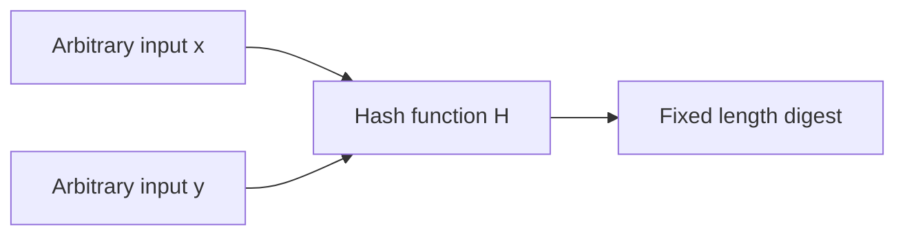
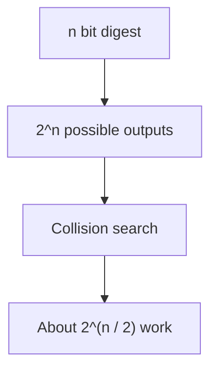
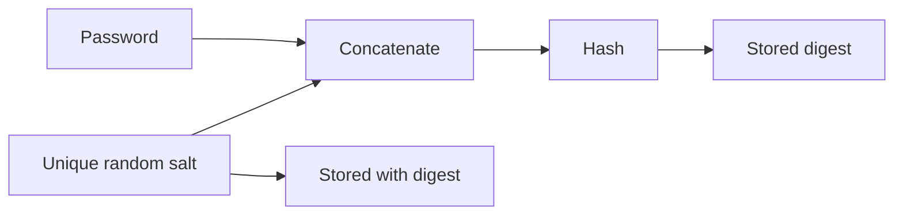
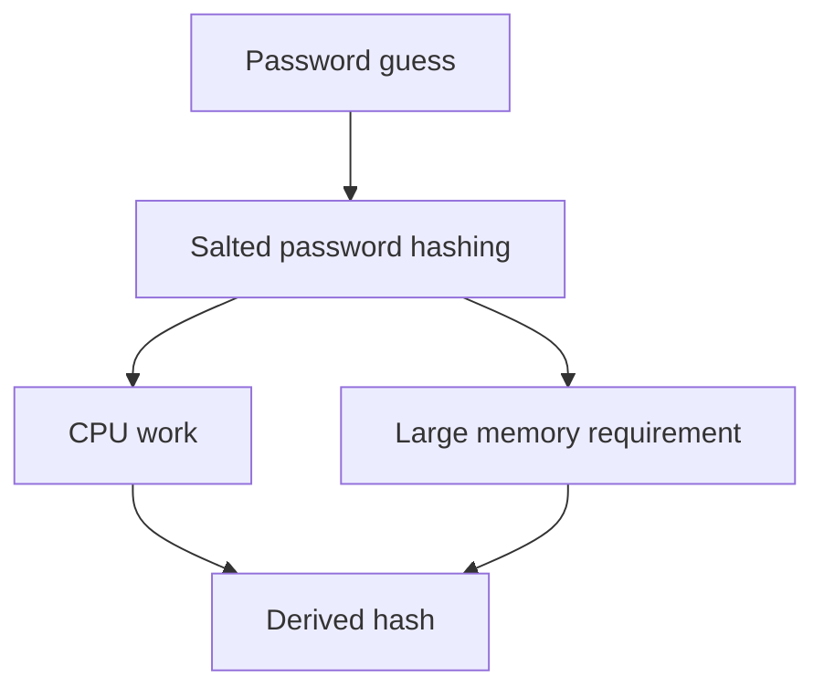
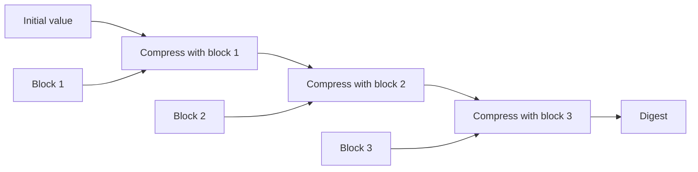
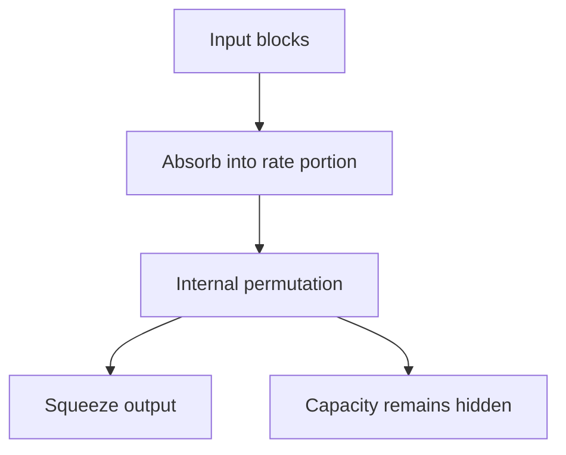
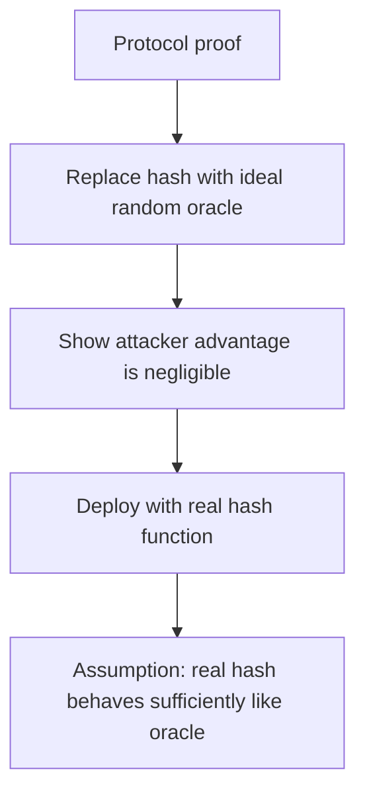

# Topic 1.6: Collision-Resistant Hash Functions

## Assessment Window
- Midterm track

## Overview
Collision resistance, preimage notions, birthday bounds, modern hash choices, and secure password hashing.

## Required Readings
- The Joy of Cryptography, Chapter 10: Collision-Resistant Hash Functions.
- The Joy of Cryptography, Chapter 12: Random Oracles and Other Idealized Models.

## Optional Readings
- Add optional reading links here.

## Materials
- [ ] Slides
- [ ] Quiz


# Notes

File inspected: Applied Cryptography, Summer 2026, Part 1: Provable Security, 1.6: Collision Resistant Hash Functions. 

## 1. Core hash function model

A cryptographic hash function maps arbitrary length input to fixed length output. The slides emphasize five practical expectations: arbitrary input size, fixed output size, determinism, strong avalanche behavior, and efficient computation.

The important consequence is compression. Because the input domain is effectively unbounded while the output range is finite, collisions are mathematically unavoidable. Security is therefore not about making collisions impossible. Security is about making them computationally infeasible to find.

A useful mental model:



If `x` and `y` are different but `H(x) = H(y)`, then a collision exists.

## 2. Main security properties

The file distinguishes three properties that are often confused:

| Property                   | Adversary goal                                               | Practical meaning                                             |
| -------------------------- | ------------------------------------------------------------ | ------------------------------------------------------------- |
| Collision resistance       | Find any two different inputs with the same digest           | Prevent malicious substitution attacks                        |
| Preimage resistance        | Given a digest, recover an input that hashes to it           | Prevent reversing a hash                                      |
| Second preimage resistance | Given one input, find a different input with the same digest | Prevent replacing a known object with another matching object |

Collision resistance is the strongest looking attack game because the adversary is free to choose both inputs. Second preimage resistance is more constrained because one input is fixed in advance.

Important nuance: collision resistance does not mean no collisions exist. It means no efficient attacker should be able to find one.

## 3. Collision risk and the birthday bound

The slides correctly connect collisions to the birthday paradox. For an output space of size `N`, collision probability becomes significant after roughly `sqrt(N)` random samples.

For an `n` bit hash function, the output space has size:

```text
N = 2^n
```

The birthday attack cost is approximately:

```text
2^(n / 2)
```

So the effective collision security of common digest sizes is roughly:

| Digest length | Collision work factor |
| ------------: | --------------------: |
|      128 bits |                  2^64 |
|      160 bits |                  2^80 |
|      256 bits |                 2^128 |
|      512 bits |                 2^256 |

This is why 128 bit hash outputs are no longer appropriate for collision resistant designs, even though 2^128 may sound large. Collision attacks cut the security level in half.



## 4. Collision attacks in practice

The slides list historically broken hash functions:

MD4 is completely broken. MD5 has practical collisions. SHA 0 was withdrawn. SHA 1 has practical collisions. Modern general purpose choices include SHA 2, SHA 3, BLAKE2, BLAKE3, KangarooTwelve, and TurboSHAKE.

The MD5 chosen prefix collision example is especially important. A normal collision means:

```text
H(x) = H(y)
```

A chosen prefix collision is more dangerous:

```text
H(prefix1 || suffix1) = H(prefix2 || suffix2)
```

This lets an attacker start from two meaningful different prefixes and append carefully crafted suffixes so both full objects collide. That is why the 2008 rogue certificate authority attack was devastating. It showed that collision attacks can break real trust systems, not just toy examples.

The SHA 1 SHAttered attack also matters because it produced two distinct PDF files with the same SHA 1 digest. This demonstrated that SHA 1 collision attacks were no longer theoretical.

## 5. Hash quality and proof limits

The slides make a good distinction between asymmetric and symmetric cryptography, but the later nuance is the important part.

Asymmetric schemes often rely on mathematical hardness assumptions such as factoring or discrete logarithms. These are not unconditional proofs. They are security arguments under assumptions.

Symmetric primitives such as block ciphers and hash functions usually gain trust through cryptanalysis, statistical analysis, design arguments, and partial formal results. Some components can be proven to satisfy specific structural properties, but the full primitive is not proven secure in an absolute sense.

The correct conclusion is:

Security always rests on assumptions. The difference is the type of assumption and the amount of cryptanalytic evidence behind it.

## 6. Precomputation attacks and salts

The password storage section is one of the most practically important parts of the file.

Without salts, an attacker can precompute hashes for common passwords once and reuse the result across many systems. This enables lookup tables and rainbow tables.

With salts, each password hash becomes context specific:

```text
h = H(S || P)
```

where `S` is a random unique salt and `P` is the password.

The salt does not need to be secret. It must be random, unique per password record, long enough, and stored with the hash.



Security effect:

| Without salt                          | With salt                            |
| ------------------------------------- | ------------------------------------ |
| Same password gives same hash         | Same password gives different hashes |
| Tables are reusable                   | Tables are not reusable              |
| One computation can attack many users | Each user requires separate work     |
| Password reuse is visible             | Password reuse is hidden             |

A 16 byte salt is a reasonable minimum. Modern systems commonly use 128 bit salts or larger.

## 7. Important correction about raw hashing passwords

The slides say salted hashing is good practice, then later clarify that specialized password hashing is best practice. The stronger operational guidance is:

Do not store passwords with raw SHA 256, SHA 3, or BLAKE3, even with salts.

These functions are designed to be fast. Fast hashing helps defenders compute checksums quickly, but it also helps attackers test billions of password guesses quickly.

For password storage, use a password hashing function or password key derivation function designed to be expensive.

Preferred modern choices:

| Function | Notes                                                    |
| -------- | -------------------------------------------------------- |
| Argon2id | Best general modern default                              |
| scrypt   | Strong memory cost design                                |
| bcrypt   | Still widely used, but older                             |
| PBKDF2   | Acceptable mainly for compatibility and compliance cases |

## 8. PBKDF2 and its limitation

PBKDF2 repeatedly applies a pseudorandom function, usually HMAC, using a salt and iteration count. Its main defense is CPU cost.

The file correctly points out the weakness: PBKDF2 is not memory expensive. Specialized hardware can parallelize it efficiently. Raising iterations helps, but it does not address GPU and ASIC economics as well as memory intensive schemes.

PBKDF2 is not broken in the same sense as MD5 or SHA 1. The issue is that it is a weaker cost equalizer against modern cracking hardware.

## 9. Memory intensive password hashing

scrypt and Argon2 make password guessing expensive by requiring both computation and memory.

This matters because memory is harder to scale cheaply than raw arithmetic. A GPU may have massive arithmetic throughput, but each parallel cracking lane also needs memory. That reduces the attacker's advantage.



The key defense is economic: make each guess expensive enough that large scale guessing becomes unattractive or infeasible.

The file mentions target processing time of about 0.5 to 1 second per hash. That is a reasonable high security target for interactive logins, but production tuning must consider authentication traffic, denial of service resistance, and server capacity.

## 10. Length extension attacks

The length extension section is important and needs precise interpretation.

Merkle Damgård hash functions process messages block by block. The final digest is essentially the final chaining state. For SHA 1, SHA 256, SHA 512, and MD5, this structure enables length extension attacks.

A more precise statement is:

If an attacker knows `H(M)` and knows or can guess the byte length of `M`, the attacker can compute:

```text
H(M || glue_padding || extra_data)
```

without knowing `M`.

This does not let the attacker compute `H(M || extra_data)` directly. The mandatory Merkle Damgård padding is part of the forged message.

The vulnerable construction is:

```text
tag = H(secret || message)
```

An attacker who sees `message` and `tag` may be able to append extra data and compute a valid tag for the extended message.

Safer constructions:

```text
tag = HMAC(key, message)
```

or use a dedicated MAC such as CMAC, Poly1305, or KMAC depending on the protocol context.

## 11. Merkle Damgård construction

The file describes Merkle Damgård as:

1. Pad the message.
2. Split into fixed size blocks.
3. Process blocks sequentially with a compression function.
4. Output the final chaining state.

Simplified structure:



Because the digest exposes enough chaining state to continue processing, naive secret prefix authentication is unsafe.

## 12. Sponge construction

SHA 3 uses a sponge construction rather than Merkle Damgård.

The sponge has a larger internal state divided conceptually into:

| Component | Meaning                        |
| --------- | ------------------------------ |
| Rate      | Part used for input and output |
| Capacity  | Hidden security reserve        |

The construction absorbs input blocks into the state, applies a permutation, then squeezes output from only part of the state.



The security intuition is that the attacker sees only part of the internal state. Since the hidden capacity is not exposed, the attacker cannot simply resume hashing from the digest.

## 13. HMAC

HMAC is the correct construction for keyed hashing with Merkle Damgård hashes.

The formula in the slides is:

```text
HMAC(K, m) = H((K xor opad) || H((K xor ipad) || m))
```

This nested design prevents length extension from producing valid tags. Even if the outer hash is length extendable, the attacker does not know the outer keyed prefix state.

Use HMAC when you need message authentication from a hash function. Do not invent custom constructions such as:

```text
H(secret || message)
H(message || secret)
H(secret || message || secret)
```

These are fragile and can fail under subtle attack models.

## 14. Blockchain use of hash functions

The file covers three blockchain uses:

| Use            | Hash role                                       |
| -------------- | ----------------------------------------------- |
| Proof of work  | Find an input whose digest satisfies a target   |
| Merkle trees   | Commit to many transactions efficiently         |
| Block chaining | Include previous block digest in the next block |

Proof of work is not a collision attack. It is closer to a partial preimage search: miners vary inputs until the digest is below a target or has enough leading zero bits.

Merkle trees rely on collision resistance. If collisions are easy, an attacker might produce different transaction sets with the same Merkle root.

## 15. Random Oracle Model

The file introduces the Random Oracle Model as an idealized abstraction where a hash function behaves like a truly random function but remains consistent for repeated queries.

A random oracle:

1. Returns the same output for the same input.
2. Returns fresh random looking output for new inputs.
3. Is available to honest parties and attackers.

This model helps prove protocol security, but it is not the same as proving security with a real hash function.



The limitation is fundamental: no real deterministic hash function can perfectly implement a random oracle. Some artificial schemes are secure in the Random Oracle Model but insecure with any concrete hash function.

## 16. Practical design guidance

For file integrity:

Use SHA 256, SHA 512, SHA 3, BLAKE2, or BLAKE3. For ordinary integrity checking, collision resistance and second preimage resistance matter. For adversarial contexts, avoid MD5 and SHA 1 entirely.

For password storage:

Use Argon2id when possible. Use unique random salts. Tune memory, time, and parallelism parameters. Store algorithm name and parameters with each password hash so migration is possible.

For authentication tags:

Use HMAC, KMAC, Poly1305, or another standard MAC. Do not use raw hash constructions with secrets.

For signatures:

Never use MD5 or SHA 1. Use modern hash functions with adequate output length. Make sure protocol encoding prevents ambiguity and chosen prefix style attacks.

For protocol agility:

Support migration, but avoid downgrade risk. Algorithm negotiation must be authenticated. Keeping obsolete algorithms enabled for compatibility can silently destroy security.

## 17. Key takeaways

The main lesson of the file is that hash functions are simple at the API level but subtle at the security level.

A hash function is not automatically suitable for every use case. Raw hashes are fine for checksums and commitments under the right assumptions. Password storage needs slow and memory intensive hashing. Authentication needs MAC constructions. Signature systems need collision resistant hashing and unambiguous encodings.

The most important operational rules are:

Use modern hash functions. Avoid MD5 and SHA 1. Salt password hashes. Prefer Argon2id or scrypt for passwords. Use HMAC or a standard MAC for authentication. Design for cryptographic migration without enabling downgrade attacks.


# Notes

Source reviewed: uploaded chapter text on collision resistant hash functions, salted hash definitions, password hashing, Merkle Damgård, length extension, NMAC, and HMAC. 

## 1. Core idea

A hash function maps a large input into a short fixed size output. The output acts like a fingerprint. The important correctness property is deterministic behavior:

Same input → same digest

Different input → should be hard to find same digest

A collision is:

```text
X ≠ X′
H(X) = H(X′)
```

Collisions must exist when the input space is larger than the output space. Collision resistance does not mean collisions do not exist. It means an efficient adversary should not be able to find one. 

## 2. Why collision resistance is subtle

The file correctly highlights a major theory versus practice mismatch. Unsalted hash functions are hard to define cleanly in formal provable security because there is no secret. An adversary can theoretically precompute a collision for a known hash function, hardcode that collision into its source code, and then run very quickly.

The key subtlety is this:

Finding the collision may take exponential work.

Running the adversary after the collision is hardcoded may be polynomial.

Formal indistinguishability definitions usually count the adversary runtime, not the historical effort needed to write the adversary source code. That is why the first formal attempt fails for ordinary unsalted hashes. 

## 3. Why salt fixes the formal problem

The file introduces a salted hash function:

```text
H(S, X)
```

Here S is sampled after the adversary program is fixed. This prevents the adversary from hardcoding a collision for the specific salted instance before execution starts.

Important distinction:

Salt is public.

Salt is not a cryptographic key.

Salt prevents reusable precomputation.

A good mental model is personalization. The public hash algorithm is shared, but each salt selects a different public variant of that algorithm. The adversary only learns which variant to attack at runtime. 

## 4. Birthday attack security level

For an n bit hash output, the generic collision search cost is about:

```text
2ⁿᐟ²
```

This is the birthday bound. It means an n bit digest does not provide n bits of collision security. It provides roughly n divided by 2 bits.

Practical consequence:

```text
128 bit digest → about 64 bit collision security
256 bit digest → about 128 bit collision security
512 bit digest → about 256 bit collision security
```

This is why 256 bit hashes are common when 128 bit collision security is desired. 

## 5. Collision resistance is not the only hash property

The file separates three different properties that are often confused.

Collision resistance:

```text
Find any X and X′ such that X ≠ X′ and H(X) = H(X′)
```

Second preimage resistance:

```text
Given X, find X′ where X′ ≠ X and H(X) = H(X′)
```

One wayness:

```text
Given Y, find some X such that H(X) = Y
```

These are different security games. A function can behave well for one property and badly for another. This distinction is especially important for password hashing, digital signatures, file integrity, and MAC constructions. 

## 6. Password hashing notes

The file correctly rejects three common bad designs.

Do not store passwords in cleartext.

Do not encrypt passwords for authentication storage.

Do not use ordinary unsalted fast hashes for passwords.

Encryption is wrong for password storage because the server must also store or access the decryption key. If the database and key environment are compromised together, encryption gives little protection.

Unsalted hashing is better than cleartext, but still weak because an attacker can precompute common password hashes and reuse that work across many systems.

Salted hashing improves the situation because every user should have a distinct salt:

```text
stored value = S, H(S, password)
```

This forces the attacker to perform separate cracking work per user. 

## 7. Password hashing needs slowness and memory cost

The file explains an important engineering distinction:

General purpose cryptographic hashes should be fast.

Password hashing should be expensive.

Fast hashes such as SHA 2 and SHA 3 are not ideal for passwords because attackers can test huge numbers of guesses. Iterating a fast hash many times helps, but specialized hardware can still gain large speedups.

The better design direction is memory expensive password hashing. The file points to Argon2 as a password hashing standard designed to consume significant memory. This matters because memory hardware is harder to specialize than raw hash computation. 

## 8. Real world hash family notes

The file discusses the SHA family as follows.

SHA 1 has 160 bit output and should not be used.

SHA 1 has practical collision attacks far below the ideal birthday cost.

SHA 2 includes SHA 256 and SHA 512 and uses the Merkle Damgård paradigm.

SHA 3 uses a sponge construction rather than Merkle Damgård.

The engineering lesson is simple: avoid SHA 1 and MD5 for collision security. Use modern constructions according to the use case. For message authentication, use HMAC or a dedicated MAC rather than plain hashing. For password storage, use a password hashing function. 

## 9. Composition of collision resistant functions

The file gives a positive composition result. If H is collision resistant, then applying H in a nested way can preserve collision resistance under the stated construction.

The proof idea is a reduction:

Assume someone finds a collision in the composed function.

Show how to turn that collision into a collision in H.

Therefore, if H is collision resistant, the composed function must also be collision resistant.

This proof style is contrapositive reasoning. Instead of directly proving no attacker exists, it says any attacker against the outer construction becomes an attacker against the underlying primitive. 

Simple view:

```text
X  → H → Y  → H → Z
X′ → H → Y′ → H → Z′
```

If Z equals Z′, then either the final H call collided or the earlier H call collided.

## 10. Bad composition using CBC MAC style chaining

The file shows that a CBC MAC like combination of a collision resistant hash can fail as a collision resistant hash construction.

The key issue is not that H itself is broken. The construction lets the attacker manipulate intermediate chaining values so that two different inputs enter a later hash call with the same value.

Engineering lesson:

A secure primitive can become insecure when composed incorrectly.

Collision resistance is not automatically preserved by intuitive chaining.

Designs inspired by encryption modes or MAC modes must be proven in the exact security model where they are used.

This is especially relevant when developers invent custom hashing, signing, commitment, or integrity schemes. 

## 11. Merkle Damgård construction

The file explains how to build a variable length hash from a fixed input compression function.

Conceptually:

```text
Y₀ = IV
Y₁ = H(Y₀, block₁)
Y₂ = H(Y₁, block₂)
Y₃ = H(Y₂, block₃)
digest = final Y
```

The compression function takes a chaining value and a message block. The output becomes the next chaining value.

The word compression here does not mean reversible data compression. It means the input to the compression function is larger than its output. 

## 12. Why length padding matters

A naive iterative construction can be secure for a fixed number of blocks but insecure for variable length inputs.

The reason is continuation ambiguity. A digest after processing some blocks can also be interpreted as an internal state for processing more blocks.

Merkle Damgård padding fixes this by encoding the message length into the final padded input. This makes messages of different lengths structurally distinguishable inside the compression chain.

Security proof structure:

If two messages have different lengths, their final length blocks differ, so a collision in the full hash reveals a collision in the compression function.

If two messages have the same length, they have the same number of blocks, so the proof reduces to the fixed length chaining argument. 

## 13. Length extension attack

The file gives a critical warning:

```text
F(K, X) = H*(K ∥ X)
```

is not a secure variable input PRF when H* is a Merkle Damgård hash.

Reason:

The digest of a Merkle Damgård hash is effectively the final internal chaining state. If an attacker knows:

```text
H*(K ∥ X)
```

and can infer or guess the length of K ∥ X, the attacker can continue hashing extra blocks without knowing K.

This allows the attacker to compute a valid digest for an extended message.

Important nuance:

This is not a collision attack.

This is a pseudorandomness and MAC forgery style attack.

The attacker is not finding two messages with the same digest. The attacker is extending a valid digest into another valid digest. 

## 14. Practical MAC warning

Never build a MAC as:

```text
hash(secret ∥ message)
```

when the hash is Merkle Damgård based.

This construction is vulnerable to length extension. Instead, use HMAC or a dedicated modern MAC.

Bad pattern:

```text
tag = SHA 256(secret ∥ message)
```

Better pattern:

```text
tag = HMAC SHA 256(secret, message)
```

The file later motivates HMAC exactly because it avoids the naive secret prefix problem. 

## 15. Hash then PRF construction

The file presents a way to turn a fixed input PRF into a variable input PRF:

```text
message → collision resistant hash → fixed size digest → PRF
```

Security intuition:

If two distinct messages almost never collide under the hash, then they become distinct fixed size PRF inputs. The PRF can then safely produce pseudorandom outputs for those fixed size inputs.

This is a clean modular design:

CRHF handles input length compression.

PRF handles pseudorandom keyed output.

The proof uses the collision resistance definition through equality checks inside a dictionary style argument. 

## 16. NMAC

NMAC is built from Merkle Damgård style hashing by using two keyed stages.

The file describes the high level recipe:

Build a salted collision resistant hash using a custom IV.

Treat the compression function as a fixed input PRF.

Combine them through the hash then PRF paradigm.

The important implementation detail is custom IV control. NMAC assumes access to the Merkle Damgård hash with a user specified IV. Many standard hash APIs do not expose custom IV control, which motivates HMAC. 

## 17. HMAC

HMAC is the practical variant designed for ordinary hash APIs with fixed IVs.

It simulates the structure needed by NMAC by deriving two internal keys from one key and fixed constants. Then it performs inner and outer hashing.

Conceptual shape:

```text
inner = H(key mixed with inner constant ∥ message)
tag = H(key mixed with outer constant ∥ inner)
```

Why this matters:

It avoids raw secret prefix hashing.

It works with standard hash implementations.

It is designed around Merkle Damgård realities.

It separates inner hashing from final authentication output.

The file frames HMAC as closely related to NMAC, with assumptions that make it indistinguishable from an NMAC like construction under suitable conditions. 

## 18. Main security lessons

1. Collision resistance means collisions are hard to find, not nonexistent.

2. Unsalted collision resistance is awkward in formal theory because precomputed hardcoded collisions break naive definitions.

3. Salt neutralizes reusable precomputation and gives cleaner formal security.

4. Birthday attacks cut collision security in half relative to digest length.

5. Password hashing is not ordinary hashing. Use per user salts and memory expensive password hashing.

6. Do not use SHA 1 or MD5 for collision security.

7. Do not invent hash chaining constructions without proof.

8. Merkle Damgård needs length encoding to be secure for variable length inputs.

9. Secret prefix hashing with Merkle Damgård is vulnerable to length extension.

10. HMAC exists because plain hashing is not a MAC.

## 19. Engineering checklist

For file integrity:

Use SHA 256, SHA 512, SHA 3, or another modern approved hash.

Compare full digests, not truncated digests unless the security level is explicitly analyzed.

For password storage:

Use Argon2id or an equivalent password hashing function.

Use a unique random salt per user.

Store the salt with the password hash.

Do not encrypt passwords for authentication storage.

Do not use raw SHA 256 for passwords.

For API authentication:

Use HMAC or a dedicated MAC.

Do not compute SHA 256(secret ∥ message).

Include domain separation when the same key family is used for multiple protocol purposes.

For protocol design:

State which property is required: collision resistance, second preimage resistance, one wayness, PRF security, or MAC security.

Do not treat those properties as interchangeable.

Analyze variable length encoding carefully.

Always bind message length, context, algorithm identifier, and domain when ambiguity could exist.

## 20. Final assessment

The file is a strong conceptual chapter. Its main value is that it does not merely say that hash functions are useful. It shows why formal collision resistance is difficult, why salt is theoretically and practically important, why birthday attacks define digest length choices, why password hashing needs specialized treatment, and why Merkle Damgård based hashes must not be used naively as keyed PRFs or MACs.

The most important operational takeaway is this:

```text
Hashing for integrity, hashing for passwords, and hashing for authentication are different engineering problems.
```

Using the same primitive name for all three is a common source of serious design bugs.


# Notes

## 1. High level map

These three works cover three different but connected cryptographic themes.

Marc Stevens, Elie Bursztein, Pierre Karpman, Ange Albertini, and Yarik Markov show that SHA 1 collision attacks moved from theoretical concern to practical reality by producing the first public collision for full SHA 1. Joël Alwen, Binyi Chen, Krzysztof Pietrzak, Leonid Reyzin, and Stefano Tessaro prove that scrypt achieves optimal cumulative memory complexity in the parallel random oracle model. Ran Canetti, Oded Goldreich, and Shai Halevi give a foundational warning: proving a scheme secure in the random oracle model does not automatically mean that replacing the oracle with a concrete hash function gives a secure real scheme. ([ePrint Archive][1])

The shared lesson is this:

```text
Hash functions have multiple roles

collision resistance
→ needed for signatures, certificates, content addressing, file identity

memory hardness
→ needed for password hashing and proof of work style cost equalization

random oracle behavior
→ often assumed in proofs, but not automatically implemented by real hash functions
```

## 2. The First Collision for Full SHA 1

The SHA 1 paper demonstrates the first known collision for the full SHA 1 hash function. SHA 1 outputs 160 bits, so a generic birthday collision search should cost roughly 2^80 work. The authors’ collision required effort equivalent to about 2^63.1 SHA 1 compression function calls, about 6,500 CPU years and 100 GPU years, which they report as more than 100,000 times faster than brute force. 

The practical meaning is simple but severe: SHA 1 should not be trusted for collision resistance. A collision means an attacker can construct two different byte strings with the same hash. This does not mean the attacker can invert arbitrary SHA 1 hashes, and it does not mean every SHA 1 based construction immediately reveals secrets. It specifically destroys the assumption that SHA 1 uniquely binds a digest to one message. 

The paper is also important because the collision was not just an abstract pair of random looking files. The authors chose the prefix of the colliding messages so the result could be embedded into two PDF documents with the same SHA 1 hash but different visual contents. The paper says the prefix was carefully chosen to allow two distinct PDF documents with arbitrarily chosen visual contents. ([ePrint Archive][1])

The attack is an identical prefix collision, not a general chosen prefix collision. In their construction, a given prefix P is extended with two distinct near collision block pairs, and then any common suffix S can be appended while preserving equality of the final SHA 1 hash. This is why the paper can create two files that differ only in controlled internal blocks but still end with the same digest. 

```text
Common prefix P
→ collision block pair one
→ collision block pair two
→ common suffix S
→ same SHA 1 digest
```

A key technical idea is the use of near collision blocks. Instead of trying to collide the entire compression function in one impossible step, the attack carefully introduces and then cancels differences through SHA 1’s internal state. The paper says the two colliding files differ only in two successive random looking message blocks produced by the attack. 

The historical context matters. Earlier attacks had reduced the estimated cost of SHA 1 collisions, but no public full collision had been produced. The paper notes that Wang et al. gave a theoretical full SHA 1 collision attack in 2005 with an estimated cost of 2^69 compression calls, while Stevens later gave an attack around 2^61 compression calls. The 2017 work crossed the practical demonstration threshold. 

Engineering consequence: never use SHA 1 where collision resistance matters. That includes digital signatures, certificate signatures, software update metadata, package integrity, long term document identity, deduplication trust boundaries, and content addressed storage where an attacker can choose inputs.

Important nuance: HMAC SHA 1 is not broken in the same way by this collision result, because HMAC security relies on different properties than plain collision resistance. But for new systems, SHA 256, SHA 384, SHA 512, SHA 3, BLAKE2, or BLAKE3 style choices are more appropriate depending on the protocol and standardization constraints.

## 3. Scrypt Is Maximally Memory Hard

This paper studies memory hard functions. A memory hard function is designed so the cost of evaluation is dominated by memory, not just arithmetic. The motivation is that memory cost is harder to reduce dramatically on specialized hardware, while pure computation can often be accelerated by GPUs, FPGAs, or ASICs. The paper lists password hashing, key derivation, and proof of work as applications. 

The paper focuses on scrypt, originally designed by Colin Percival and later described in RFC 7914. The authors note that scrypt has been used in cryptocurrencies such as Litecoin and Dogecoin and influenced Argon2d. Before this work, scrypt was widely believed to be memory hard, but rigorous lower bounds for its memory complexity were missing. 

The main result is that scrypt is optimally memory hard in the parallel random oracle model. More precisely, they prove cumulative memory complexity Ω(n²w), where n is the number of invocations of the underlying hash function and w is the output length. This is optimal up to constant factors because the naive sequential evaluation already has cumulative memory complexity O(n²w). 

Cumulative memory complexity is the sum of memory used over time. This is stronger than saying “the algorithm once uses a lot of RAM.” It measures the total memory area consumed during execution. This matters against adversaries who try to recompute values instead of storing them, or who parallelize evaluations and amortize cost over many password guesses. 

```text
Normal computation cost
→ count operations

Memory hard computation cost
→ count memory over time

Cumulative memory complexity
→ memory used at each step summed over all steps
```

The proof uses a pebbling style abstraction. Scrypt’s core can be viewed as a line graph where values must be computed in sequence, then later random challenge nodes must be recovered. An adversary with limited memory can store some labels, but to answer a random challenge it must recompute from the nearest stored point. The paper formalizes this through pebbling with challenges and then lifts the reasoning to the parallel random oracle model. 

Theorem 1 gives the main lower bound. For typical values, such as w equals 256 and n equals 2^20, the lower bound becomes Ω(n²w). The authors explicitly state that this is the best possible bound up to constant factors. 

The proof is nontrivial because scrypt is data dependent. The challenge locations are not externally sampled independent random nodes; they are derived from the random oracle behavior inside scrypt. The paper identifies this as a technical issue and handles it directly in the proof. 

Engineering consequence: scrypt has strong theoretical support as a memory hard password hashing primitive, but the theorem does not automatically choose safe production parameters. Parameters must still be set according to attacker economics, server latency budget, memory budget, denial of service exposure, and expected password entropy.

Important nuance: memory hardness is not the same as complete password storage security. You still need unique salts, strong parameter management, constant time comparison, rate limiting, breach monitoring, and migration strategy. Scrypt makes offline guessing more expensive; it does not make weak passwords strong.

## 4. The Random Oracle Methodology, Revisited

Canetti, Goldreich, and Halevi analyze the random oracle model methodology. The methodology has two steps. First, design and prove a protocol secure in an ideal world where all parties and the adversary can query a truly random function. Second, replace that random oracle with a concrete hash function such as MD5 or SHA in the real implementation. The paper’s purpose is to explain fundamental problems with this second step. 

The central negative result is that there exist signature and encryption schemes that are secure in the random oracle model, but for which any implementation of the random oracle by a function ensemble is insecure. The paper also says these schemes have a generic adversary that breaks the implementation once given the description of the function replacing the oracle. 

This does not mean every practical random oracle based protocol is broken. The authors explicitly say their constructed encryption and signature schemes are unnatural and that they do not claim the same statement holds for schemes presented in the literature. The real lesson is more precise: a proof in the random oracle model is not, by itself, a theorem about every concrete hash based implementation. 

A major concept in the paper is correlation intractability. Informally, a random oracle should make it infeasible for an attacker to find an input x such that the pair x and O(x) falls into some rare relation. The paper formalizes this and proves a strong negative result: correlation intractable function ensembles do not exist, even in a weak sense. 

```text
Random oracle proof

oracle is truly random
→ adversary sees only query answers
→ proof can program or reason about ideal randomness

Concrete hash implementation

function description is public
→ adversary can inspect code
→ adversary may exploit structure beyond query behavior
```

The distinction between oracle access and code access is central. In the ideal model, the adversary can only query the oracle. In a real implementation, the adversary has the full public algorithm. The paper emphasizes that the adversary may gain global insight into the function description and use it in ways that are impossible in the ideal model. 

The authors also explain why a secret seeded pseudorandom function would avoid part of the issue, but that is not the random oracle methodology used in public protocols. A secret PRF needs a trusted party or hidden seed, while real hash functions are fully specified and publicly evaluable by everyone. 

Engineering consequence: treat random oracle proofs as useful evidence, not as automatic implementation guarantees. When instantiating a random oracle, use domain separation, unambiguous encoding, length binding, suite binding, context binding, and modern hash functions. Also check whether the proof relies on programmability, collision resistance, indifferentiability, extractability, or algebraic behavior, because different proof techniques create different implementation risks.

## 5. Cross paper synthesis

These papers create an important triangle.

```text
SHA 1 collision paper
→ concrete hash functions can lose required properties

Scrypt paper
→ random oracle style modeling can prove meaningful lower bounds

Random oracle methodology paper
→ random oracle proofs do not automatically instantiate safely
```

The SHA 1 collision paper is a concrete cryptanalytic warning. A hash function can remain widely deployed long after theoretical weakness is known, until a practical attack finally forces migration. The paper says SHA 1 was officially deprecated by NIST in 2011, yet remained in use in 2017 for documents, TLS certificates, Git integrity, and backup purposes. ([ePrint Archive][1])

The scrypt paper is a positive modeling result. It does not say random oracles are real. It says that in a particular idealized model, scrypt achieves the strongest possible memory hardness bound. This gives confidence in the design goal, while still leaving implementation and parameter questions open. 

The Canetti Goldreich Halevi paper is the philosophical boundary. It says random oracle methodology is not universally sound. A protocol can be secure in the ideal oracle world but insecure under every fully specified replacement. This forces engineers to distinguish “proved in ROM” from “proved after concrete instantiation.” ([ePrint Archive][2])

## 6. Practical design rules

1. Do not use SHA 1 for collision sensitive use cases. Any protocol where two different attacker controlled messages with the same digest cause harm must migrate away from SHA 1.

2. Do not rely only on digest equality for semantic identity. For file formats, structured objects, certificates, and package metadata, bind type, length, context, algorithm identifier, and canonical encoding.

3. Use memory hard password hashing with explicit parameters. Scrypt’s strength depends on memory and cost settings, not only the algorithm name.

4. Do not treat memory hardness as side channel resistance. Scrypt’s theoretical lower bound does not automatically protect against cache leakage, timing leakage, or denial of service amplification.

5. When using random oracle based schemes, instantiate carefully. Use domain separation labels, fixed encodings, and modern hash functions with enough output length.

6. Read ROM proofs for what they actually require. Some proofs need only collision resistance. Some need programmability. Some need oracle outputs to look random in stronger ways. The implementation choice should match the proof obligation.

7. Separate collision resistance from pseudorandomness. SHA 1 collision failure does not equal full random oracle failure in every construction, but it is enough to invalidate any construction that needs collision resistance.

8. Plan cryptographic migration before public breaks. SHA 1 shows that “currently expensive” can become “practical” faster than deployed systems can migrate.

[1]: https://eprint.iacr.org/2017/190 "The first collision for full SHA-1"
[2]: https://eprint.iacr.org/1998/011 "The Random Oracle Methodology, Revisited"
