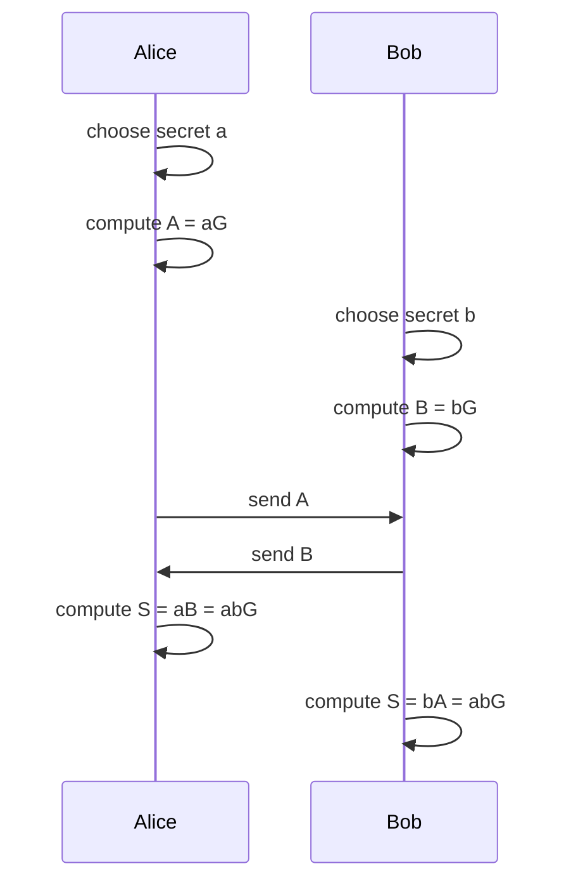
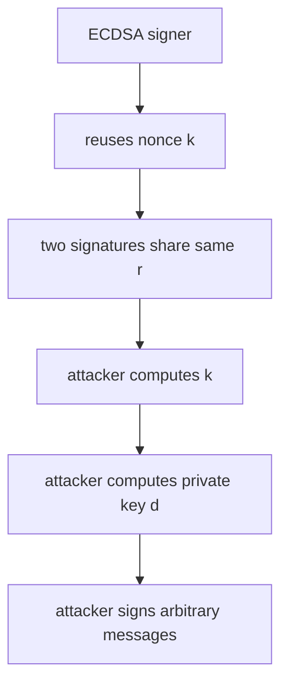
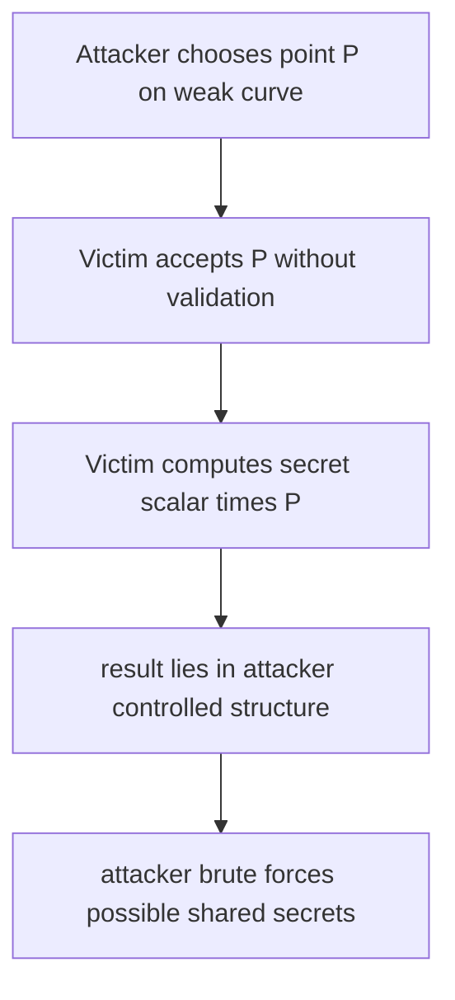

# Topic 1.8: Elliptic Curves & Digital Signatures

## Assessment Window
- Midterm track

## Overview
ECC fundamentals, ECDLP assumptions, ECDH/ECDSA/EdDSA, safe curve selection, and implementation pitfalls.

## Required Readings
- Serious Cryptography (2nd ed.), Chapter 12: Elliptic Curves.

## Optional Readings
- Add optional reading links here.

## Materials
- [ ] Slides
- [ ] Quiz

# Notes

I inspected the uploaded deck, **Applied Cryptography, Part 1: Provable Security, 1.8: Elliptic Curves & Digital Signatures**. It is a 69 page lecture deck covering elliptic curve theory, ECDH, digital signatures, ECDSA, EdDSA, Ed25519, curve selection, validation bugs, subgroup issues, Ristretto, and implementation practice. 

## 1. Main idea of the deck

The deck explains why elliptic curve cryptography matters: it gives public key cryptography with much smaller keys than RSA or classical finite field Diffie Hellman while maintaining comparable security. The central security assumption is the **elliptic curve discrete logarithm problem**, usually abbreviated as **ECDLP**.

The deck’s main message is:

* Elliptic curves give efficient public key cryptography.
* ECDH replaces modular exponentiation with scalar multiplication on curve points.
* ECDSA and EdDSA are signature schemes built on elliptic curve groups.
* Curve choice and validation rules are critical.
* Implementation mistakes in ECC often lead to total private key compromise.

## 2. Elliptic curve cryptography overview

Pages 3 to 6 compare ECC with RSA and finite field Diffie Hellman.

The deck correctly emphasizes that ECC achieves roughly 128 bit security with 256 bit curve keys, while RSA needs around 3072 bit keys for a similar security level. This efficiency matters for TLS, mobile devices, IoT systems, blockchains, SSH, messaging protocols, and certificate chains.

The key conceptual change is this:

* Classical DH works in a multiplicative group modulo a prime.
* ECDH works in a group of points on an elliptic curve.
* Classical DH uses exponentiation.
* ECDH uses scalar multiplication.

In finite field DH:

```text
public value = g^a mod p
shared secret = g^(ab) mod p
```

In ECDH:

```text
public value = aG
shared point = abG
```

Here, `G` is the base point, `a` and `b` are private scalars, and `aG` means adding `G` to itself `a` times using elliptic curve group addition.

## 3. Why ECDLP is different from classical discrete log

The deck explains that index calculus attacks work well against many finite field discrete logarithm settings, but no comparable general purpose subexponential attack is known for properly chosen elliptic curves.

This is one of the reasons elliptic curves can use smaller keys.

The important distinction is:

```text
Finite field DH:
Find x such that g^x = h mod p

Elliptic curve:
Find k such that kG = H
```

The easy direction is scalar multiplication:

```text
given k and G, compute H = kG
```

The hard direction is the reverse:

```text
given G and H, recover k
```

This asymmetry is what gives ECC its security.

## 4. Elliptic curves over real numbers versus finite fields

Pages 8 to 12 introduce the curve equation visually. The deck first shows curves over real numbers because they are easier to visualize. Then it moves to finite fields, where actual cryptographic operations happen.

The common Weierstrass form is:

```text
y² = x³ + ax + b
```

Over real numbers, this produces a smooth geometric shape. Over a finite field, the curve becomes a finite set of coordinate pairs satisfying the equation modulo `p`.

This distinction is important. Cryptographic implementations do not use floating point arithmetic or real valued geometry. They use exact modular arithmetic.

For a prime field:

```text
x, y ∈ Fp
y² ≡ x³ + ax + b mod p
```

Every coordinate is an integer from `0` to `p − 1`.

## 5. Point addition and point doubling

Pages 11 and 12 explain the group law visually.

For two different points `P` and `Q`:

```text
P + Q = R
```

The geometric intuition is:

* Draw a line through `P` and `Q`.
* Find the third intersection with the curve.
* Reflect that intersection across the x axis.
* The reflected point is `P + Q`.

For point doubling:

```text
2P = P + P
```

The intuition is:

* Draw the tangent line at `P`.
* Find where it intersects the curve again.
* Reflect that point across the x axis.

In finite fields, the same algebraic formulas are used, but all operations are modulo `p`.

The practical implementation never draws lines. It computes slopes, coordinate transforms, and modular inverses or uses projective coordinates to avoid inverses.

## 6. Elliptic curve group structure

Page 16 explains why elliptic curve points form a group.

The required group properties are:

* Closure: adding two valid points gives another valid point.
* Identity: the point at infinity acts like zero.
* Inverses: every point has a negation.
* Associativity: point addition groups consistently.

The point at infinity is written as:

```text
𝒪
```

It satisfies:

```text
P + 𝒪 = P
P + (−P) = 𝒪
```

This group structure lets us build protocols such as ECDH and signatures.

## 7. ECDH key agreement

Page 18 maps classical Diffie Hellman to elliptic curves.

A clean ECDH flow is:



A critical engineering note: the shared point `S` is not normally used directly as an encryption key. A secure protocol should feed the encoded shared secret into a key derivation function.

Typical pattern:

```text
ECDH shared point → encoding → KDF → symmetric keys
```

Also, unauthenticated ECDH is vulnerable to man in the middle attacks. Real protocols authenticate the exchange using certificates, signatures, pre shared keys, or transcript binding.

## 8. Digital signatures

Pages 20 to 23 introduce digital signatures.

A digital signature scheme has three core algorithms:

```text
KeyGen() → private key, public key
Sign(private key, message) → signature
Verify(public key, message, signature) → valid or invalid
```

Digital signatures provide:

* Authenticity: the signer had the private key.
* Integrity: the signed message was not modified.
* Non repudiation in many legal or operational contexts.

A key point from the deck is that digital signatures are message dependent. You cannot safely copy a valid signature from one message to another.

## 9. ECDSA overview

Pages 24 to 26 cover ECDSA.

ECDSA uses:

```text
private key: d
public key: P = dG
signature: (r, s)
```

For a curve with subgroup order `n`, signing a message `M` works conceptually as follows:

```text
h = Hash(M)
choose random nonce k
R = kG
r = x(R) mod n
s = k⁻¹(h + rd) mod n
signature = (r, s)
```

The deck writes `s = (h + rd) / k mod n`. That is mathematically understandable, but implementation wise it must be read as multiplication by the modular inverse of `k`:

```text
s = k⁻¹(h + rd) mod n
```

Division modulo `n` means modular inversion.

## 10. ECDSA verification

The verification flow is:

```text
h = Hash(M)
w = s⁻¹ mod n
u = hw mod n
v = rw mod n
Q = uG + vP
accept if r ≡ x(Q) mod n
```

Important precision note: page 26 says accept if `Qx = r`. Strictly, the check should be:

```text
r ≡ x(Q) mod n
```

A robust verifier must also check:

```text
1 ≤ r ≤ n − 1
1 ≤ s ≤ n − 1
Q is not 𝒪
public key is valid
```

Without these checks, malformed signatures or invalid public keys can create edge case vulnerabilities.

## 11. Why ECDSA nonce reuse is catastrophic

Pages 25 and 44 correctly emphasize that ECDSA nonce reuse exposes the private key.

If the same nonce `k` signs two different messages:

```text
s1 = k⁻¹(h1 + rd) mod n
s2 = k⁻¹(h2 + rd) mod n
```

Subtract:

```text
s1 − s2 = k⁻¹(h1 − h2) mod n
```

Recover the nonce:

```text
k = (h1 − h2)(s1 − s2)⁻¹ mod n
```

Recover the private key:

```text
d = (sk − h)r⁻¹ mod n
```

This is total key recovery.

The deck uses the PlayStation 3 case study on page 45 to show the real impact: reused ECDSA nonces allowed attackers to recover Sony signing keys.

A useful mental model:



## 12. ECDSA implementation risks

ECDSA is secure when implemented correctly, but fragile in practice.

Major risks:

* Bad random number generation.
* Nonce reuse.
* Biased nonces.
* Timing leakage during scalar operations.
* Missing public key validation.
* Signature malleability.

Signature malleability matters because in many ECDSA systems, if `(r, s)` is valid, then `(r, n − s)` may also verify. Some systems enforce a low `s` rule to make signatures canonical.

For new systems, deterministic ECDSA as specified in RFC 6979 is often used to avoid reliance on runtime randomness during signing.

## 13. EdDSA and Ed25519

Pages 27 to 31 introduce EdDSA and Ed25519 as modern alternatives to ECDSA.

The deck correctly highlights the major advantage: EdDSA signing is deterministic. It does not require a fresh random nonce per signature.

For Ed25519, the private key is hashed and expanded. The signing scalar is derived from part of the hash, and the nonce is derived from another part plus the message.

Conceptually:

```text
expanded = Hash(private key)
a = signing scalar
prefix = nonce derivation material
r = Hash(prefix || message)
R = rB
challenge = Hash(R || A || message)
S = r + challenge · a
signature = (R, S)
```

Verification checks:

```text
SB = R + Hash(R || A || M)A
```

This is much cleaner than ECDSA because it avoids modular inversion during signing and removes fresh randomness as a failure point.

## 14. Important Ed25519 precision notes

The deck gives a simplified EdDSA explanation. For implementation, the missing details are important:

* The signing scalar is not just the first half of a hash. It is clamped according to Ed25519 rules.
* Scalars are reduced modulo the subgroup order.
* Encoded points must be parsed according to precise validation rules.
* Some implementations differ in how they treat non canonical encodings, small order points, and edge cases.
* Ed25519, Ed25519ph, and Ed25519ctx are different variants and should not be mixed casually.

The deck later mentions validation inconsistencies on pages 53 and 54. That point is very important for consensus systems such as blockchains, where all nodes must accept and reject exactly the same signatures.

## 15. ECDSA versus Ed25519

The deck recommends Ed25519 for new projects unless ECDSA is required. That is a sound practical recommendation.

ECDSA is still common because of:

* TLS compatibility.
* Hardware support.
* Existing certificate ecosystems.
* Blockchain legacy.
* Compliance requirements.

Ed25519 is often better for new designs because:

* Deterministic signing avoids nonce failure.
* Signatures are compact.
* Implementations can be simpler.
* It has strong performance.
* It has good library support.

However, Ed25519 is not always drop in compatible with systems expecting ECDSA keys or X.509 profiles.

## 16. Curve selection

Pages 33 to 42 discuss safe curve selection.

The deck highlights three important criteria:

* Group order security.
* Complete or unified addition formulas.
* Transparent parameter generation.

Unsafe or poorly selected curves can make ECDLP easier or create implementation traps.

The deck contrasts NIST curves with Curve25519.

NIST P 256 is widely used and remains important for compliance and interoperability. The concern is not a known practical break of P 256, but parameter transparency. The origin of certain constants has historically been considered insufficiently transparent.

Curve25519 was designed with more transparent parameter choices and strong software performance.

## 17. NIST curve controversy and Dual EC DRBG

Pages 36 to 38 cover the trust issue around NSA influenced standards and Dual EC DRBG.

The deck’s point is that opaque constants reduce trust. Dual EC DRBG is a separate and much stronger case because it had a plausible backdoor mechanism involving two elliptic curve points `P` and `Q`.

If someone knows `d` such that:

```text
Q = dP
```

then outputs of the generator may reveal enough information to recover internal state and predict future outputs.

This is a major lesson for cryptographic engineering:

```text
unexplained constants + privileged parameter knowledge = serious trust problem
```

Even when no attack is known, transparent generation procedures are preferred.

## 18. Curve25519 and X25519

Pages 39 and 40 discuss Curve25519.

Curve25519 is commonly used for ECDH through X25519. Ed25519 is the signature scheme associated with the Edwards form of the same underlying curve family.

Important distinction:

```text
X25519: key agreement
Ed25519: digital signatures
Curve25519: curve family and underlying arithmetic context
```

The deck gives the Montgomery curve equation:

```text
y² = x³ + 486662x² + x
```

over:

```text
p = 2²⁵⁵ − 19
```

This curve is optimized for efficient field arithmetic and safe scalar multiplication patterns.

## 19. Invalid curve attacks

Pages 46 to 48 explain invalid curve attacks.

The core issue is that some elliptic curve addition formulas do not depend on the `b` coefficient. An attacker may send a point that does not lie on the intended curve, but the victim’s implementation still performs scalar multiplication with it.

Attack flow:



Prevention requires validating received public points:

```text
coordinates are in range
point is not 𝒪
point satisfies the correct curve equation
point belongs to the correct subgroup
```

Some modern protocols avoid exposed validation problems through design, but generic ECC code should never skip validation unless the library and protocol explicitly guarantee safety.

## 20. Small subgroup attacks

Pages 49 to 52 explain subgroup issues.

Many useful curves do not have prime order. For example, Curve25519 has a small cofactor. The total group order has the form:

```text
8 · ℓ
```

where `ℓ` is a large prime.

The large subgroup is secure. The small subgroup is dangerous if an attacker can force operations into it.

A small subgroup attack works like this:

* Attacker sends a point of small order.
* Victim multiplies it by the private scalar.
* The result has only a few possible values.
* Attacker brute forces all possibilities.

For an order 8 point, there are at most 8 outputs. That is catastrophic if the output is used to derive encryption keys.

Defenses include:

* Subgroup checks.
* Cofactor clearing.
* Prime order abstractions.
* Protocol specific validation.
* Using APIs such as X25519 correctly, including checking for an all zero shared secret where required.

## 21. Invalid curve versus small subgroup

The deck gives a good distinction on page 52.

Invalid curve attack:

```text
wrong curve equation
```

Small subgroup attack:

```text
right curve, wrong subgroup
```

This distinction matters because the defenses are not identical.

For invalid curve attacks, validate the curve equation.

For small subgroup attacks, validate subgroup membership or use a construction that eliminates cofactor issues.

## 22. Ristretto

Pages 55 and 56 introduce Ristretto.

Ristretto gives a prime order group abstraction over a curve with cofactor. It allows protocol designers to work as if they had a clean prime order group, while still using efficient Curve25519 style arithmetic underneath.

This matters because many cryptographic protocols and proofs assume prime order groups. Cofactors create edge cases that can break those assumptions.

Ristretto is especially relevant for advanced protocols such as:

* Anonymous credentials.
* Zero knowledge protocols.
* Commitment schemes.
* Multi party protocols.
* Privacy preserving systems.

## 23. Constant time implementation

Page 59 discusses timing attacks.

ECC scalar multiplication must not branch on secret scalar bits.

A vulnerable pattern is:

```text
if bit is 1:
    add point
else:
    skip
```

This leaks timing information about private key bits.

A safer implementation ensures the same operation pattern regardless of secret data.

Critical constant time areas:

* Scalar multiplication.
* Modular reduction.
* Modular inversion.
* Conditional swaps.
* Table lookups.
* Signature nonce derivation.
* Private key parsing.
* Error behavior where secrets influence execution.

The deck correctly says modern libraries should handle this, but the engineer must choose libraries that explicitly guarantee constant time behavior.

## 24. Memory handling

Page 60 discusses private key exposure through memory.

Important practical risks:

* Crash dumps.
* Swap files.
* Cold boot attacks.
* Process memory scanning.
* Debug logs.
* Serialization mistakes.
* Long lived key buffers.
* Copies created by garbage collected runtimes.

Good practices:

* Zero secrets after use.
* Use protected memory where available.
* Avoid unnecessary copies.
* Keep key material in HSMs or secure enclaves for high value assets.
* Avoid logging encoded private keys.
* Use libraries with secure memory primitives.

In Rust, the deck mentions the `zeroize` crate, which is commonly used to clear sensitive memory.

## 25. Testing ECC implementations

Page 61 gives good testing guidance.

A serious ECC test plan should include:

* Official test vectors.
* Cross library interoperability tests.
* Invalid public key tests.
* Malformed signature tests.
* Edge scalar tests.
* Point at infinity tests.
* Small subgroup tests.
* Non canonical encoding tests.
* Fuzzing of parsers.
* Constant time analysis.
* Differential testing across implementations.

For signatures, test both acceptance and rejection. Rejection tests are as important as success tests.

## 26. Library guidance

Page 57 advises against implementing ECC from scratch. That is the correct default.

Good selection criteria:

* Active maintenance.
* Security audit history.
* Constant time claims.
* Clear validation behavior.
* Standard compliance.
* Safe APIs.
* No exposed footguns.
* Good test vectors.
* Mature ecosystem usage.

For modern systems, strong default choices often include:

* X25519 for key agreement.
* Ed25519 for signatures.
* P 256 where compliance or legacy interoperability requires it.
* Ristretto where a prime order group abstraction is needed.

## 27. Practical design guidance

For a new protocol, a safe default shape is:

```text
X25519 for key agreement
HKDF for key derivation
Ed25519 for signatures
AEAD such as AES GCM or ChaCha20 Poly1305 for encryption
Transcript binding for authentication
Domain separation for all hashes
Strict input validation
Versioned algorithm negotiation
```

Do not use raw ECDH output directly. Do not invent a custom curve. Do not write custom scalar multiplication. Do not define ambiguous point encoding rules.

## 28. Corrections and precision improvements for the deck

The deck is broadly good, but these details should be tightened.

### ECDSA verification condition

The deck says:

```text
Accept if Qx = r
```

More precise:

```text
Accept if r ≡ x(Q) mod n
```

Also reject if `Q = 𝒪`, or if `r` or `s` is outside `[1, n − 1]`.

### ECDSA signing formula

The deck writes division by `k`. That should be explicitly explained as modular inverse:

```text
s = k⁻¹(h + rd) mod n
```

### ECDSA must reject zero values

During signing, if `r = 0` or `s = 0`, the signer must choose a new nonce and retry.

### ECDH needs a KDF

The shared point should not be used directly as a symmetric key. It should be encoded and processed through a KDF.

### ECDH needs authentication

ECDH alone does not authenticate parties. Without authentication, a man in the middle attack is possible.

### Ed25519 explanation omits clamping

The deck simplifies private key expansion. Real Ed25519 clamps the scalar derived from the hashed private key.

### Ed25519 validation must be exact

The deck correctly mentions validation inconsistencies, but this deserves strong emphasis. In consensus systems, ambiguous validation can cause chain splits or state divergence.

### Curve25519 and Ed25519 should be distinguished

Curve25519 usually refers to the Montgomery curve used for X25519. Ed25519 uses an Edwards form related to the same curve family. They are connected but not identical APIs.

### Bad randomness prevention

The deck recommends secure randomness for ECDSA. It would be useful to also mention deterministic ECDSA using RFC 6979 as a mitigation against runtime RNG failure.

## 29. Security takeaways

The most important takeaways from the file are:

* ECC security depends on the hardness of ECDLP in a carefully chosen group.
* Smaller ECC keys can provide security comparable to much larger RSA keys.
* ECDH is efficient but must be authenticated and passed through a KDF.
* ECDSA is fragile if nonces are reused or biased.
* Ed25519 is safer for many new systems because signing is deterministic.
* Point validation and subgroup handling are not optional details.
* Cofactor issues are real and require protocol level care.
* Constant time implementation is mandatory for private key operations.
* Use audited libraries rather than custom ECC implementations.
* Cryptographic standards must specify validation behavior exactly.

## 30. Final assessment

This is a strong instructional deck. It gives a good conceptual path from elliptic curve theory to real implementation risks. Its best sections are the ECDSA nonce reuse explanation, invalid curve attack discussion, subgroup comparison, and practical implementation guidance.

The main improvements would be adding more precise verification conditions, stronger emphasis on KDF use after ECDH, clearer Ed25519 scalar derivation details, and more explicit handling of ECDSA malleability and deterministic nonce generation.

# Notes

## 1. High level map

All these readings are about the same hard lesson in elliptic curve engineering: the group abstraction used in proofs is cleaner than the group behavior exposed by real APIs. Real systems parse byte strings, accept attacker supplied points, expose validation differences, use curves with cofactors, choose standard parameters, reuse libraries, and rely on protocol level assumptions that are often implicit.

```text
Clean proof model

prime order group
valid elements only
unique encodings
constant behavior
clear public parameter origin

Real implementation

cofactor groups
invalid points
small subgroups
multiple encodings
validation divergence
standardization trust issues
```

The papers split into three clusters. SafeCurves, Decaf, and Ristretto are constructive: they try to make safe curve use simpler. Invalid curve attacks, Prime Order Please, and the 255:19AM article are diagnostic: they show how small subgroup behavior, invalid points, and ambiguous validation break systems. ECC in Practice and Dual EC are empirical and institutional: they show how real deployments and standards fail even when the mathematics is strong. ([safecurves.cr.yp.to][1])

## 2. SafeCurves

SafeCurves starts from the observation that elliptic curve discrete logarithm hardness is not the same as elliptic curve cryptography security. A curve can have a hard discrete logarithm problem but still be dangerous in deployed protocols if implementations mishandle rare points, invalid inputs, timing behavior, cache behavior, or exceptional cases. The SafeCurves site explicitly says real ECC has attacker controlled input, timing leakage, and failure cases, while ECDLP is a much cleaner mathematical problem. ([safecurves.cr.yp.to][1])

The core SafeCurves thesis is that the safest curves are not merely curves with large prime subgroup order. They are curves that support simple, uniform, exception free, constant time implementations. This is why SafeCurves evaluates not only ECDLP security but also implementation oriented criteria such as ladders, twists, complete addition formulas, and indistinguishability. ([safecurves.cr.yp.to][1])

SafeCurves separates requirements into three groups: basic parameter requirements, ECDLP security requirements, and ECC security requirements beyond ECDLP. The table includes field, equation, base point, rho, transfer, discriminant, rigidity, ladder, twist, complete, and indistinguishability checks. Curve25519 is marked safe under these criteria, while NIST P 256, NIST P 384, secp256k1, Brainpool curves, and ANSSI FRP256v1 are marked false for at least some SafeCurves requirements. ([safecurves.cr.yp.to][1])

The ladder criterion is about scalar multiplication that follows a uniform pattern. A Montgomery ladder can compute scalar multiplication using a fixed sequence of operations independent of scalar bits. This helps reduce branch timing and cache timing leaks. The SafeCurves philosophy is that a curve should make constant time scalar multiplication natural, not an expert only implementation exercise. ([safecurves.cr.yp.to][1])

Twist security matters because many implementations operate on x coordinates only. If the input x coordinate does not correspond to a point on the intended curve, it may correspond to a point on the twist. If the twist has weak subgroup structure, an attacker can feed twist points and learn information about the scalar. Curve25519 was designed so both the curve and its twist have large prime factors, reducing the danger of accepting arbitrary x coordinate inputs in X25519 style Diffie Hellman. ([safecurves.cr.yp.to][2])

Completeness means the group law formulas work for every pair of inputs in the relevant group, without exceptional cases. Incomplete formulas are dangerous because rare points can trigger wrong results, branches, faults, or divergent behavior. Edwards curves are attractive here because complete addition laws are simple and efficient for suitable curve parameters. 

Rigidity is about public parameter trust. SafeCurves argues that curve generation should leave little or no unexplained choice to the parameter generator. If the generator can search across many candidate curves, it may choose a curve vulnerable to a secret attack known only to the generator. SafeCurves classifies generation processes as fully rigid, somewhat rigid, manipulatable, or trivially manipulatable. ([safecurves.cr.yp.to][2])

SafeCurves should not be read as saying every curve marked false is automatically broken. It is a conservative engineering checklist. A NIST curve can be implemented securely with enough validation, constant time code, complete enough formulas, and careful protocol design. The SafeCurves criticism is that many standard curves make safe implementation harder than necessary. ([safecurves.cr.yp.to][1])

## 3. Decaf

Decaf addresses the cofactor problem. Many fast Edwards style curves do not have prime order. Their group order is `h × q`, where `q` is a large prime and `h` is a small cofactor. The cofactor enables fast and complete formulas, but it creates protocol hazards because many proofs assume a prime order group. Hamburg’s Decaf proposes a point compression and group abstraction that effectively divides the cofactor by 4, letting cofactor 4 curves efficiently implement prime order groups. ([ePrint Archive][3])

The paper gives several concrete cofactor pitfalls. If an attacker replaces a point `P` with `P + T`, where `T` is a small subgroup point, scalar multiplication by secret scalar `s` produces `sP + sT`. The `sT` component can reveal low order information about `s`. Cofactors also create noninjective behavior, identity misbinding, covert channels, implementation defined behavior, and proof mismatch when a protocol proven over a prime order group is instantiated over a composite order curve group. 

The usual defense is cofactor clearing: multiply certain points by `h` and sometimes reject if the result is the identity. The problem is deciding exactly which points to clear, where to reject, and how this interacts with the protocol proof. Decaf tries to make the exposed API prime order so protocol designers do not have to manually reason about torsion points. 

The Decaf idea is to use a quotient style group. Points that differ by small torsion are considered equivalent and encode to the same byte string. Internally, small order points may appear, but in the exposed group they are collapsed into the identity. In the paper’s improved construction, the group is usually `2E / E[2]`, meaning even points are used and points differing by 2 torsion are identified. 

The important API consequence is that equality and encoding are not ordinary curve point equality and ordinary point compression. Decaf needs modified equality, modified encoding, and strict decoding. This is the price paid to expose a prime order group abstraction while retaining efficient Edwards or Montgomery internals. 

Security wise, Decaf aims to preserve the standard assumptions. Hamburg states that discrete logarithm and several related Diffie Hellman style assumptions are equivalent between the original curve models and the Decaf group, while decision assumptions become meaningful in the prime order abstraction rather than being trivialized by the small cofactor structure. 

## 4. Ristretto

Ristretto extends Decaf to cofactor 8 curves such as Curve25519. This matters because Curve25519 and Edwards25519 are extremely widely deployed, but their Edwards form has cofactor 8. Ristretto gives protocol designers a prime order group abstraction while allowing implementations to reuse Curve25519 arithmetic. ([hdevalence.ca][4])

RFC 9496 specifies ristretto255 and decaf448. It says these are prime order groups suitable for higher level and complex cryptographic protocols. The RFC also emphasizes that ristretto255 can be implemented using Curve25519, and decaf448 can be implemented using edwards448. ([RFC Editor][5])

The central reason this matters is proof alignment. Many protocols, especially zero knowledge proofs, commitments, Schnorr proof systems, anonymous credentials, and multiparty protocols, are written assuming a prime order group. If you directly instantiate them over Edwards25519 without handling the cofactor exactly correctly, subtle attacks can appear. Ristretto fixes the mismatch once at the group abstraction layer. ([RFC Editor][5])

The RFC makes a strong API recommendation: ristretto255 and decaf448 elements are represented by curve points internally, but they are not curve points at the API level. Implementations should use opaque element types and should not expose internal curve points, field elements, constants, or internal functions. ([RFC Editor][5])

This is more than software hygiene. If callers can construct arbitrary curve points, the abstraction is broken and the protocol again has to reason about cofactors, torsion, invalid encodings, and equivalence classes. Ristretto’s safety depends on only constructing group elements through decoding, hash to group style derivation, or group operations on existing valid group elements. ([RFC Editor][5])

Practical rule: use X25519 for ordinary Diffie Hellman key exchange. Use ristretto255 when you need a prime order group abstraction for higher level protocols. Do not replace X25519 with ristretto255 blindly, because their wire formats, APIs, and intended protocol roles differ.

## 5. Practical invalid curve attacks on TLS ECDH

Invalid curve attacks exploit implementations that multiply a secret scalar by an attacker supplied point without verifying that the point is on the intended curve and in the intended subgroup. If the attacker supplies a point on a different curve with small order, the shared secret has only a small number of possible values. The attacker can then learn the server secret modulo that small order. Repeating with many small orders and combining the congruences with the Chinese Remainder Theorem can recover the full private key. ([Semantic Scholar][6])

```text
Attacker sends invalid point P prime

Server computes s × P prime

P prime has order 5

Result reveals s modulo 5

Repeat for orders 7, 11, 13, ...

CRT reconstructs s
```

The TLS setting provides an oracle. The attacker sends an invalid ECDH public point in ClientKeyExchange. The server derives a premaster secret from scalar multiplication. The attacker guesses the small set of possible shared secrets and checks whether the TLS Finished message is accepted. Acceptance tells the attacker which residue of the server secret is correct. ([Semantic Scholar][6])

Jager, Schwenk, and Somorovsky evaluated eight libraries: Bouncy Castle 1.50, Bouncy Castle 1.52, MatrixSSL, mbedTLS, OpenSSL, Java NSS Provider, Oracle JSSE, and WolfSSL. Their slides report two vulnerable libraries in the tested set and a practical test using NIST secp256r1. For Bouncy Castle 1.50, they report 74 equations and 3300 real server queries. For JSSE, they report 52 equations and 17000 server requests after handling invalid computation behavior for some EC points. ([Semantic Scholar][6])

The impact is server private key extraction. This is especially severe for static ECDH certificates because recovering the server static scalar compromises all sessions relying on that key and forces certificate revocation. The authors also note that the problem is not limited to TLS and applies to other Java applications using EC. ([Semantic Scholar][6])

Their bonus HSM result is also important: Utimaco HSMs were reported vulnerable under CVE 2015 6924, with fewer than 100 queries to extract a 256 bit EC key. This shows that “the key never leaves the HSM” is not enough if the HSM exposes a scalar multiplication oracle on attacker controlled invalid points. ([Semantic Scholar][6])

Mitigation is conceptually simple but operationally easy to miss: validate received EC points, reject the identity, check subgroup membership or use a safe single coordinate ladder where appropriate, avoid static ECDH where possible, and bind protocol transcripts so oracle behavior is minimized. For modern TLS, ephemeral groups and safer key exchange design reduce this specific exposure, but the lesson remains relevant to any custom EC protocol.

## 6. It's 255:19AM. Do you know what your validation criteria are?

Henry de Valence’s article is about Ed25519 signature validation divergence. The basic problem is that a signature scheme should define exactly which signatures are valid. The article argues that Ed25519 did not provide this property consistently across deployed implementations, making it fragile for distributed systems that require every node to agree on signature validity. ([hdevalence.ca][7])

The article says RFC 8032 standardized Ed25519 but did not require conforming implementations to agree on validation behavior, and the validation criteria changed years after deployment. Some implementations added additional ad hoc checks. The result was wide variation not only across implementations but also across versions and modes of the same implementation. ([hdevalence.ca][7])

This is especially dangerous in consensus systems. If one node accepts a signature and another rejects it, an attacker can trigger a network partition or consensus fork. This is not a theoretical API aesthetics issue. The article discusses libsodium behavior changes, Zcash implementation difficulties, a Go platform specific issue on IBM z Architecture, and a Tor crash denial of service bug triggered by validating attacker controlled signatures. ([hdevalence.ca][7])

The validation choices include whether to require canonical `s`, whether to require canonical public key encoding `A`, which verification equation to use, how equality is checked, whether `R` must be canonical, and whether extra implementation specific checks are applied. These choices can change whether the same byte string is accepted as a valid signature. ([hdevalence.ca][7])

A key subtlety is the difference between the batched and unbatched verification equations. Using the batch equation for single signature verification can make batch and single verification agree, at a small performance cost. This matters because batch verification is attractive for performance, but consensus systems cannot tolerate batch accepting a signature that single verification rejects or the reverse. ([hdevalence.ca][7])

The proposed fix is ZIP 215 style precise validation criteria. The article emphasizes two goals: support batch verification and maintain backward compatibility with existing signatures. The lesson is that signature validation rules are consensus critical protocol rules, not library internals. ([hdevalence.ca][7])

## 7. Elliptic Curve Cryptography in Practice

Bos, Halderman, Heninger, Moore, Naehrig, and Wustrow performed a large empirical survey of ECC deployments in Bitcoin, SSH, TLS, and the Austrian e ID card. Their abstract says about 1 in 10 systems supported ECC across TLS and SSH at the time, but also that implementations suffered from vulnerabilities similar to those seen in earlier cryptographic systems. ([ePrint Archive][8])

Their framing is important: practical failures usually do not break the elliptic curve discrete logarithm problem. Instead, they come from weak randomness, repeated nonces, duplicate keys, side channels, bugs, defaults, or protocol mistakes. This is the same pattern seen in RSA and DSA deployments. 

For Bitcoin, the authors parsed the block chain up to block 252450, extracting 22159078 transactions into a 26 GB file. They found 46254121 valid public keys and 15291112 unique points. Bitcoin used ECDSA over secp256k1, and Bitcoin addresses were derived through SHA 256 followed by RIPEMD 160. 

The most important Bitcoin result is nonce reuse. They extracted 47093121 elliptic curve points from signatures and found that 158 unique public keys reused the same ECDSA nonce value `r` in more than one signature. Reusing an ECDSA per message nonce allows private key recovery. They also identified an address that appeared to steal more than 59 BTC from 10 vulnerable addresses. 

```text
ECDSA signing

s = k inverse × (e + d × r) mod n

If k repeats across two messages

attacker solves for k
then solves for private key d
```

For SSH, they scanned the public IPv4 space and found 12114534 hosts where cipher suites were collected. Of those, 1249273 hosts supported an ECDSA host key suite, and 1674700 supported some form of ECDH key exchange. Almost all ECDSA supporting SSH hosts supported nistp256, showing strong concentration around one curve. 

For TLS, they scanned 30.2 million hosts with port 443 open. About 2.2 million hosts, or 7.2 percent, supported some form of ECDH and provided an ECC public key. Among ECC supporting hosts, secp256r1 was supported by 98 percent, secp384r1 by 80 percent, and secp521r1 by 17 percent. Among hosts supporting more than one curve, 98.9 percent had a preference ordering from smaller to larger curves, suggesting performance preference over higher security margin. 

They also found duplicate ECDH keys in TLS. Out of more than 5.4 million collected ECDH and ECDHE public keys, only 5.2 million were unique. They found 120900 distinct keys presented by more than one IP address, and about 1831 Netasq devices presenting the same secp256r1 ECDHE public key, implying the same private key. This could allow passive decryption by someone who obtains that private key from one device. 

The Austrian e ID dataset looked comparatively healthy. The authors collected 828911 Citizen Card certificates, with 477985 containing elliptic curve public keys, and did not find abnormalities in that dataset beyond duplicates that largely corresponded to equal or near equal certificate subjects. 

Engineering lesson: ECC reduces key sizes and improves performance, but it does not remove operational failure modes. Randomness quality, nonce generation, key uniqueness, point validation, certificate behavior, and library defaults remain critical.

## 8. Prime, Order Please!

Cremers and Jackson revisit small subgroup and invalid curve attacks from a formal verification perspective. Their starting point is that many protocol proofs assume prime order Diffie Hellman groups, while real implementations often use non prime order groups for efficiency or can be manipulated into non prime order behavior. This creates a gap between symbolic proofs and deployed implementations. ([ePrint Archive][9])

Traditional symbolic tools such as Tamarin and ProVerif commonly model Diffie Hellman using a prime order abstraction. That abstraction hides the identity element, small subgroup elements, low order components, invalid curve elements, and cofactor behavior. As a result, symbolic proofs can miss real attacks. ([ePrint Archive][9])

The slides explain three consequences of non prime order groups. First, non contributory behavior: a small subgroup element raised to a secret exponent has only a small number of possible results, so the sender may guess the shared secret without contributing real entropy. Second, equivalent outcomes: distinct public elements can lead to the same shared secret with non negligible probability. Third, key leakage: repeated use of a secret exponent against small subgroup elements reveals the exponent modulo small orders, and CRT can recover significant information. 

```text
Prime order model

every non identity element generates the full group

Non prime order model

some elements have small order
some inputs are invalid
some outputs leak residues
some protocol claims no longer hold
```

The paper extends the symbolic model to capture internal group structure more accurately. It models non prime order groups, invalid EC elements, mitigations, and multiple group types in the same protocol. The authors implement the improved models in Tamarin. ([ePrint Archive][9])

Their model captures attacks using small subgroups and invalid curve points, but also captures mitigations such as excluding low order elements, single coordinate ladders, checking the curve equation, checking order, rejecting identity elements, and cofactor clearing. This is valuable because mitigations are protocol specific and can be misunderstood. ([ePrint Archive][9])

The authors report finding a new attack on Secure Scuttlebutt Gossip, independently discovering a recent attack on Tendermint’s secure handshake, and evaluating mitigations for Bluetooth attacks. This makes the work more than a modeling improvement; it shows that better formal models can uncover real protocol flaws. ([ePrint Archive][9])

One especially useful point is that not all protocols need the same validation. Bernstein’s Curve25519 guidance says X25519 was designed to allow all 32 byte strings as Diffie Hellman public keys, and low order exclusions are unnecessary for ordinary Diffie Hellman, but unusual non Diffie Hellman protocols that need contributory behavior may need to reject specific low order inputs. The correct rule depends on the protocol security goal. 

## 9. Dual EC

Dual EC is a pseudorandom number generator standardized by NIST, ANSI, and ISO. Bernstein, Lange, and Niederhagen explain that it was suspicious for several independent reasons: it was much slower than alternatives, its outputs were biased, and the parameter generation could allow a party knowing a hidden relation between the points `P` and `Q` to predict outputs. ([ePrint Archive][10])

The basic Dual EC state update uses elliptic curve scalar multiplication. The state is an integer `s`. The next state is derived as the x coordinate of `sP`, and output is derived as the x coordinate of `sQ`, with some bits discarded. If someone knows a scalar relation between `P` and `Q`, observing enough output can allow recovery of internal state and prediction of subsequent outputs. 

```text
Dual EC structure

state s

next state = x coordinate of s × P

output = x coordinate of s × Q

hidden relation between P and Q

state recovery from output becomes feasible
```

The paper explains that Shumow and Ferguson publicly described the possible back door in 2007. The entity that generated `P` and `Q` could start from a public output and predict subsequent random numbers. Since PRNG outputs are used for public nonces and private keys, this can break entire protocols. 

A major institutional point is that NIST did not simply allow safer replacement points. The paper says NIST added an appendix explaining how users could generate their own points, but recommended against doing so and FIPS validation effectively required the NIST approved points. The authors argue NIST could have generated a new canonical `Q` or removed Dual EC, but did not. 

The paper also discusses a change from Dual EC 2006 to Dual EC 2007. Additional input could break the back door in many cases in the 2006 version, but the 2007 version repaired the back door so it could be used even when additional input was supplied. The authors describe the official motivation as backtracking resistance but point out the attacker benefit. 

Dual EC was not merely theoretical. The paper reports that NIST validation records showed Dual EC in commercial cryptographic libraries and that it was the default PRNG in RSA Security’s BSAFE library. Reuters reported that NSA paid RSA 10 million dollars in a deal that made Dual EC the preferred or default random generation method in BSAFE. 

The practical TLS exploitability section summarizes work showing that where Dual EC was actually used in TLS, the back door was exploitable by someone knowing the secret relation. TLS exposes enough random data in plaintext during the handshake while using other random data to generate secret keys. The paper reports implementation dependent recovery times, including BSAFE C in 0.04 minutes on a 16 CPU research cluster under the analyzed scenario. 

Dual EC’s lesson is broader than one bad RNG. Public parameters need transparent generation. Standards need adversarial review. Optional algorithms can become deployed defaults. Certification can freeze bad choices. A mathematically elegant primitive can still be institutionally compromised.

## 10. Cross paper synthesis

SafeCurves asks: can we choose curves that make safe implementations simpler? Decaf and Ristretto ask: can we expose a clean prime order group abstraction even when the internal curve has a cofactor? Invalid curve attacks ask: what happens when attacker supplied points are accepted without correct validation? The 255:19AM article asks: what happens when validation criteria are not specified precisely enough? ECC in Practice asks: what actually happens on the Internet? Prime Order Please asks: why do formal models miss these failures? Dual EC asks: can public standard parameters themselves be a back door?

```text
SafeCurves

choose curves that reduce implementation traps

Decaf and Ristretto

hide cofactor complexity behind a prime order abstraction

Invalid curve attacks

unvalidated attacker points become key recovery oracles

255:19AM

ambiguous validation becomes consensus divergence

ECC in Practice

deployment failures repeat across protocols

Prime Order Please

proof models must include real group structure

Dual EC

standard parameters can encode institutional risk
```

The strongest unifying theme is abstraction mismatch. Cryptographic proofs often assume a clean group. Implementations expose bytes, encodings, curve equations, cofactors, invalid points, timing behavior, and parser decisions. Every mismatch must either be eliminated by the primitive API or handled explicitly by the protocol.

## 11. Practical design rules

Use X25519 for ordinary elliptic curve Diffie Hellman unless there is a specific reason not to. It was designed to be simple, uniform, and robust for DH style use.

Use ristretto255 or decaf448 when the protocol proof assumes a prime order group and the protocol is more complex than ordinary DH, especially for zero knowledge proofs, commitments, credentials, and Schnorr style proof systems.

Do not expose raw curve points from a Ristretto or Decaf API. Expose opaque group elements only.

For Weierstrass curves, validate received points: correct encoding, correct field range, not identity, satisfies the curve equation, and lies in the correct subgroup when required.

Do not assume cofactor clearing is universally safe. It can fix one protocol and break another. Match the mitigation to the proof.

For Ed25519 in consensus systems, specify exact validation rules. Do not depend on whatever a library version happens to accept.

For ECDSA, use deterministic nonces or a well reviewed nonce generation scheme. One repeated nonce is enough to recover the signing key.

For TLS style systems, avoid static ECDH. Use ephemeral key exchange and authenticated transcript binding.

For standards and public parameters, require rigidity or a transparent generation story. “Generated from a random seed” is not enough if the seed is unexplained and searchable.

For formal analysis, model the actual group behavior, not only the ideal prime order abstraction. Include identity, small subgroups, invalid elements, and the exact mitigations used.

## 12. Final takeaway

Elliptic curve cryptography is not only about choosing a curve with a hard discrete logarithm problem. It is about exposing the right abstraction to protocol designers and attackers. SafeCurves tries to make the curve safer. Decaf and Ristretto make the group abstraction safer. Invalid curve attacks and Prime Order Please show what happens when real group structure leaks through. The Ed25519 validation article shows that even signature verification acceptance rules must be part of the protocol. ECC in Practice shows that deployments fail through weak randomness and bad defaults. Dual EC shows that standardization and parameter generation are also part of the threat model.

[1]: https://safecurves.cr.yp.to/ "
SafeCurves:
Introduction
"
[2]: https://safecurves.cr.yp.to/rigid.html "
SafeCurves:
Rigidity
"
[3]: https://eprint.iacr.org/2015/673 "Decaf: Eliminating cofactors through point compression"
[4]: https://hdevalence.ca/projects/ "Henry de Valence"
[5]: https://www.rfc-editor.org/rfc/rfc9496.html "RFC 9496: The ristretto255 and decaf448 Groups"
[6]: https://pdfs.semanticscholar.org/eb93/6fe0e5b550a8ab848423bff0387300e8c20b.pdf "OWASP"
[7]: https://hdevalence.ca/blog/2020-10-04-its-25519am/ "It's 255:19AM. Do you know what your validation criteria are?"
[8]: https://eprint.iacr.org/2013/734 "Elliptic Curve Cryptography in Practice"
[9]: https://eprint.iacr.org/2019/526 "Prime, Order Please! Revisiting Small Subgroup and Invalid Curve Attacks on Protocols using Diffie-Hellman"
[10]: https://eprint.iacr.org/2015/767 "Dual EC: A Standardized Back Door"

