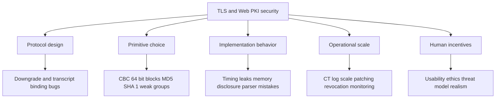
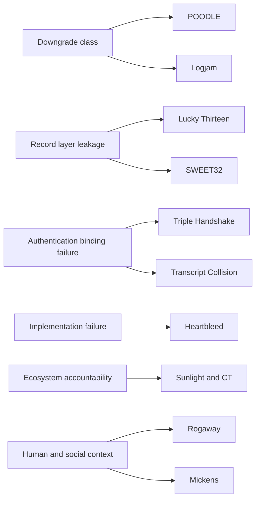

# Topic 2.1: Transport Layer Security

## Assessment Window
- Final track

## Overview
TLS architecture and handshake design, PKI trust, deployment trade-offs, and major protocol vulnerabilities.

## Required Readings
- Serious Cryptography (2nd ed.), Chapter 13: TLS.

## Optional Readings
- Add optional reading links here.

## Materials
- [ ] Slides
- [ ] Quiz


# Notes

I inspected the uploaded 133 page slide deck. It is **Applied Cryptography, Part 2, Real World Cryptography, 2.1 Transport Layer Security**, focused on TLS architecture, certificates, real TLS attacks, and why TLS 1.3 redesigned many parts of the protocol. 

## 1. Main thesis

TLS is not only “encryption for web traffic.” The deck frames TLS as a complete secure channel protocol. Its job is to give two parties confidentiality, integrity, and authentication over a hostile network. The important lesson is that encryption alone is insufficient. Without authentication, an active attacker can sit between client and server, decrypt one side, reencrypt to the other side, and both victims may believe the channel is secure. TLS prevents that by combining authenticated key exchange, certificate validation, and record protection. 

The slides separate attacker models clearly. A passive attacker only observes traffic. An active attacker can modify, inject, reorder, replay, block, or impersonate messages. TLS must mainly defeat the active attacker, because passive confidentiality is easier than authenticated secure channel establishment. 

## 2. TLS adoption constraints

TLS became universal because it satisfies four product level constraints:

1. **Efficiency**
   Servers must handle huge connection volume without excessive CPU cost. Clients need low latency and low battery impact.

2. **Interoperability**
   Any TLS implementation must work across operating systems, CPUs, browsers, servers, libraries, and programming languages.

3. **Extensibility**
   The protocol must evolve when algorithms fail or new features become necessary.

4. **Versatility**
   TLS is not only for HTTPS. The deck lists email, messaging, banking, cloud storage, VPN, database connections, Git repositories, WebRTC, VoIP, IoT, software updates, and many other uses. 

The page 10 and page 11 diagrams are important. They visually distinguish academic cryptography, applied cryptography, standards, secure implementations, product cryptography, and broader cyber security. The intended lesson is that real secure systems are not just proofs or primitives. They require protocol design, standardization, implementation discipline, deployment incentives, and operational security.

## 3. SSL and TLS version history

The naming is historically confusing. SSL was created by Netscape in 1995. SSL 2.0 and SSL 3.0 had major flaws. TLS is the successor, but people still say “SSL certificate” when they mean “TLS certificate.” 

TLS 1.0 and TLS 1.1 are obsolete. TLS 1.2 was a major improvement but carried too many legacy features. It could be secure when configured correctly, but it also supported dangerous choices such as CBC mode, weak hashes, weak ciphers, RSA key exchange, old fallback behavior, and complex state transitions. TLS 1.3 is presented as the cleanup: fewer algorithms, fewer dangerous options, mandatory forward secrecy, authenticated encryption, simpler handshakes, better downgrade protection, and formal verification during design. 

## 4. TLS architecture

TLS has two main protocols.

1. **Handshake Protocol**
   This establishes the shared secrets, negotiates the protocol version and cipher suite, performs authentication, and creates traffic keys.

2. **Record Protocol**
   This protects actual data after keys are established. It splits data into records, applies encryption and authentication, and transports application data in a protocol agnostic way. 

The key mental model is:

Client sends ClientHello. Server responds with ServerHello, certificate, signature, and verification material. Both sides derive shared secrets. After verification succeeds, the record layer carries encrypted application data.

## 5. Cipher suites

A TLS 1.2 cipher suite name encodes several things: key exchange, authentication, bulk encryption, and MAC. Example: `TLS_ECDHE_RSA_WITH_AES_128_GCM_SHA256` means ephemeral elliptic curve Diffie Hellman for key exchange, RSA signatures for authentication, AES GCM for authenticated encryption, and SHA 256 for transcript integrity. 

TLS 1.3 simplifies cipher suite naming. The suite only names the symmetric encryption algorithm and hash function, such as `TLS_AES_128_GCM_SHA256` or `TLS_CHACHA20_POLY1305_SHA256`. That simplification is possible because TLS 1.3 always uses ephemeral Diffie Hellman style key exchange for forward secrecy, and authentication is tied to the certificate rather than mixed into the suite name. 

## 6. Handshake details

The client proposes capabilities. It sends supported versions, supported cipher suites, extensions, a random value, and usually a fresh Diffie Hellman public key.

The server chooses parameters from the client offer. It sends its own random value, its selected cipher suite, its Diffie Hellman public key, certificate, a signature over handshake material, and MAC protected verification data. 

The client then validates:

1. The certificate chain reaches a trusted root certificate authority.
2. The certificate is valid for the requested domain.
3. The certificate has not expired.
4. The server signature verifies under the public key in the certificate.
5. The Diffie Hellman shared secret derives the same traffic keys on both sides.
6. The MAC or Finished verification confirms that the transcript was not modified. 

The diagram on page 40 is a compact TLS 1.3 flow: client generates a key share, server generates its key share, both compute the shared secret, keys are derived, the server proves identity with certificate and signature, and the Finished MAC authenticates the transcript.

## 7. Record protocol details

A TLS record is up to 16 KB of payload plus a compact 5 byte header. The header contains ContentType, ProtocolVersion, and Length. ContentType distinguishes alert, handshake, and application data records. For compatibility, TLS 1.3 still commonly places `03 03` in the record version field. 

After the handshake, application data records carry ciphertext plus an authentication tag. The receiver verifies the tag first, decrypts only if authentication succeeds, and then passes plaintext to the application.

Nonce management is critical. The slides explain that each side maintains a 64 bit sequence number and combines it with the write IV to derive a per record nonce. Separate keys and IVs are used in each direction, so the client and server can both start from sequence number zero without nonce reuse. 

## 8. Certificates and certificate authorities

A certificate binds a public key to identity information such as a domain name. The browser trusts the binding because a certificate authority signs it. The trust chain usually goes from leaf certificate, to intermediate certificate, to root certificate installed in the browser or operating system. 

The deck shows the classic certificate authority problem: any trusted authority can issue a certificate for any domain. That creates a huge asymmetric trust surface. A single compromised or dishonest authority can undermine authentication for everyone.

The DigiNotar case is used as a concrete failure. A Dutch certificate authority was hacked, fake Google certificates were issued, browsers removed trust, and the authority collapsed. The Kazakhstan example shows a government attempting to install a national root certificate that would enable HTTPS interception, and browser vendors responding by blocking it. 

Certificate Transparency is presented as the main monitoring improvement. Certificates are submitted to public append only logs. Browsers can require Signed Certificate Timestamps as evidence that the certificate was publicly logged. This does not remove certificate authority trust, but it makes misissuance detectable. 

The charts on pages 26, 27, and 28 show the deployment impact of Let’s Encrypt: rapid growth in active certificates, large daily issuance volume, and a major rise in HTTPS traffic in Firefox.

## 9. Forward secrecy

Forward secrecy means that compromise of a server’s long term private key should not decrypt old captured sessions. TLS achieves this with ephemeral Diffie Hellman. The server’s long term private key signs the handshake, but it does not directly derive session keys. Session keys come from fresh ephemeral key exchange material and are deleted after use. 

This distinction is fundamental. If RSA key exchange is used, server key compromise can expose old sessions. If ephemeral Diffie Hellman is used correctly, an attacker who records today’s traffic and steals the server key tomorrow still cannot reconstruct yesterday’s ephemeral shared secret.

## 10. Trust model failure points

The deck emphasizes that TLS can fail through three broad compromise points.

1. **Certificate authority compromise**
   The attacker can issue fake certificates and impersonate domains.

2. **Server compromise**
   TLS terminates at the server, so a fully compromised server sees plaintext, session keys, and application data.

3. **Client compromise**
   Malware or a malicious root certificate on the client can bypass certificate validation or intercept plaintext before encryption. 

The main engineering lesson is that TLS protects the network path, not every endpoint. If the endpoint is owned, TLS cannot save the application.

## 11. Attack timeline framing

The page 3 and page 65 visual timeline divides TLS failures into crypto failures, protocol weaknesses, and implementation bugs. That categorization is useful:

1. Some attacks break weak primitives or parameters.
2. Some attacks exploit protocol composition or negotiation.
3. Some attacks exploit implementation mistakes.
4. Some attacks exploit legacy compatibility.

TLS 1.3 is mostly a response to that history. It removes dangerous options rather than asking operators to configure them safely. 

## 12. Lucky Thirteen

Lucky Thirteen targets TLS CBC mode with HMAC. Older TLS versions used MAC then encrypt with CBC. The vulnerability is a timing leak in padding and MAC verification. The attacker modifies ciphertext, observes server timing differences, and statistically infers padding validity. With enough samples, the attacker can recover sensitive plaintext such as cookies or session tokens. 

The important cryptographic lesson is that composing CBC padding with MAC then encrypt is fragile. Even when the math is sound, parsing, padding validation, and timing behavior can leak information. TLS 1.3 avoids this class by requiring authenticated encryption such as AES GCM or ChaCha20 Poly1305. 

## 13. POODLE

POODLE exploited SSL 3.0 padding behavior plus browser fallback. The attacker forced a client that supported TLS to retry with SSL 3.0, then used SSL 3.0’s weak padding checks as a padding oracle. 

The lesson is that fallback for compatibility can become fallback for exploitation. The correct fix was to disable SSL 3.0 and add explicit downgrade protection mechanisms. TLS 1.3 later made downgrade protection a first class design point.

## 14. Triple Handshakes

Triple Handshakes showed that TLS session resumption could confuse authentication context. A session could be resumed in a way that did not bind the resumed secret strongly enough to the original handshake transcript and certificate identity. The result was handshake splicing and identity confusion. 

The fix in older TLS was Extended Master Secret, which binds the master secret to the handshake transcript. TLS 1.3 goes further by removing renegotiation and redesigning resumption around PSK in a simpler model. 

## 15. Heartbleed

Heartbleed was not a protocol flaw. It was an OpenSSL implementation bug in the heartbeat extension. A malicious peer could send a small payload with a huge claimed length. The server copied memory according to the claimed length and returned memory contents to the attacker. 

The damage model was severe: leaked private keys, active session keys, passwords, cookies, credit cards, and random process memory. The deck states that OpenSSL 1.0.1 through 1.0.1f was affected and that around 17 percent of SSL or TLS web servers were vulnerable. 

The deeper lesson is implementation quality. A secure protocol can still fail catastrophically through unsafe parsing, missing bounds checks, unsafe memory behavior, and insufficient auditing.

## 16. SMACK

SMACK means State Machine Attacks. TLS implementations must enforce a precise message order. If unexpected messages cause inconsistent state transitions, attackers may bypass authentication, downgrade security, or inject data. 

This is a protocol implementation lesson. A TLS library is not just crypto primitives. It is a state machine. Every state transition must be explicit, verified, and tested against invalid message sequences.

## 17. FREAK

FREAK exploited legacy export grade RSA. The attacker modified the handshake to force use of weak 512 bit RSA parameters. Once factored, the attacker could decrypt the TLS session. 

The lesson is that dead policy can leave live vulnerabilities. Export controls from the 1990s forced weak cryptography into products. Years later, the compatibility code still existed and became exploitable.

## 18. Logjam

Logjam targets Diffie Hellman. The first part is a downgrade to weak 512 bit export grade DH. The second part is more strategic: common 1024 bit DH groups allow expensive precomputation to be amortized across many targets. Once a widely used group is precomputed, individual discrete logs become far cheaper. 

The deck notes that using the same group everywhere creates concentration risk. Breaking one common group can affect many servers, VPNs, or SSH deployments. The mitigation is to disable export grade DH, use at least 2048 bit groups where integer DH is needed, and prefer elliptic curve Diffie Hellman. 

## 19. SWEET32

SWEET32 attacks 64 bit block ciphers such as 3DES and Blowfish. Due to the birthday bound, collisions become likely after about 2 to the 32 blocks. Long lived TLS connections with repetitive plaintext can leak relationships between plaintext blocks. The practical mitigation is to retire 64 bit block ciphers, use AES or modern AEAD, and limit connection lifetime where legacy systems remain.

## 20. Transcript collision attacks

Transcript collision attacks target the hashes used over handshake messages. If two different protocol transcripts collide under a weak hash such as MD5 or SHA 1, an attacker may substitute one transcript for another. The slides also describe cross protocol confusion, where messages valid in one protocol context are abused in another. 

The engineering lesson is domain separation. Protocols should use strong hash functions, protocol specific transcript formats, and separate contexts so that messages from different protocols cannot be meaningfully substituted. 

## 21. TLS 1.3 design philosophy

TLS 1.3 is presented as a disciplined removal project. The core philosophy is:

1. If it was broken, remove it.
2. If it was easy to configure incorrectly, remove the option.
3. If it was complex and unnecessary, simplify it.
4. If a safer construction exists, make it mandatory. 

This is why TLS 1.3 removes or avoids MD5, SHA 1, RC4, CBC mode, MAC then encrypt, compression, renegotiation, static RSA key exchange, weak DH groups, and many historical compatibility traps. 

## 22. TLS 1.3 cryptographic profile

TLS 1.3 allows only authenticated encryption algorithms such as AES GCM, AES CCM, and ChaCha20 Poly1305. It uses HKDF based on HMAC with SHA 256 or SHA 384. For key exchange, it supports modern elliptic curves including Curve25519 and Curve448, plus specified integer DH groups. 

This profile is much easier to reason about than TLS 1.2. There are fewer algorithm combinations, fewer unsafe modes, and fewer operator choices that can silently destroy security.

## 23. Formal verification

A major claim in the deck is that TLS 1.3 changed protocol design culture by using formal methods during the design phase. The slides mention Inria Prosecco, Microsoft Research Project Everest, ProVerif, F⋆, HACL⋆, miTLS, and EverCrypt. 

The benefit is not that proofs replace engineering. The benefit is that proofs constrain ambiguity, expose flawed drafts earlier, and give implementers a more precise target. The deck highlights that ProVerif modeled the TLS 1.3 handshake, proved secrecy and forward secrecy properties, and found potential attacks in early drafts. 

## 24. Compression removal and CRIME

TLS compression looked useful because it reduced bandwidth. CRIME showed that compression leaks secrets through ciphertext length. If an attacker can inject chosen plaintext and observe compressed lengths, repeated trials can reveal cookies or tokens. TLS 1.3 removes compression entirely. 

The general lesson is that metadata matters. Even when content is encrypted, length can be a side channel.

## 25. Zero padding

TLS 1.3 supports zero padding to reduce traffic analysis through message size. The idea is simple: add zero bytes before encryption so that ciphertext length no longer closely reveals plaintext length. This costs bandwidth but can hide application level patterns. 

This is not a universal privacy solution because timing and volume can still leak information, but it is a useful record layer primitive for applications that need size hiding.

## 26. Downgrade protection

TLS 1.3 protects against version rollback using special values in the server random field when a server negotiates TLS 1.2 or below despite supporting TLS 1.3. The magic values encode readable downgrade sentinels. Because the server random is covered by the handshake authentication, an attacker cannot modify it without detection. 

This directly responds to attacks like POODLE, FREAK, and Logjam, where attackers exploited negotiation or legacy fallback.

## 27. Performance improvements

TLS 1.2 commonly required two round trips before encrypted data. TLS 1.3 usually requires one round trip because the client sends a key share immediately in ClientHello. This saves meaningful latency, especially on mobile, satellite, and cross continent connections. 

TLS 1.3 also supports session resumption with PSK. The client and server can use a previously established secret to speed up later connections, usually combined with fresh Diffie Hellman to preserve forward secrecy. 

## 28. Zero RTT

Zero RTT lets a returning client send encrypted application data in its first message using a PSK from an earlier session. This removes connection setup delay for repeat visits. 

The security tradeoff is replay. An attacker can record early data and replay it later. The server may not be able to distinguish replayed early data from fresh early data without a round trip. Therefore zero RTT should only be used for replay safe operations, not payments, state changing requests, or sensitive transactions. 

## 29. Practical inspection checklist derived from the deck

1. Prefer TLS 1.3.
2. Disable SSL 2.0, SSL 3.0, TLS 1.0, and TLS 1.1.
3. Avoid CBC suites.
4. Avoid RSA key exchange.
5. Avoid static DH.
6. Disable export grade algorithms.
7. Disable RC4, 3DES, MD5, and SHA 1 based constructions.
8. Prefer AES GCM or ChaCha20 Poly1305.
9. Prefer X25519 or strong approved elliptic curve groups.
10. Use certificate chains correctly and monitor Certificate Transparency.
11. Automate certificate issuance and renewal.
12. Protect private keys with HSM or managed key infrastructure where possible.
13. Treat endpoint compromise as out of scope for TLS and mitigate separately.
14. Test public servers with configuration scanners such as SSL Labs. 

## 30. Most important takeaway

The deck’s strongest lesson is that secure protocol design is mostly about reducing degrees of freedom. TLS 1.2 tried to support too many algorithms, modes, fallbacks, and historical compatibility paths. Attackers repeatedly turned those options into downgrade attacks, padding oracles, state confusion, weak parameter attacks, and side channels. TLS 1.3 improves security not by adding more complexity, but by deleting dangerous choices and making the safe path the default.


# Notes

These notes inspect the uploaded TLS chapter excerpt and focus on protocol design, cryptographic correctness, implementation implications, and places where the text needs precision. 

## 1. TLS purpose

TLS provides a secure channel between two endpoints, usually a client and a server. Its core guarantees are:

1. Confidentiality
   Passive observers should not learn plaintext application data.

2. Integrity
   Attackers should not be able to modify records without detection.

3. Server authentication
   The client should know it is talking to the intended server.

4. Optional client authentication
   The server may authenticate the client with a certificate, but most web use cases authenticate clients later with passwords, tokens, cookies, or other application layer credentials.

The file correctly emphasizes that TLS is application agnostic. It can protect HTTP, SMTP, IMAP, custom protocols, service communication, IoT traffic, and many other application protocols.

## 2. TLS is not a transport protocol

TLS usually sits above TCP and below the application protocol.

Conceptually:

```text
Application protocol
HTTP, SMTP, IMAP, custom protocol

TLS
Handshake protocol
Record protocol

Transport
TCP

Network
IP
```

For UDP, the precise statement is not “TLS works over UDP” in the ordinary TLS record layer sense. The datagram variant is DTLS. Also, modern HTTP 3 uses QUIC, where the TLS 1.3 handshake is integrated into QUIC rather than using the normal TLS record protocol over UDP.

## 3. TLS protocol suite

The file separates TLS into two major protocols:

1. Handshake protocol
   Negotiates parameters, authenticates the server, and derives shared traffic keys.

2. Record protocol
   Fragments, protects, transmits, decrypts, and verifies data records.

This separation is important. The handshake creates cryptographic state. The record layer consumes that state to protect application data.

## 4. TLS versions

The file’s security ranking is directionally correct:

1. SSL 2.0 and SSL 3.0 are obsolete and unsafe.
2. TLS 1.0 and TLS 1.1 are obsolete and should not be enabled.
3. TLS 1.2 can be secure, but only with strict configuration.
4. TLS 1.3 is the cleanest and safest baseline for modern deployments.

The key practical lesson is that TLS 1.2 is not automatically secure. It depends heavily on configuration. TLS 1.3 removes many dangerous choices, which makes secure deployment easier.

## 5. Why TLS 1.3 is a major redesign

TLS 1.3 removed many legacy mechanisms that caused real world vulnerabilities:

1. Static RSA key exchange was removed.
2. RC4 was removed.
3. MD5 and SHA 1 based legacy constructions were removed.
4. CBC mode record protection was removed.
5. Compression was removed.
6. Renegotiation was removed.
7. Many negotiation options were simplified.

This matters because protocol complexity directly increases implementation risk. TLS 1.3 narrows the cryptographic surface area and makes insecure configurations harder to select.

## 6. Certificate based authentication

The file correctly identifies certificate validation as the critical authentication step.

A server certificate binds:

1. A public key
2. A domain identity
3. Validity metadata
4. Key usage constraints
5. Issuer information
6. A digital signature from a certificate authority or intermediate authority

The client validates the certificate chain. In simplified form:

```text
Leaf certificate
www.google.com public key

Intermediate certificate
signs the leaf certificate

Root certificate authority
trusted by browser or operating system
```

The browser does not simply trust the server public key because the server sent it. It trusts the key only if the certificate chain validates to a trusted root and the certificate identity matches the requested domain.

## 7. Certificate authority trust model

The file correctly explains that certificate authorities are trusted third parties. The security assumption is strong:

1. Root authorities must issue certificates correctly.
2. Intermediate authorities must be protected.
3. Private signing keys must remain secret.
4. Domain validation procedures must not be bypassed.
5. Browsers and operating systems must maintain trustworthy root stores.

A compromised certificate authority can issue fraudulent certificates. That enables impersonation if the attacker can also intercept or redirect traffic.

This is why modern ecosystems also rely on controls such as certificate transparency, certificate revocation mechanisms, short certificate lifetimes, HSTS, and sometimes certificate pinning in controlled applications.

## 8. Important correction about the example certificate

The file’s example includes an elliptic curve public key using P 256, but later text says the decoded certificate contains an RSA modulus and exponent. That is inconsistent.

A precise reading is:

1. The certificate subject public key is elliptic curve P 256.
2. The certificate signature algorithm shown is RSA based, meaning the issuer signed the certificate using an RSA signing key.
3. The server leaf public key and issuer signing key do not need to use the same algorithm.

So the certificate can contain an EC public key while being signed by an RSA certificate authority key.

## 9. TLS record protocol

A TLS record contains a small header and a payload.

The file describes:

1. Content type
2. Legacy protocol version
3. Length
4. Payload

However, the version field needs correction. For TLS 1.3 records, the legacy record version is generally `0x0303`, not `0x0301`. Some compatibility behavior exists for the initial ClientHello, but the simplified claim that bytes two and three are always `03 01` is not accurate for normal TLS 1.3 records.

The practical record layer view is:

```text
Record header
content type
legacy version
length

Record payload
plaintext or ciphertext depending on phase
```

Before encryption is active, handshake records carry visible handshake data. After encryption is active, TLS 1.3 generally uses an outer content type that looks like application data while the true inner content type is encrypted.

## 10. AEAD protection

TLS 1.3 uses authenticated encryption with associated data, usually called AEAD.

Supported cipher families include:

1. AES GCM
2. AES CCM
3. ChaCha20 Poly1305

AEAD gives confidentiality and integrity in a single construction. This is safer than older TLS 1.2 style combinations such as MAC then encrypt.

Record protection does the following:

1. Builds a nonce from a sequence number and write IV.
2. Encrypts plaintext.
3. Authenticates the record header as associated data.
4. Appends an authentication tag.
5. Rejects modified ciphertexts during verification.

If authentication fails, decryption must not release plaintext to the application.

## 11. Nonce construction

The file’s nonce explanation is mostly correct. TLS 1.3 does not transmit a nonce inside each record. Instead, each side maintains a sequence number.

For each direction:

```text
client write key
client write IV
client sequence number

server write key
server write IV
server sequence number
```

The nonce is derived by combining the static write IV with the current sequence number.

This design saves bytes on the wire and avoids nonce negotiation. The security requirement is strict: a given key and nonce pair must never repeat. If an implementation resets sequence numbers incorrectly without changing keys, AEAD security can fail catastrophically.

## 12. Record sequence numbers

Each sender has its own sequence number space. Client sending records and server sending records are independent directions.

This is safe because:

1. Client and server use different traffic keys.
2. Client and server use different write IV values.
3. Sequence numbers are direction local.
4. Key updates can refresh traffic secrets before limits are reached.

The implementation must treat sequence numbers as cryptographic state, not just packet counters.

## 13. Padding and traffic analysis

The file correctly describes zero padding as a defense against size based traffic analysis.

Encryption hides content, not necessarily metadata. Observers can still see:

1. IP addresses
2. Timing
3. Direction
4. Approximate byte counts
5. Connection duration
6. Packet sizes

Padding can hide the true plaintext length, but it does not eliminate all side channels. It trades bandwidth for metadata protection.

For high sensitivity systems, padding policy matters. Random padding, fixed size buckets, and application level batching can be stronger than ad hoc padding.

## 14. Handshake overview

The normal TLS 1.3 handshake can be summarized as:

```text
Client
sends ClientHello
includes supported versions
includes cipher suites
includes key share
includes random value
includes extensions

Server
sends ServerHello
selects version
selects cipher suite
returns key share
sends encrypted extensions
sends certificate
sends certificate verify
sends finished

Client
validates certificate
validates signature
derives keys
verifies finished
sends finished

Both sides
send encrypted application data
```

The file’s explanation is broadly correct, but a precise TLS 1.3 handshake has several named messages after ServerHello. Server certificate and authentication data are not literally all inside ServerHello. They are separate handshake messages protected under handshake traffic keys.

## 15. Key agreement

TLS 1.3 typically uses ephemeral Diffie Hellman.

The important security property is that the client and server create a fresh shared secret without transmitting that secret over the network.

The client sends an ephemeral public key. The server sends an ephemeral public key. Each side combines its private key with the peer public key to compute the same shared secret.

An eavesdropper sees both public keys but cannot feasibly compute the shared secret.

## 16. Server authentication during handshake

Diffie Hellman alone does not authenticate the server. Without authentication, an active attacker could perform two separate key agreements and sit between client and server.

TLS prevents that by requiring the server to prove possession of the private key corresponding to the certificate public key. In TLS 1.3, the CertificateVerify message signs the transcript.

The transcript includes previous handshake messages. This binds the server identity to the negotiated parameters and prevents tampering.

## 17. Finished MAC

The Finished message is essential. It proves that both parties derived the same handshake secrets and that the transcript has not been modified.

Conceptually:

```text
Handshake transcript
plus derived finished key
produces Finished MAC
```

If an attacker modifies handshake messages, the transcript changes and Finished verification fails.

## 18. HKDF and key schedule

TLS 1.3 uses HKDF based on HMAC. Depending on the cipher suite, SHA 256 or SHA 384 is used.

The key schedule derives separate secrets for different purposes:

1. Early secrets
2. Handshake traffic secrets
3. Application traffic secrets
4. Exporter secrets
5. Resumption master secret

Separation is crucial. A key used for one purpose should not be reused for another. HKDF gives domain separated derivation through labels and transcript context.

## 19. Supported key exchange groups

TLS 1.3 supports elliptic curve groups and finite field Diffie Hellman groups.

Common modern choices:

1. X25519
2. P 256
3. P 384
4. X448
5. Finite field groups from RFC 7919

In practice, X25519 is often preferred because it is fast, widely deployed, and designed to avoid many implementation pitfalls.

## 20. Security level note

The file says 2048 bit finite field Diffie Hellman may provide less than 100 bit security and that this is about as hard as 128 bit security in practice. That statement should be treated carefully.

Both are infeasible for ordinary attackers, but 100 bit and 128 bit security are not equivalent. The gap is around a factor of `2^28`, which is enormous. For long term conservative systems, 128 bit security should remain the target.

## 21. Downgrade protection correction

The file describes downgrade protection but has an important detail wrong.

In TLS 1.3, downgrade sentinels are placed in the last 8 bytes of the ServerHello random value, not the first 8 bytes.

The values encode whether a TLS 1.3 capable server negotiated an older version. A client that offered TLS 1.3 can detect suspicious fallback behavior.

Conceptually:

```text
Client offers TLS 1.3

Attacker modifies offer
tries to force TLS 1.2 or older

Server response contains downgrade signal

Client detects mismatch
connection fails
```

Also, the file says “first 8 bits” in one place. It should be bytes, not bits.

## 22. Single round trip handshake

TLS 1.3 reduces latency compared with a common TLS 1.2 full handshake.

The main improvement is that the client sends its key share immediately in ClientHello. The server can respond with its own key share and authentication data without another negotiation round.

This saves latency, especially on high round trip networks such as mobile networks or cross region connections.

## 23. Session resumption

TLS 1.3 resumption uses a pre shared key derived from a previous connection. This lets the client and server resume cryptographic context more quickly.

Benefits:

1. Less latency
2. Less CPU cost
3. Certificate validation may be avoided on resumed connections
4. Faster repeat connections

However, resumption must be implemented carefully. Tickets must be protected. Ticket lifetimes should be limited. Server side ticket encryption keys must rotate.

## 24. 0 RTT data warning

The file mentions 0 RTT data but should emphasize its security tradeoff more strongly.

0 RTT data can be replayed by an attacker. Therefore, it must not be used for non idempotent actions such as:

1. Money transfer
2. Password change
3. Purchase confirmation
4. Account deletion
5. State changing API request

Safe candidates are usually idempotent reads, such as fetching static resources, but even then policy must be deliberate.

0 RTT early data also does not have the same forward secrecy properties as data sent after the fresh handshake completes.

## 25. Forward secrecy

The file correctly explains that TLS 1.3 provides forward secrecy for normal ephemeral Diffie Hellman handshakes.

If the server certificate private key is compromised later, old captured TLS 1.3 sessions should remain protected because the application traffic keys came from ephemeral key exchange, not from the certificate private key.

Forward secrecy depends on:

1. Fresh ephemeral private keys
2. Correct random number generation
3. Secure key schedule implementation
4. Proper deletion of old secrets
5. No accidental logging of keys
6. No memory disclosure bugs

The file correctly notes that theory fails if old keys remain in memory and an attacker extracts them.

## 26. Memory hygiene

Cryptographic implementations must erase sensitive material after use.

Sensitive material includes:

1. Ephemeral private keys
2. Shared secrets
3. Handshake secrets
4. Application traffic secrets
5. Resumption secrets
6. Ticket protection keys
7. Exported keying material

This is hard in garbage collected languages because memory ownership and object lifetime are less deterministic. Libraries must provide explicit zeroization support or isolate secrets in safer native components.

## 27. Compromised certificate authority

The file’s DigiNotar example is appropriate. A compromised authority can issue fraudulent certificates that validate under browser trust stores.

Modern mitigations include:

1. Certificate transparency logs
2. Browser root program enforcement
3. Short lived certificates
4. Revocation checking
5. Strict certificate authority audits
6. Domain owner monitoring

Certificate transparency does not prevent all misuse by itself, but it makes fraudulent issuance discoverable.

## 28. Compromised server

The file correctly states that TLS cannot protect data once the endpoint itself is compromised.

If the server is fully controlled by an attacker, the attacker can access:

1. Plaintext before encryption
2. Plaintext after decryption
3. Session keys
4. Authentication cookies
5. Application secrets
6. Server private keys, unless isolated

Using HSMs or KMS backed signing can reduce private key exposure, but it does not protect plaintext inside the compromised application process.

## 29. Compromised client

A compromised client can defeat TLS for that client.

An attacker may:

1. Read browser memory
2. Extract cookies
3. Capture plaintext
4. Install a malicious root certificate
5. Hook cryptographic APIs
6. Modify application behavior

TLS protects network transport. It does not make a compromised endpoint trustworthy.

## 30. Implementation bugs

The Heartbleed section illustrates a critical lesson: cryptographic protocol security does not imply implementation security.

Heartbleed was not a failure of the TLS design itself. It was a memory safety bug in OpenSSL’s heartbeat extension implementation.

The bug class was an out of bounds read caused by trusting attacker supplied length metadata. The server copied more bytes than the actual input buffer contained, leaking adjacent memory.

Engineering lessons:

1. Never trust attacker supplied lengths.
2. Validate buffer boundaries before reading.
3. Use memory safe languages where possible.
4. Fuzz protocol parsers aggressively.
5. Keep optional protocol features minimal.
6. Use constant time code for secret dependent operations.
7. Separate parsing from cryptographic state transitions.
8. Avoid exposing raw memory near long lived secrets.

## 31. Practical TLS 1.3 deployment guidance

For a modern server, recommended posture:

1. Enable TLS 1.3.
2. Keep TLS 1.2 only if legacy compatibility is required.
3. Disable TLS 1.0 and TLS 1.1.
4. Disable SSL entirely.
5. Prefer AEAD cipher suites only.
6. Prefer X25519 and P 256 key exchange.
7. Use certificates with appropriate SAN entries.
8. Automate certificate renewal.
9. Enable OCSP stapling where appropriate.
10. Use HSTS for HTTPS services.
11. Use secure cookie attributes.
12. Disable 0 RTT unless the application is explicitly safe for replay.
13. Rotate session ticket keys.
14. Monitor certificate transparency logs.
15. Test configuration with independent scanners.

## 32. Key implementation risks

The most dangerous implementation areas are:

1. Certificate validation
   Hostname matching, chain building, expiration, revocation policy, trust anchor handling, and name constraints must be correct.

2. Random number generation
   Ephemeral keys, nonces, and secrets depend on strong randomness.

3. Transcript handling
   CertificateVerify and Finished depend on the exact handshake transcript.

4. State machines
   TLS implementations must reject invalid message ordering.

5. Downgrade behavior
   Version negotiation must not silently accept attacker forced fallback.

6. Ticket handling
   Resumption keys and ticket encryption keys need careful lifecycle control.

7. Early data
   Replay risk must be handled at the application layer.

8. Secret erasure
   Old secrets should not remain recoverable from memory.

## 33. Conceptual TLS 1.3 full handshake diagram

```text
Client                                      Server

ClientHello
supported versions
cipher suites
key share
random
extensions
                         →                 validates offer

                                           ServerHello
                                           selected version
                                           selected cipher
                                           key share
                                           random
                                           encrypted extensions
                                           certificate
                                           certificate verify
                                           finished
                         ←

validate certificate
verify signature
derive secrets
verify finished

Finished
                         →

Application data         ⇄                 Application data
encrypted and authenticated
```

## 34. Conceptual resumption diagram

```text
First connection

Client                                      Server
full TLS 1.3 handshake      ⇄              full TLS 1.3 handshake
resumption secret created   ⇄              ticket issued


Later connection

Client                                      Server
ClientHello with PSK
optional early data
fresh key share
                         →                 validates ticket

                                           ServerHello
                                           fresh key share
                                           finished
                         ←

Finished
                         →

Application data         ⇄                 Application data
```

## 35. Most important takeaways

1. TLS 1.3 is safer largely because it removed dangerous legacy choices.

2. The handshake authenticates the server and derives traffic keys.

3. The record layer uses AEAD to protect data.

4. Certificates solve server identity only if the certificate authority ecosystem behaves correctly.

5. Forward secrecy depends on ephemeral key exchange and correct secret deletion.

6. 0 RTT improves latency but introduces replay risk.

7. TLS cannot protect against compromised endpoints.

8. Implementation quality is as important as protocol design.

9. The uploaded text is broadly correct, but its record version explanation, downgrade sentinel location, certificate algorithm explanation, and 0 RTT security discussion need correction.


# Notes

I treated your bibliography as one combined reading set. Two items are not conventional academic papers: the Let’s Encrypt Sunlight article is an operational Web PKI engineering report, and James Mickens’s piece is a satirical security essay. Both are still useful because they explain why cryptographic security depends on deployment, usability, incentives, and operational discipline.

## 1. Core thesis across the readings

The shared lesson is that TLS and Web PKI failures usually do not come from a single bad primitive. They come from the interaction between cryptographic design, protocol state machines, compatibility logic, implementation behavior, and deployment scale.

A secure block cipher does not save CBC when padding validation leaks timing. A sound key exchange idea does not save Diffie Hellman when millions of servers reuse weak groups. A certificate ecosystem does not remain accountable unless logs are scalable enough to be monitored. A formally elegant protocol does not protect users if engineers keep obsolete fallbacks for compatibility. This is the central pattern across POODLE, Lucky Thirteen, Logjam, Triple Handshake, SWEET32, Transcript Collision Attacks, Heartbleed, and Sunlight.



## 2. Sunlight and Certificate Transparency

Sunlight is about making Certificate Transparency operationally scalable. Certificate Transparency exists because a certificate authority can issue an incorrect or malicious certificate, and without public logging that event might never become visible. CT forces public disclosure of issued certificates through append only logs, and browsers generally require cryptographic proof called a Signed Certificate Timestamp before accepting public certificates. CT logs use a Merkle tree, where leaves are certificates or precertificates, internal nodes are hashes, and the signed tree head commits to the current log state. This provides inclusion verification and append only verification, but it does not itself prevent misissuance. It makes misissuance detectable. ([Let's Encrypt][1])

Sunlight changes the CT log read model from dynamic API responses toward static tiled files. Let’s Encrypt explains that traditional CT logs became expensive because large relational databases were used as the main storage and read path, with shards reaching 5 to 10 terabytes and clients sometimes overloading logs while trying to download all entries. Static tiles avoid much of this by making log data cacheable, easy to mirror, and cheap to serve through object storage, file storage, or CDN infrastructure. ([Let's Encrypt][2])

The cryptographic structure remains an append only Merkle log, but the operational security property improves because monitors can retrieve data more cheaply and reliably. Sunlight also removes the traditional maximum merge delay model by integrating submitted certificates before returning the SCT. That reduces a common failure mode where a log promises inclusion but later fails to merge the certificate in time. In the 2025 reflection, Let’s Encrypt says it ran three Sunlight logs called Twig, Willow, and Sycamore, logged its own issued certificates, handled each write side with a single server, and achieved high availability during the experiment. ([Let's Encrypt][2])

The main design lesson is that transparency systems are cryptographic systems plus distribution systems. A Merkle tree gives verifiability, but the ecosystem only works if log data is easy to fetch, easy to audit, cheap to replicate, and hard to silently fork. Sunlight therefore attacks the real bottleneck: not hash correctness, but global verification at Web PKI scale.

## 3. POODLE

POODLE shows how compatibility fallback can destroy protocol security. SSL 3.0 was obsolete, but many clients still retried failed TLS handshakes with older protocol versions. A network attacker could intentionally break TLS handshakes and force the client down to SSL 3.0. Once SSL 3.0 was used, the attacker could exploit CBC padding because SSL 3.0 padding bytes were not fully authenticated by the MAC. 

The attack works because SSL 3.0 CBC accepts some modified ciphertexts when the final decrypted byte accidentally matches a valid padding length. The attacker repeatedly causes the victim browser to send cookie bearing HTTPS requests, modifies ciphertext blocks, and observes whether the server accepts or rejects the record. A successful acceptance leaks information about one secret byte. The advisory estimates 256 SSL 3.0 requests per recovered byte. 

The important insight is that POODLE is not just a padding oracle. It is a downgrade plus padding oracle. If the attacker cannot force SSL 3.0, the CBC weakness is not reachable through normal TLS negotiation. That is why TLS_FALLBACK_SCSV mattered: it let servers reject suspicious fallback handshakes when the server supported a higher protocol version. The stronger long term fix is complete removal of SSL 3.0. ([blog.google][3])

## 4. Lucky Thirteen

Lucky Thirteen is a timing attack against TLS and DTLS CBC record processing. TLS CBC used a MAC then encode then encrypt construction. During decryption, implementations had to remove padding, calculate or verify the MAC, and handle errors without revealing whether padding or MAC validation failed. The paper shows that even when implementations try to avoid obvious padding oracle errors, small timing differences can distinguish cases and recover plaintext. ([ieee-security.org][4])

The “thirteen” refers to the 13 bytes of TLS record header data that are included in the MAC calculation. This small protocol detail affects the number of hash compression function evaluations, which affects timing. The paper reports distinguishing and plaintext recovery attacks against TLS and DTLS, including experiments against real implementations such as OpenSSL. It also notes that DTLS can be especially exposed because DTLS errors are not necessarily fatal, allowing repeated attempts within one session. ([ieee-security.org][4])

The cryptographic lesson is that CBC with MAC then encrypt created an implementation trap. Secure behavior required carefully equalized padding checks, MAC checks, memory access, error paths, and timing. That is fragile engineering. The better design direction is authenticated encryption, especially AEAD modes such as AES GCM and ChaCha20 Poly1305, where authentication and encryption are part of one construction.

## 5. Imperfect Forward Secrecy and Logjam

The Diffie Hellman paper shows that forward secrecy can be much weaker in practice than in theory. The Logjam attack allowed a man in the middle attacker to downgrade TLS connections to export grade ephemeral Diffie Hellman. The authors implemented number field sieve discrete logarithm computation and found that after around a week of precomputation for a specific 512 bit group, arbitrary discrete logarithms in that group could be computed in about a minute. They also found that many vulnerable servers reused the same 512 bit group. ([UMD Computer Science][5])

The deeper issue is amortization. Number field sieve attacks against finite field Diffie Hellman have a large precomputation phase that depends only on the prime group. Once an attacker pays that cost for a widely reused group, individual sessions become much cheaper to break. So a 1024 bit group used by millions of systems is not equivalent to millions of independent hard problems. It is one very valuable target. ([UMD Computer Science][5])

The paper recommends disabling export cryptography, rejecting weak groups, carefully vetting Diffie Hellman parameters, and moving toward stronger groups, especially elliptic curve Diffie Hellman. This is also a deployment lesson: do not use a parameter just because it is common, standardized, or copied from a default configuration. Shared parameters can concentrate attacker return on investment. ([UMD Computer Science][5])

## 6. Triple Handshakes and Cookie Cutters

The Triple Handshake attack targets authentication binding in TLS session resumption and renegotiation. In TLS 1.2 and earlier, the master secret was derived from the pre master secret and the client and server random values, but it was not bound to the full handshake transcript. An active attacker could synchronize two TLS sessions so that they shared the same master secret while the endpoints believed different identities and contexts were involved. ([RFC Editor][6])

Once the master secret is synchronized, TLS resumption becomes dangerous because the abbreviated handshake authenticates using the existing master secret, not the full original identity context. This can break assumptions behind client authentication, channel bindings, exported key material, and renegotiation protections. RFC 7627 explains that this is an unknown key share style problem: two parties share a secret, but their understanding of who shares it is wrong. ([RFC Editor][6])

The fix is the Extended Master Secret extension. Instead of deriving the master secret from only the pre master secret plus randoms, EMS derives it using a session hash over the full handshake context. This binds keys to the transcript that created them. Modern TLS guidance requires TLS 1.2 implementations to support EMS because of this class of attacks. ([RFC Editor][6])

## 7. Practical insecurity of 64 bit block ciphers

SWEET32 shows why 64 bit block ciphers such as 3DES and Blowfish became unsafe at modern traffic volumes. The birthday bound says that after roughly 2 to the 32 encrypted blocks under the same key, block collisions become likely. For a 64 bit block cipher, that amount of traffic is reachable in long lived or attacker stimulated sessions. ([ePrint Archive][7])

The paper demonstrated concrete attacks against 3DES in HTTPS and Blowfish in OpenVPN. The authors report that their demonstrations needed about 785 GB of captured data, taking 19 to 38 hours in their setting, and could recover secrets such as session cookies or HTTP Basic Auth credentials. That is large but not absurd for persistent browser or VPN traffic. ([ePrint Archive][7])

The design lesson is that block size matters as much as key size for high volume protocols. 3DES has an effective key strength that may look acceptable in some discussions, but its 64 bit block size makes it inappropriate for modern TLS scale. The correct mitigation is disabling all 64 bit block cipher suites, rotating keys before usage limits are reached, and preferring AEAD ciphers with 128 bit block or stream based designs.

## 8. Transcript Collision Attacks

Transcript Collision Attacks show that MD5 and SHA 1 collision weaknesses can affect protocol authentication, not only certificate signatures. The paper investigates TLS, IPsec, and SSH key exchanges and demonstrates that collisions can break fundamental authentication guarantees. It describes man in the middle attacks that can impersonate TLS 1.2 clients, TLS 1.3 servers in draft contexts, and IKEv2 initiators, and can downgrade TLS 1.1 and SSH 2 connections to weak ciphers. 

The essential mechanism is transcript confusion. Protocols often authenticate a hash of the handshake transcript. If an attacker can create two different transcripts with the same hash, then one party may believe it authenticated one session while the other party believes in another. This is especially dangerous when transcript hashes feed signatures, MACs, channel bindings, or key derivation. 

The paper’s practical conclusion is blunt: weak hash functions such as MD5 and SHA 1 should be removed from mainstream protocol authentication. Later TLS 1.3 design removed weak constructions, and current TLS guidance says SHA 1 and MD5 must not be used for TLS 1.2 and DTLS 1.2 signature hashes. 

## 9. The Matter of Heartbleed

Heartbleed is different from POODLE, Lucky Thirteen, and Logjam because it was not primarily a protocol design flaw. It was an implementation memory disclosure bug in OpenSSL’s heartbeat handling. The ACM IMC paper measured the incident’s impact and says Heartbleed allowed remote reading of protected memory from an estimated 24 to 55 percent of popular HTTPS sites. It tracked vulnerable hosts, patching behavior, certificate ecosystem impact, observed attacks, and notification outcomes. ([Illinois Experts][8])

The paper also reports a large vulnerability notification experiment involving 150,000 hosts, where notification increased patching by nearly 50 percent among notified hosts. That makes Heartbleed a security operations paper as much as a crypto paper. The key issue after patching was not only replacing vulnerable software, but also rotating private keys, reissuing certificates, and revoking potentially exposed credentials. ([Illinois Experts][8])

The lesson is that protocol security assumes key secrecy, but real implementations can leak keys. Therefore, mature cryptographic engineering needs memory safety, bounds checks, fuzzing, key rotation, certificate lifecycle automation, revocation strategy, and incident notification at internet scale.

## 10. The moral character of cryptographic work

Rogaway’s paper argues that cryptography is not morally neutral because it reallocates power. It determines who can read, modify, authenticate, hide, reveal, or deny information. He frames cryptography as political because it changes what institutions, states, companies, and individuals can do to each other. He specifically calls for the field to take mass surveillance and societal impact more seriously, not only mathematical elegance. ([ePrint Archive][9])

Applied to the TLS papers, this means choices such as keeping SSL 3.0 fallback, supporting export ciphers, accepting SHA 1, using shared Diffie Hellman groups, or delaying CT scalability are not merely technical choices. They affect who gets practical confidentiality and who remains exposed to passive monitoring, active downgrade, or undetectable certificate abuse.

## 11. This World of Ours

Mickens’s essay is satire, but its security engineering message is serious: threat models must be realistic, usable, and connected to what practitioners and users can actually do. He criticizes security work that focuses on exotic adversary stories while ignoring mundane problems such as passwords, usability, public key infrastructure complexity, and developer cognitive load. 

This connects directly to the TLS failures. The hard parts were not only cryptographic proofs. They were fallback behavior, legacy compatibility, server defaults, certificate operations, patching delay, revocation failure, monitoring cost, and user invisible deployment choices. Security designs that require every operator to be perfect will fail at Web scale.

## 12. Combined attack taxonomy



## 13. Practical review checklist

1. Disable SSL 3.0, TLS 1.0, and TLS 1.1. Current best practice says implementations must not negotiate TLS 1.0 or TLS 1.1, should support TLS 1.3, and must prefer TLS 1.3 when available. ([RFC Editor][10])

2. For TLS 1.2, allow only ECDHE with AEAD cipher suites. Avoid CBC, RC4, 3DES, Blowfish, static RSA key exchange, export suites, and finite field Diffie Hellman groups below modern strength expectations.

3. Require Extended Master Secret for TLS 1.2. Without EMS, session resumption, channel bindings, renegotiation, and exported key material can inherit Triple Handshake style risks. ([RFC Editor][6])

4. Remove MD5 and SHA 1 from authentication paths. This includes certificates, transcript hashes where applicable, signatures, and legacy negotiation logic. 

5. Prefer TLS 1.3 for new systems. TLS 1.3 removed static RSA and static Diffie Hellman key exchange, and public key based key exchange now provides forward secrecy by design. ([IETF Datatracker][11])

6. Treat CT monitoring as part of certificate security. Certificate Transparency does not stop bad issuance by itself. It makes bad issuance visible, but only if logs are reliable, monitors are active, and certificate owners actually watch for unexpected names.

7. Treat implementation safety as cryptographic safety. Memory disclosure, timing behavior, error handling, and state machine transitions can fully compromise a mathematically sound protocol.

## 14. Final synthesis

These readings show the evolution from “choose good algorithms” to “engineer complete cryptographic systems.” The mature position is:

Use modern protocols. Remove fallback paths. Bind keys to transcripts. Use AEAD. Avoid weak hashes. Avoid small or shared finite field groups. Enforce key usage limits. Automate certificate lifecycle. Monitor CT logs. Build incident response into the system. Design for developers and operators who are busy, fallible, and constrained by legacy systems.

The most important meta lesson is that cryptography fails at the seams: between versions, between layers, between proof and implementation, between implementation and deployment, and between technical design and human reality.

[1]: https://letsencrypt.org/2025/06/11/reflections-on-a-year-of-sunlight "
Reflections on a Year of Sunlight -  Let's Encrypt
"
[2]: https://letsencrypt.org/2024/03/14/introducing-sunlight "
Introducing Sunlight, a CT implementation built for scalability, ease of operation, and reduced cost -  Let's Encrypt
"
[3]: https://security.googleblog.com/2014/10/this-poodle-bites-exploiting-ssl-30.html "
Google Online Security Blog: This POODLE bites: exploiting the SSL 3.0 fallback
"
[4]: https://www.ieee-security.org/TC/SP2013/papers/4977a526.pdf "Lucky Thirteen: Breaking the TLS and DTLS Record Protocols"
[5]: https://www.cs.umd.edu/class/fall2019/cmsc818O/papers/imperfect-dh.pdf "Imperfect Forward Secrecy: How Diffie-Hellman Fails in Practice"
[6]: https://www.rfc-editor.org/rfc/rfc7627.txt "www.rfc-editor.org"
[7]: https://eprint.iacr.org/2016/798 "On the Practical (In-)Security of 64-bit Block Ciphers: Collision Attacks on HTTP over TLS and OpenVPN"
[8]: https://experts.illinois.edu/en/publications/the-matter-of-heartbleed/ "
        The matter of heartbleed
      \-  Illinois Experts"
[9]: https://eprint.iacr.org/2015/1162 "The Moral Character of Cryptographic Work"
[10]: https://www.rfc-editor.org/rfc/rfc9325.txt "www.rfc-editor.org"
[11]: https://datatracker.ietf.org/doc/html/rfc8446?"RFC 8446 - The Transport Layer Security (TLS) Protocol ..."
