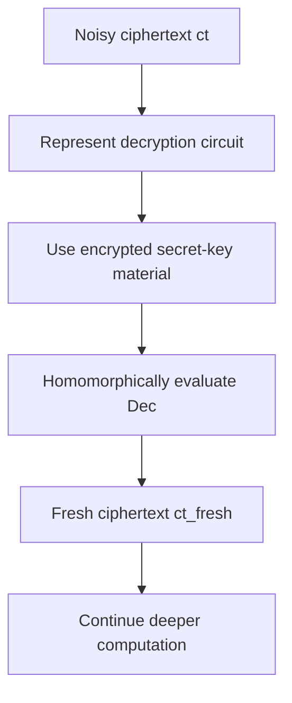
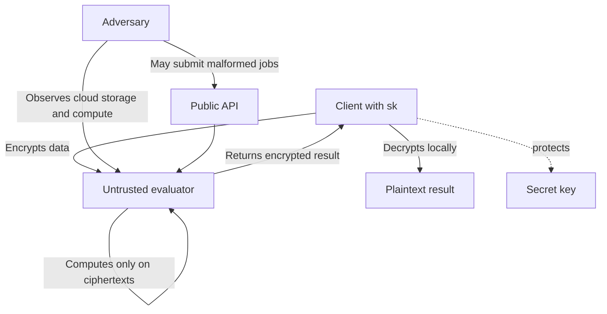
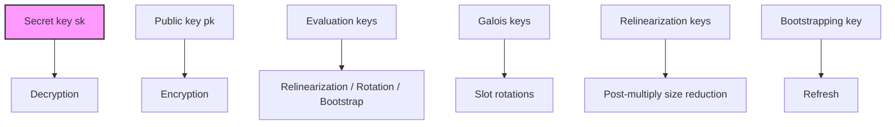
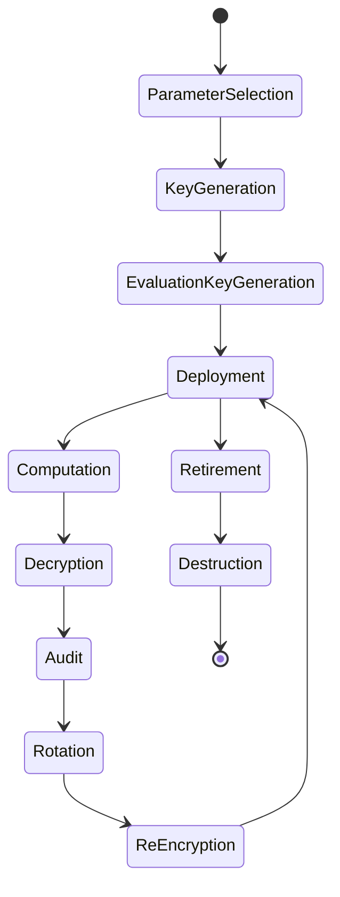
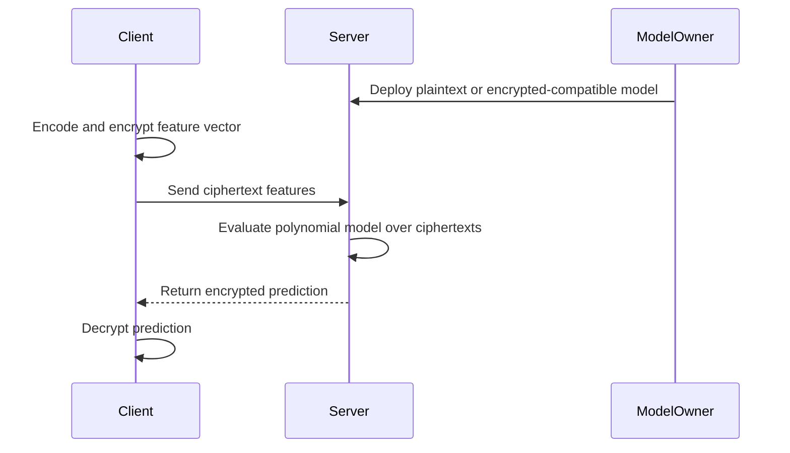
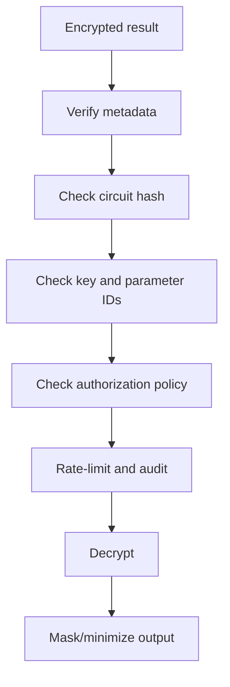
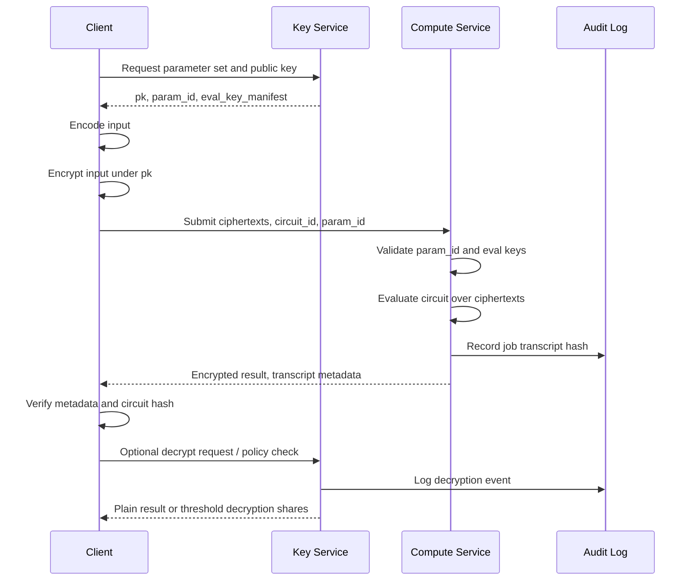

# Topic 2.10: Fully Homomorphic Encryption

## Assessment Window
- Final track

## Overview
From partially homomorphic to fully homomorphic encryption, bootstrapping, and practical deployment constraints.

## Required Readings
- To be determined.

## Optional Readings
- Add optional reading links here.

## Materials
- [ ] Slides
- [ ] Quiz


## 1. Executive overview

Fully Homomorphic Encryption, or **FHE**, is a public-key encryption technology that allows an untrusted party to compute over encrypted data without decrypting it. Given ciphertexts `Enc(pk, x)` and `Enc(pk, y)`, an evaluator can compute a ciphertext that decrypts to `f(x, y)` for some permitted function `f`, while never seeing `x`, `y`, or intermediate plaintext values. Modern practical FHE is overwhelmingly lattice-based, primarily using **LWE/RLWE-style assumptions** over polynomial rings. The Homomorphic Encryption Standard describes BGV, BFV, and GSW-style constructions, and parameterizes security around LWE/RLWE hardness and concrete lattice attack cost estimates. ([Homomorphic Encryption][1])

The most important engineering distinction is this:

**Theoretical FHE** means arbitrary-depth computation, usually enabled by **bootstrapping**, where the system homomorphically refreshes a noisy ciphertext.

**Practical deployed FHE** is often **leveled FHE**, where parameters are chosen for a bounded multiplicative depth and bootstrapping is avoided because it is expensive and operationally complex. The standard explicitly notes that many practical HE schemes are bounded-depth and can be transformed into fully homomorphic schemes using bootstrapping, which evaluates the decryption algorithm homomorphically using encrypted secret-key material. ([Homomorphic Encryption][1])

A senior engineering view:

```mermaid
flowchart LR
    A[Client / Data Owner] -->|Encrypt under pk| B[Ciphertexts]
    B --> C[Untrusted Compute Service]
    C -->|Eval f over ciphertexts| D[Encrypted Result]
    D -->|Return| A
    A -->|Decrypt with sk| E[Plaintext f(x)]

    subgraph Trust Boundary
        A
    end

    subgraph Untrusted Zone
        C
    end
```

FHE is not a drop-in replacement for normal computation. It changes the programming model: circuits must be mostly arithmetic, data-dependent branching is unavailable unless transformed into arithmetic selection, comparison is expensive, memory access patterns can leak metadata, ciphertexts are large, and multiplicative depth drives parameter size and latency. Microsoft SEAL’s documentation makes this practical limitation explicit: additions and multiplications are supported, while operations such as encrypted comparison, sorting, or regular expressions are generally not feasible in the same direct way; it also notes that efficient and inefficient implementations can differ by several orders of magnitude. ([GitHub][2])

---

## 2. Core concepts and terminology

### Homomorphic encryption interface

A homomorphic encryption scheme is typically modeled as:

```text
Params <- ParamGen(λ, circuit_spec)
(pk, sk, evk) <- KeyGen(Params)
ct <- Enc(pk, m)
m <- Dec(sk, ct)
ct_f <- Eval(evk, f, ct_1, ..., ct_n)
```

Correctness requires:

```text
Dec(sk, Eval(evk, f, Enc(pk, m1), ..., Enc(pk, mn))) = f(m1, ..., mn)
```

For approximate schemes such as CKKS:

```text
Dec(sk, Eval(...)) ≈ f(m1, ..., mn)
```

The Homomorphic Encryption Standard describes compactness as the property that evaluated ciphertexts remain in a ciphertext space whose size does not depend on the complexity of the evaluated function, and efficient decryption as decryption runtime not depending on the evaluated function. ([Homomorphic Encryption][1])

### HE, SHE, leveled FHE, and FHE

| Term                                     | Meaning                                                                              | Engineering implication         |
| ---------------------------------------- | ------------------------------------------------------------------------------------ | ------------------------------- |
| **PHE**                                  | Partially homomorphic encryption, e.g. only addition or only multiplication          | Efficient but limited           |
| **SHE**                                  | Somewhat homomorphic encryption                                                      | Supports limited-depth circuits |
| **Leveled FHE**                          | Supports circuits up to chosen multiplicative depth without bootstrapping            | Most common production style    |
| **Bootstrapped FHE**                     | Refreshes ciphertexts to support arbitrary-depth computation                         | More general, expensive         |
| **Circuit privacy / evaluation privacy** | Evaluated ciphertext hides information about the circuit or intermediate computation | Not automatic in all schemes    |
| **Packing / SIMD batching**              | Multiple plaintext slots in one ciphertext                                           | Essential for performance       |
| **Noise budget**                         | Remaining margin before decryption failure                                           | Central correctness metric      |
| **Relinearization**                      | Reduces ciphertext size after multiplication                                         | Requires evaluation keys        |
| **Rotation / automorphism**              | Permutes packed slots                                                                | Requires Galois/rotation keys   |
| **Modulus switching / rescaling**        | Reduces modulus/noise/scale after operations                                         | Critical in BGV/BFV/CKKS        |

### Major practical schemes

| Scheme                 | Plaintext model                       | Best fit                                                               | Notes                                                                               |
| ---------------------- | ------------------------------------- | ---------------------------------------------------------------------- | ----------------------------------------------------------------------------------- |
| **BFV**                | Exact modular integer arithmetic      | Integer arithmetic, exact counters, private set-like computations      | Operations mod plaintext modulus `t`                                                |
| **BGV**                | Exact modular arithmetic              | Similar to BFV; strong in algebraic workflows                          | Uses modulus switching differently                                                  |
| **CKKS**               | Approximate real/complex arithmetic   | ML inference, statistics, linear algebra                               | Not exact; scale/precision management is security and correctness sensitive         |
| **TFHE / FHEW / CGGI** | Boolean or small-torus/LWE arithmetic | Comparisons, bit operations, lookup tables, programmable bootstrapping | Excellent for non-linear bit-level logic, often poor for large dense linear algebra |
| **GSW / RGSW**         | Gadget-matrix-based encryption        | Bootstrapping, external products                                       | Often appears internally in bootstrapping machinery                                 |

Microsoft SEAL exposes BFV/BGV for modular integer arithmetic and CKKS for approximate real/complex arithmetic, while OpenFHE exposes BFV, BGV, CKKS, DM, and CGGI/TFHE-style capabilities, including threshold FHE and proxy re-encryption extensions. ([GitHub][2])

---

## 3. Relevant cryptographic primitives, protocols, algorithms, and assumptions

### 3.1 LWE and RLWE

Most modern FHE schemes rely on **Learning With Errors** or **Ring Learning With Errors**.

Simplified LWE sample:

```text
Given secret s ∈ Z_q^n
Sample a ← Z_q^n
Sample small error e
Publish (a, b = <a, s> + e mod q)
```

The LWE assumption says that `(a, b)` is computationally indistinguishable from uniform random under appropriate parameters. RLWE moves from vectors to polynomial rings:

```text
R_q = Z_q[X] / (X^N + 1)
b = a · s + e mod q
```

RLWE gives compactness and fast polynomial arithmetic using the Number Theoretic Transform, but it introduces algebraic structure, so parameter selection must consider known lattice, algebraic, and hybrid attacks. The Homomorphic Encryption Standard explicitly bases many practical schemes on RLWE and discusses LWE/RLWE assumptions, known lattice attacks, and parameter recommendations. ([Homomorphic Encryption][1])

### 3.2 Polynomial rings

A common ring is:

```text
R_q = Z_q[X] / (X^N + 1)
```

where:

```text
N = power-of-two polynomial degree
q = ciphertext modulus
t = plaintext modulus for BFV/BGV
Δ = scale, often q/t for BFV or explicit CKKS scale
```

Ciphertexts are usually tuples of ring elements:

```text
ct = (c0, c1) ∈ R_q^2
```

A valid ciphertext decrypts because:

```text
c0 + c1 · s = encoded_message + small_noise mod q
```

The “small noise” is intentional. It gives security under LWE/RLWE, but it also grows during homomorphic operations.

### 3.3 Encoding

FHE does not encrypt native language-level objects. You must encode.

Common encodings:

```text
integer -> coefficient encoding
integer vector -> batching/SIMD slots
real number -> fixed-point or CKKS approximate encoding
boolean -> LWE/TFHE bit ciphertext
polynomial -> ring plaintext
```

SIMD batching is usually decisive for performance. Without packing, each encrypted scalar is expensive. With packing, one ciphertext can carry thousands or tens of thousands of slots depending on `N`, scheme, and plaintext modulus structure.

### 3.4 Evaluation keys

FHE needs extra public auxiliary keys:

| Key                             | Purpose                              |
| ------------------------------- | ------------------------------------ |
| `pk`                            | Encryption                           |
| `sk`                            | Decryption                           |
| `relin_key`                     | Relinearization after multiplication |
| `galois_keys` / `rotation_keys` | SIMD slot rotations                  |
| `bootstrap_key`                 | Ciphertext refresh / bootstrapping   |
| threshold decryption shares     | Distributed decryption               |

Evaluation keys are usually public in the security model, but they must be authenticated, versioned, parameter-bound, tenant-bound, and protected against substitution.

### 3.5 Bootstrapping

Bootstrapping refreshes a ciphertext by homomorphically evaluating decryption:

```text
ct' = Eval(evk, Dec_sk, ct)
```

The evaluator does not know `sk`; instead, encrypted or gadget-encoded secret-key material is included in the bootstrapping key. The result is a fresh ciphertext encrypting the same plaintext with reduced noise.



The standard describes bootstrapping as evaluating the decryption algorithm homomorphically using an encryption of the secret key and notes that it remains time-consuming and an active area of improvement. ([Homomorphic Encryption][1])

---

## 4. Detailed internal mechanism and step-by-step workflow

### 4.1 Simplified BFV-style encryption

This is not production pseudocode; it is a conceptual model.

Let:

```text
R_q = Z_q[X] / (X^N + 1)
R_t = Z_t[X] / (X^N + 1)
Δ = floor(q / t)
s, e, e1, e2, u = small polynomials
a = uniform polynomial in R_q
```

Key generation:

```text
s  <- SmallPoly()
a  <- Uniform(R_q)
e  <- ErrorPoly()
pk = (p0, p1)
p0 = -a*s + e mod q
p1 = a
sk = s
```

Encryption:

```text
function Encrypt(pk, m):
    u  <- SmallPoly()
    e1 <- ErrorPoly()
    e2 <- ErrorPoly()

    c0 = p0*u + e1 + Δ*m mod q
    c1 = p1*u + e2 mod q

    return (c0, c1)
```

Decryption:

```text
function Decrypt(sk, ct=(c0,c1)):
    v = c0 + c1*s mod q
    m_hat = round((t/q) * v) mod t
    return m_hat
```

Why it works:

```text
c0 + c1*s
= (-a*s + e)u + e1 + Δm + (a*u + e2)s
= Δm + e*u + e1 + e2*s
= Δm + noise
```

If `noise` is small enough relative to `q/t`, rounding recovers `m`.

### 4.2 Homomorphic addition

```text
ct_add = (c0 + d0, c1 + d1) mod q
```

Noise grows additively. This is cheap.

### 4.3 Homomorphic multiplication

Given:

```text
ct1 = (c0, c1)
ct2 = (d0, d1)
```

Multiplication produces a degree-2 ciphertext:

```text
e0 = c0*d0
e1 = c0*d1 + c1*d0
e2 = c1*d1
```

Decryption would require:

```text
e0 + e1*s + e2*s^2
```

But normal ciphertexts are degree-1 in `s`. Therefore, multiplication expands ciphertext size and requires **relinearization**.

### 4.4 Relinearization

Relinearization converts the `s^2` term back into an equivalent encryption under `s`.

Conceptually:

```text
relin_key encrypts powers/decompositions of s^2 under s
```

Then:

```text
ct_mul_large = (e0, e1, e2)
ct_mul = Relinearize(relin_key, ct_mul_large)
```

After relinearization:

```text
ct_mul = (r0, r1)
Dec(sk, ct_mul) = m1 * m2
```

Engineering implications:

* Relinearization is expensive.
* Relinearization keys are large.
* Gadget decomposition base affects latency, memory, and noise.
* Multiplication depth dominates parameter selection.

### 4.5 Modulus switching and rescaling

A leveled scheme often uses a modulus chain:

```text
Q = q_L · q_{L-1} · ... · q_0
```

Each multiplication consumes a level. After multiplication, the ciphertext is switched or rescaled to a smaller modulus.

```mermaid
flowchart LR
    A[Level L: modulus Q_L] -->|Multiply| B[Noise and scale grow]
    B -->|Relinearize| C[Size reduced]
    C -->|ModSwitch or Rescale| D[Level L-1: smaller modulus Q_{L-1}]
    D -->|Next op| E[Continue]
```

In CKKS, rescaling also manages approximate fixed-point scale:

```text
scale(ct1 * ct2) ≈ scale(ct1) * scale(ct2)
Rescale divides by a modulus prime to bring scale back down
```

### 4.6 CKKS workflow

CKKS encodes real or complex vectors approximately:

```text
z = [z0, z1, ..., zk]
plaintext = Encode(z, scale=Δ)
ct = Encrypt(plaintext)
```

Typical CKKS multiplication:

```text
ct3 = Multiply(ct1, ct2)
ct3 = Relinearize(ct3)
ct3 = Rescale(ct3)
```

Addition requires compatible scales and levels:

```text
AlignLevel(ct1, ct2)
AlignScale(ct1, ct2)
ct_sum = Add(ct1, ct2)
```

CKKS is ideal for polynomial approximations of ML/statistical workloads, but it is not appropriate for exact equality, exact comparison, exact balances, exact authorization decisions, or consensus-critical arithmetic unless the entire error analysis is formally bounded.

### 4.7 TFHE / programmable bootstrapping workflow

TFHE-style systems usually operate on LWE ciphertexts and use frequent bootstrapping. The key engineering advantage is that **programmable bootstrapping** can evaluate a lookup table while refreshing the ciphertext.

```mermaid
flowchart TD
    A[LWE ciphertext encrypting x] --> B[Linear combination]
    B --> C[Programmable bootstrapping]
    C --> D[Apply LUT f during refresh]
    D --> E[Fresh LWE ciphertext encrypting f(x)]
```

This makes TFHE-style schemes highly attractive for:

* comparisons,
* bitwise logic,
* small lookup tables,
* encrypted control-flow-like operations,
* private smart-contract condition checks.

They are less attractive for high-throughput dense linear algebra compared with CKKS.

---

## 5. Security properties and formal guarantees

### 5.1 Confidentiality

The baseline property is usually **IND-CPA security**: ciphertexts hide plaintexts against passive adversaries that can obtain encryptions of chosen messages but cannot use a decryption oracle.

OpenFHE’s security documentation states that its implemented HE schemes are IND-CPA secure and are expected to be used in an honest-but-curious or semi-honest model, where the adversary uses valid APIs but does not corrupt or tamper with ciphertexts for active attacks. ([openfhe-development.readthedocs.io][3])

This matters: FHE ciphertexts are generally **malleable by design**. Malleability is the feature that enables homomorphic computation. Therefore, FHE by itself does not provide authenticated encryption, CCA security, integrity, freshness, replay protection, or authorization.

### 5.2 Correctness

Correctness is conditional on noise remaining below the decryption threshold.

For exact schemes:

```text
Dec(sk, ct_result) = f(m)
```

For CKKS:

```text
|Dec(sk, ct_result) - f(m)| <= ε
```

where `ε` depends on initial scale, circuit depth, rescaling, approximation error, rounding error, and noise.

### 5.3 Compactness

The result ciphertext must remain compact. Decryption complexity should not grow with the evaluated circuit. This is part of the standard FHE definition and is crucial: otherwise an evaluator could simply append the entire computation transcript to the ciphertext and force the decryptor to recompute everything.

### 5.4 Circuit privacy

Basic FHE protects data from the evaluator, but evaluated ciphertexts may reveal information about the circuit or intermediate values to the decryptor. **Circuit privacy** or **evaluation privacy** requires additional randomization/noise flooding or protocol design.

### 5.5 Approximate decryption leakage in CKKS

CKKS deserves special caution. Approximate decryption can leak information about noise. OpenFHE’s documentation cites the Li–Micciancio result showing that IND-CPA may be insufficient for CKKS in scenarios where decryption results are shared, because decryption outputs can be used in key-recovery attacks; it also describes mitigations such as stronger noise flooding modes. ([openfhe-development.readthedocs.io][3])

More recent work has shown that non-worst-case noise flooding countermeasures can be vulnerable in CKKS-style approximate HE; the USENIX Security 2024 paper reports key-recovery attacks when average-case noise estimation is used and emphasizes worst-case noise estimation when sharing decryption results. ([USENIX][4])

---

## 6. Threat model, attack surfaces, and realistic attack scenarios

### 6.1 Typical intended threat model



Assumptions:

* The evaluator may see all ciphertexts, evaluation keys, circuits, timing, sizes, and metadata.
* The evaluator must not see `sk`.
* The evaluator usually must not receive unrestricted decryption results for attacker-chosen ciphertexts.
* The client must validate parameters, context identifiers, and ciphertext provenance.
* Side channels on the decryptor/key owner are out of scope unless explicitly mitigated.

### 6.2 Attack surface inventory

| Surface                | Risk                                                                      |
| ---------------------- | ------------------------------------------------------------------------- |
| Parameter generation   | Insufficient security, decryption failure, lattice attack margin collapse |
| Secret sampling        | Weak distribution, biased RNG, repeated seeds                             |
| Error sampling         | Incorrect Gaussian/binomial sampling can break assumptions                |
| Evaluation keys        | Substitution, cross-tenant misuse, parameter mismatch                     |
| Decryption API         | Chosen-ciphertext leakage, CKKS key recovery, error oracle                |
| Noise budget APIs      | Secret-dependent leakage if exposed                                       |
| Serialization          | Malformed ciphertexts, context confusion, memory safety bugs              |
| Circuit design         | Data leakage through output, approximation error, metadata                |
| SIMD packing           | Slot leakage, uninitialized slots, unintended data retention              |
| Rotations and sums     | Extra slots may contain sensitive partial results                         |
| Bootstrapping          | Large keys, circular/KDM assumptions, implementation complexity           |
| Blockchain integration | Replay, MEV, ciphertext malleability, threshold decryption governance     |
| Client implementation  | Side channels, key exfiltration, non-constant-time decoding               |

Microsoft SEAL explicitly warns that decryptions of ciphertexts should be treated as private to the secret-key owner, that sharing decryptor outputs can leak the secret key, and that `invariant_noise_budget` depends on secret-key material and must not be invoked on ciphertexts of unverified provenance or propagated across a trust boundary. ([GitHub][5])

### 6.3 Realistic attack scenarios

#### Scenario A: decryption oracle through helpful diagnostics

A cloud service lets users upload ciphertexts and request:

```text
"Tell me whether this ciphertext is valid"
"Return the noise budget"
"Return partial decrypted debug output"
```

An attacker sends crafted ciphertexts and observes secret-dependent responses. This can violate the passive IND-CPA security model and become a chosen-ciphertext or key-recovery vector.

Mitigation:

```text
No decryptor diagnostics across trust boundaries.
No noise-budget oracle for untrusted ciphertexts.
No plaintext error details.
Strict ciphertext provenance validation.
```

#### Scenario B: CKKS shared-result leakage

In a threshold FHE analytics system, multiple parties receive approximate decrypted CKKS results. If the same or related ciphertexts are decrypted repeatedly, approximation error may leak noise information. Under insufficient noise flooding, this can become a key-recovery attack. OpenFHE and recent USENIX work both highlight this class of risk. ([openfhe-development.readthedocs.io][3])

Mitigation:

```text
Use threshold protocols designed for CKKS decryption sharing.
Apply worst-case noise flooding where needed.
Limit repeated related decryptions.
Audit all decryptions.
Rotate keys only as part of a full re-encryption/re-keying plan.
```

#### Scenario C: plaintext modulus wraparound

A BFV system computes encrypted balances modulo `t`.

```text
t = 2^32
balance = 4_000_000_000
add = 1_000_000_000
result = 705_032_704 mod 2^32
```

The cryptography is correct, but the application semantics are broken.

Mitigation:

```text
Prove plaintext range bounds.
Use signed encoding deliberately.
Add overflow checks through larger moduli or protocol-level constraints.
Never use modular arithmetic where business logic expects integers.
```

#### Scenario D: malicious evaluator returns malformed result

The evaluator returns a ciphertext that is not the output of the agreed circuit. FHE confidentiality still holds, but integrity does not. The client decrypts and acts on an attacker-chosen plaintext.

Mitigation:

```text
Bind ciphertexts to job IDs, parameters, circuit hashes, and authenticated transcripts.
Use verifiable computation, SNARKs, redundant execution, or server attestation where needed.
Authenticate all transport and metadata.
```

#### Scenario E: slot leakage after aggregation

Packed ciphertexts contain many slots. An `EvalSum` or inner product may leave sensitive intermediate values in non-result slots. OpenFHE specifically warns that `EvalSum` may expose extra information in non-result-designated slots if decryption is performed immediately afterward, and recommends clearing/masking slots depending on scheme and workflow. ([openfhe-development.readthedocs.io][3])

Mitigation:

```text
Mask unused slots before decryption.
Zero or randomize irrelevant slots.
Define output slot policy explicitly.
```

---

## 7. Common implementation mistakes and insecure patterns

### 7.1 Treating FHE as authenticated encryption

Wrong:

```text
"Only the holder of sk can decrypt, therefore the result is trustworthy."
```

Correct:

```text
FHE provides confidentiality under its model.
It does not prove the evaluator ran the right circuit.
```

Use:

* signed circuit descriptors,
* job manifests,
* transcript hashes,
* verifiable computation where needed,
* threshold approval for high-value decryptions.

### 7.2 Choosing parameters by trial and error

Wrong:

```text
Increase q until it works.
Use small N for speed.
Ignore concrete security estimates.
```

Increasing `q` without increasing `N` can reduce lattice security. Use library-provided parameter selection and validate against accepted HE security guidance. The standardization effort exists partly because secure parameter selection is hard and must balance security, correctness, and supported computation. ([Homomorphic Encryption][6])

### 7.3 Misusing CKKS as exact arithmetic

Wrong:

```text
if decrypted_ckks_value == 0.0:
    authorize()
```

CKKS is approximate. It is suitable for controlled numerical workloads, not exact authorization, consensus, accounting, identity decisions, or equality proofs unless the protocol includes robust error margins and formal range analysis.

### 7.4 Exposing decryption internals

Wrong:

```text
return decrypt(ct)
return noise_budget(ct)
return "invalid padding/noise too large"
```

Correct:

```text
Only decrypt trusted, expected outputs.
Return minimal application-level result.
Rate-limit and audit decryptions.
Do not expose secret-dependent diagnostics.
```

### 7.5 Forgetting scale and level alignment

In CKKS:

```text
ct1.scale = 2^40, level = 5
ct2.scale = 2^30, level = 4
ct1 + ct2 = invalid or inaccurate
```

You need explicit scale and modulus-chain management.

### 7.6 Ignoring slot hygiene

Wrong:

```text
Decrypt packed result and expose all slots.
```

Correct:

```text
Define which slots are semantically valid.
Mask or clear all other slots before decryption.
```

### 7.7 Overusing rotations

Rotations are often more expensive than additions and require large Galois keys. A poor SIMD layout can dominate runtime.

### 7.8 Using one key forever

FHE key rotation is not like rotating a TLS key. Existing ciphertexts and evaluation keys are tied to parameters and keys. Rotation usually requires:

* re-encryption by the client,
* proxy re-encryption if supported,
* threshold re-keying,
* or bootstrapped key switching.

### 7.9 Unsafe deserialization

Ciphertexts must carry or be bound to:

```text
scheme_id
parameter_set_id
modulus_chain_id
key_id
level
scale
slot_count
serialization_version
tenant_id
circuit/job context
```

A ciphertext from the wrong context should fail closed.

---

## 8. Key-management, randomness, entropy, nonce, and lifecycle considerations

### 8.1 Key material classes



### 8.2 Secret-key handling

Recommendations:

* Generate keys client-side or inside a trusted key service.
* Use a CSPRNG seeded from OS entropy or approved DRBG.
* Avoid deterministic test seeds outside reproducible test vectors.
* Zeroize secret polynomials, sampled errors, and decoded plaintext buffers.
* Treat decrypted plaintexts as high-sensitivity data.
* Do not send `sk` to the evaluator.
* Do not log plaintexts, decoded slots, or decryption errors.

### 8.3 Evaluation-key handling

Evaluation keys are usually public, but operationally sensitive:

* They can be huge.
* They are bound to `sk`, parameters, and allowed operations.
* Substitution can cause correctness failures or protocol abuse.
* They should be signed or authenticated.
* They should be versioned and tenant-scoped.
* Rotation keys should be generated minimally: only for required rotations.

A practical policy:

```text
Generate only:
  relin key if multiplication is required
  rotation keys for exact rotation set needed
  bootstrap key only if bootstrapping is required
Reject all jobs needing undeclared keys
```

### 8.4 Randomness

Randomness is used for:

* secret-key sampling,
* error sampling,
* public-key generation,
* encryption randomness,
* re-randomization,
* noise flooding,
* masking slots,
* threshold protocols.

Engineering rules:

```text
Never reuse encryption randomness intentionally.
Never use non-cryptographic PRNGs.
Never use average-case shortcuts in security-critical noise flooding.
Domain-separate randomness by purpose.
Record parameter-set version, not RNG outputs.
```

### 8.5 Nonces

Many FHE schemes are randomized public-key schemes and do not use AEAD-style nonces. But applications still need nonces for:

* job identifiers,
* replay protection,
* transcript binding,
* request freshness,
* encrypted payload metadata,
* authenticated wrappers.

Use FHE inside an authenticated protocol envelope:

```text
AEAD_or_signature(
    tenant_id,
    key_id,
    param_id,
    circuit_hash,
    ciphertext_hashes,
    nonce,
    timestamp,
    policy
)
```

### 8.6 Lifecycle



Key lifecycle must include:

* parameter approval,
* key generation ceremony,
* evaluation-key generation,
* deployment to compute services,
* decryption authorization,
* monitoring and audit,
* rotation/re-encryption,
* revocation,
* secure deletion.

---

## 9. Performance, scalability, latency, storage, and operational trade-offs

### 9.1 Dominant cost drivers

| Driver                       | Why it matters                                                     |
| ---------------------------- | ------------------------------------------------------------------ |
| Polynomial degree `N`        | Larger `N` gives more security/slots but increases CPU and memory  |
| Ciphertext modulus chain `Q` | More depth requires more modulus primes and larger ciphertexts     |
| Multiplicative depth         | Drives parameter size and noise growth                             |
| Bootstrapping                | Usually the most expensive operation                               |
| Rotations                    | Expensive and require large keys                                   |
| Packing efficiency           | Determines amortized throughput                                    |
| Scheme choice                | CKKS, BFV/BGV, and TFHE have very different profiles               |
| Hardware                     | NTT/RNS arithmetic is memory-bandwidth and vectorization sensitive |

OpenFHE documents that it uses RNS algorithms for performance and has modular layers for low-level modular arithmetic, NTTs, ring algebra, scheme implementations, and encodings. ([openfhe-development.readthedocs.io][7])

### 9.2 Ciphertext expansion

A rough ciphertext size model:

```text
ciphertext_size ≈ num_components × N × num_RNS_primes × bytes_per_limb
```

For a two-component ciphertext:

```text
ct = (c0, c1)
```

After multiplication before relinearization:

```text
ct = (c0, c1, c2)
```

Evaluation keys can be much larger than ciphertexts, especially rotation and bootstrapping keys.

### 9.3 Latency hierarchy

Typical relative cost:

```text
add << multiply < multiply+relinearize+rescale < rotation << bootstrap
```

But exact numbers depend heavily on:

* scheme,
* parameters,
* hardware,
* compiler flags,
* vector extensions,
* memory layout,
* number of slots,
* batch size,
* bootstrapping strategy.

### 9.4 Scalability strategy

For practical systems:

```text
1. Minimize multiplicative depth.
2. Maximize SIMD slot utilization.
3. Replace branches with arithmetic selection.
4. Approximate non-linear functions with low-degree polynomials.
5. Precompute plaintext constants.
6. Minimize rotations using layout-aware algorithms.
7. Batch many user records per ciphertext where the privacy model allows it.
8. Avoid bootstrapping unless the application truly needs it.
```

### 9.5 CKKS ML inference trade-offs

CKKS works well for:

* linear layers,
* dot products,
* matrix-vector multiplication,
* polynomial activations,
* encrypted scoring.

It struggles with:

* ReLU unless approximated,
* argmax,
* comparison,
* dynamic control flow,
* exact classification confidence thresholds,
* deep networks without bootstrapping or approximation redesign.

### 9.6 TFHE trade-offs

TFHE works well for:

* Boolean circuits,
* comparisons,
* bit decomposition,
* lookup tables,
* private condition evaluation.

It struggles with:

* large dense linear algebra,
* high-throughput vectorized numerical workloads,
* large integer arithmetic unless carefully optimized.

---

## 10. Real-world production use cases

### 10.1 Privacy-preserving cloud analytics

A client encrypts data, the cloud computes aggregate statistics, and only the client decrypts.

Examples:

```text
sum, average, variance approximation, histogram with fixed bins, risk score
```

Microsoft SEAL explicitly targets end-to-end encrypted storage and computation services where the customer does not share the key with the service. ([Microsoft][8])

### 10.2 Encrypted machine-learning inference

Workflow:



Best fit:

* medical risk scoring,
* fraud scoring,
* sensitive document classification,
* identity-risk analytics,
* privacy-preserving recommendation with limited model complexity.

### 10.3 Secure identity and credential systems

Potential patterns:

* encrypted attribute checks,
* private risk scoring,
* biometric-template distance computation,
* privacy-preserving watchlist matching,
* encrypted eligibility computation.

Caution: exact authorization decisions require exact schemes or robust threshold/error handling. CKKS should not be naively used for binary policy decisions.

### 10.4 Financial and security infrastructure

Use cases:

* encrypted fraud analytics,
* privacy-preserving AML feature computation,
* cross-institution risk aggregation,
* encrypted telemetry aggregation,
* secure incident intelligence sharing.

### 10.5 Blockchain and confidential smart contracts

FHE can support:

* encrypted balances,
* private voting,
* sealed-bid auctions,
* encrypted order flow,
* confidential governance,
* private identity attestations.

However, blockchain FHE requires additional systems:

```text
threshold decryption committees
key rotation / resharing
proof of correct computation or deterministic verifiable execution
ciphertext validity checks
replay protection
MEV-aware protocol design
governance for decryption policy
```

FHE alone does not solve consensus, data availability, front-running, malicious ciphertext injection, or output integrity.

---

## 11. Comparison with alternative approaches

| Approach                               | Protects data during computation? | Trust model                                   | Strengths                             | Weaknesses                                                    |
| -------------------------------------- | --------------------------------: | --------------------------------------------- | ------------------------------------- | ------------------------------------------------------------- |
| **FHE**                                |                               Yes | Cryptographic, no trusted compute server      | Strong confidentiality from evaluator | Slow, large ciphertexts, hard programming model               |
| **MPC**                                |                               Yes | Non-collusion or dishonest-majority protocols | Good for multi-party workflows        | Interactive, network-heavy                                    |
| **TEE**                                |               Yes, inside enclave | Trust CPU vendor/hardware                     | Fast, supports normal programs        | Side channels, attestation complexity                         |
| **ZK proofs**                          |                      No by itself | Proves computation correctness                | Integrity/verifiability               | Does not hide private server-side computation unless combined |
| **Searchable encryption**              |                           Limited | Leakage-profile based                         | Efficient search                      | Leaks access/search patterns                                  |
| **Differential privacy**               |          Releases noisy aggregate | Statistical privacy                           | Good for aggregate publication        | Does not protect exact inputs from compute party              |
| **Tokenization**                       |          Avoids raw data exposure | Token vault trust                             | Simple operational model              | Not computation over encrypted data                           |
| **Functional encryption**              |      Reveals only function output | Specialized cryptography                      | Fine-grained decryption               | Narrow function classes, less mature                          |
| **Plain encryption + server decrypts** |                                No | Trust server                                  | Simple and fast                       | Server sees plaintext                                         |

A practical architecture often combines these:

```text
FHE for sensitive arithmetic
ZK for proof of correct evaluation
MPC/threshold FHE for distributed trust
TEE for acceleration or key isolation
AEAD/signatures for transport and metadata integrity
```

---

## 12. Practical engineering recommendations

### 12.1 Start from the function, not the library

Define:

```text
f(input) = output
plaintext domain
required exactness
allowed error
multiplicative depth
number of comparisons
number of rotations
batching layout
decryption policy
threat model
```

Then select the scheme.

### 12.2 Scheme selection checklist

```text
Need exact modular integer arithmetic?      BFV/BGV
Need approximate real linear algebra?       CKKS
Need comparisons / Boolean logic / LUTs?    TFHE/FHEW/CGGI
Need multi-party decryption?                Threshold FHE
Need arbitrary depth?                       Bootstrapping or redesign
Need verifiable correctness?                Add ZK / audit / redundancy
```

### 12.3 Design circuits for FHE

Bad:

```text
for record in records:
    if encrypted_salary > threshold:
        count += 1
```

Better:

```text
indicator = CompareFHE(encrypted_salary, threshold)
count += indicator
```

Or for CKKS-style approximation:

```text
indicator ≈ polynomial_step(encrypted_salary - threshold)
count ≈ sum(indicator)
```

But approximate indicators must be used carefully.

### 12.4 Use reference plaintext implementations

For every encrypted circuit, maintain:

```text
plaintext_reference(input)
fhe_evaluation(encrypt(input))
assert decrypt(fhe_result) == reference or within error_bound
```

Test:

* boundary values,
* overflow cases,
* negative encodings,
* maximum depth,
* scale alignment,
* randomized property tests,
* malicious/malformed serialization.

### 12.5 Treat decryptions as privileged operations

Implement a decryption gateway:



### 12.6 Bind all artifacts to context

Every ciphertext and key should be bound to:

```text
scheme
parameter set
security level
key ID
tenant ID
level
scale
slot count
serialization version
circuit hash
creation time
```

### 12.7 Prefer mature libraries

Use established libraries such as:

* Microsoft SEAL for BFV/BGV/CKKS-style workflows,
* OpenFHE for broad scheme coverage, threshold FHE, CKKS/BGV/BFV, and TFHE-like capabilities,
* Concrete/TFHE ecosystems for programmable bootstrapping workflows,
* HElib/Lattigo where ecosystem fit is better.

Microsoft SEAL and OpenFHE both emphasize usability and practical implementations, but their own documentation also highlights security-model caveats and the need for expert review in production systems. ([GitHub][2])

---

## 13. Pseudocode, protocol traces, and examples

### 13.1 FHE service protocol trace



### 13.2 CKKS encrypted inference sketch

```text
Inputs:
  x: real-valued feature vector
  W1, W2: plaintext model weights
  activation(z) ≈ a0 + a1*z + a3*z^3

Client:
  pt_x = CKKS.Encode(x, scale=2^40)
  ct_x = Encrypt(pk, pt_x)
  send ct_x

Server:
  ct_h = MatVecPlain(ct_x, W1)
  ct_h2 = ct_h * ct_h
  ct_h3 = ct_h2 * ct_h
  ct_act = a0 + a1*ct_h + a3*ct_h3
  ct_y = MatVecPlain(ct_act, W2)
  return ct_y

Client:
  y = Decode(Decrypt(sk, ct_y))
```

Engineering notes:

```text
Depth ≈ 2 for cubic activation
Rotations dominate MatVecPlain
Scale alignment required after each multiply
Approximation error must be included in model validation
```

### 13.3 Exact BFV private counter sketch

```text
Plaintext modulus:
  t large enough for max_count

Client:
  ct_one_or_zero = Encrypt(pk, bit)

Server:
  ct_sum = 0
  for ct in encrypted_bits:
      ct_sum = EvalAdd(ct_sum, ct)

Client:
  count = Decrypt(sk, ct_sum)
```

Risks:

```text
If t <= number_of_records, count wraps modulo t.
If packed, non-result slots must be cleared before exposing.
```

### 13.4 Arithmetic replacement for encrypted branch

Plain code:

```text
if secret_bit:
    y = a
else:
    y = b
```

FHE arithmetic version:

```text
y = secret_bit * a + (1 - secret_bit) * b
```

This avoids branching on encrypted data.

### 13.5 High-level bootstrapping trace

```text
Input:
  ct encrypts m with high noise
  bsk contains encrypted/gadget secret-key material

Bootstrapping:
  1. Transform ct into representation suitable for homomorphic decryption.
  2. Homomorphically evaluate phase/decryption relation.
  3. Remove or reduce accumulated noise.
  4. Output ct_fresh encrypting same m at low noise.

Output:
  ct_fresh = Refresh(ct)
```

---

## 14. Final senior-engineer-level technical summary

FHE is a lattice-based cryptographic computation substrate, not merely an encryption mode. It gives confidentiality of data during computation under carefully scoped assumptions, usually IND-CPA security against passive evaluators. Practical FHE systems are dominated by scheme selection, parameter selection, noise growth, circuit depth, SIMD layout, rotation cost, evaluation-key management, and decryption governance.

For exact arithmetic, use BFV or BGV and prove bounds against modular wraparound. For approximate numerical workloads, use CKKS and treat scale, precision, and decryption leakage as first-class security and correctness concerns. For comparisons, Boolean logic, and lookup-table-heavy workloads, use TFHE/FHEW/CGGI-style programmable bootstrapping. For arbitrary-depth computation, bootstrapping is conceptually the answer, but it remains one of the most expensive and delicate parts of the stack.

FHE does not provide integrity, CCA security, freshness, replay protection, access-pattern privacy, or correct-execution guarantees by itself. A production design must wrap FHE in authenticated protocols, strong metadata binding, circuit manifests, ciphertext provenance checks, decryption authorization, audit logging, and often ZK/MPC/TEE components depending on the threat model.

The hardest real-world FHE failures are rarely “broken lattice cryptography.” They are usually:

```text
bad parameters,
wrong scheme choice,
plaintext-domain overflow,
CKKS precision misuse,
decryption oracle exposure,
slot leakage,
unsafe diagnostics,
unbounded decryption sharing,
context-confused serialization,
and assuming encrypted computation implies trustworthy computation.
```

A high-assurance FHE deployment should be engineered like a cryptographic protocol, not like a library feature.

[1]: https://homomorphicencryption.org/wp-content/uploads/2024/08/Homomorphic-Encryption-Standard-v1.1.pdf "Homomorphic Encryption Standard v1.1"
[2]: https://github.com/microsoft/SEAL "GitHub - microsoft/SEAL: Microsoft SEAL is an easy-to-use and powerful homomorphic encryption library. · GitHub"
[3]: https://openfhe-development.readthedocs.io/en/latest/sphinx_rsts/intro/security.html "Security Notes for Homomorphic Encryption — OpenFHE  documentation"
[4]: https://www.usenix.org/conference/usenixsecurity24/presentation/guo-qian "Key Recovery Attacks on Approximate Homomorphic Encryption with Non-Worst-Case Noise Flooding Countermeasures | USENIX"
[5]: https://github.com/microsoft/SEAL/blob/main/SECURITY.md "SEAL/SECURITY.md at main · microsoft/SEAL · GitHub"
[6]: https://homomorphicencryption.org/standard/ "Standard – Homomorphic Encryption Standardization"
[7]: https://openfhe-development.readthedocs.io/ "Welcome to OpenFHE’s documentation! — OpenFHE  documentation"
[8]: https://www.microsoft.com/en-us/research/project/microsoft-seal/ "Microsoft SEAL: Fast and Easy-to-Use Homomorphic Encryption Library"
