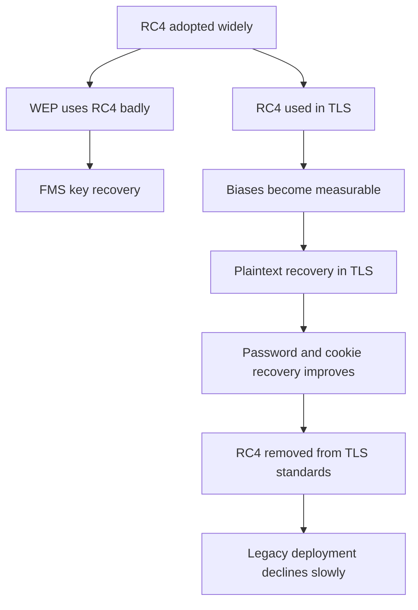
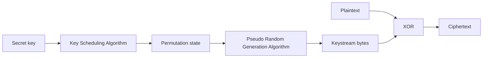
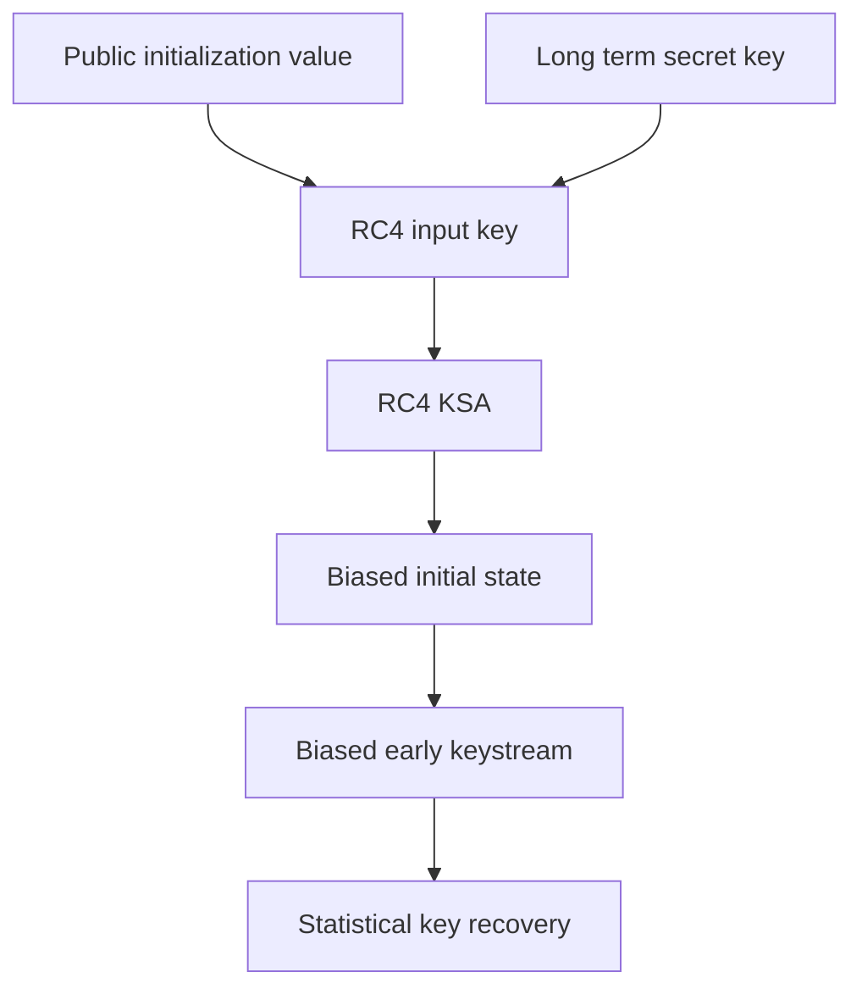
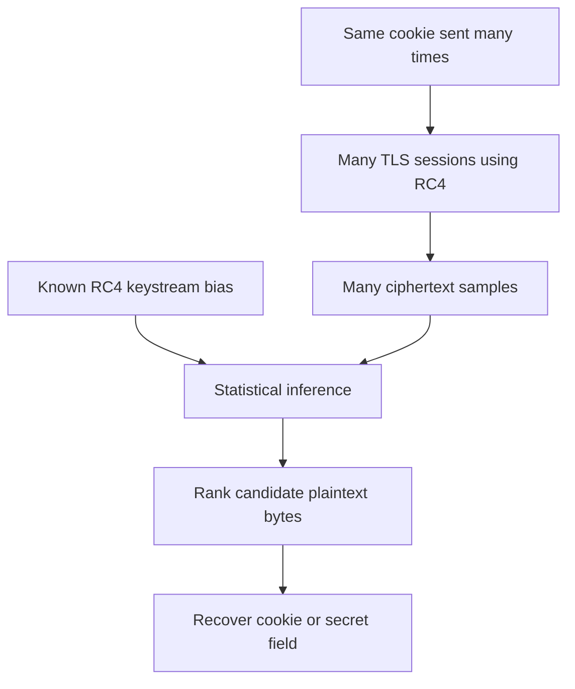
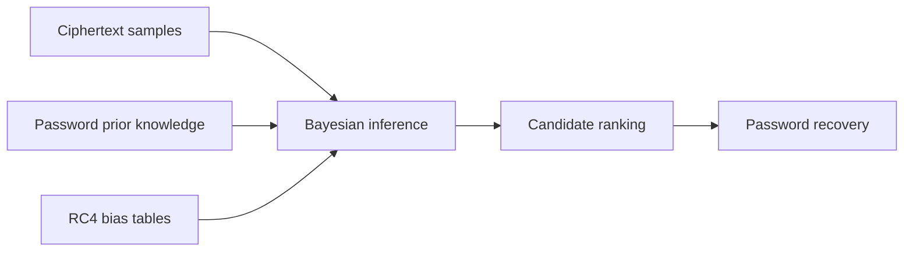
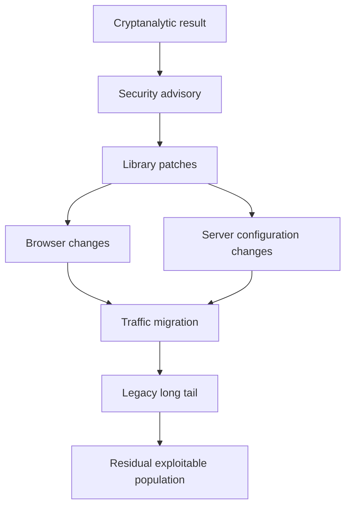
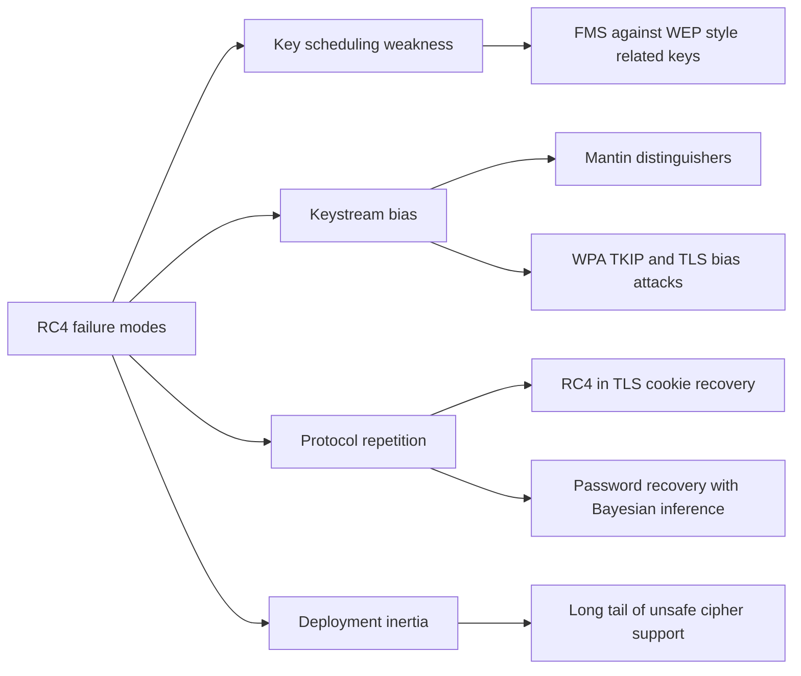

# Topic 2.2: The Story of RC4

## Assessment Window
- Final track

## Overview
Historical case study of RC4 from adoption to cryptanalytic collapse and deprecation lessons.

## Required Readings
- None.

## Optional Readings
- Add optional reading links here.

## Materials
- [ ] Slides
- [ ] Quiz


# Notes

I inspected the uploaded 42 page slide deck. It is **Applied Cryptography, Part 2, Real World Cryptography, 2.2 The Story of RC4**, focused on RC4’s design, why it became popular, how it failed in WEP and TLS, and what modern cryptographic engineering learned from its collapse. 

## 1. Main thesis

The deck presents RC4 as a full cryptographic lifecycle case study. RC4 began as a fast, simple, practical stream cipher. It became massively deployed in WEP, SSL, TLS, SSH, Microsoft Office, Adobe PDF encryption, and many other systems. Then decades of cryptanalysis exposed statistical weaknesses that moved from academic results to practical attacks.

The strongest message is this:

**Small statistical bias is not harmless when the internet can generate millions or billions of ciphertexts.**

RC4 was not broken by one single catastrophic design flaw. It died through accumulated evidence: weak key scheduling, early keystream bias, related key exposure in WEP, broadcast attacks in TLS, password recovery attacks, and painful migration pressure.

## 2. What RC4 is

RC4 is a symmetric stream cipher. It uses the same secret key for encryption and decryption. It expands a relatively small key into a keystream and XORs that keystream with plaintext.

Conceptually:

```text
plaintext XOR keystream equals ciphertext
ciphertext XOR keystream equals plaintext
```

This is attractive because XOR is fast and reversible. The problem is that the keystream must be computationally indistinguishable from random. If the keystream has bias, then the ciphertext leaks information about the plaintext.

RC4 became popular because it was extremely fast in software, had a tiny memory footprint, and was easy to implement. Its internal state was only 256 bytes, which made it ideal for old browsers, embedded systems, low power devices, and constrained hardware.

## 3. Origin and historical context

RC4 was designed by Ron Rivest at RSA Security in 1987. It was originally a trade secret. In 1994, source code was anonymously posted to the Cypherpunks mailing list. Because of legal concerns, open implementations often called it ARCFOUR rather than RC4.

The leak made RC4 widely available. That accelerated adoption across internet protocols. Ironically, a proprietary cipher became one of the most widely deployed ciphers because its leaked design was simple, fast, and easy for implementers to copy.

## 4. Stream cipher security intuition

The deck reminds us why stream ciphers exist. A one time pad gives perfect secrecy only when the key is as long as the message, uniformly random, used once, and kept secret. That is not practical for ordinary internet traffic.

A stream cipher tries to solve this by expanding a short key into a long keystream.

The desired property is:

```text
RC4 key expansion output should look random
```

Then:

```text
ciphertext equals plaintext XOR random looking keystream
```

If the keystream is distinguishable from random, then encryption is distinguishable from ideal encryption. That is exactly what happened with RC4.

## 5. RC4 structure

RC4 has two main parts.

### Key Scheduling Algorithm

The Key Scheduling Algorithm initializes the state array `S` with values from 0 to 255. Then it scrambles that array using the secret key.

Simplified structure:

```text
S starts as 0, 1, 2, ..., 255
j starts at 0

for i from 0 to 255:
    j equals j plus S[i] plus key[i mod key length], modulo 256
    swap S[i] and S[j]
```

The goal is to create a key dependent permutation of 256 values. The problem is that this scrambling is not strong enough. Some key patterns produce predictable structure in the initial state.

### Pseudo Random Generation Algorithm

After key scheduling, RC4 generates one byte of keystream at a time.

Simplified structure:

```text
i and j start at 0

for each output byte:
    i equals i plus 1 modulo 256
    j equals j plus S[i] modulo 256
    swap S[i] and S[j]
    output S[S[i] plus S[j] modulo 256]
```

The state changes after every output byte. That gives RC4 a long period, but it does not guarantee randomness. The generated bytes contain statistical bias, especially near the beginning of the keystream.

## 6. Why RC4 dominated

The deck calls the 1990s and 2000s RC4’s golden age. It was widely used because it was faster than DES in software, required little memory, avoided block cipher padding complexity, and was easier to deploy under historical export control constraints.

Important deployments included:

1. WEP for wireless network encryption
2. SSL and early TLS cipher suites
3. SSH 1
4. Microsoft Office document encryption
5. Adobe PDF encryption

At its peak, the deck says RC4 secured over half of SSL and TLS connections.

## 7. Early warning signs

The first warning signs appeared years before RC4 was formally prohibited.

Roos found correlations between key bytes and RC4’s initial permutation. Golić found keystream biases. Jenkins found internal state patterns and correlations between consecutive output bytes. At first, these issues looked theoretical.

That was the mistake. In modern cryptography, distinguishability is already a serious warning. If a keystream is not close to random, attackers can often amplify the weakness with enough samples or with a favorable protocol context.

## 8. Weak keys and key scheduling failure

The deck highlights that certain key patterns create predictable initial RC4 states. In particular, some key structures make values in the state array appear with higher than expected probability.

The critical point is not only that some keys are weak. The deeper issue is that RC4’s Key Scheduling Algorithm does not sufficiently destroy relationships between key bytes and early output bytes.

This means the first bytes of RC4 output can leak information about the key. If a protocol repeatedly uses related keys, attackers can collect enough samples to recover secret key bytes statistically.

## 9. Page 17 visual

The visual on page 17 shows a heatmap of bias in RC4 output. The image makes a key point visually: RC4 output is not uniformly random. Some positions and byte values are more likely than others.

This matters because encryption with a stream cipher is only safe when the keystream is indistinguishable from random. The heatmap is a visual proof that RC4 has structure, and structure is exactly what attackers exploit.

## 10. WEP design

WEP used RC4 for Wi Fi encryption. The design was:

```text
24 bit IV concatenated with shared secret key
result used as RC4 key
RC4 output XOR plaintext equals ciphertext
IV transmitted with ciphertext
```

The 24 bit initialization vector was sent in plaintext. All devices on the network shared the same secret key. The per packet RC4 key was created by prepending the IV to the secret key.

This design created a related key setting:

```text
IV1 || secret key
IV2 || secret key
IV3 || secret key
...
```

Many keys differed only in the public IV bytes. That was exactly the kind of structure RC4 could not safely handle.

## 11. Why WEP was the perfect storm

WEP combined several dangerous choices:

1. RC4 had weak key scheduling
2. WEP created many related RC4 keys
3. The IV was public
4. The IV was only 24 bits
5. The same long term secret key was reused by all devices
6. Attackers could passively collect large numbers of packets

The IV space was too small. On busy networks, IV reuse and weak IV patterns appeared naturally. Attackers did not need to break into the network first. They could sit nearby, collect traffic, and analyze it offline.

## 12. FMS attack intuition

The Fluhrer, Mantin, and Shamir attack exploited weak IV patterns. For a target key byte, the attacker waited for IVs with a special form. Those IVs caused RC4’s early keystream byte to leak information about one secret key byte.

The attacker repeated this process many times:

1. Capture many WEP packets
2. Filter packets with useful IV patterns
3. Extract information from the first keystream byte
4. Vote statistically for likely key byte values
5. Recover the key one byte at a time

This is a classic statistical key recovery attack. No single packet reveals the whole key. Many weakly informative packets reveal it collectively.

## 13. Practical WEP cracking

The deck describes practical tools that made WEP cracking accessible.

AirSnort in 2001 implemented the FMS attack and could crack WEP with millions of packets. WEPCrack demonstrated the same practical failure. Aircrack ng later improved the process, reducing required packet counts and adding packet injection to speed up traffic collection.

The important lesson is that academic attacks often become tools quickly. A protocol designer should not dismiss a paper as theoretical merely because the first version needs many samples.

## 14. Attacks improved over time

Klein’s attack expanded the set of useful weak IV patterns. The PTW attack used better statistical techniques and could crack WEP with far fewer packets, sometimes around tens of thousands.

This shows a recurring pattern in cryptanalysis:

```text
first attack proves weakness
later attacks reduce cost
tools automate exploitation
legacy deployments remain vulnerable
```

WEP went from “theoretically weak” to “practically dead” very quickly.

## 15. WEP lessons

The deck gives several important WEP lessons.

First, never use a stream cipher with related keys unless the cipher and protocol are explicitly designed for that use. WEP’s IV construction directly exposed RC4’s weak key scheduling.

Second, public nonces and IVs must be handled through a proper key derivation or nonce based encryption construction. Concatenating a public IV with a secret key is not a safe general design.

Third, protocols require cryptographic review. WEP was not just a bad implementation. The protocol design itself was flawed.

Fourth, migration can take years even after public breakage. WEP was deprecated long after practical attacks were available, which created a long tail of insecure networks.

## 16. WEP timeline

The WEP timeline is a textbook example of delayed retirement:

1. 2001: FMS attack published
2. 2001: AirSnort released
3. 2003: WPA standardized
4. 2004: WPA2 released with AES
5. 2006: Wi Fi Alliance deprecated WEP
6. 2012: Windows 8 removed WEP support
7. 2018: many vendors stopped supporting WEP entirely

The technical conclusion was obvious early, but ecosystem migration took much longer.

## 17. RC4 in TLS

RC4 was once attractive in TLS because it avoided CBC padding. When BEAST attacked CBC mode in TLS 1.0, many operators moved toward RC4 because it did not use block cipher padding.

This was an ironic failure mode. To avoid one practical attack against CBC, deployments moved to a cipher whose statistical weaknesses were already known. The internet traded one fragile construction for another.

## 18. RC4 bias in TLS

AlFardan and collaborators showed that RC4 biases were exploitable in TLS. The first 256 bytes of RC4 output were heavily biased. Some byte values appeared more often than random expectation.

A key example from the slides:

```text
Probability that early output byte equals zero is roughly double the random expectation
```

Random byte expectation is 1 out of 256. RC4 made certain events significantly more likely.

There were also multi byte biases. The deck gives an example where a pair pattern involving positions 1 and 257 occurred far more often than it should under random output.

The problem is that TLS traffic often repeats secrets in predictable positions, especially cookies, tokens, and authentication headers.

## 19. Broadcast attack model

The TLS attack model is repeated encryption of the same plaintext under many independent RC4 sessions.

Examples:

1. HTTP cookies sent on every request
2. Session tokens placed in stable header positions
3. Basic Authentication credentials repeated across requests
4. IMAP and SMTP authentication data sent repeatedly

The attacker collects many ciphertexts where the target secret appears at the same byte position. Because RC4 has biased keystream bytes, the most frequent ciphertext byte at that position gives information about the underlying plaintext byte.

Mathematically:

```text
ciphertext byte equals plaintext byte XOR biased keystream byte
```

If the keystream byte is biased toward a value, the ciphertext distribution is biased toward plaintext XOR that value.

## 20. Why repeated secrets are dangerous

A single ciphertext may reveal almost nothing. Millions of ciphertexts can reveal enough.

This is why the internet scale matters. Browser traffic, injected JavaScript, persistent connections, automatic retries, and repeated authentication can generate the sample size needed for statistical recovery.

The deck says practical attacks may require very large numbers of encryptions, but determined attackers can create traffic in some scenarios.

## 21. Garman and collaborators

Garman and collaborators improved the practicality of RC4 attacks by changing the target. Instead of only targeting cookies, they focused on password verifiers and repeated authentication.

This matters because passwords have structure:

1. Human passwords are not random
2. Character sets are limited
3. Dictionaries reduce search space
4. Encodings such as Base64 introduce patterns
5. Protocol headers place secrets at predictable offsets

Cryptanalysis improves dramatically when statistical cipher bias combines with application level structure.

## 22. Mantin’s ABSAB bias

Mantin’s ABSAB bias describes repeated byte patterns in RC4 output.

The pattern is conceptually:

```text
A B ... A B
```

Such patterns occur more often in RC4 output than they should in truly random output.

This is useful for attacking structured secrets because passwords and encodings often contain repeated characters or repeated patterns. The deck gives an example involving the password `hello123`, where repeated characters can reduce the password search space.

The broader point is that RC4 does not only have single byte bias. It also has correlations across positions. Multi byte bias is often more dangerous because real secrets have structure.

## 23. Password recovery

The deck states that password recovery attacks became practical enough to demonstrate in laboratory conditions. Basic Authentication and IMAP style repeated authentication were especially exposed.

The attack flow is:

1. Force or observe many authentications
2. Collect ciphertexts at fixed byte positions
3. Apply RC4 bias statistics
4. Use password structure and dictionaries
5. Recover characters or sharply reduce search space

This is not brute force alone. It is cryptanalysis plus protocol behavior plus human password predictability.

## 24. POODLE’s role

POODLE was not an RC4 attack. It attacked SSL 3.0 CBC padding. But it affected RC4’s story because it accelerated the end of SSL 3.0 and highlighted the danger of old protocol fallback.

The deck frames this as part of the final collapse. SSL 3.0, CBC, RC4, downgrade behavior, and legacy compatibility were all symptoms of the same ecosystem problem: insecure old options remained enabled because compatibility was prioritized.

## 25. RC4 prohibition

The coordinated response occurred across standards bodies and browser vendors.

The deck states that RFC 7465 prohibited RC4 in TLS. TLS clients must not offer RC4 cipher suites, and TLS servers must not select them. Browser vendors phased it out between roughly 2014 and 2018.

This matters because cryptographic death is not just academic consensus. A cipher is truly dead only when standards prohibit it and major implementations remove it.

## 26. Technical lessons from RC4

The deck’s technical lessons are strong.

### Statistical bias matters

A tiny deviation from random can become exploitable at large scale. Modern systems produce enormous data volumes, and attackers can often choose or influence plaintext.

### Attack composition matters

RC4 bias alone may look weak. Password structure alone may look ordinary. Repeated authentication alone may look normal. Combined, they become an attack.

### Protocol context matters

The same cipher can fail differently in different protocols. RC4 in WEP failed through related keys. RC4 in TLS failed through keystream biases and repeated secrets.

### Migration must be planned

Algorithms need sunset paths. Crypto agility is not optional. If an ecosystem cannot remove a broken cipher quickly, the ecosystem remains vulnerable long after cryptographers know the truth.

## 27. Broader cryptographic impact

RC4’s death influenced modern cipher design. Stream ciphers such as ChaCha20 were designed with much more attention to bias resistance, nonce handling, and modern cryptanalysis.

It also influenced TLS design. TLS 1.3 removed weak ciphers and requires authenticated encryption. The protocol no longer gives operators a giant menu of dangerous legacy options.

The operational lesson is that cipher suite audits and deprecation policies are part of security engineering, not administrative cleanup.

## 28. Modern alternatives

The deck names two major modern alternatives.

### ChaCha20 Poly1305

ChaCha20 is a modern stream cipher designed by Daniel J. Bernstein. Poly1305 provides authentication. Together they form an AEAD construction, meaning encryption and integrity protection are integrated.

It is especially useful on systems without fast AES hardware.

### AES GCM

AES GCM is a block cipher based AEAD mode. It is widely used in TLS 1.3 and benefits from hardware acceleration on many modern CPUs.

Both alternatives differ from RC4 in a crucial way: they provide authenticated encryption. RC4 only encrypts. It does not authenticate ciphertexts. Modern protocols require both confidentiality and integrity.

## 29. Engineering interpretation

RC4 teaches that simplicity is not enough. RC4 was simple, fast, and elegant, but its internal statistical behavior was not strong enough.

A safe cipher needs:

1. Public design
2. Extensive cryptanalysis before deployment
3. Strong nonce and key handling rules
4. No exploitable early output bias
5. Authentication support at the protocol level
6. Clear deprecation path
7. Continuous monitoring after deployment

The “easy to implement” property helped RC4 spread, but it also made people overtrust it.

## 30. Practical checklist derived from the deck

For modern systems:

1. Do not use RC4 anywhere.
2. Do not use WEP anywhere.
3. Do not use TKIP unless forced by legacy constraints, and even then treat it as deprecated.
4. Prefer TLS 1.3.
5. Prefer AES GCM or ChaCha20 Poly1305.
6. Use AEAD only for new protocol designs.
7. Never concatenate public IVs with long term secrets as an ad hoc key schedule.
8. Use proper key derivation functions.
9. Avoid related key settings unless the primitive is explicitly secure for them.
10. Do not dismiss small biases in keystream output.
11. Design for algorithm retirement from day one.
12. Remove weak ciphers, do not merely lower their preference.
13. Treat repeated secrets in fixed positions as dangerous.
14. Avoid repeated password based authentication over weak encryption.
15. Monitor standards bodies and cryptographic literature for deprecation signals.

## 31. Most important takeaway

RC4’s failure was not only a cipher failure. It was a deployment failure, a protocol design failure, and a migration failure.

In WEP, RC4 failed because the protocol created related keys and exposed public IVs directly inside the RC4 key. In TLS, RC4 failed because biased keystream output became exploitable when secrets were encrypted repeatedly at internet scale. In both cases, small cryptographic weaknesses became practical because the surrounding protocol gave attackers exactly the samples they needed.

The final lesson is simple:

**A cipher that is distinguishable from random is already living on borrowed time.**


# Notes

Small correction: the first entry should be Scott Fluhrer, not cott Fluhrer. The paper is Scott Fluhrer, Itsik Mantin, and Adi Shamir, Weaknesses in the Key Scheduling Algorithm of RC4. ([Springer][1])

## 1. Main thesis of this reading cluster

This group of papers explains the full lifecycle of RC4 failure.

RC4 was attractive because it was simple, fast, widely implemented, and avoided CBC padding oracle problems in older TLS deployments. But its internal state evolution has measurable statistical bias. At first, the attacks looked protocol specific, especially against WEP. Later work showed that the bias was not merely a WEP problem. It was a structural problem in RC4 itself, and it became exploitable in TLS when the same secret plaintext, such as a cookie or password, was encrypted many times under independent RC4 streams. ([Springer][1])

The broader lesson is that cryptographic primitives do not fail all at once. They decay. First there are distinguishers. Then there are partial plaintext recovery attacks. Then attacks become cheaper. Then standards prohibit the primitive. Then deployment studies show the long tail of legacy support. RC4 is a textbook example of this pattern. RFC 7465 finally required TLS clients and servers to never negotiate RC4 cipher suites in any TLS version. ([IETF Datatracker][2])



## 2. RC4 structure and why it was fragile

RC4 has two main parts.

1. The Key Scheduling Algorithm initializes a 256 byte permutation using the key.

2. The Pseudo Random Generation Algorithm updates two indexes, swaps permutation entries, and emits one byte at a time.

The security intuition was that the permutation becomes sufficiently mixed and that output bytes look random. The papers show that this intuition is false. RC4 leaks statistical structure from both initialization and generation. FMS attacked key scheduling. Mantin attacked keystream distribution. Later TLS attacks converted these statistical biases into plaintext recovery attacks.



The fatal property is not that every RC4 byte is obviously broken. The fatal property is that RC4 output is not close enough to random when used at internet scale. Small bias becomes exploitable when the attacker can collect millions or billions of samples.

## 3. Fluhrer Mantin Shamir, Weaknesses in the Key Scheduling Algorithm of RC4

The FMS paper targets the RC4 Key Scheduling Algorithm. It identifies weak keys where knowledge of a small number of key bits can reveal many state and output bits with meaningful probability. The authors use these weak key properties to build distinguishers and practical related key attacks. ([Springer][1])

This matters most in protocols that build RC4 keys by concatenating a public initialization value with a long term secret key. WEP did exactly this. For example, WEP used a public initialization vector together with a shared secret key to derive the per packet RC4 key. That construction gave attackers many related RC4 keys sharing the same secret suffix. FMS exploited this structure to recover the WEP key.

The key point is subtle: RC4 alone was not used in the abstract. It was embedded in a key derivation pattern. The pattern created related keys. The RC4 KSA did not adequately destroy the relationship among those keys. Therefore, the stream cipher and protocol composition failed together.



Practical lesson: never rely on a cipher key scheduler to act as a secure key derivation function. A KDF must be explicitly designed for domain separation, entropy extraction, and collision resistance. Concatenating public and secret material and hoping the cipher initialization will mix it safely is dangerous.

## 4. Mantin, Predicting and Distinguishing Attacks on RC4 Keystream Generator

Mantin’s 2005 work moves from key scheduling weakness to keystream generator weakness. It analyzes the statistical distribution of RC4 and RC4A outputs. The first result is a bias in digraph distributions, where pairs of bytes tend to repeat with short gaps more often than expected from random streams. Mantin shows that this can distinguish RC4 keystreams from random after about 2 to the 26 bytes with success probability greater than two thirds. ([Springer][3])

The second result is even more damaging at a conceptual level. The paper finds families of output patterns whose probabilities are several times higher in RC4 than in a random stream. The source reports examples where a bit can be predicted with 85 percent probability after 2 to the 45 output words, and a byte with 82 percent probability after 2 to the 50 output words. ([Springer][3])

This is important because a secure stream cipher should behave like a random oracle style keystream source for practical attackers. Distinguishers are not always immediately exploitable, but they are red flags. They mean the cipher is leaking structure. Once enough structure is found, protocol specific attacks often follow.

## 5. AlFardan, Bernstein, Paterson, Poettering, and Schuldt, On the Security of RC4 in TLS

This paper is the turning point for RC4 in TLS. It presents ciphertext only plaintext recovery attacks when RC4 is selected as the TLS record encryption algorithm. The attacks use statistical biases in RC4 and new findings from the paper itself. ([USENIX][4])

The attack model is realistic for web traffic. The attacker wants to recover a secret that appears repeatedly at a predictable position in encrypted HTTP requests, such as an authentication cookie. The attacker causes the browser to send many requests containing the same cookie. Each request is encrypted under a fresh RC4 stream, but the plaintext byte at a target position is the same or highly structured. Across many sessions, the attacker observes ciphertext bytes and uses known RC4 bias distributions to rank likely plaintext values.

The critical cryptographic equation is simple.

```text
ciphertext byte equals plaintext byte XOR keystream byte
```

If the keystream byte were uniform random, many ciphertext samples would reveal nothing useful. But RC4 keystream bytes are biased. Therefore, the ciphertext distribution is also biased around the true plaintext byte. With enough samples, the secret byte becomes statistically visible.



The engineering lesson is that probabilistic attacks matter. A cipher does not need to reveal every byte deterministically to be unsuitable. If it leaks enough signal under repeated use, it fails confidentiality.

## 6. Garman, Paterson, and Van der Merwe, Attacks Only Get Better

This paper demonstrates a principle every cryptographic engineer should internalize: once a primitive is known to be weak, attacks usually improve. The paper reports password recovery attacks against RC4 in TLS using Bayesian inference. It combines prior knowledge about password distributions with ciphertext observations to produce posterior likelihoods for candidate passwords. 

The improvement is substantial. The paper reports good password recovery success with 2 to the 26 encryptions, while earlier attacks needed around 2 to the 34 encryptions to recover an HTTP session cookie. It also reports a proof of concept against Basic Auth. 

The main cryptographic upgrade here is not only a new RC4 bias. It is better inference. Attackers do not need to treat plaintext as uniformly random. Passwords have structure. HTTP headers have structure. Cookies have formats. Basic Auth has formats. Once the attacker uses this structure, the number of required encryptions drops.



Practical lesson: when evaluating cryptographic leakage, assume attackers will combine signal from the primitive with application semantics. A tiny keystream bias can become dangerous when the plaintext space is small or structured.

## 7. Vanhoef and Piessens, All Your Biases Belong To Us

Vanhoef and Piessens expanded the known bias landscape of RC4. They used statistical hypothesis testing to discover many new biases in initial keystream bytes and several long term biases. Their work attacked both WPA TKIP and TLS. 

For TLS, they showed practical secure cookie recovery with a 94 percent success rate using 9 times 2 to the 27 ciphertexts. The attack injects known data around the cookie, uses Mantin’s ABSAB bias, and ranks plaintext candidates. They report that their traffic generation technique could execute the attack in about 75 hours. 

The WPA TKIP result is also important because it shows cross protocol fragility. RC4 weaknesses were not confined to one deployment. When a cipher has structural bias, every protocol using it becomes suspect, especially protocols that allow repeated known or partially known plaintext.

## 8. POODLE and the RC4 dilemma

POODLE is not an RC4 attack. It is included here because it explains why RC4 remained attractive for a period. Before RC4 was removed, TLS operators faced a bad choice: CBC had known practical attacks in older TLS contexts, while RC4 had growing statistical evidence against it. The Cloudflare article explains that after BEAST, many operators preferred RC4 because it avoided CBC mode exposure in TLS 1.0. ([The Cloudflare Blog][5])

POODLE exploited SSL 3.0 fallback. Google explained that browsers would retry failed HTTPS connections with older protocol versions, including SSL 3.0, and a network attacker could intentionally cause failures to trigger that downgrade. Once SSL 3.0 was reached, the attacker could exploit CBC padding behavior to calculate plaintext. Google recommended disabling SSL 3.0 or CBC ciphers with SSL 3.0, and also recommended TLS_FALLBACK_SCSV as a compatibility mechanism against forced fallback. ([blog.google][6])

The connection to RC4 is operational. RC4 survived partly because it was seen as the practical workaround for CBC attacks. But this was a temporary defensive tradeoff, not a clean cryptographic solution. Cloudflare’s 2014 article states that it removed RC4 for browsers using TLS 1.1 or later, made AES based suites preferred, and kept RC4 only as a last resort at that time. ([The Cloudflare Blog][5])

The lesson is that emergency mitigations can become technical debt. A workaround for one attack can keep a weaker primitive alive long enough for new attacks to mature.

## 9. Nick Sullivan, Killing RC4: The Long Goodbye

Cloudflare’s article is useful because it captures the operational decision process during the RC4 phase out. It explains that RC4 became popular after BEAST because it was the only widely supported non CBC option for many clients and servers at that time. Later, browser mitigations, TLS 1.2, and AES GCM changed the tradeoff. ([The Cloudflare Blog][5])

The article also distinguishes active from passive risk. BEAST required an active attacker with traffic injection and a victim interaction pattern. RC4 created concern about broader passive decryption and future retroactive decryption if attacks improved. Cloudflare argued that choosing AES CBC for older clients was preferable to keeping RC4 as the preferred cipher. ([The Cloudflare Blog][5])

This is a good example of security risk prioritization. Not all attacks with proofs of concept have the same operational profile. A noisy active attack, a passive bulk decryption risk, and a future cryptanalytic collapse must be weighed differently.

## 10. Kotzias and others, Coming of Age: A Longitudinal Study of TLS Deployment

This paper measures how TLS changed over time in response to attacks and standards. It uses passive and active measurements across a six year period. The authors state that in 2012, 90 percent of TLS connections used TLS 1.0, while by the time of the study, 90 percent used TLS 1.2, with TLS 1.3 traffic increasing. They also report that RC4 and CBC mode were prevalent in 2012, but RC4 had almost completely disappeared, while CBC mode remained around 10 percent of traffic. ([0xxon.net][7])

The paper’s key deployment insight is the long tail. Browsers and major clients adopt stronger algorithms quickly, but they are slow to drop old ones. Some software continues to offer unsafe ciphers because of backward compatibility, abandonment, or difficulty keeping TLS libraries current. ([0xxon.net][7])

This matters for cryptographic engineering because attacks do not end when papers are published. They end when vulnerable configurations disappear from real traffic. The latency between cryptanalysis and ecosystem repair is part of the attack surface.



## 11. RFC 7465 and the final standard response

RFC 7465 is the formal endpoint for RC4 in TLS. It says TLS clients must not include RC4 cipher suites in ClientHello, servers must not select RC4 cipher suites, and if a client offers only RC4, the server must terminate the handshake. ([IETF Datatracker][2])

This is stronger than “prefer something else.” It is a ban. That distinction matters. If RC4 remains as a fallback, downgrade behavior, legacy clients, or misconfigured servers can keep it reachable. Cryptographic deprecation must eventually become removal.

## 12. Attack taxonomy



## 13. What to inspect in a real system today

1. Confirm that RC4 is completely disabled in clients, servers, libraries, proxies, load balancers, scanners, embedded products, and test endpoints.

2. Confirm that no RC4 cipher suite appears in TLS ClientHello messages or server cipher configuration.

3. Confirm that SSL 3.0, TLS 1.0, and TLS 1.1 are disabled unless there is a formally accepted legacy exception.

4. Confirm that TLS 1.2 configurations use AEAD suites such as AES GCM or ChaCha20 Poly1305, preferably with ECDHE authentication suites.

5. Confirm that TLS 1.3 is enabled where possible.

6. Confirm that cipher preference does not keep weak suites as emergency fallback.

7. Confirm that monitoring catches downgrade attempts and legacy cipher negotiation.

8. Confirm that compliance exceptions are time bounded and documented with compensating controls.

## 14. Deep engineering lessons

The first lesson is that a stream cipher must be indistinguishable from random under realistic use. RC4 fails this property repeatedly. Early bytes are biased, later patterns are biased, and these biases can be combined with repeated plaintext positions.

The second lesson is that repeated secret plaintext is dangerous. Web cookies, Basic Auth passwords, authorization headers, CSRF tokens, and session identifiers often appear in predictable locations. If the encryption layer leaks a small statistical signal, repetition amplifies it.

The third lesson is that replacing one risky construction with another can create delayed failure. RC4 was used partly to avoid CBC attacks, but the ecosystem traded one fragile mode for a fragile primitive.

The fourth lesson is that cryptographic deprecation must be decisive. Lowering priority is a temporary migration strategy. Actual safety requires removal from negotiation.

The fifth lesson is that standards, implementations, and traffic measurements must be read together. FMS and Mantin explain the primitive weakness. AlFardan and later works explain exploitation in TLS. Cloudflare explains operational transition. Kotzias explains deployment reality. RFC 7465 explains final protocol policy.

## 15. Final synthesis

RC4 failed because its output was biased, its key scheduling was fragile, and real protocols gave attackers enough repeated structure to exploit those weaknesses. The practical collapse took more than a decade because the internet needed compatibility, and because RC4 temporarily solved a different TLS problem. That delay is the real warning.

A cryptographic primitive with known statistical bias should not remain in production merely because current attacks are expensive. Attack cost trends downward. Traffic volume trends upward. Inference methods improve. Deployment removal takes years. By the time an attack becomes convenient, the ecosystem may still be full of legacy exposure.

[1]: https://link.springer.com/chapter/10.1007/3-540-45537-X_1?"Weaknesses in the Key Scheduling Algorithm of RC4"
[2]: https://datatracker.ietf.org/doc/html/rfc7465 "
            
                RFC 7465 - Prohibiting RC4 Cipher Suites
            
        "
[3]: https://link.springer.com/chapter/10.1007/11426639_29 "Predicting and Distinguishing Attacks on RC4 Keystream Generator | Springer Nature Link"
[4]: https://www.usenix.org/conference/usenixsecurity13/technical-sessions/paper/alFardan "On the Security of RC4 in TLS | USENIX"
[5]: https://blog.cloudflare.com/killing-rc4-the-long-goodbye/ "Killing RC4: The Long Goodbye"
[6]: https://security.googleblog.com/2014/10/this-poodle-bites-exploiting-ssl-30.html "
Google Online Security Blog: This POODLE bites: exploiting the SSL 3.0 fallback
"
[7]: https://www.0xxon.net/papers/imc18tlsdeployment.pdf "Coming of Age: A Longitudinal Study of TLS Deployment"
