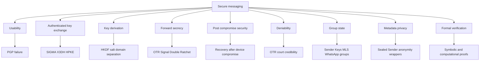
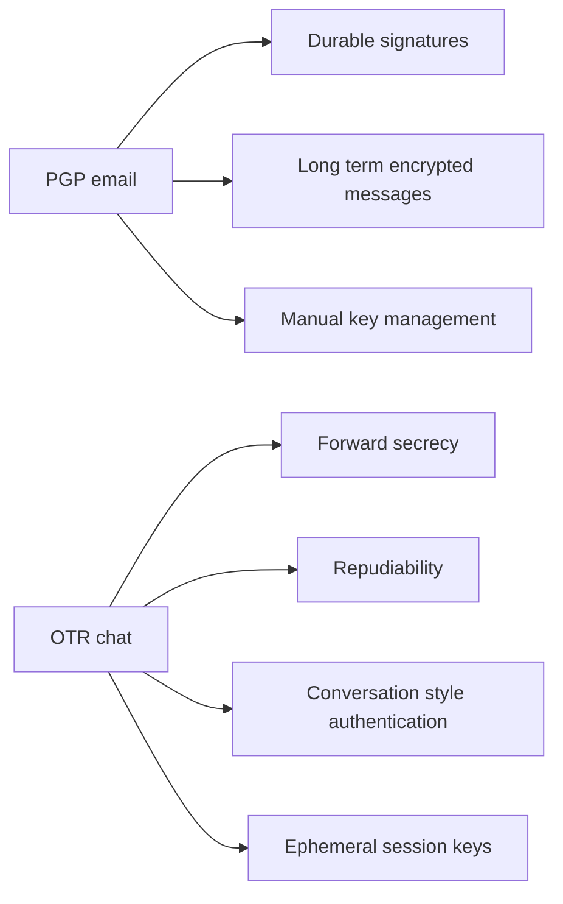
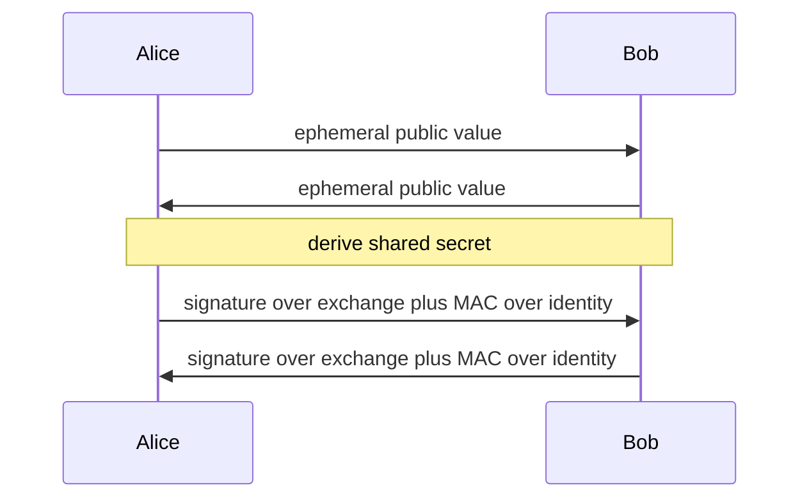
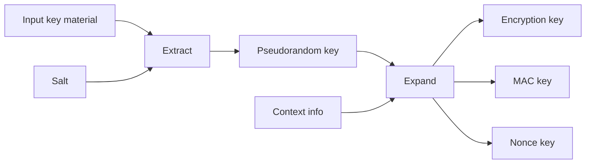
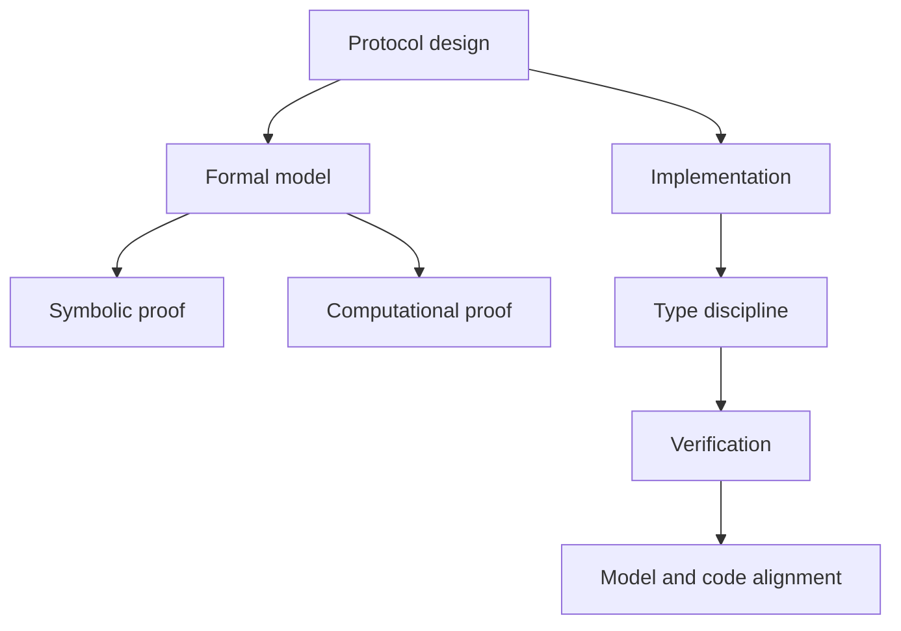
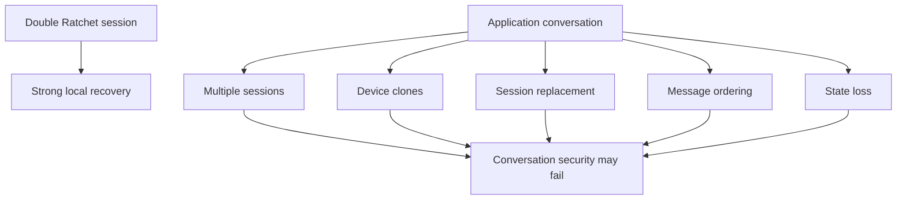
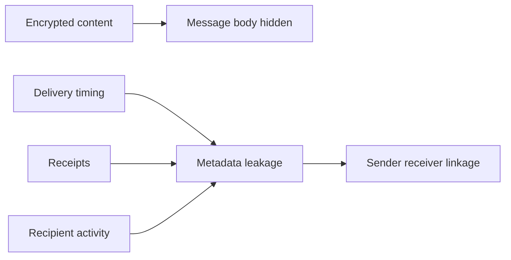
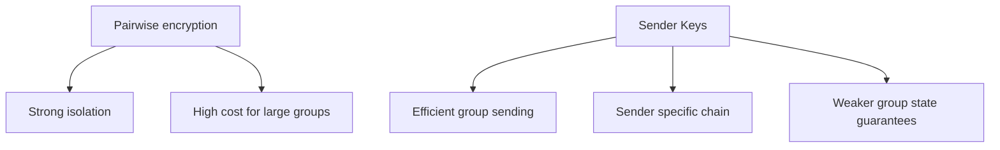
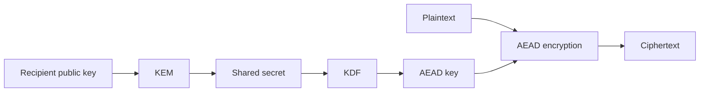
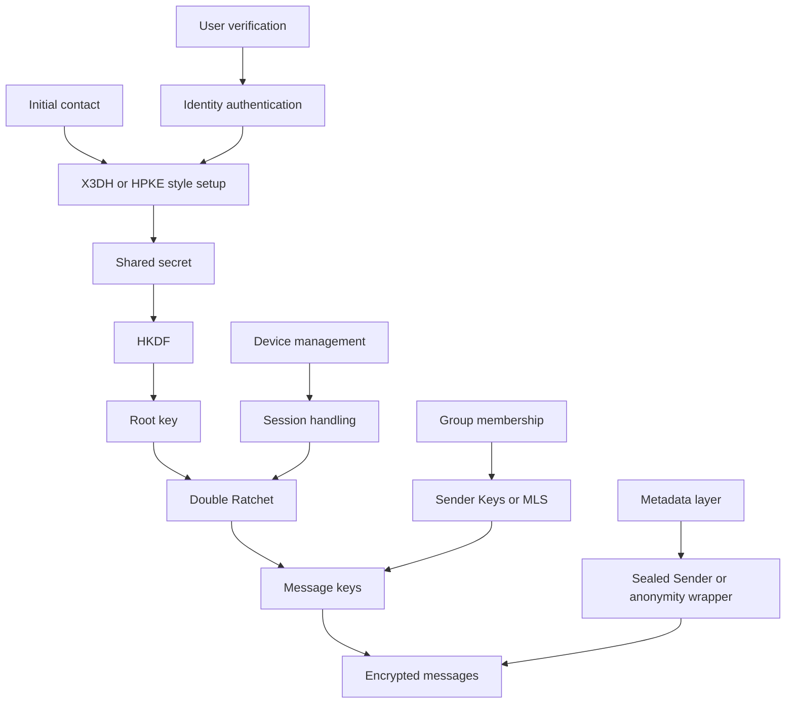

# Topic 2.3: Secure Messaging

## Assessment Window
- Final track

## Overview
From OTR to Signal: authenticated key exchange, ratcheting, post-compromise security, and group messaging.

## Required Readings
- The Joy of Cryptography, Chapter 17: Encrypted Messaging & Ratcheting.

## Optional Readings
- Add optional reading links here.

## Materials
- [ ] Slides
- [ ] Quiz

# Notes

I inspected the uploaded deck. The document is a secure messaging lecture covering PGP, OTR, authenticated key exchange, key derivation, Signal, Telegram, and group secure messaging. Its main lesson is that secure messaging is not only about encryption algorithms. It is about identity binding, key lifecycle, usability, metadata leakage, state recovery, and protocol failure modes. 

## 1. Core thesis

The deck compares three eras of secure messaging.

• PGP shows why strong cryptography can still fail when key management is pushed onto users.
• OTR shows how automatic Diffie Hellman based sessions made usable secure chat possible.
• Signal shows how asynchronous messaging, pre keys, ratcheting, metadata reduction, and post compromise recovery became central design goals.
• Telegram is presented as a cautionary case where product features and server side convenience conflict with end to end confidentiality.
• Group messaging shows that scaling from two users to hundreds of users changes the cryptographic problem entirely.  

## 2. PGP: strong crypto, weak system design

PGP uses a public key and private key model for email. The message content is encrypted with symmetric encryption, while public key cryptography is used to protect the symmetric key and to support digital signatures. This hybrid pattern is cryptographically sensible, but the user experience around keys became the main failure point. 

The key distribution problem dominates PGP. A user needs the recipient public key, but key servers allow anyone to upload anything. Fingerprints and the Web of Trust were intended to solve authenticity, but they require out of band verification and user discipline. The slides show this as a confusing public key discovery process rather than a usable trust system. 

The most important criticism is not that PGP encryption is mathematically broken. The criticism is that PGP does not provide modern secure messaging properties by default. It lacks forward secrecy, exposes metadata such as recipients and subject lines, keeps long lived keys for years, and makes catastrophic user mistakes easy. If the private key is compromised, previously recorded encrypted mail can become readable. 

The usability studies are central. In the 1999 study, only one third of participants succeeded, and one quarter sent secrets in plaintext. In the 2015 Mailvelope study, only one of ten pairs succeeded. The practical conclusion is that security interfaces must communicate the security model, not merely expose cryptographic operations through a graphical interface. 

## 3. OTR: secure chat as a protocol shift

OTR changes the assumptions. Instead of email, it targets synchronous chat where both parties are online. That allows automatic Diffie Hellman key agreement during the conversation. This removes much of the user facing key management burden that made PGP fragile. 

OTR introduces three major properties.

• Forward secrecy: old messages remain protected even if a later key is compromised.
• Deniable authentication: the recipient can authenticate messages during the conversation, but a third party cannot later verify a permanent cryptographic proof of authorship.
• Socialist Millionaire Protocol: users can verify shared knowledge without a trusted third party. 

The crucial design principle is separation of identity keys and ephemeral keys. Identity keys authenticate the key exchange. Ephemeral Diffie Hellman keys derive the message encryption material. Long term identity keys must not directly encrypt messages, because that would destroy forward secrecy. 

## 4. Authenticated key exchange and SIGMA

The SIGMA pattern is used to explain how authentication and Diffie Hellman should be combined. Each party signs the ephemeral Diffie Hellman public values, while a MAC under a key derived from the Diffie Hellman secret binds the claimed identity to the exchange. 

The deck emphasizes identity binding. If the signature only covers ephemeral values, an attacker can substitute an identity and cause identity confusion. This is related to unknown key share style attacks. The lesson is that the protocol transcript must bind identities, ephemeral keys, negotiated parameters, and context before accepting a session. 

The HMAC in SIGMA is not decorative. It proves knowledge of the derived session key and binds the identity to that derived key. This also supports identity protection variants where identities are encrypted against passive observers. However, identity protection is weaker against active attackers because active attackers can manipulate the protocol and force disclosure. 

The protocol design checklist here is:

• Authenticate ephemeral public keys.
• Bind identities into authenticated data.
• Bind protocol version and negotiation context.
• Include freshness through nonces, sequence numbers, timestamps, or equivalent transcript context.
• Avoid static static Diffie Hellman as the only basis for authentication, because it can create key compromise impersonation exposure. 

## 5. Key derivation: never use raw Diffie Hellman output directly

The slides explicitly call out that writing `hash(gxy)` is a simplification. Diffie Hellman output is not generally suitable as a direct encryption key. It can have mathematical structure and may not be uniformly distributed over the target key space. 

The Curve25519 example makes this concrete. A Curve25519 shared value is a 32 byte coordinate, but it is not a uniformly random AES 256 key. Some bit patterns are impossible or biased, and malformed public keys can cause small subgroup or related issues if the protocol lacks validation and proper extraction. 

The right abstraction is a KDF. HKDF is presented as the modern answer because it separates extraction from expansion. Extraction concentrates entropy into a pseudorandom key. Expansion derives multiple purpose specific keys using an `info` field for domain separation. 

Good key derivation should create separate keys for:

• encryption
• authentication
• each traffic direction
• each protocol stage
• each transcript context
• each algorithm purpose

The deck contrasts this with OTR style hand rolled derivation such as hashing `secret || counter`, which lacks formal context structure and is easier to misuse. 

## 6. OTR ratcheting and deniability

OTR messages include the encrypted message, a fresh ephemeral Diffie Hellman public value, and a MAC over the message. On each send or receive event, the protocol advances keys and deletes old ephemeral private material. This gives forward secrecy if key erasure actually works. 

Deniability in OTR relies on MACs rather than signatures. Since both parties know the MAC key, either party could have produced a valid message. OTR later reveals old MAC keys so anyone can forge past transcripts. That removes long term cryptographic proof of authorship. 

The deck correctly separates cryptographic deniability from legal deniability. The Manning and Lamo discussion shows that courts may accept testimony, context, screenshots, logs, and corroborating evidence even without non repudiable signatures. So deniability is useful against automatic mass verification, but it is not a complete defense against legal or social attribution. 

## 7. OTR attacks and lessons

The OTR version rollback attack comes from unauthenticated version negotiation. If an attacker can force peers into an older protocol version before authentication, the security of the session becomes the security of the weakest accepted version. The fix is to authenticate the negotiated version inside the authenticated key exchange. 

The OTR message integrity attack is especially instructive. It combines MAC key revelation, message ordering assumptions, active network control, and malleable encryption. Alice reveals an old MAC key after believing a key state is finished. Mallory delays and forges an older looking message with the now published MAC key. Bob accepts it as a delayed message. 

The fix space is clear:

• delay MAC key revelation
• improve the state machine
• reject impossible out of order messages
• include counters in authentication
• use AEAD instead of malleable encryption plus separate MAC handling
• authenticate transcript and message ordering context 

## 8. Signal: asynchronous messaging

Signal solves the mobile era problem that OTR could not solve. OTR requires both users online. Signal allows Alice to start a secure session while Bob is offline by using pre keys stored on the server. 

X3DH combines several Diffie Hellman outputs:

• Alice identity with Bob signed pre key
• Alice ephemeral key with Bob identity key
• Alice ephemeral key with Bob signed pre key
• Alice ephemeral key with Bob one time pre key

These values are concatenated with constants and fed into key derivation. Bob can later compute the same secret when he comes online. 

The signed pre key provides an authenticated asynchronous anchor. The one time pre key improves initial forward secrecy when available. The server helps deliver public key material, but it should not learn message plaintext. The trust model still requires users to trust that identity keys are not maliciously substituted unless they verify them. 

## 9. Double Ratchet

The Double Ratchet combines two ratchets.

• Symmetric ratchet: advances chain keys with HMAC for every message.
• Diffie Hellman ratchet: injects fresh public key randomness when message direction changes.

This gives message level key freshness and allows recovery after some compromises once fresh uncompromised Diffie Hellman material enters the state. 

Forward secrecy protects the past. Post compromise security tries to protect the future after compromise. The deck explains this distinction well: forward secrecy is backward looking, while post compromise security is healing oriented. 

The realistic limitation is state. Phones crash, restore from backup, lose data, reinstall apps, and maintain multiple sessions. If an application must survive state loss, it usually keeps fallback sessions or old decryptability windows. That weakens perfect conversation level post compromise security. The deck presents the impossibility result: if real applications must tolerate state loss and recovery, full conversation level post compromise security is mathematically impossible. 

## 10. Sealed Sender and metadata

Signal protects message content, but normal end to end encryption does not hide who is talking to whom from the service. Sealed Sender tries to reduce sender visibility by placing sender identity and sender certificate inside an encrypted envelope. The server sees the recipient and a delivery token, not the sender identity in the normal delivery flow. 

The system uses short lived sender certificates and delivery tokens. The certificate binds phone number, identity key, and expiry. The delivery token acts as an abuse control mechanism, since fully anonymous sending would create spam and abuse problems. 

The statistical disclosure attack shows that hiding explicit sender identity does not eliminate traffic analysis. Delivery receipts and reply timing can reveal communication patterns. If Bob tends to reply shortly after receiving Alice messages, Alice appears more often in Bob reply windows than random users. After a few messages, contacts can be inferred statistically. 

The broader lesson is that metadata privacy needs traffic shaping, batching, delays, cover traffic, or stronger anonymity infrastructure. Cryptographic envelopes alone are not enough.

## 11. Telegram

The deck treats Telegram as a security mismatch between marketing and default behavior. Telegram has cloud chats and secret chats. Cloud chats are encrypted to Telegram servers, not end to end encrypted. Secret chats use MTProto 2.0 and must be explicitly enabled for one to one conversations. The result is that most Telegram usage is not end to end encrypted. 

Telegram prioritizes cloud sync, search, bots, large file handling, edits, deletion, and consistent multi platform behavior. Those features are easier when the server can access message plaintext or equivalent server readable state. That is a product choice, but it changes the threat model fundamentally. 

The most important note is that Telegram is not primarily designed to protect users from Telegram itself. It is more aligned with resisting some external censorship and giving convenient cloud features. Users who believe all Telegram chats are end to end encrypted misunderstand the default model. 

## 12. Group secure messaging

Two party secure messaging does not directly scale to groups. If a sender encrypts separately to every recipient, the cost is linear in group size. For large groups, this creates bandwidth, battery, state consistency, and delivery problems. 

WhatsApp sender keys improve efficiency. Each group member has a sender key shared with the group. A message key is derived from a chain key, the message is encrypted once, the ciphertext is signed, the message key is erased, and the chain key ratchets forward. This gives constant encryption cost per message and handles out of order delivery better. 

The trade is weaker security compared with pairwise ratchets. Sender keys improve scalability and battery life, but they weaken forward secrecy and post compromise security. The deck also notes that a malicious server can add or remove parties, which means membership authentication and transparency matter. 

MLS is presented as the principled group protocol. It uses group key agreement, ratcheting epochs, and TreeKEM to reduce update cost to logarithmic scale. HPKE is used as a building block for encrypting new path secrets to sibling subtrees. 

TreeKEM is the central group AKE idea. Members know secrets on their path to the root. When a member updates, it refreshes path secrets and encrypts relevant new secrets to sibling public keys. This lets the group update keys efficiently without encrypting separately to every member. 

The reality check is complexity. MLS is powerful, but the specification is large, state transitions are intricate, server coordination is nontrivial, and implementation bugs are likely. The deck frames MLS as cryptographically elegant but developer hostile. 

## 13. Design lessons

A secure messaging protocol should be judged across these dimensions.

• Content secrecy: message plaintext is protected from servers and network attackers.
• Forward secrecy: old messages stay protected after later key compromise.
• Post compromise security: future messages can recover after state compromise.
• Authentication: users know which identity they are talking to.
• Identity binding: the protocol prevents identity substitution and unknown key share confusion.
• Replay resistance: old valid messages cannot be reused to create false state.
• Ordering integrity: delayed or reordered messages cannot be abused.
• Metadata resistance: sender, recipient, timing, and social graph leakage are minimized.
• State recovery model: crashes, backups, reinstalls, and multiple devices are explicitly modeled.
• Group scalability: large groups avoid linear encryption cost without silently destroying security.
• Usability: security works by default and does not depend on users understanding protocol internals.

## 14. Practical takeaways

For protocol design, the strongest lesson is to authenticate all context: identities, ephemeral keys, versions, algorithm choices, transcript order, group membership, and application level purpose. Missing context is where substitution, rollback, replay, and state confusion attacks appear.

For implementation, the hardest problems are not only primitives. They are key erasure, state machines, old key caches, backup behavior, multi device sessions, recovery flows, server controlled membership, and metadata leakage.

For product security review, ask these questions first:

• Is end to end encryption default for all chats?
• Are identity keys visible and verifiable by users?
• What does the server know?
• What happens after device compromise?
• What happens after app reinstall or backup restore?
• How many old sessions can still decrypt or send?
• Can the server silently add a group member?
• Are protocol versions and algorithm choices authenticated?
• Are AEAD associated data fields complete?
• Are message counters and transcript identifiers authenticated?

## 15. Bottom line

The deck’s strongest conclusion is that secure messaging is a protocol engineering discipline, not a primitive selection exercise. PGP had strong crypto but failed usability and forward secrecy. OTR introduced usable forward secret chat and deniability, but had state and integrity issues. Signal moved secure messaging into the asynchronous mobile world with X3DH and Double Ratchet, but metadata and real application state still limit the ideal model. Telegram shows how server side convenience can undermine user expectations. MLS shows the future direction for groups, but also shows that correctness and deployability are now the hard parts.

# Notes

Source inspected: uploaded text on encrypted messaging, ratcheting, Signal, MLS, ratchet trees, and UPKE. Some formulas and construction pseudocode appear damaged by text extraction, so I am treating the prose as authoritative and marking missing mathematical details where relevant. 

## 1. Core problem

The chapter starts from a simple observation: authenticated encryption is secure only while the encryption key remains secret. Once Alice and Bob’s shared key is stolen, the adversary can usually decrypt old traffic, decrypt future traffic, and impersonate both sides.

The main question is therefore not:

Can we remain secure after total key theft?

That is impossible for the exact moment of compromise.

The real question is:

Can we limit the blast radius of key theft?

The file studies three major damage containment properties:

1. Forward secrecy
   Theft of current secrets should not reveal past messages.

2. Post compromise secrecy
   Theft of current secrets should not permanently reveal future messages.

3. Efficient group key evolution
   Large groups should update shared secrets without making every update cost linear work in the number of members.

## 2. Forward secrecy

Forward secrecy means that if an adversary steals a user’s secrets at time t, messages from before time t should remain hidden.

The important engineering implication is:

Secrets must evolve, and old secrets must be erased.

A static key cannot provide forward secrecy. If the same key protects messages for a long time, stealing that key later reveals everything protected by it. Therefore, a forward secure system needs key evolution:

Current secret → next secret → next secret → next secret

The old secret must be unrecoverable from the new secret.

This is why the ratchet metaphor matters. A ratchet moves forward, but should not move backward.

## 3. Symmetric ratchet

The symmetric ratchet uses a pseudorandom generator to evolve secret state.

Conceptual model:

```text
Ratchet key R0
    ↓
derive epoch key K1 and next ratchet key R1
    ↓
derive epoch key K2 and next ratchet key R2
    ↓
derive epoch key K3 and next ratchet key R3
```

Each epoch key is used for a short period, ideally one message. After use, the implementation must erase:

1. The previous ratchet key
2. The previous message key
3. Any intermediate key derivation material

The file’s security claim is that past epoch keys remain pseudorandom even if the adversary learns the current ratchet key, assuming the underlying length doubling pseudorandom generator is secure.

### What the symmetric ratchet gives

It gives strong forward secrecy under strict erasure assumptions.

If the attacker steals R5, they can compute R6, R7, R8, and future epoch keys.

But they should not be able to compute K1, K2, K3, or K4.

### What the symmetric ratchet does not give

It does not give post compromise secrecy.

If the adversary gets the current ratchet key, all future keys are computable because the ratchet is deterministic. There is no fresh external randomness entering the system.

### Critical implementation note

The proof assumes the attacker gets only the current ratchet key. That assumption is fragile in real systems.

Forward secrecy fails if old keys remain in:

1. Heap memory
2. Swap
3. Crash dumps
4. Logs
5. Debug traces
6. Persistent database records
7. Mobile backup snapshots
8. Language runtime copies
9. Serialization buffers
10. Message retry queues

So the cryptographic construction is only as strong as the key erasure discipline.

## 4. Synchronization risk in symmetric ratchets

The symmetric ratchet is deterministic. Alice and Bob must advance their local ratchet state in exactly the same way.

This creates a practical problem:

Alice sends message 1, message 2, message 3.

Bob receives message 1, then message 3, then message 2.

If Bob advances the ratchet incorrectly, he may lose the ability to decrypt later messages.

Therefore, production protocols need message numbers, skipped message key storage, replay protection, and bounded out of order handling.

The file correctly warns that message loss and out of order delivery can break synchronization.

## 5. Post compromise secrecy

Post compromise secrecy means the system can heal after compromise.

The key idea is:

The future must depend on randomness that the adversary does not yet know.

A deterministic ratchet cannot heal itself. Once the attacker knows the current state, the attacker can simulate the same deterministic evolution.

Healing requires new randomness injected by an honest participant after the compromise.

## 6. Asymmetric ratchet

The asymmetric ratchet is based on repeated Diffie Hellman exchange.

Each participant periodically creates a fresh exponent. The current shared key is derived from a Diffie Hellman value involving one party’s current exponent and the other party’s latest public value.

Conceptual model:

```text
Alice sends fresh DH public value
Bob combines it with Bob secret exponent
Bob sends fresh DH public value
Alice combines it with Alice secret exponent
```

The important difference from a symmetric ratchet is that future keys depend on fresh exponents that have not yet been generated.

This gives post compromise healing.

If an attacker steals Alice’s current exponent, the attacker may learn the current key and possibly the next key depending on protocol timing. But once Alice or Bob injects fresh uncompromised randomness, the attacker loses predictive power.

### Key reuse observation

The file notes that each Diffie Hellman exponent may be used for two epoch keys. This is acceptable under the Decisional Diffie Hellman assumption, but the formal proof is nontrivial.

From an engineering perspective, this reuse must be carefully bounded. Exponents should not become long lived identity keys. They are ratchet state, not identity state.

## 7. Weakness of the plain asymmetric ratchet

The file explains a critical active attack:

1. Alice sends a Diffie Hellman ratchet message to Bob.
2. The adversary intercepts or manipulates traffic.
3. The adversary replies to Alice while pretending to be Bob.
4. Alice derives a new epoch key using the adversary supplied public value.
5. The adversary can compute the same key.

This means a plain asymmetric ratchet is insufficient against an active network adversary unless ratchet messages are authenticated and bound to session state.

The lesson is important:

Post compromise secrecy against passive compromise is not enough.

A messaging protocol must also defend against injection, replay, reordering, unknown key share style confusion, identity substitution, and session hijacking.

## 8. Double Ratchet

The Double Ratchet combines two mechanisms:

1. A Diffie Hellman ratchet
   Supplies fresh shared secrets through interactive key agreement.

2. A symmetric ratchet
   Derives per message keys and provides forward secrecy between Diffie Hellman updates.

Conceptual model:

```text
DH ratchet output
        ↓
root key update
        ↓
chain key update
        ↓
message key
```

The key security idea is that an attacker should need both:

1. The current symmetric ratchet state
2. The relevant Diffie Hellman contribution

Knowing only one should not be enough to predict future message keys.

This improves resistance to session hijacking. An attacker who only injects a Diffie Hellman value does not automatically know the victim’s current root or chain key. An attacker who only steals local state but cannot keep controlling the network eventually loses access after honest Diffie Hellman updates.

## 9. Consecutive messages

Real chats are not strictly alternating. Alice may send ten messages before Bob replies.

A bad design would encrypt all ten messages under the same epoch key.

That may be acceptable for some authenticated encryption schemes from a narrow confidentiality perspective if nonces are handled correctly, but it is bad for forward secrecy.

If Alice sends ten messages under one key, then later compromise of that key exposes all ten messages.

The better design is:

```text
chain key C1 → message key M1
chain key C2 → message key M2
chain key C3 → message key M3
chain key C4 → message key M4
```

Even without a new Diffie Hellman input, Alice advances the symmetric sending chain for every message.

This is exactly the right design principle for modern encrypted messaging:

One message should have one message key.

## 10. Branching ratchets and out of order messages

The file explains that simultaneous messages can desynchronize the ratchet.

Example:

Alice thinks her message came before Bob’s.

Bob thinks his message came before Alice’s.

If both update ratchets based on different perceived orders, their states diverge.

Signal handles this by separating chains:

1. A root ratchet
2. A sending chain
3. A receiving chain
4. Additional skipped message key handling for out of order delivery

The file describes this as branching into secondary symmetric ratchets.

Practical meaning:

Alice can close an old sending chain after starting a new one, but she may need to keep the latest receiving chain active because Bob’s older messages may still arrive.

This is necessary because real networks reorder, delay, duplicate, and drop messages.

## 11. Signal protocol notes

The file correctly frames Signal as a real world protocol designed for long lived conversations on losable, clonable, portable devices.

Important security objectives:

1. Protect past messages after device compromise
2. Heal future messages after compromise when honest communication resumes
3. Support asynchronous messaging
4. Tolerate out of order delivery
5. Resist active network manipulation
6. Avoid using the same key for many messages
7. Authenticate the initial key agreement separately

The file explicitly says it assumes Alice and Bob already share an initial secret, and that initial authentication is handled elsewhere. That is an important boundary. Ratcheting does not solve identity authentication by itself.

## 12. Group messaging problem

Two party ratchets do not generalize cleanly to groups.

Diffie Hellman naturally gives a shared secret between two parties. For a group of n users, there is no simple direct equivalent that gives the same clean properties with low cost.

Messaging Layer Security solves this with a ratchet tree.

The file states three design goals:

1. All group members agree on a common secret
2. The group secret evolves across epochs
3. Updating the group secret should cost much less than n

The third point is fundamental. If every group update required encrypting separately to every member, large groups would become expensive.

## 13. MLS ratchet tree

MLS arranges group members as leaves of a balanced binary tree.

Each node has a public key and private key.

Each group member knows:

1. All public keys in the tree
2. The private keys on its own path from leaf to root

The root private key is the group secret.

For eight users, user 3 knows:

```text
SK3
SK[3:4]
SK[1:4]
SK[1:8]
```

The root secret SK[1:8] is the group key.

### Why the tree matters

When user 3 updates, they sample new keypairs along their path to the root.

They then publish:

1. New public keys for the updated path
2. Encrypted private key material for subtrees that need it

This lets the updater distribute new secrets to whole subtrees rather than every individual user.

Cost becomes logarithmic in group size.

If the tree has height h, the updater publishes fewer than 2h ciphertexts.

Since h is about log n, the update cost is O(log n), not O(n).

## 14. MLS post compromise secrecy

The file makes a subtle but important point:

If user i is compromised, the group does not heal until user i performs an update.

Why?

At compromise time, the attacker and victim know the same secrets. If other people update the tree, both the victim and attacker can process those updates using the stolen secrets.

The system heals only when the compromised user injects new randomness that the attacker does not know.

So MLS post compromise recovery is conditional:

Recovery requires an update by the compromised member.

This is a weaker and more nuanced healing property than a casual reader might expect.

## 15. MLS forward secrecy delay

Forward secrecy in the basic ratchet tree is also delayed.

Example from the file:

User 3 updates the tree at time t. User 4 may hold an old private key that can decrypt enough update material to recover the group key for that epoch. If the attacker compromises user 4 before user 4 updates their own key, the attacker may recover the earlier group key.

So forward secrecy is not immediate in the basic construction.

It depends on when relevant users refresh or erase decryptable key material.

## 16. Updatable PKE

UPKE is introduced to improve forward secrecy in ratchet trees.

A normal public key encryption scheme has:

1. Key generation
2. Encryption
3. Decryption

UPKE adds:

1. Public key update
2. Private key update
3. Update ciphertext generation

The idea is elegant:

A sender can publish update information that lets the receiver update both public and private key material, but the sender still cannot compute the receiver’s new private key.

This matters because every time a receiver decrypts sensitive tree update material, their decryption key can be advanced immediately.

That prevents the receiver from keeping a private key that can decrypt past update ciphertexts.

## 17. El Gamal UPKE

The file sketches an El Gamal based UPKE.

Standard El Gamal keypair:

```text
private key = a
public key = g^a
```

The update idea:

A sender chooses random r.

The updated private key is conceptually related to a + r.

The updated public key becomes related to g^(a + r), which can be computed from g^a and g^r.

The receiver learns r through encrypted update material, but the sender does not know a, so the sender cannot compute a + r.

This gives a public update mechanism without letting the updater take over the receiver’s private key.

## 18. Security subtlety in UPKE

The file correctly warns that UPKE security is tricky.

The challenge is that some proof hybrids may require encrypting values related to the private key. Standard chosen plaintext security for El Gamal does not directly cover that case because the adversary normally cannot request encryption of a message depending on the secret key.

This is a major cryptographic proof caveat.

The file says one may need an El Gamal variant using a random oracle and careful ad hoc reasoning.

Engineering implication:

Do not invent a UPKE variant casually.

UPKE is not just “El Gamal with a key update field”. Its proof model is delicate, and implementation mistakes may silently destroy forward secrecy.

## 19. MLS with UPKE

UPKE improves ratchet tree forward secrecy by updating receiver keys whenever they decrypt update material.

Without UPKE:

```text
Receiver decrypts with old SK
Receiver may keep old SK
Old SK may decrypt past update material
```

With UPKE:

```text
Receiver decrypts update material
Receiver immediately updates SK
Old SK becomes obsolete
New SK cannot decrypt past material
```

This gives immediate forward secrecy in the ideal model because no honest user continues holding a key useful for past epochs.

## 20. Main security properties by mechanism

### Symmetric ratchet

Provides:

1. Forward secrecy for past epochs
2. Simple deterministic key evolution
3. Efficient local operation

Does not provide:

1. Post compromise secrecy
2. Automatic healing
3. Robust handling of desynchronization by itself

Depends on:

1. Secure pseudorandom generator
2. Uniform initial secret
3. Correct key erasure
4. Synchronization logic

### Asymmetric ratchet

Provides:

1. Post compromise healing after fresh randomness
2. Protection against deterministic future prediction
3. Periodic Diffie Hellman based renewal

Does not fully provide:

1. Resistance to active network injection by itself
2. Complete session security without authentication
3. Simple asynchronous behavior

Depends on:

1. Decisional Diffie Hellman style hardness
2. Fresh exponents
3. Authentication of ratchet messages
4. Replay and ordering protection

### Double Ratchet

Provides:

1. Forward secrecy per message
2. Post compromise healing after honest Diffie Hellman updates
3. Better resistance to active session hijacking
4. Support for non alternating chat patterns

Depends on:

1. Initial authenticated shared secret
2. Correct root chain and message chain separation
3. Correct handling of skipped message keys
4. Bounded storage for out of order messages
5. Strong deletion of old keys

### MLS ratchet tree

Provides:

1. Group key agreement
2. Logarithmic update cost
3. Group level ratcheting
4. Scalable encrypted updates to subtrees

Limitations:

1. Healing after compromise requires affected member update
2. Forward secrecy can be delayed
3. Concurrent updates are complex
4. Membership changes add major complexity

### UPKE enhanced MLS

Provides:

1. Faster forward secrecy
2. Immediate key refreshing after decryption
3. Reduced exposure from retained private keys

Limitations:

1. More complex cryptographic assumptions
2. More delicate proof model
3. Not part of the basic MLS standard in the text
4. Higher implementation risk

## 21. Threat model notes

The file progressively strengthens the adversary model.

First model:

The adversary steals a key.

Second model:

The adversary steals current ratchet state at time t.

Third model:

The adversary can observe network traffic.

Fourth model:

The adversary can manipulate traffic, inject messages, replay protocol messages, and impersonate parties at the network layer.

Fifth model:

The adversary can compromise group members adaptively.

This progression is important. Many constructions look secure under passive compromise but fail under active manipulation.

The file repeatedly warns that formal security for Signal and MLS is research level because the adversary can reorder, tamper, reveal secrets adaptively, and exploit concurrency.

## 22. Implementation checklist

For a real implementation, the following items are non negotiable:

1. Use domain separated key derivation
   Root keys, chain keys, header keys, message keys, and AEAD keys must be derived with explicit context separation.

2. Never reuse nonce and key pairs
   AEAD safety still depends on correct nonce discipline.

3. Erase old key material aggressively
   This includes temporary buffers, derived keys, and decrypted tree secrets.

4. Authenticate ratchet messages
   Diffie Hellman public values must be bound to session identity and transcript state.

5. Handle replay
   Replayed ratchet messages must not roll state backward or cause key reuse.

6. Handle out of order messages
   Store skipped message keys only within strict bounds.

7. Bound memory growth
   Attackers can send messages with large counters to force skipped key derivation or storage exhaustion.

8. Separate sending and receiving chains
   Never use one chain for both directions.

9. Bind associated data
   Message headers, sender identity, epoch number, group identifier, and protocol version should be authenticated.

10. Version the protocol
    All cryptographic context should include protocol version to prevent downgrade or cross protocol confusion.

11. Validate public keys
    Group elements must be validated to prevent invalid curve or small subgroup attacks, depending on the group.

12. Protect state persistence
    Ratchet state stored on disk must be encrypted and updated atomically.

13. Avoid rollback
    Device backup restoration or database rollback can resurrect old ratchet state and break security.

14. Use constant time cryptographic operations
    Especially for private key operations and key comparisons.

15. Treat deserialization as part of the attack surface
    Encrypted messaging protocols process hostile network inputs.

## 23. Important caveats in the uploaded text

Several mathematical expressions and algorithms appear missing from the pasted file. In particular:

1. The exact symmetric ratchet construction steps are not visible.
2. Some library names and subroutine names in the proof are missing.
3. Several Diffie Hellman formulas in the asymmetric ratchet section are blank.
4. The UPKE algorithm names are missing.
5. The El Gamal UPKE update formulas are partially missing.
6. Exercises contain missing expressions.

So the prose is understandable, but the file is not complete enough to reconstruct formal proofs exactly.

## 24. Best mental model

The chapter can be summarized as:

```text
Authenticated encryption protects messages with a key.

Ratcheting protects the damage boundary when keys are stolen.

Symmetric ratchet protects the past.

Asymmetric ratchet helps heal the future.

Double Ratchet combines both for two party messaging.

MLS ratchet trees generalize key evolution to groups.

UPKE improves immediate forward secrecy in tree based group ratchets.
```

## 25. Final assessment

The file is a strong conceptual explanation of modern encrypted messaging key evolution. Its main value is showing that secure messaging is not just “encrypt with AEAD”. Long lived messaging requires state evolution, key deletion, fresh randomness, active attack resistance, out of order delivery support, and scalable group update mechanisms.

The most important lesson is this:

Ratcheting does not prevent compromise. It limits the time window affected by compromise.

The second most important lesson is:

Security claims depend heavily on exact state handling. A mathematically secure ratchet can fail in production if old keys are not erased, messages are replayable, state can roll back, or active ratchet messages are not authenticated.


# Article

# Notes

## 1. Main thesis

This reading cluster is about secure messaging as a complete system, not only as cryptographic protocol design. The papers move from PGP usability failure, to OTR deniability and forward secrecy, to SIGMA and HKDF as reusable cryptographic building blocks, to Signal style asynchronous messaging, to group messaging, metadata privacy, formal verification, and legal credibility of deniable communication.

The central lesson is this:

A secure messenger must protect message content, identity binding, session continuity, device state, group membership, metadata, recovery after compromise, and user comprehension at the same time. Any one missing layer can invalidate the security story.



## 2. PGP usability failure

Whitten and Tygar’s PGP study is foundational because it showed that cryptographic strength does not imply user security. Their usability criteria required users to understand the security task, avoid dangerous errors, and feel comfortable enough to keep using the tool. The study found that ordinary users could not reliably use PGP 5.0 to achieve secure email communication, even when they were educated and motivated. The paper’s core insight is that security software has special usability problems because mistakes are often invisible, delayed, and catastrophic. ([People at EECS][1])

Ruoti and colleagues repeated the core question many years later with Mailvelope, a modern browser based PGP client. Their result was still negative: even after improved integration with webmail, PGP remained too hard for ordinary users. Participants struggled with key management, identity verification, encryption state, and mental models of public key cryptography. This shows that PGP’s failure is not only old user interface design. It is also the underlying interaction model. ([arXiv][2])

The deeper engineering lesson is that PGP exposes too many protocol concepts directly to users. Public keys, private keys, fingerprints, trust decisions, key servers, revocation, signing, encryption, and attachment handling become user tasks. Modern messengers succeed partly because they hide most of this complexity and make encryption the default path.

## 3. Developer intent versus user intent

Ermoshina, Halpin, and Musiani study the mismatch between secure messaging developers and high risk users. The paper reports that protocol designers and users often care about the same broad goals, such as confidentiality and privacy, but interpret them differently. Developers reason in terms of keys, protocols, adversary models, and authentication ceremonies. Users reason in terms of social risk, device seizure, group trust, migration, safety under pressure, and whether the tool fits real communication habits. ([NDSS Symposium][3])

This is important because secure messaging protocols are not used in isolation. They are used by journalists, activists, lawyers, dissidents, ordinary families, and corporate teams. Each group has different failure consequences. A protocol that offers strong message secrecy but confusing identity verification may still fail high risk users if they cannot detect impersonation or cannot explain what a safety number means.

The lesson is that threat models must include user behavior. A protocol design that assumes perfect verification, perfect device hygiene, and perfect understanding may be formally elegant but operationally weak.

## 4. OTR as a reaction against PGP

Borisov, Goldberg, and Brewer introduced Off the Record Messaging as a direct critique of PGP style secure communication. They argued that casual conversation needs different properties from signed email. PGP gives durable signatures, which can become long term proof of authorship. OTR instead tries to provide confidentiality, forward secrecy, authentication during the conversation, and repudiability after the conversation. ([otr.cypherpunks.ca][4])

OTR’s design goal is close to real speech. During a private conversation, participants want to know who they are talking to, but they usually do not want a cryptographic transcript that can later prove authorship to a third party. OTR achieves this by avoiding durable public signatures on message contents and by revealing authentication material after use so that transcripts can be forged by either participant.



The key lesson is that authentication is not one property. There is online authentication, where Alice knows she is currently talking to Bob. There is third party verifiability, where Alice can prove later that Bob sent a message. OTR wants the first and rejects the second.

## 5. OTR state machines and user authentication

Bonneau and Morrison analyzed OTR version 2 using finite state methods. Their work matters because secure messaging is a stateful protocol. It is not just one key exchange followed by encryption. Sessions start, refresh, end, restart, and sometimes receive stale messages. State machine bugs can break security even if the underlying cryptographic operations are sound. ([jbonneau.com][5])

Alexander and Goldberg improved user authentication in OTR using the Socialist Millionaires Protocol. The goal was to let two users verify that they share the same secret without revealing the secret itself. This avoids asking users to manually compare public key fingerprints, which is both error prone and conceptually difficult. ([cypherpunks.ca][6])

This is one of the most important usability and cryptography combinations in the list. The cryptographic primitive was chosen specifically to improve the human authentication ceremony. Instead of saying “compare these opaque fingerprints”, the system can ask a natural shared secret question such as “where did we meet?”

## 6. SIGMA and authenticated Diffie Hellman

Krawczyk’s SIGMA work is a key bridge between theoretical key exchange and deployed protocols such as IKE. The problem is authenticated Diffie Hellman. Plain Diffie Hellman gives a shared secret, but it does not authenticate the parties. Naively signing only the ephemeral public values can introduce identity misbinding and other subtle failures. SIGMA combines signatures and MACs so that the parties authenticate both the exchange and possession of derived keys. ([Springer][7])

The structural idea is:



The MAC over identity is not an implementation detail. It is central to preventing identity misbinding. The parties must not only agree on a key. They must agree on who owns the key and in what session context it was created.

## 7. HKDF and disciplined key derivation

Krawczyk’s HKDF paper formalizes a practical extract then expand pattern for key derivation. The extract phase compresses potentially imperfect input key material into a strong pseudorandom key. The expand phase derives context specific output keys. RFC 5869 standardizes HKDF using HMAC and describes it as a conservative building block for many protocols. ([ePrint Archive][8])



HKDF matters because secure messaging protocols derive many keys from a small number of secrets. A Signal style session may derive root keys, chain keys, message keys, header keys, and application keys. Without explicit domain separation, one key may accidentally be reused in multiple roles. HKDF’s info parameter exists to bind each derived key to a purpose.

## 8. KDFs without salt

Backendal, Clermont, Fischlin, and Günther revisit a subtle question: what security can a KDF provide when no salt is available? Their 2025 Eurocrypt paper studies KDFs that must process raw key material such as Diffie Hellman outputs even when a fresh salt is missing. This is relevant because many real protocols omit salt, misuse salt, or use fixed salt values. ([ePrint Archive][9])

The practical lesson is not “salt is unnecessary.” The lesson is more precise: protocols need proofs for the exact way they instantiate extraction and expansion. If a protocol has no fresh salt, then the security argument must explicitly cover that case. Engineers should not silently inherit the strongest HKDF intuition while deploying a weaker or different construction.

## 9. Automated verification of secure messaging implementations

Kobeissi, Bhargavan, and Blanchet present a methodology for verifying both protocol models and implementations. They introduce ProScript, a framework designed for security critical protocol code, and use tools such as ProVerif and CryptoVerif to analyze messaging protocols. Their work is important because many protocol proofs analyze idealized pseudocode, while real vulnerabilities often appear in serialization, state transitions, message parsing, and implementation level choices. ([Bruno Blanchet][10])

The lesson is that secure messaging requires proof continuity. A paper proof of a protocol is useful, but if the implementation diverges from the model, the proof may not apply. The stronger goal is to reduce the gap between specification, model, and executable code.



## 10. Sessions versus conversations

Cremers, Jacomme, and Naska show that proving security for a single Double Ratchet session is not enough. Real messaging applications have session handling layers that manage multiple devices, stale sessions, replacement sessions, message retries, and clone style attacks. They analyze Signal’s Sesame session management and show practical scenarios where post compromise security can fail at the conversation level even though the Double Ratchet itself has strong properties at the session level. ([USENIX][11])

This distinction is critical:



The engineering lesson is that security properties do not automatically compose upward. A protocol can be secure in a clean two party model but insecure inside a real application that handles multiple sessions and devices.

## 11. Limits of post compromise security

Cremers, Medinger, and Naska’s 2025 work gives impossibility results for post compromise security in real communication systems. The core claim is that systems needing resilience against certain practical forms of state loss cannot achieve full post compromise security for users. In simple terms, a messenger cannot always both recover from compromise and recover from lost or inconsistent state under all realistic conditions. ([ePrint Archive][12])

This matters because post compromise security is often described too casually. In theory, a ratchet can heal after fresh uncompromised Diffie Hellman input. In practice, devices go offline, lose state, restore backups, clone sessions, skip messages, reinstall apps, and synchronize across devices. These realities create unavoidable tradeoffs.

The practical advice is to specify exactly what kind of compromise is covered, what kind of state loss is tolerated, how healing occurs, and what user visible event marks recovery.

## 12. Sealed Sender and metadata privacy

Signal’s Sealed Sender tries to hide sender information from the server. Martiny, Kaptchuk, Aviv, Roche, and Wustrow show that content encryption and sender hiding do not eliminate metadata attacks. They present a statistical disclosure attack using timing and delivery behavior, and report that Signal could link sealed sender users in as few as five messages in their model. Delivery receipts make the attack more effective because they reveal successful delivery events. ([NDSS Symposium][13])

The important lesson is that metadata privacy is not solved by encrypting message content. Routing, timing, delivery receipts, online presence, push tokens, contact discovery, group size, and traffic volume can all leak social graph information.



A robust metadata privacy design needs batching, delays, cover traffic, private information retrieval, anonymous credentials, or other privacy mechanisms. These come with latency, bandwidth, abuse prevention, and reliability costs.

## 13. Telegram key exchange analysis

Albrecht, Mareková, Paterson, Ronen, and Stepanovs analyze Telegram’s client server key exchange protocols. They formally model the protocols, derive pseudocode from Telegram specifications and client source code, and prove security in a custom multistage key exchange model. The important contribution is not merely saying whether Telegram is secure or insecure. It is creating a precise model for a widely deployed but unusually designed protocol family. ([ePrint Archive][14])

The broader lesson is that public specifications are not always enough. Formal analysis of deployed messengers may require reverse engineering, source code inspection, protocol archaeology, and explicit documentation of where the model differs from reality.

A separate practical point: Telegram should not be treated as equivalent to Signal or WhatsApp for message content privacy by default. Telegram’s ordinary cloud chats are not end to end encrypted by default, while secret chats are optional and not available for all group use cases. This is a usability and default security issue, not only a cryptographic primitive issue. ([WIRED][15])

## 14. Group messaging and the “more is less” problem

Rösler, Mainka, and Schwenk analyze group chats in Signal, WhatsApp, and Threema. The title captures the core problem: adding more participants makes security harder. Group messaging introduces membership control, sender authentication, group state consistency, removal, invitation authorization, and recovery after compromise. A one to one ratchet does not automatically become a secure group protocol. ([ResearchGate][16])

Group messaging has three hard questions:

1. Who is in the group?

2. Who is authorized to add or remove members?

3. Which messages were visible to which members at which time?

If the server can manipulate group membership or if clients fail to authenticate membership changes, then end to end encryption may protect messages only from outsiders while still allowing server assisted group injection.

## 15. Sender Keys and WhatsApp group messaging

Sender Keys is used to make large group messaging efficient. Instead of encrypting every group message separately to every recipient using pairwise sessions, each sender uses a sender specific key chain for group messages. This improves performance, but the security model becomes different from classical group key agreement. Balbás, Collins, and Gajland introduce a model for Sender Keys, prove a weak security notion for the existing design, and propose efficient improvements. ([ePrint Archive][17])



Albrecht, Dowling, and Jones later give a formal analysis of WhatsApp multi device group messaging. Because WhatsApp is closed source and only partially documented, they combine public documentation with reverse engineering to describe the relevant protocol subset. They extend a device oriented group messaging model to support device revocation and discuss both the guarantees and limitations of WhatsApp’s design. ([ePrint Archive][18])

The main engineering lesson is that modern group messaging is really user and device messaging. A “member” is not one cryptographic endpoint. It may be a phone, desktop, linked browser, backup state, revoked device, reinstalled app, or stale session.

## 16. HPKE and the RFC correction

Your bibliography lists RFC 9810 for Hybrid Public Key Encryption, but the correct RFC is RFC 9180. RFC 9810 is about Certificate Management Protocol updates, not HPKE. RFC 9180 defines HPKE as a reusable public key encryption scheme for arbitrary size plaintexts, combining a key encapsulation mechanism, a key derivation function, and authenticated encryption. It also defines authenticated modes, including use of pre shared keys and sender authentication through KEM private keys. ([RFC Editor][19])

HPKE matters for secure messaging because it gives protocol designers a standardized way to encrypt to a recipient public key without inventing a custom hybrid encryption format. In modern messaging, this is useful for initial messages, group setup, credential delivery, backup encryption, and MLS style tree operations.



## 17. Verification framework for secure group messaging

Théophile Wallez’s thesis focuses on verification of secure group messaging, especially Messaging Layer Security style protocols. The thesis develops methods for bit precise specifications and symbolic verification using DY star and F star based tooling. This matters because MLS and similar protocols have dynamic group sizes, tree structures, updates, removals, commits, and complex message formats. ([twal.org][20])

The key lesson is that group messaging needs tool support. Manual reasoning over tree based state transitions is fragile. Verification must cover not only idealized cryptographic operations, but also concrete encodings, recursive structures, and compromise scenarios.

## 18. Generic anonymity wrappers

Thiemt, Rösler, Bienstock, Schmidt, and Dodis study generic anonymity wrappers for messaging protocols. The goal is to hide communication metadata while preserving useful security properties of the underlying two party or group messaging protocol. The paper defines anonymity wrappers and studies forward anonymity style guarantees for ciphertext exchange. ([ACM Digital Library][21])

The idea is attractive because it tries to modularize metadata protection. Instead of redesigning every messenger from scratch, wrap an existing secure messaging protocol in a layer that hides sender and receiver relationships.

The hard part is composition. If the base protocol leaks state through message timing, acknowledgments, group updates, or retries, the wrapper must either hide those leaks or state clearly that they remain outside the guarantee.

## 19. Deniability in court

Leiken and Park study the gap between cryptographic deniability and legal credibility. Cryptographic deniability usually means that a transcript is forgeable or cannot be cryptographically attributed to one sender after the fact. Courts, however, already deal with imperfect and forgeable evidence. They evaluate context, witnesses, device possession, metadata, screenshots, backups, behavior, and expert testimony. ([ePrint Archive][22])

This creates an important warning: deniability in a protocol proof does not automatically mean deniability in a courtroom. If a phone contains messages, notifications, cloud backups, contact names, delivery receipts, and consistent conversation context, a judge may still find the evidence credible even without a durable cryptographic signature.

The engineering lesson is that real deniability is a system property. It depends on cryptography, storage, screenshots, backups, logs, user interface, forensic traces, and legal process.

## 20. Signal Protocol interactive demo

Abdullah Talayhan’s interactive demo is educational rather than a paper. It walks through X3DH and the Double Ratchet with simulated local cryptography and human readable keys. It explicitly notes that it is for education and does not cover newer post quantum variants. ([cs.bilkent.edu.tr][23])

This kind of tool is valuable because Signal style protocols are difficult to understand from equations alone. Seeing prekeys, identity keys, root keys, chain keys, and message keys evolve interactively helps engineers reason about what is protected after compromise and what depends on fresh ratchet input.

## 21. Unified protocol map



## 22. What these readings say about PGP versus modern messengers

PGP is centered on files, email, explicit keys, and durable signatures. It is powerful but user hostile.

OTR is centered on live chat, forward secrecy, and repudiability.

Signal style protocols are centered on asynchronous messaging, automatic key management, forward secrecy, and post compromise recovery.

Group messengers are centered on device oriented state, membership authentication, efficient fanout, and server mediated synchronization.

Modern secure messaging moved away from “give users cryptographic tools” toward “make the safe path automatic.”

## 23. Engineering checklist

1. Make encryption default, not optional.

2. Avoid exposing raw key management to normal users.

3. Separate online authentication from third party verifiability.

4. Use explicit key derivation with domain separation.

5. Bind keys to identities, sessions, devices, and protocol context.

6. Treat device state as part of the trusted computing base.

7. Prove session security and conversation security separately.

8. Define exactly what compromise recovery means.

9. Authenticate group membership changes.

10. Treat device addition and revocation as first class protocol events.

11. Minimize metadata leakage, especially timing, receipts, contact discovery, and group membership.

12. Do not claim deniability unless storage, logs, backups, and user interface support it.

13. Verify executable code or minimize the gap between model and implementation.

14. Use standardized components such as HKDF and HPKE instead of custom constructions.

## 24. Final synthesis

This reading set shows the evolution of secure messaging from manual cryptography to protocol integrated privacy. The field learned that users cannot be expected to operate PGP style systems safely. It learned that authentication must be designed for human ceremonies. It learned that deniability, forward secrecy, and post compromise security require stateful protocols. It learned that group messaging and multi device support are not simple extensions of one to one chat. It also learned that metadata, court evidence, and implementation fidelity can defeat a narrow cryptographic claim.

The strongest secure messaging designs are therefore layered systems:

Content secrecy comes from authenticated encryption and ratcheting.

Identity security comes from authenticated key exchange and user verification.

Key hygiene comes from HKDF style derivation.

Compromise recovery comes from fresh ratchet input and correct session handling.

Group security comes from authenticated membership state.

Metadata privacy comes from separate anonymity mechanisms.

Trustworthiness comes from formal verification, careful implementation, and usability design.

The hardest part is not any single primitive. The hardest part is making all layers compose under real user behavior, real devices, real servers, real legal processes, and real failure modes.

[1]: https://people.eecs.berkeley.edu/~tygar/papers/Why_Johnny_Cant_Encrypt/USENIX.pdf?"Why Johnny Can't Encrypt: A Usability Evaluation of PGP 5.0"
[2]: https://arxiv.org/abs/1510.08555?"Why Johnny Still, Still Can't Encrypt: Evaluating the Usability of a Modern PGP Client"
[3]: https://www.ndss-symposium.org/wp-content/uploads/2018/03/eurousec2017_16_Ermoshina_paper.pdf?"Can Johnny Build a Protocol? Co-ordinating developer ..."
[4]: https://otr.cypherpunks.ca/otr-wpes.pdf?"Off-the-Record Communication, or, Why Not To Use PGP"
[5]: https://jbonneau.com/doc/BM06-OTR_v2_analysis.pdf?"Finite-State Security Analysis of OTR Version 2"
[6]: https://www.cypherpunks.ca/~iang/pubs/impauth.pdf?"Improved User Authentication in Off-The-Record Messaging"
[7]: https://link.springer.com/chapter/10.1007/978-3-540-45146-4_24?"The 'SIGn-and-MAc' Approach to Authenticated Diffie-Hellman ..."
[8]: https://eprint.iacr.org/2010/264.pdf?ref=sambent.com&"Cryptographic Extraction and Key Derivation: The HKDF ..."
[9]: https://eprint.iacr.org/2025/657?"Key Derivation Functions Without a Grain of Salt"
[10]: https://bblanche.gitlabpages.inria.fr/publications/KobeissiBhargavanBlanchetEuroSP17.pdf?"Automated Verification for Secure Messaging Protocols and ..."
[11]: https://www.usenix.org/conference/usenixsecurity23/presentation/cremers-session-handling?"Formal Analysis of Session-Handling in Secure Messaging"
[12]: https://eprint.iacr.org/2024/1886?"Impossibility Results for Post-Compromise Security in Real ..."
[13]: https://www.ndss-symposium.org/ndss-paper/improving-signals-sealed-sender/?"Improving Signal's Sealed Sender"
[14]: https://eprint.iacr.org/2025/451?"Analysis of the Telegram Key Exchange"
[15]: https://www.wired.com/story/telegram-encryption-whatsapp-settings?"Fleeing WhatsApp for Better Privacy? Don't Turn to Telegram"
[16]: https://www.researchgate.net/publication/326280602_More_is_Less_On_the_End-to-End_Security_of_Group_Chats_in_Signal_WhatsApp_and_Threema?"On the End-to-End Security of Group Chats in Signal ..."
[17]: https://eprint.iacr.org/2023/1385?"WhatsUpp with Sender Keys? Analysis, Improvements and ..."
[18]: https://eprint.iacr.org/2025/794?"Formal Analysis of Multi-Device Group Messaging in WhatsApp"
[19]: https://www.rfc-editor.org/rfc/rfc9180.html?"RFC 9180: Hybrid Public Key Encryption"
[20]: https://www.twal.org/pdf/thesis.pdf?"A Verification Framework for Secure Group Messaging"
[21]: https://dl.acm.org/doi/10.1145/3719027.3765186?"Generic Anonymity Wrapper for Messaging Protocols"
[22]: https://eprint.iacr.org/2025/1949?"On the Credibility of Deniable Communication in Court"
[23]: https://cs.bilkent.edu.tr/~talayhan/teaching/signal.html?"Signal Protocol Interactive Demo"
