# Topic 2.4: End-to-End Encrypted Cloud Storage

## Assessment Window
- Final track

## Overview
E2EE cloud design, protocol failures in real systems, password-authenticated recovery, and formal design guidance.

## Required Readings
- Nextcloud, End-to-End Encryption Design, 2017.
- WhatsApp, Security of End-to-End Encrypted Backups, 2021.

## Optional Readings
- Add optional reading links here.

## Materials
- [ ] Slides
- [ ] Quiz


Below is the detailed cryptography focused explanation of the uploaded deck. I will explain it as a protocol design review, not merely as slide text repetition. The deck is about E2EE cloud storage, why it is hard, why MEGA and Nextcloud failed, why OPAQUE matters, how WhatsApp encrypted backups work, and what a cleaner formally analyzed design looks like. 

# 1. Core idea: regular cloud storage versus E2EE cloud storage

In regular cloud storage, the provider usually protects data in transit with TLS and protects stored data with server side encryption. That sounds secure, but the provider controls the encryption keys. Therefore, the provider can decrypt the data, comply with legal requests, scan content, or expose plaintext if its key management layer is breached.

In E2EE cloud storage, encryption happens before upload. The client owns the keys. The provider stores ciphertext and should not be able to decrypt or silently modify files. The core security target is:

```text
provider compromise should not become user data compromise
```

The important distinction is this:

| Property                     | Regular cloud storage | E2EE cloud storage         |
| ---------------------------- | --------------------- | -------------------------- |
| Data in transit              | TLS                   | TLS plus client encryption |
| Data at rest                 | Provider encryption   | User controlled encryption |
| Provider can decrypt         | Yes                   | Should be no               |
| Provider can modify silently | Often yes             | Should be detectable       |
| Metadata hidden              | Usually no            | Often still no             |

E2EE does not magically hide everything. File size, timing, access patterns, account metadata, sharing graph, and folder structure may still leak unless the system explicitly protects them.

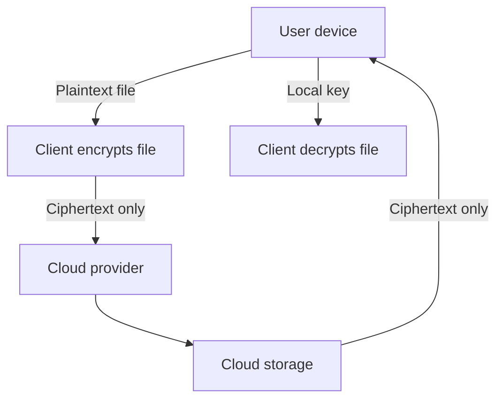

# 2. The real hard part is key management

The deck’s main thesis is that encryption primitives are not the hard part. Key management is the hard part.

A cloud storage user expects:

• access from many devices
• password reset
• file sharing
• device loss recovery
• simple onboarding
• no data loss
• protection from the provider

Those goals conflict.

The “mud puddle test” explains the conflict well. If a user loses their device and also forgets their password, can the provider recover the data? In true E2EE, the answer should be no. If the provider can recover the data without the user key, then the provider or an attacker with provider access has some path to plaintext. 

This creates the central tradeoff:

```text
recoverability increases provider trust
provider trust decreases strict E2EE
```

Recovery keys, social recovery, threshold recovery, secure hardware, and passkeys are all attempts to reduce this tension, but none remove it completely.

# 3. Passwords are weak roots of trust

Most E2EE storage systems bootstrap from passwords. That is dangerous because passwords are low entropy secrets. A cryptographic key might have 128 or 256 bits of entropy. A human password often has far less.

So systems use password hashing or password hardening:

| Function | Main idea                        | Security value                   |
| -------- | -------------------------------- | -------------------------------- |
| PBKDF2   | many iterations                  | slows guessing                   |
| scrypt   | memory cost                      | hurts GPU and ASIC attackers     |
| Argon2   | memory hard design               | modern preferred option          |
| HKDF     | key derivation from strong input | not suitable alone for passwords |

A key lesson from the MEGA case is that HKDF is not a password hashing function. HKDF assumes high entropy input key material. A password is not high entropy. If you feed a weak password into a fast KDF, you make offline dictionary attacks cheap. 

Correct password based design usually needs:

• salt or account binding
• memory hard password hashing
• rate limiting when possible
• no password equivalent stored on server
• protection against offline guessing after breach

# 4. Authentication versus encryption dilemma

A normal service stores a password hash and uses it for login. An E2EE service also needs to derive encryption keys without revealing them to the server.

That creates three common approaches:

| Approach                                        | Benefit                      | Problem                  |
| ----------------------------------------------- | ---------------------------- | ------------------------ |
| Separate login password and encryption password | clean separation             | terrible usability       |
| SRP                                             | password never sent directly | complex and older        |
| OPAQUE                                          | stronger modern design       | newer and less deployed  |
| Passkeys with PRF                               | strong device backed secret  | support is not universal |

The key engineering question is:

```text
Can the user authenticate without giving the server either the password or a password equivalent?
```

This is why the deck later focuses on SRP, OPAQUE, and WebAuthn PRF.

# 5. Passkeys and WebAuthn PRF

Passkeys replace passwords for authentication using public key cryptography. The private key stays on the device or platform keychain. The server stores only the public key. During login, the device signs a challenge.

The WebAuthn PRF extension can derive symmetric keys from passkeys. That is powerful for E2EE because it means the user can authenticate and derive encryption material without typing a password.

Conceptually:

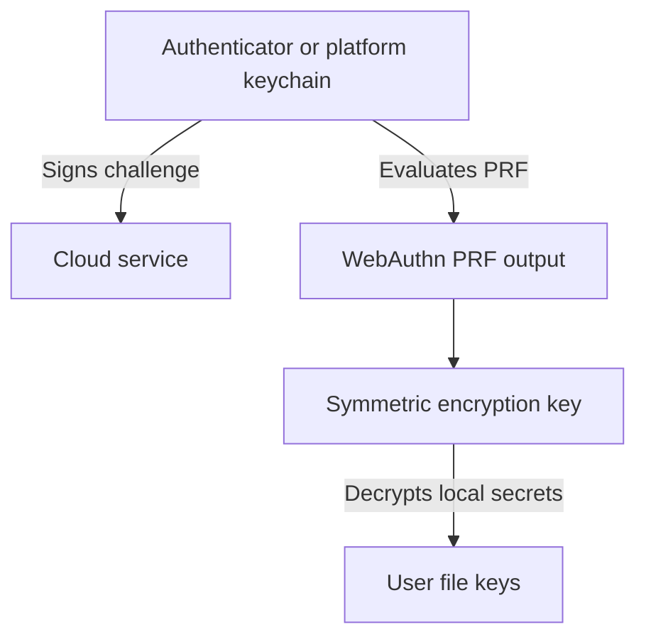

But the deck notes a practical limitation: PRF support is not universal, and some authenticators may not support PRF during credential creation. So this is promising, but not yet a universal solution. 

# 6. File sharing is where many designs break

E2EE storage is easy if there is only one user and one device. It becomes hard when sharing enters the model.

To share a file, the recipient needs the file decryption key. But the server must not learn it.

Common pattern:

```text
file key encrypts file
recipient public key encrypts file key
recipient decrypts file key locally
```

But this requires public key authenticity. If the server can replace a recipient public key, it can insert its own key and decrypt future shares. This is exactly the class of failure that appears in several cloud storage systems.

A secure sharing design must authenticate:

• who created the share
• which file key was shared
• which recipient identity was intended
• which file or folder the key belongs to
• whether the server replayed an old share

# 7. MEGA: what went wrong

MEGA used a complex key hierarchy. Password derived keys protected a random master key. The master key encrypted RSA, Curve25519, Ed25519, and node keys. The deck highlights a critical issue: many keys were encrypted using AES ECB without authentication. 

The key hierarchy looked conceptually like this:

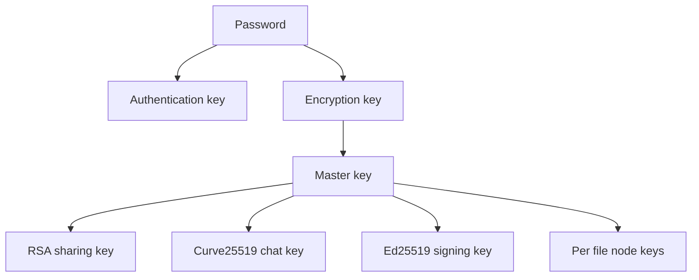

The failures were not just one bug. They were composition failures.

## MEGA mistake 1: HKDF from password

HKDF is fine when the input is already strong. It is not a password hashing function. Using it as the password root makes guessing faster than it should be.

## MEGA mistake 2: AES ECB without authentication

AES ECB encrypts blocks independently. It provides no integrity. An attacker who can modify ciphertext can cause controlled corruption. In MEGA’s case, corrupted encrypted private keys became cryptographic attack surfaces.

Correct primitive should have been AEAD such as AES GCM or ChaCha20 Poly1305, with associated data binding the encrypted object to its context.

## MEGA attack 1: RSA key recovery

The malicious server modifies the encrypted RSA private key. Since there is no integrity protection, the client decrypts the corrupted key and uses it. Due to RSA CRT behavior, the corrupted key leaks information through client behavior.

The server turns the client into an oracle. Each login reveals information about one RSA prime. The original attack required about 512 logins, later improved significantly.

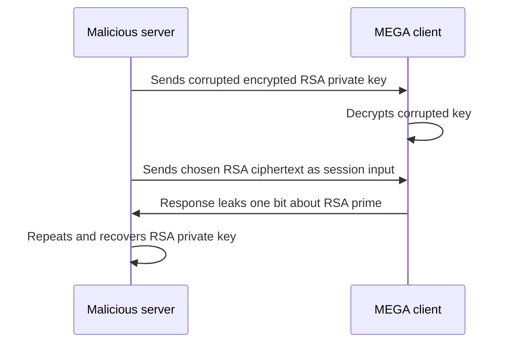

The deeper lesson: encryption without integrity lets attackers feed malicious cryptographic state into honest clients.

## MEGA attack 2: plaintext recovery

After recovering the RSA key, the attacker can construct an oracle that decrypts AES ECB ciphertexts under the master key. That exposes node keys, signing keys, and chat keys.

Impact:

• file confidentiality lost
• sharing confidentiality lost
• signing identity compromised
• chat key material compromised
• file forgery becomes possible

## MEGA root causes

| Root cause            | Why it matters                            |
| --------------------- | ----------------------------------------- |
| No AEAD               | ciphertext modification was not detected  |
| AES ECB               | block level manipulation and oracle abuse |
| Key reuse             | one compromise crossed security domains   |
| Legacy RSA padding    | Bleichenbacher style risks                |
| Complex custom design | hard to reason about globally             |

The lesson is not “MEGA made one implementation mistake.” The lesson is that custom cryptographic architecture without formal analysis tends to produce attack chains. 

# 8. Nextcloud: what went wrong

Nextcloud’s design used a 12 word mnemonic, a master key, an RSA key pair, metadata keys, and per file AES keys. Files used AES GCM, which is a modern AEAD. But the surrounding protocol still failed. 

The hierarchy:

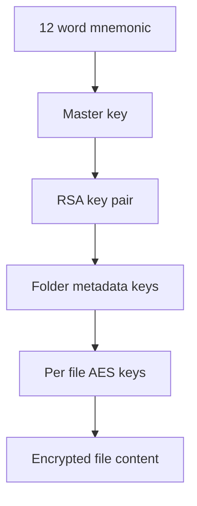

## Nextcloud mistake 1: RSA OAEP gives confidentiality, not sender authentication

RSA OAEP lets anyone encrypt to a public key. It does not prove who encrypted the message.

That means a malicious server can create a metadata key, encrypt it under the user public key, place it in the user folder, and trigger the client to use it.

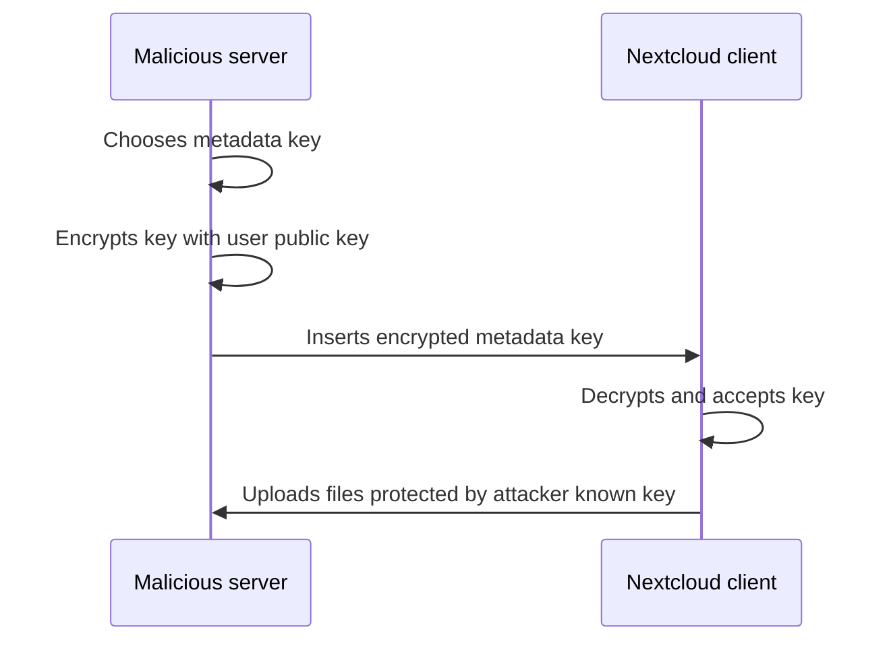

The bug is conceptual: public key encryption is not identity authentication.

Fixes require signatures, authenticated key exchange, signcryption, or a protocol where the recipient verifies the sender and context.

## Nextcloud mistake 2: Ghost Key

The server modifies a key index to point outside the valid metadata key array. The client mishandles the missing entry and uses an all zero key.

This is devastating because an all zero key is not secret. Files encrypted under that key are readable and forgeable.

This is an implementation bug, but cryptographic protocol design should anticipate hostile server controlled metadata.

## Nextcloud mistake 3: IV reuse in AES GCM

AES GCM requires unique IV values for each encryption under the same key. Reusing the IV with the same key is catastrophic.

For encryption, GCM uses counter mode internally. If the same key and IV are reused, the same keystream is reused.

```text
C1 = P1 xor KS
C2 = P2 xor KS
C1 xor C2 = P1 xor P2
```

If the attacker knows one plaintext version, they can recover the other. Worse, repeated IVs can also enable authentication tag forgery because GCM authentication algebra leaks information about the GHASH key.

So the rule is absolute:

```text
Never reuse an AES GCM IV with the same key
```

# 9. Ecosystem lesson

The deck also mentions broader 2024 analysis across multiple E2EE cloud providers. The same classes of mistakes keep appearing:

• unauthenticated key material
• unauthenticated encryption modes
• missing integrity checks
• weak KDF downgrade
• public key replacement
• unsafe link sharing
• chunk reorder or chunk deletion attacks

The important senior engineering lesson is that E2EE cloud storage is not a solved product category. Messaging systems received years of protocol research and review. Cloud storage protocols often evolved as custom product features first and cryptographic protocols second. 

# 10. Moving beyond passwords: SRP and OPAQUE

Password hashing alone has a structural problem. If the server stores a password hash, an attacker who steals the database can test password guesses offline.

SRP and OPAQUE try to avoid that.

## SRP

SRP is a password authenticated key exchange. The password is not transmitted, and the protocol gives mutual authentication plus a session key.

Its downside is complexity and older design constraints.

## OPAQUE

OPAQUE is a modern augmented password authenticated key exchange. It uses an OPRF, an authenticated key exchange, and an encrypted envelope. The server does not receive the password and should not receive a password equivalent during normal operation. 

Core idea:

```text
client knows password
server has OPRF key
client and server compute hardened password output
server does not learn password
client recovers encrypted private credential
client and server run authenticated key exchange
```

# 11. OPRF explained deeply

OPRF means Oblivious Pseudorandom Function.

The client has input `x`, usually derived from the password. The server has secret key `k`. The client wants `F(k, x)`, but the server must not learn `x`.

Simplified group based flow:

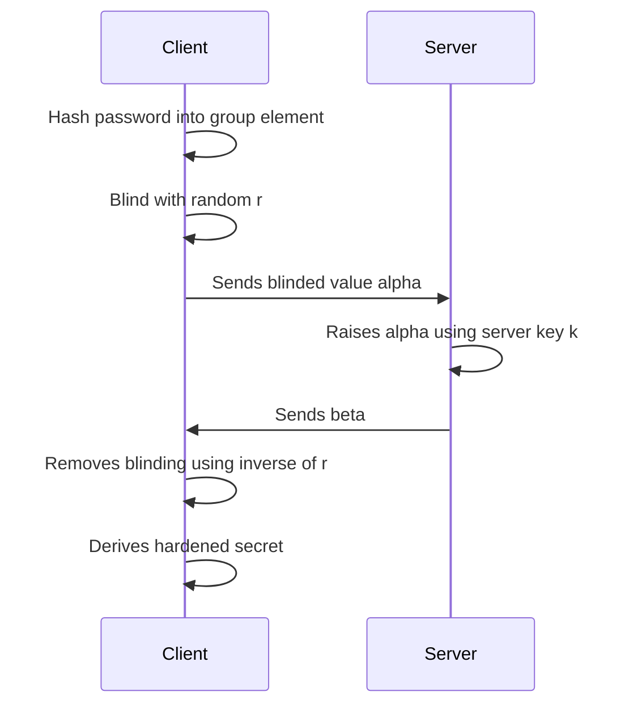

Why this helps:

• server sees only a randomized group element
• each login uses fresh randomness
• passive observers cannot test guesses offline
• the derived result is stable for the correct password
• wrong password fails envelope decryption

OPAQUE then uses that result to decrypt the client envelope and run authenticated key exchange. 

# 12. WhatsApp encrypted backups

WhatsApp messages were already E2EE, but backups to iCloud or Google Drive created a gap. If the backup is not E2EE, the cloud provider can expose message history.

WhatsApp’s backup design introduces a random 256 bit backup key `K`. The client encrypts the backup with `K`, uploads the encrypted backup to cloud storage, and stores recoverability material through WhatsApp infrastructure. 

The high level model:

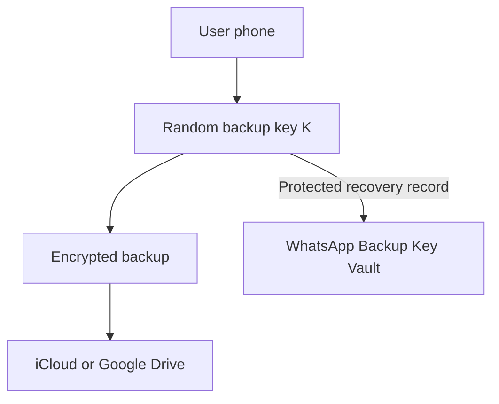

WhatsApp offers two recovery modes:

| Mode              | Meaning                      | Tradeoff                                     |
| ----------------- | ---------------------------- | -------------------------------------------- |
| Password recovery | OPAQUE plus HSM backed vault | usable, but trust in WhatsApp infrastructure |
| 64 digit key      | user stores key directly     | less provider trust, high user burden        |

# 13. WhatsApp HSM Backup Key Vault

The HSM is meant to enforce password attempt limits in hardware. This matters because a normal password encrypted backup key can be attacked offline. With HSM enforced rate limiting, each guess requires interaction with the HSM, and attempts can be capped.

Registration flow:

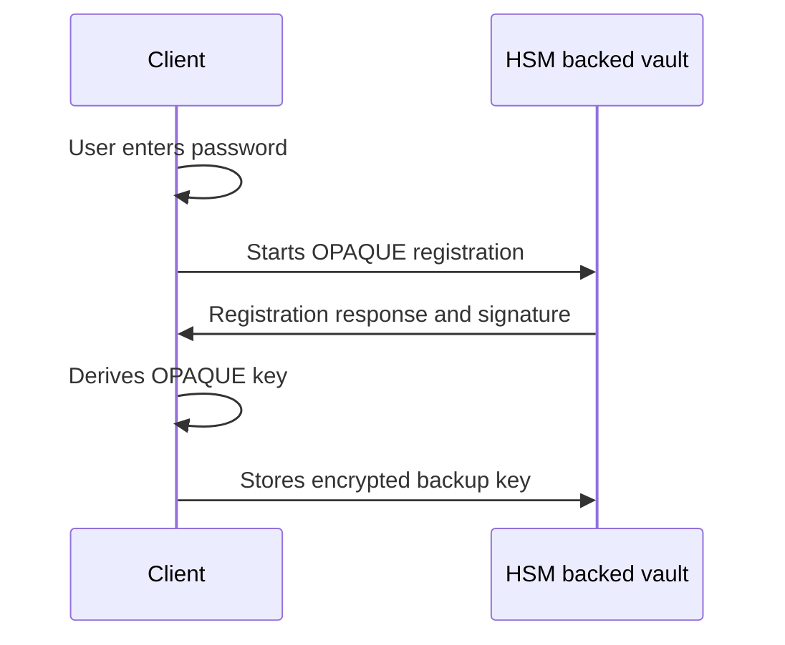

Retrieval flow:

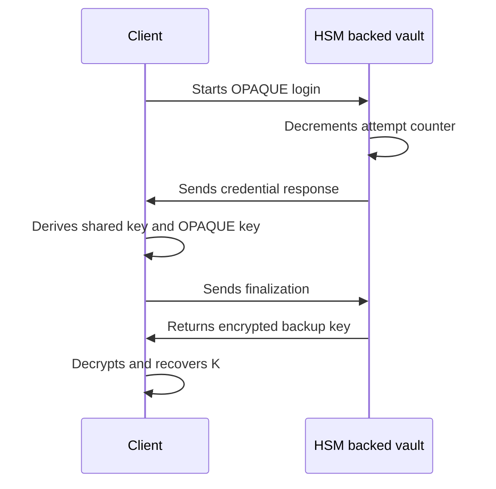

This is a much cleaner design than MEGA or Nextcloud because it uses OPAQUE and hardware rate limiting instead of inventing a custom password protocol. 

# 14. Critique of WhatsApp’s design

The deck also critiques WhatsApp. The critique is important.

## Ambiguous specification

The slides say the specification is ambiguous about `OPAQUEK`. It could mean the OPAQUE export key, which should be client only, or it could mean a shared session key known to both sides. If an implementation uses the shared session key to encrypt the backup key, the server can decrypt the backup key. That would break the security model.

Cryptographic specifications must be unambiguous. Variable names like `OPAQUEK` are not enough. A secure spec must define exactly:

• which OPAQUE output is used
• who knows it
• what label derives it
• what context binds it
• what it encrypts
• what security property relies on it

## Trust in HSM infrastructure

Users cannot directly verify that WhatsApp actually uses HSMs as claimed, that rate limits are enforced, or that selected accounts are not handled differently. The deck calls this an attestation problem. Without remote attestation, public audit logs, or third party verification, users must trust the operator. 

So WhatsApp backups protect strongly against cloud providers, and likely improve security against external attackers, but they do not provide fully verifiable protection against WhatsApp itself.

# 15. Formal protocol design lessons

The final section moves from case studies to a cleaner design based on formal treatment of E2EE cloud storage. The primitives are standard:

• PRF for deterministic key derivation
• MAC for integrity and authentication checks
• AEAD for encrypting files and keys
• 2HashDH OPRF for password hardening
• random master key for data encryption hierarchy

The design goal is simplicity:

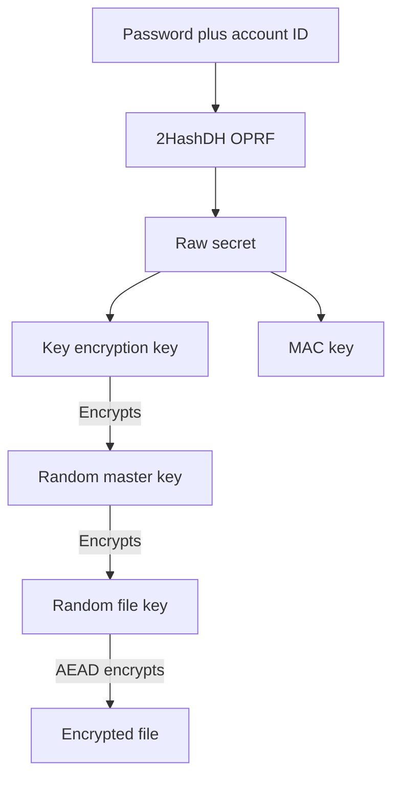

The separation is clean:

| Key                | Purpose                        |
| ------------------ | ------------------------------ |
| Password           | human root secret              |
| OPRF output        | hardened password secret       |
| Key encryption key | decrypts master key            |
| MAC key            | authenticates login transcript |
| Master key         | wraps file keys                |
| File key           | encrypts file content          |

This separation prevents one key from being used in many unrelated contexts, which was one of MEGA’s problems. 

# 16. Registration and authentication in the formal design

Registration:

• client has account ID and password
• client computes OPRF based raw secret
• client derives key encryption key and MAC key
• client generates random master key
• client encrypts master key with key encryption key
• server stores account record and encrypted master key

Authentication:

• client runs OPRF with server
• client derives key encryption key and MAC key
• client authenticates transcript with MAC
• server verifies MAC
• server returns encrypted master key
• client decrypts master key

This gives password based access without sending the password to the server. The deck presents this as a simpler and formally analyzed alternative to custom provider designs. 

Important engineering note: the exact breach model matters. If a design stores enough material for a stolen server database to test password guesses, then it does not resist offline cracking under database compromise. A formal proof is only meaningful relative to its exact adversary model and stored values.

# 17. File operations in the clean design

Upload:

• generate a random file key
• AEAD encrypt the file using the file key
• AEAD encrypt the file key using the master key
• store encrypted file content
• store encrypted header containing the file key

Download:

• fetch encrypted header
• decrypt file key with master key
• fetch encrypted file content
• decrypt file with file key
• bind file ID and metadata as AEAD associated data

The use of AEAD is central. It gives confidentiality and integrity together. If the server changes ciphertext, header, file ID, or associated metadata, decryption fails.

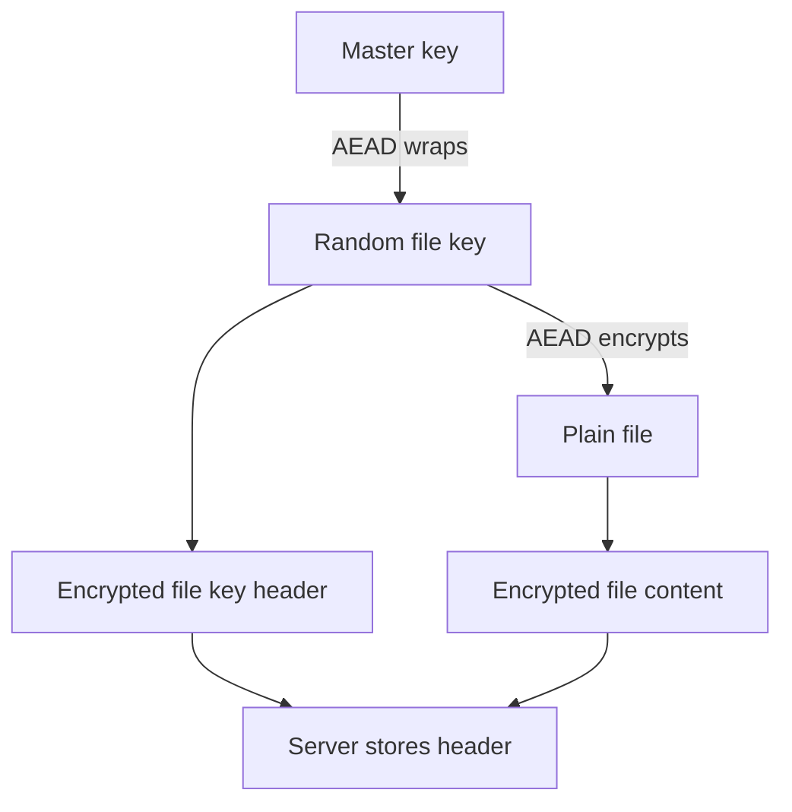

# 18. Sharing in the clean design

The elegant idea is that the encrypted file content is shared, but every authorized user has their own header.

Same encrypted file content:

```text
Encrypted file content encrypted under file key kf
```

Different user headers:

```text
Header for user 1: file key wrapped by user 1 master key
Header for user 2: file key wrapped by user 2 master key
Header for user 3: file key wrapped by user 3 master key
```

Diagram:

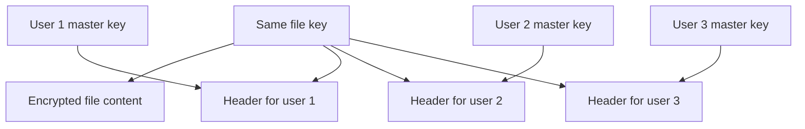

Benefits:

• no need to encrypt large file content again
• each user can rotate password independently
• sharing only changes headers
• file updates remain efficient
• key ownership is cleaner

This directly addresses the complexity that hurt MEGA and Nextcloud. 

# 19. The main security lessons

The deck’s final message is simple but important.

| Lesson                                | Engineering interpretation                                   |
| ------------------------------------- | ------------------------------------------------------------ |
| Encryption is not enough              | You need integrity and authentication                        |
| Public key encryption is not identity | Anyone can encrypt to a public key                           |
| AEAD should be default                | Avoid separate unauthenticated encryption                    |
| Never reuse GCM IVs                   | One repeated IV can destroy confidentiality and authenticity |
| Do not use HKDF as password hashing   | Use Argon2, scrypt, PBKDF2, or OPAQUE style hardening        |
| Avoid custom protocols                | Composition errors dominate                                  |
| Specify threat model                  | Claims without adversary model are marketing                 |
| Formal analysis matters               | It catches protocol level flaws early                        |
| Verifiability matters                 | HSM claims without attestation require trust                 |

# 20. My senior engineering summary

The deck is really about a pattern:

```text
E2EE cloud storage fails when teams confuse encryption with complete security.
```

MEGA encrypted many things, but without authentication and with dangerous composition. Nextcloud used better primitives in places, but missed sender authentication and made implementation errors around key indexes and IV reuse. WhatsApp used stronger modern ideas like OPAQUE and HSM rate limiting, but still has trust and specification clarity issues. The formal design tries to solve this by using small, standard, analyzable building blocks and a clean key hierarchy.

The architectural rule I would enforce in a real system is:

```text
Every encrypted object must be authenticated.
Every key must have one purpose.
Every server supplied value must be treated as malicious.
Every public key must be authenticated.
Every password protocol must define its breach model.
Every security claim must map to a formal adversary.
```

Below is a cryptography focused reading guide for the full pack. I focus on the core idea, the construction, the trust model, and the security lesson.

## Big picture

These readings are all about one central problem: how to store or recover user data in the cloud while preventing the cloud provider from reading or silently modifying it. The hard part is not just encrypting files. The hard part is authenticating keys, binding metadata to ciphertext, handling sharing, supporting multiple devices, enabling recovery, and surviving a malicious server.

## Required readings

## 1. Nextcloud, Nextcloud End to End Encryption Design, 2017

**Core idea:** Nextcloud tried to add encrypted cloud storage while keeping normal cloud features such as sync, sharing, multiple devices, enterprise recovery, and auditability. The design uses client generated keys, encrypted folder metadata, per file encryption keys, and server assisted key distribution. The server is supposed to store ciphertext and key envelopes, not plaintext data or plaintext keys.

The official RFC says the design goals include sharing encrypted folders, optional central recovery, simple multiple device management, authenticated key exchange, hardware security module support, and protocol versioning. It also explicitly accepts the loss of several server features such as server search, previews, versioning, group sharing, and file level sharing inside encrypted folders because the server cannot read data. ([GitHub][1])

Cryptographically, the model is a hierarchy. A user has an asymmetric identity key, folder metadata is encrypted under a folder metadata key, and individual files are encrypted under fresh file keys. The metadata key is wrapped for authorized users using RSA OAEP. The RFC says the first device generates an X.509 certificate request and private key, stores the private key locally, and also stores an encrypted copy on the server using a twelve word mnemonic processed through PBKDF2 with HMAC SHA256 and AES GCM. ([GitHub][1])

The threat model is ambitious: the attacker may bypass transport encryption and may have full control over the server, but the design still assumes that the first key exchange and initial connection to a share are not tampered with under a trust on first use model. That assumption is extremely important. It means the system is not fully secure against a malicious server during first contact unless users verify keys out of band. ([GitHub][1])

**Security lesson:** file encryption alone is not enough. The design must authenticate who introduced each key, whether metadata was rolled back, whether a removed user can still decrypt future content, and whether the server can create malicious metadata that honest clients will accept.

## 2. WhatsApp, Security of End to End Encrypted Backups, 2021

**Core idea:** WhatsApp wanted encrypted cloud backups without forcing every user to memorize a high entropy key. The design encrypts the backup locally with a random key, then gives the user two choices: manually store a 64 digit key, or protect the backup key with a password using a hardware security module based Backup Key Vault.

The paper says the client generates a 256 bit random backup key K, uses it to encrypt chat history and media before cloud upload, and never sends K outside the client in plaintext. If the user chooses password based recovery, the backup key is stored in encrypted form in the HSM Backup Key Vault. The vault enforces password attempt limits and can render the key permanently inaccessible after too many failed attempts. ([WhatsApp.com][2])

The elegant cryptographic component is OPAQUE, an augmented password authenticated key exchange. OPAQUE lets the client prove knowledge of the password and recover a derived secret without revealing the password to the vault. During registration, the client uses OPAQUE to obtain a symmetric key and encrypts K with AES GCM 128. During recovery, the client performs OPAQUE login, unwraps the encrypted backup key, and then decrypts the backup. ([WhatsApp.com][2])

The architecture separates storage from key recovery. The encrypted backup may sit in iCloud or Google Drive, but Apple and Google do not get K. WhatsApp infrastructure routes client traffic, while the HSM fleet stores password protected key material and enforces online guessing limits. The system is geographically replicated for availability. ([Engineering at Meta][3])

**Security lesson:** this is not pure end user key custody. It is a usability and security compromise. The manually stored 64 digit key gives stronger provider independence. The password mode depends on HSM correctness, rate limiting, fleet integrity, and client validation of the vault keys.

## Optional readings

## 3. Apple Platform Security, iCloud data security overview, 2025

**Core idea:** Apple uses two iCloud protection modes. Standard Data Protection encrypts data in transit and at rest, but Apple stores many key classes in its data centers for recovery. Advanced Data Protection moves the majority of iCloud key custody to trusted user devices, expanding end to end protection to more data categories.

Apple says Standard Data Protection is the default and stores encryption keys in Apple data centers so Apple can help with recovery. Advanced Data Protection is optional and lets trusted devices retain sole access to the encryption keys for most iCloud data, including iCloud Backup, Photos, Notes, and iCloud Drive. ([Apple Support][4])

The most important tradeoff is recovery. With Advanced Data Protection enabled, Apple says it cannot help recover encrypted data if the user loses access, so users must set up a recovery contact or recovery key. Apple also states that turning Advanced Data Protection off securely uploads required keys back to Apple servers and returns the account to standard protection. ([Apple Support][4])

Some categories remain outside full end to end protection because they must interoperate with global protocols. Apple notes that iCloud Mail does not use end to end encryption because of email interoperability, and Contacts and Calendars use CalDAV and CardDAV, which lack built in end to end protection. ([Apple Support][4])

**Security lesson:** iCloud security is not one uniform thing. You must reason per data category, per recovery mode, and per key custody model.

## 4. Adam Langley, A Tour of WebAuthn, 2024

**Core idea:** WebAuthn replaces shared password authentication with public key signatures. During registration, the authenticator generates a private key and gives the server a public key. During login, the server sends a fresh challenge, and the authenticator signs a message bound to the relying party and browser origin.

Langley frames WebAuthn around public key signature schemes: key generation creates a public key and private key, signing uses the private key, and verification uses the public key. Security requires that the private key cannot be derived from the public key and that signatures cannot be produced without the private key. ([Imperial Violet][5])

The signed login message contains a challenge and origin. The challenge prevents replay. The origin binds the signature to the real site, so a phishing site cannot simply proxy the signature as valid for another origin. The server must verify the signature, expected challenge, expected origin, expected relying party identifier, and authenticator flags. ([Imperial Violet][5])

The relying party identifier is subtle. It is usually a domain name, and credentials are scoped to it. Langley emphasizes that choosing the wrong relying party identifier early can make later account architecture painful, because credentials created for one identifier may not work from another origin. ([Imperial Violet][5])

**Security lesson:** WebAuthn is not just public key crypto. Its security comes from correct binding between challenge, origin, relying party identifier, user presence, user verification, and authenticator state.

## 5. MEGA, MEGA Security White Paper, 2022

**Core idea:** MEGA is a cloud storage system built around user controlled encryption. A password derived key decrypts a user master key. The master key protects private keys and file keys. Files are encrypted on the client, and sharing is done by wrapping folder share keys or file keys for recipients.

The white paper says registration derives a key from the password using PBKDF2 HMAC SHA512. The derived encryption key encrypts the master key using AES ECB. After first login, the client generates RSA 2048 keys for sharing, Ed25519 keys as a signing trust root, and Curve25519 keys for chat. Private keys are encrypted by the master key and stored by the API. 

For file upload encryption, each file or folder node has its own key. Files use a 128 bit file key and a 64 bit nonce, file chunks are encrypted using AES CCM, and the obfuscated file key is encrypted with the master key using AES ECB before upload to the API. 

For sharing, MEGA creates a 128 bit share key for a folder. File keys in that folder are encrypted with the share key using AES CBC, and the share key is encrypted for the recipient using the recipient RSA public key. Contact keys rely on an Ed25519 public key fingerprint model, with stronger assurance if users manually verify fingerprints. 

**Security lesson:** MEGA shows why key hierarchy design is dangerous when key separation and authenticated encryption are incomplete. AES ECB used as a wrapping primitive, mixed key roles, and weak integrity around key material created the basis for later academic attacks.

## 6. Backendal, Davis, Günther, Haller, Paterson, A Formal Treatment of End to End Encrypted Cloud Storage, 2024

**Core idea:** This paper gives a formal model for encrypted cloud storage. Messaging already has strong formal models, but cloud storage has extra complexity: files, folders, sharing, revocation, metadata, multiple devices, uploads, downloads, and malicious server behavior.

The paper defines syntax for cloud storage protocols and game based confidentiality and integrity notions against a fully malicious server. It also considers selective and fully adaptive client compromise, and shows that the model can express core MEGA functionality and the ways known MEGA attacks violate security. ([IACR Eprint Archive][6])

The paper also proposes an efficient cloud storage construction that provides core functionality and is provably secure under the authors’ selective security notions. This is important because it moves the field from “this design looks plausible” to “this design satisfies an explicit adversarial game.” ([IACR Eprint Archive][6])

**Security lesson:** E2EE cloud storage needs its own formal security definitions. You cannot directly reuse secure messaging intuition, because cloud storage has mutable shared state, metadata, revocation, and server mediated synchronization.

## 7. Hofmann and Truong, End to End Encrypted Cloud Storage in the Wild: A Broken Ecosystem, ACM CCS 2024

**Core idea:** This paper evaluates deployed encrypted cloud storage products under the malicious server model and finds that many fail. The key point is ecosystem level: independent providers often repeat similar mistakes.

The authors analyzed Sync, pCloud, Icedrive, Seafile, and Tresorit, covering providers with more than 22 million users. They report severe cryptographic vulnerabilities in four of the five systems. Attacks include malicious server file injection, file tampering, and in some cases direct access to file contents. ([IACR Eprint Archive][7])

The broader lesson is that marketing claims such as “zero knowledge” or “end to end encrypted” are not precise security definitions. A provider may encrypt file contents but still let a malicious server replace keys, tamper with metadata, exploit unauthenticated sharing state, or trigger dangerous client behavior.

**Security lesson:** deployed encrypted storage repeatedly fails at metadata integrity, key authenticity, and malicious server resilience. The ecosystem needs formal models, audits, and conservative primitives.

## 8. Connell, Fang, Schmidt, Dauterman, Popa, Secret Key Recovery in a Global Scale End to End Encryption System, USENIX OSDI 2024

**Core idea:** This paper is about recovering secret keys at massive scale without letting the provider learn them. The system, Secure Value Recovery 3, distributes trust across heterogeneous secure hardware enclaves operated by different cloud providers.

The paper states the core usability problem clearly: if encrypted messaging protects message history with user held keys, users who lose devices also lose history. SVR3 lets users back up decryption keys while preventing the messaging provider from accessing them. It splits trust across different enclave types and different cloud providers, avoiding dependence on one enclave technology or one operator. ([USENIX][8])

SVR3 also addresses rollback protection and fault tolerance. The paper reports deployment to millions of users, capacity above 500 million users, recovery latency of 365 ms, and cost of 0.0025 dollars per user per year. ([USENIX][8])

**Security lesson:** recovery is one of the hardest E2EE problems. A good recovery system must resist offline password guessing, malicious provider access, rollback, enclave compromise, and large scale availability failures.

## 9. Backendal, Haller, Paterson, MEGA: Malleable Encryption Goes Awry, IEEE Security and Privacy 2023

**Core idea:** This paper breaks MEGA’s security claims in the malicious server model. It shows that a malicious MEGA server can exploit malleability, poor key separation, and insufficient integrity protection to compromise user files.

The authors present five attacks that together allow full compromise of user file confidentiality. They also show integrity compromise: an attacker can insert malicious files that pass client authenticity checks. Four of the five attacks are described as practical, and proof of concept versions were built. ([IACR Eprint Archive][9])

The root problem is architectural. MEGA’s design uses a long lived master key for multiple roles and stores sensitive key material in forms that can be manipulated by the server. When a server can alter encrypted key material and observe client behavior, malleability becomes a decryption and key recovery tool.

**Security lesson:** authenticated encryption and key separation are not optional. If the server can alter encrypted private keys, file keys, or sharing keys, then clients become decryption oracles.

## 10. Albrecht, Haller, Mareková, Paterson, Caveat Implementor! Key Recovery Attacks on MEGA, Eurocrypt 2023

**Core idea:** This paper shows that MEGA’s attempted patching after the first MEGA attacks was insufficient. The new sanity checks created new exploitable behavior, allowing recovery of a target user RSA private key.

The paper says MEGA added lightweight sanity checks on user RSA private keys after the earlier attacks. The authors then show that these checks can themselves be exploited. They identify an AES ECB encryption oracle under the user master key, which lets an adversary partially overwrite RSA private key material and recover the full key with lattice techniques after recovering selected blocks. ([IACR Eprint Archive][10])

The attacks exploit error behavior during MEGA authentication, including modular inversion handling and a small subgroup style attack. The authors also improve the earlier unpatched MEGA RSA key recovery attack from 512 logins to only 2 logins. ([IACR Eprint Archive][10])

**Security lesson:** patching cryptographic protocols locally is dangerous. Adding sanity checks without a complete redesign can increase attack surface. The correct fix is usually authenticated key storage, domain separated keys, and a proof informed protocol redesign.

## 11. Albrecht, Backendal, Coppola, Paterson, Share with Care: Breaking E2EE in Nextcloud, IEEE Euro S and P 2024

**Core idea:** This paper analyzes Nextcloud’s E2EE implementation in the malicious server model and finds three practical attacks that break both confidentiality and integrity.

The authors say they provide the first detailed documentation and security analysis of Nextcloud’s E2EE feature. They present three distinct attacks, each enabling compromise of confidentiality and integrity for all user files, and they built proof of concept implementations. They report that two vulnerabilities were remediated and the first was addressed by temporarily removing file sharing from the E2EE feature pending redesign. 

The first attack is key insertion. It exploits a misunderstanding: public key encryption provides confidentiality, not data origin authenticity. A malicious server can create an RSA OAEP ciphertext containing a metadata key it chose, trick the client into accepting it during key rotation, then decrypt future file keys and modify files. 

The second attack is the ghost key attack. A malicious server crafts metadata so the client accesses an uninitialized metadata key map entry, causing an all zero key to be used for file key encryption. This destroys both confidentiality and integrity. 

The third attack is IV reuse in AES GCM. If a modified file is encrypted with a reused IV, comparing old and new ciphertexts can reveal plaintext structure, and AES GCM integrity can also fail because the authentication key can be recovered from two ciphertexts under the same IV. Nextcloud patched this by generating a fresh random IV and a new file key for each encryption. 

**Security lesson:** a malicious server model requires strict client side validation of all server supplied metadata. Also, every AEAD encryption must use a fresh nonce under a given key, and encrypted key material must be authenticated to its origin and context.

## 12. Russinovich et al, Toward Confidential Cloud Computing, Communications of the ACM, 2021

**Core idea:** Confidential computing protects data while it is being processed, not only while stored or transmitted. It uses trusted execution environments, attestation, and hardware isolation so tenants can define which code and hardware may access their secrets.

The paper starts from the observation that cloud providers commonly encrypt data in transit and at rest, but data is exposed during computation. Confidential computing extends hardware enforced cryptographic protection to data in use and reduces trust in the cloud fabric, hypervisor, operators, and infrastructure. 

The authors define the goal as tenant control over the trusted computing base. Tenants should be able to specify the hardware and software allowed to access workloads and verify enforcement through technical mechanisms. The paper discusses confidential virtual machines, confidential containers, and enclaves as different abstractions with different trusted computing base sizes and usability tradeoffs. 

**Security lesson:** confidential computing is complementary to E2EE. E2EE avoids server plaintext access where computation is unnecessary. Confidential computing is useful when server side computation is necessary but the tenant wants cryptographic and hardware backed limits on who can inspect data during execution.

## Cross reading synthesis

The main failure pattern across Nextcloud, MEGA, Sync, pCloud, Icedrive, Seafile, and similar systems is not weak AES. It is protocol composition. Systems fail because the server can influence key selection, metadata, sharing state, rollback state, or client parsing.

A strong E2EE cloud storage design should satisfy these principles:

1. Every key has one role only.

2. Every encrypted object is authenticated with its type, owner, path or file identifier, version, and intended context.

3. Public key encryption must not be treated as authenticity.

4. Metadata needs the same integrity attention as file contents.

5. Nonces for AEAD must never repeat under the same key.

6. Recovery must be explicit about whether users, providers, hardware, or social recovery contacts hold the real trust.

7. A malicious server must be treated as an active protocol participant, not just a passive storage backend.

[1]: https://github.com/nextcloud/end_to_end_encryption_rfc/blob/master/RFC.md "end_to_end_encryption_rfc/RFC.md at master · nextcloud/end_to_end_encryption_rfc · GitHub"
[2]: https://www.whatsapp.com/security/WhatsApp_Security_Encrypted_Backups_Whitepaper.pdf "Whitepaper with Style"
[3]: https://engineering.fb.com/2021/09/10/security/whatsapp-e2ee-backups/ "How WhatsApp is enabling end-to-end encrypted backups"
[4]: https://support.apple.com/en-us/102651 "iCloud data security overview - Apple Support"
[5]: https://www.imperialviolet.org/tourofwebauthn/tourofwebauthn.html "A Tour of WebAuthn"
[6]: https://eprint.iacr.org/2024/989 "A Formal Treatment of End-to-End Encrypted Cloud Storage"
[7]: https://eprint.iacr.org/2024/1616 "End-to-End Encrypted Cloud Storage in the Wild: A Broken Ecosystem"
[8]: https://www.usenix.org/conference/osdi24/presentation/connell "Secret Key Recovery in a Global-Scale End-to-End Encryption System | USENIX"
[9]: https://eprint.iacr.org/2022/959 "MEGA: Malleable Encryption Goes Awry"
[10]: https://eprint.iacr.org/2023/329 "Caveat Implementor! Key Recovery Attacks on MEGA"
