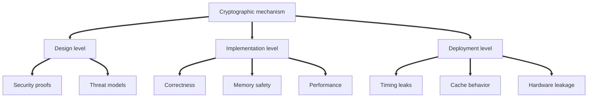
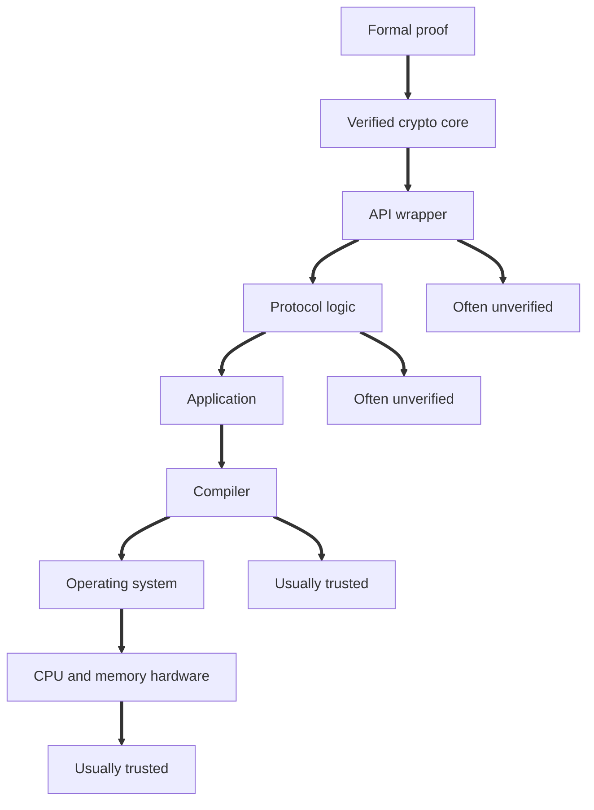
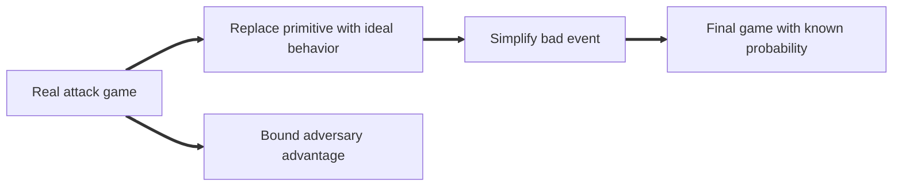
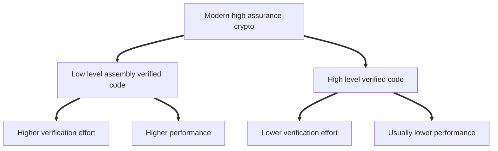
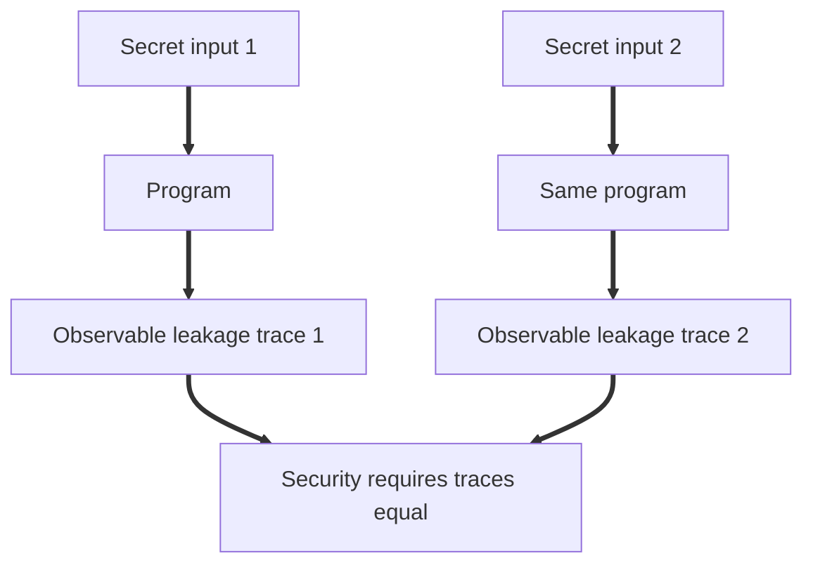
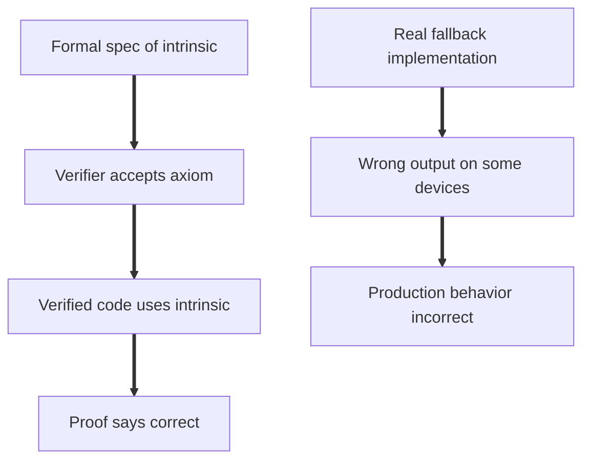
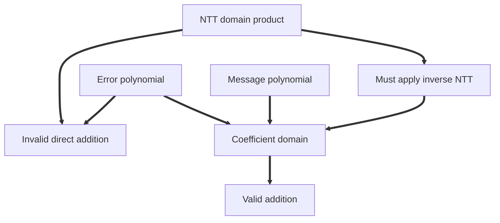
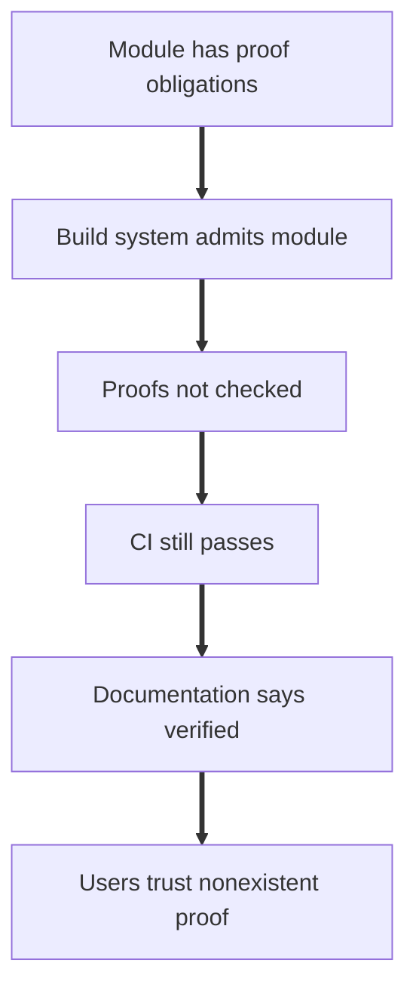
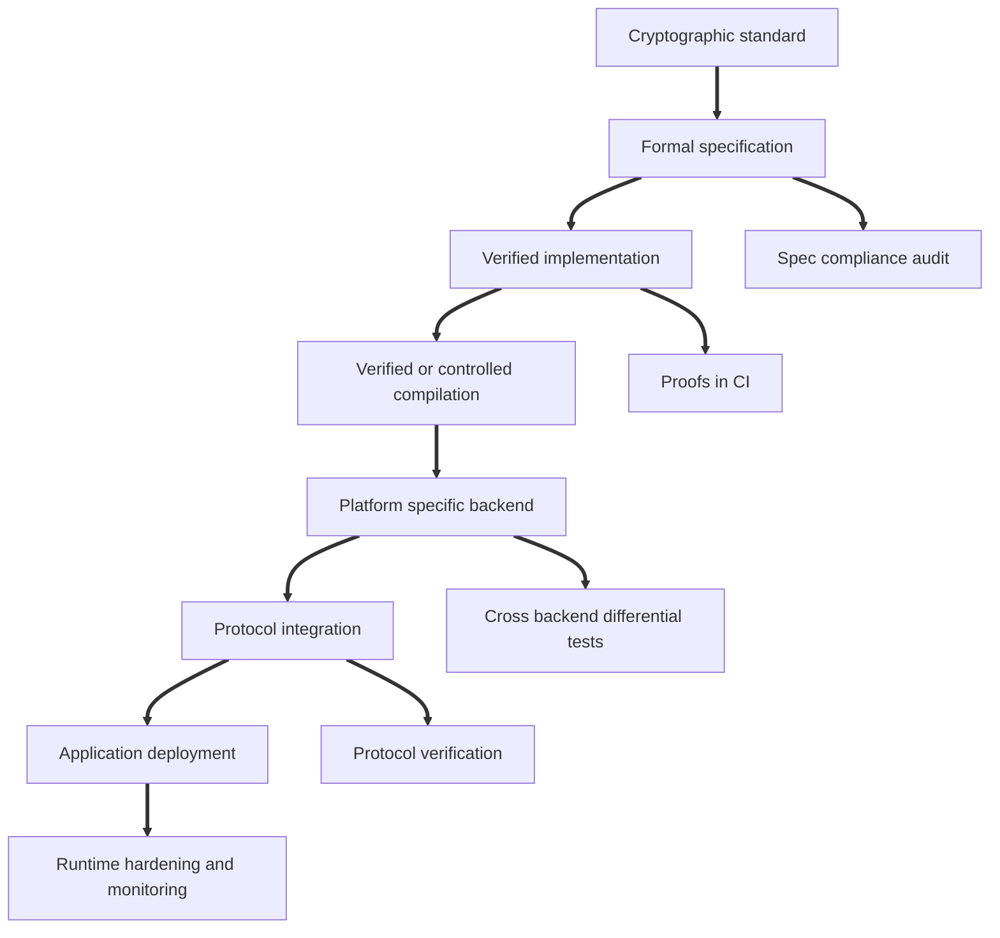

# Topic 2.5: High-Assurance Cryptography

## Assessment Window
- Final track

## Overview
Formal methods for crypto design/implementation, constant-time concerns, and verification-boundary failures.

## Required Readings
- Manuel Barbosa et al., SoK: Computer-Aided Cryptography, IEEE S&P, 2021.
- Nadim Kobeissi, Verification Theatre: False Assurance in Formally Verified Cryptographic Libraries, IACR ePrint, 2026.

## Optional Readings
- Add optional reading links here.

## Materials
- [ ] Slides
- [ ] Quiz


Below is the detailed senior cryptography engineering explanation of the uploaded deck, **Applied Cryptography 2.5: High Assurance Cryptography**. I will treat this as a design review of the whole topic: what high assurance means, what computer aided cryptography gives us, where it succeeds, where it fails, and why “formally verified” can still be misleading. 

# 1. What this deck is really about

This deck has two major parts.

First, it explains the promise of **computer aided cryptography**, meaning machine checked methods for proving cryptographic designs, implementations, and side channel resistance.

Second, it critiques overconfident claims around formal verification. The deck introduces the idea of **verification theatre**, where a library has some formal proofs but communicates them as if the whole system is comprehensively verified.

The core message is:

```text
Formal verification is powerful.
Formal verification is not magic.
The guarantee only applies inside the verified boundary.
```

A cryptographic system can fail at three levels:

| Level                | What can go wrong                                     |
| -------------------- | ----------------------------------------------------- |
| Design level         | the protocol is mathematically flawed                 |
| Implementation level | the code does not implement the design correctly      |
| Deployment level     | timing, cache, hardware, or integration leaks secrets |

The deck argues that high assurance cryptography must cover all three, or at least document exactly which parts are not covered.

# 2. Why implementing cryptography is hard

Cryptographic software is unusually difficult because the adversary is not just a normal bug finder. The adversary actively searches for every mismatch between the proof, the code, the compiler, the operating system, the hardware, and the deployment environment.

A cryptographic design can be mathematically sound and still fail because:

1. The proof models only an idealized core.
2. The implementation has a memory safety bug.
3. An optimized assembly routine computes the wrong result.
4. A compiler optimization reintroduces a secret dependent branch.
5. The hardware leaks through cache or speculative execution.
6. Glue code around the verified primitive forgets a required check.
7. The formal specification itself is wrong.

This is why the deck starts with three layers:



The important engineering point is that attackers can combine failures. For example, a protocol design bug plus a parsing bug plus a timing leak can become a full key recovery attack.

# 3. Enter computer aided cryptography

Computer aided cryptography, usually abbreviated as CAC, uses formal tools to help design, analyze, verify, and implement cryptographic systems.

It can help at multiple layers:

| Layer               | Example guarantee                                 |
| ------------------- | ------------------------------------------------- |
| Design              | protocol secrecy, authentication, key agreement   |
| Implementation      | functional correctness, memory safety             |
| Side channel        | constant time behavior or secret independence     |
| Systems integration | verified protocol state machines or record layers |

The deck gives several real success stories:

| Project           | Impact                                       |
| ----------------- | -------------------------------------------- |
| TLS 1.3 analyses  | influenced the standardization process       |
| HACL star         | used in Mozilla Firefox NSS                  |
| Fiat Cryptography | used in Google BoringSSL elliptic curve code |
| EverCrypt         | used in Linux kernel Zinc crypto library     |

The key lesson is that verified cryptographic code is no longer only academic. It is deployed at internet scale.

# 4. The missing problem: real software complexity

Pen and paper cryptographic proofs usually reason about a small idealized core. Real software is not a small core.

A real deployment includes:

1. Protocol parser
2. Serialization and deserialization
3. State machine logic
4. Platform specific CPU intrinsics
5. Compiler transformations
6. Operating system behavior
7. Hardware behavior
8. API wrappers
9. Error handling
10. Build system choices

A proof about a cryptographic primitive does not automatically cover any of those.



This is the recurring theme of the deck: the formal guarantee ends somewhere. That place is the verification boundary.

# 5. Design level security

Design level security means proving that a protocol has the intended cryptographic properties under a defined adversary model.

There are two major approaches:

| Approach               | Mental model                                             |
| ---------------------- | -------------------------------------------------------- |
| Symbolic security      | cryptography is ideal black box operations               |
| Computational security | cryptography is probabilistic algorithms over bitstrings |

## Symbolic security

Symbolic models treat messages as abstract terms.

For example, symmetric encryption might be modeled as:

```text
Dec Enc m k k = m
```

Meaning: if you decrypt an encryption of message `m` under key `k` using the same key `k`, you get `m`.

The adversary can manipulate terms but cannot break cryptography unless the model gives them the required key.

This is useful because symbolic tools can often analyze many protocol sessions automatically.

Symbolic security is good at finding:

1. Missing authentication
2. Replay attacks
3. Unknown key share attacks
4. Bad key confirmation logic
5. Bad state machine transitions
6. Protocol confusion bugs

## Computational security

Computational models treat everything as bitstrings and probabilistic algorithms. The adversary is an efficient algorithm. Security is not absolute. It is bounded by probability.

A typical statement looks like:

```text
For every efficient adversary A,
the probability that A wins the security game is negligible.
```

This model is closer to cryptographic reality. It accounts for concrete assumptions such as pseudorandomness, collision resistance, decisional Diffie Hellman, lattice hardness, or AEAD security.

# 6. Symbolic versus computational security

The deck compares them directly.

| Aspect     | Symbolic                      | Computational                          |
| ---------- | ----------------------------- | -------------------------------------- |
| Messages   | abstract terms                | bitstrings                             |
| Adversary  | rule based                    | probabilistic algorithm                |
| Security   | cannot break inside the model | hard to break with bounded probability |
| Automation | often high                    | usually harder                         |
| Guarantees | good for protocol logic       | good for cryptographic assumptions     |

These are complementary.

A senior protocol engineering workflow should often use both:

1. Use symbolic analysis early to find design flaws.
2. Use computational proofs for final cryptographic claims.
3. Use implementation verification for code correctness.
4. Use constant time analysis for leakage resistance.
5. Use fuzzing and testing for integration bugs.

# 7. Symbolic properties: trace and equivalence

The deck separates symbolic properties into two categories.

## Trace properties

A trace property says that a bad event never happens in any execution.

Example:

```text
The adversary never learns the session key.
```

Or:

```text
A server never accepts unless a matching client session exists.
```

Trace properties are good for secrecy and authentication.

## Equivalence properties

An equivalence property says that the adversary cannot distinguish between two worlds.

Example:

```text
The adversary cannot tell whether the encrypted value is the real secret or a random value.
```

Equivalence is important for privacy properties, anonymity, unlinkability, ballot secrecy, and deniability.

Trace properties cannot naturally express all equivalence properties.

# 8. Computational security properties

The deck describes two axes:

| Axis           | Values                         |
| -------------- | ------------------------------ |
| Proof style    | game based or simulation based |
| Quantification | concrete or asymptotic         |

Most CAC tools focus on game based concrete security.

## Game based security

A game is a probabilistic experiment between a challenger and an adversary.

The proof usually uses game hopping:



Each transition must be justified. For example:

```text
If the adversary distinguishes Game 0 from Game 1,
then we can build an adversary against AES GCM security.
```

This is the backbone of modern provable cryptography.

# 9. ProVerif and Tamarin

The deck gives examples of symbolic tools.

## ProVerif

ProVerif is strong for automated symbolic protocol analysis. It can analyze unbounded sessions. It has been used for TLS, Signal, and the Noise Protocol Framework.

Its strength is automation. Its limitation is that some properties or equational theories can become hard or imprecise.

## Tamarin

Tamarin is more expressive and can model complex stateful protocols. It is often used for massive protocols like 5G authentication or TLS 1.3.

Its strength is expressivity. Its limitation is that proofs can become interactive and resource intensive.

Engineering interpretation:

| Tool        | Best suited for                      |
| ----------- | ------------------------------------ |
| ProVerif    | fast automated exploration           |
| Tamarin     | complex stateful protocol proofs     |
| CryptoVerif | computational protocol proofs        |
| F star      | verified systems and implementations |

# 10. CryptoVerif and F star

## CryptoVerif

CryptoVerif automates computational proofs for protocols. It is useful for key exchange protocols and can produce concrete security statements.

It has been applied to TLS 1.3, Signal, and WireGuard.

## F star

F star is a general purpose verification language based on dependent types.

A dependent type can encode a correctness property directly in the type.

The deck’s elliptic curve point example is conceptually:

```text
point is a pair x y such that y squared equals x cubed plus a x plus b
```

That means invalid curve points cannot be passed to functions requiring valid points, assuming the type checking and proof obligations are discharged.

This matters because many cryptographic attacks exploit invalid inputs. If the type system rules them out, whole bug classes disappear.

# 11. The fine print of CAC

The deck is careful: computer aided proofs are only as good as the statements being proven.

A proof can be perfectly machine checked and still useless if:

1. The wrong property was proved.
2. The model excluded the real attack.
3. The implementation does not match the model.
4. The compiler changes the behavior.
5. The code path used in production was not verified.
6. The proof relies on an unproved axiom.
7. The formal specification contains a mathematical mistake.

This is the transition into the second half of the deck.

# 12. Functional correctness and efficiency

Design level security is not enough. We also need code that computes the right outputs, runs fast, and is memory safe.

There is a fundamental tension:

| Path                                  | Benefit              | Cost           |
| ------------------------------------- | -------------------- | -------------- |
| Simple reference implementation       | easy to reason about | slow           |
| Aggressively optimized implementation | fast                 | hard to verify |

Cryptographic libraries often use C and assembly because performance matters. For example, TLS servers, VPNs, browsers, and mobile devices process large volumes of cryptographic operations.

But optimized cryptographic code is dangerous because:

1. It uses manual memory management.
2. It uses platform specific assembly.
3. It uses CPU intrinsics.
4. It has complex carry chains and modular arithmetic.
5. It often avoids natural branches for constant time behavior.
6. It can be broken by compiler transformations.

The deck gives the OpenSSL example: fast crypto sometimes involves code generators, Perl scripts, C preprocessors, and assembly. That is extremely hard to verify end to end.

# 13. Program verification

Program verification asks:

```text
Does the implementation satisfy its specification for all possible inputs?
```

Two common approaches:

| Approach                 | Meaning                                          |
| ------------------------ | ------------------------------------------------ |
| Equivalence to reference | optimized code produces same output as reference |
| Functional specification | code satisfies preconditions and postconditions  |

Example for AES:

```text
For every valid key, nonce, plaintext, and associated data,
optimized AES GCM output equals the mathematical AES GCM specification.
```

But there is a compiler gap. If you verify C source, you still execute machine code. The guarantee must pass through compilation.

Possible solutions:

1. Use a verified compiler like CompCert.
2. Verify assembly directly.
3. Verify a low level language with controlled extraction.
4. Keep the compiler inside the trusted computing base and document it clearly.

# 14. Verified crypto can be fast

The deck rejects the old assumption that verified code must be slow.

Examples include:

| Project         | Practical impact                                   |
| --------------- | -------------------------------------------------- |
| HACL star       | high performance verified crypto used in Firefox   |
| Fiat Crypto     | verified finite field arithmetic used in BoringSSL |
| EverCrypt       | verified routines used in Linux kernel Zinc        |
| Jasmin and Vale | verified low level crypto code                     |

The Curve25519 example is important. Verified implementations can match or beat unverified C implementations. The reason is that verification does not require naive code. It can verify optimized code too, although that takes more effort.

The engineering tradeoff:



# 15. Side channels

Design proofs usually assume the attacker sees only inputs and outputs. Real attackers may see timing, cache behavior, power consumption, electromagnetic radiation, and even memory bus traffic.

Side channel attacks break the abstraction.

Examples:

| Leakage source    | What leaks                                  |
| ----------------- | ------------------------------------------- |
| Timing            | how long operations take                    |
| Cache             | which memory addresses are accessed         |
| Branch prediction | control flow shaped by secrets              |
| Power             | data dependent operations                   |
| EM radiation      | physical signal patterns                    |
| Memory bus        | raw memory traffic in some hardware attacks |

A mathematically secure RSA implementation can leak the private key if exponentiation branches on secret exponent bits.

# 16. Constant time programming

Constant time means execution behavior must not depend on secret values.

Rules:

1. No secret dependent branches.
2. No secret dependent memory access.
3. No variable time instructions on secrets.
4. No early return based on secret data.
5. No table lookup indexed by secret data.

Insecure natural code:

```c
if (secret_bit) {
    result = a;
} else {
    result = b;
}
```

Constant time style:

```c
mask = 0 - secret_bit;
result = (a & mask) | (b & ~mask);
```

This computes the same result without a branch. But it is harder to read and easier to get wrong.

That is why verification tools are valuable. Humans are bad at manually auditing constant time behavior across all code paths and compiler outputs.

# 17. Leakage models

The deck defines three leakage models.

| Model                 | Leakage considered                                    |
| --------------------- | ----------------------------------------------------- |
| Program counter model | control flow only                                     |
| Constant time model   | control flow plus memory addresses                    |
| Size respecting model | control flow plus memory addresses plus operand sizes |

The strictness matters. A proof in the program counter model does not automatically protect against cache attacks. A constant time proof may not protect against variable latency division or speculative execution.

The formal property is usually observational non interference:

```text
Changing secrets must not change observable leakage.
```

Meaning: if two executions differ only in secret inputs, the attacker observable trace must be the same.



# 18. Compilers and hardware can betray constant time code

Even if source code looks constant time, the compiler may transform it.

Compiler risks:

1. Reintroducing branches
2. Replacing arithmetic with lookup tables
3. Removing masking logic
4. Short circuiting operations
5. Using variable time instructions

Hardware risks:

1. Branch prediction
2. Speculative execution
3. Cache hierarchy effects
4. Variable latency instructions
5. Microcode behavior
6. Physical leakage

This means constant time claims must specify the level at which they are proven:

| Claim                                              | Stronger or weaker  |
| -------------------------------------------------- | ------------------- |
| source is constant time                            | weaker              |
| generated assembly is constant time                | stronger            |
| binary is constant time under a specific CPU model | stronger            |
| resistant to all physical attacks                  | usually unrealistic |

# 19. TLS as a case study

TLS before version 1.3 was largely reactive. Attacks appeared, patches were added, then patches introduced new problems.

Examples mentioned include BEAST, CRIME, Lucky 13, POODLE, and Logjam.

TLS 1.3 changed the process. Formal methods experts were involved during design. Multiple tools analyzed drafts. Real attacks were found before standardization.

Important TLS 1.3 lessons:

1. Formal methods find real flaws.
2. Writing a formal spec exposes ambiguity.
3. Protocol drafts are moving targets.
4. Proofs must evolve with the protocol.
5. Design choices can make verification easier.
6. Key separation and consistent labels matter.

The core engineering principle:

```text
Design for verifiability from the start.
```

Not after deployment. Not after the first attack. During design.

# 20. The verification boundary

A verification boundary is the line between code and assumptions that are machine checked and code and assumptions that are merely trusted.

Inside the boundary:

```text
verified code
verified specification
checked proof obligations
```

Outside the boundary:

```text
compiler
assembler
linker
operating system
hardware
platform intrinsics
wrapper code
protocol glue code
build scripts
manual documentation
```

The deck emphasizes that good projects document this boundary explicitly.

Examples:

| Project   | Boundary practice                                                  |
| --------- | ------------------------------------------------------------------ |
| CompCert  | documents verified and unverified compiler passes                  |
| seL4      | documents trust assumptions about hardware                         |
| EverCrypt | identifies compiler, embedding semantics, and hardware assumptions |
| Jasmin    | documents which compiler passes are proved                         |

Bad communication happens when a library says “formally verified” without explaining the boundary.

# 21. Verification theatre

Verification theatre is the gap between the verification claim and the real verification coverage.

The deck defines it as using formal methods in a way that creates an appearance of comprehensive assurance while leaving important code paths, assumptions, or proofs unchecked.

This is analogous to security theater:

```text
Security theater: looks secure but may not be secure.
Verification theatre: looks verified but may not be meaningfully verified.
```

The problem is not formal verification itself. The problem is overclaiming.

A responsible claim should say:

1. Which code paths are verified
2. Which platforms are verified
3. Which properties are verified
4. Which proofs are checked in CI
5. Which modules are admitted
6. Which axioms are trusted
7. Which compiler and hardware assumptions remain

# 22. Case study: libcrux

The second half of the deck analyzes Cryspen’s libcrux and related components. The deck claims 13 vulnerabilities escaped formal verification.

The vulnerabilities are grouped into five categories.

| Type     | Category                              | Example issue                       |
| -------- | ------------------------------------- | ----------------------------------- |
| Type I   | unverified platform abstractions      | incorrect ARM64 SHA3 intrinsic      |
| Type II  | unverified protocol logic             | missing X25519 all zero check       |
| Type III | specification incompleteness          | ECDSA missing low S rule            |
| Type IV  | unverified wrapper logic              | Ed25519 double clamping             |
| Type V   | specification errors and false proofs | wrong ML KEM decompression constant |

The visual on page 65 is important because it shows bugs above, below, and inside the verification boundary. The key lesson is that failures do not only happen outside verification. Some can happen inside the formal specification layer itself.

# 23. Type I failures: unverified platform abstractions

These happen when verified code depends on platform intrinsics treated as axioms.

An axiom is accepted by the verifier without proof. If the axiom says a function behaves correctly but the real implementation behaves differently, the proof is disconnected from reality.

## V1: incorrect ARM64 SHA3 intrinsic

The ARM64 SHA3 intrinsic wrapper had an incorrect fallback path on platforms without hardware SHA3 support. The verifier accepted the specification, but the implementation was wrong.

This is a classic boundary failure:



## V2: cross backend endianness bug

Different backends used different byte order for serialization. Each backend may be locally correct, but they were incompatible with each other.

This is subtle because the missing property was not “does backend A work?” or “does backend B work?”

The missing property was:

```text
Serializing on backend A and deserializing on backend B preserves the same state.
```

That is a cross backend invariant. It was not specified.

Lesson:

```text
Verifying each backend in isolation does not verify interoperability.
```

# 24. Type II failures: unverified protocol logic

These occur when the primitive is verified but the protocol code around it is not.

## V3: missing X25519 all zero check

RFC 9180 requires checking whether the Diffie Hellman output is all zero. This protects against small subgroup style issues and invalid public key behavior.

If the code returns raw X25519 output without validation, an attacker may force the shared secret to zero.

A verified X25519 primitive does not automatically verify HPKE protocol compliance.

## V4: nonce reuse via integer overflow

HPKE uses a sequence number to derive nonces. If the counter is `u32`, then after `2^32` messages it wraps back to zero in release mode.

Nonce reuse in AEAD schemes such as AES GCM or ChaCha20 Poly1305 is catastrophic.

The protocol invariant should be:

```text
A nonce must never repeat under the same key.
```

But if the counter silently wraps, this invariant fails.

The deeper engineering issue:

```text
Primitive correctness does not imply protocol state correctness.
```

# 25. Type III failure: specification incompleteness

This is when code is correct according to the formal spec, but the spec omitted a real world requirement.

## V5: ECDSA missing low S normalization

ECDSA signatures are malleable. If `(r, s)` is valid, then `(r, n minus s)` is also valid.

Many systems require low S signatures, meaning:

```text
s <= n / 2
```

Bitcoin, Ethereum, and other ecosystems use this to prevent signature malleability.

If a library’s formal spec does not include low S normalization, the implementation can be formally correct yet incompatible or unsafe for systems that require low S.

The proof is not wrong. The spec is incomplete.

# 26. Type IV failures: unverified wrapper logic

These are bugs in API wrappers, glue code, or validation logic outside the verified core.

## V6: Ed25519 double clamping

Correct Ed25519 key derivation hashes first, then clamps the derived scalar.

The wrapper allegedly clamps too early, before hashing. This changes key generation behavior and reduces entropy.

This is not a primitive arithmetic bug. It is an API level bug.

## V7: AES GCM decryption panic

The wrapper calls `.unwrap()` on decryption failure. If ciphertext is invalid, the program panics.

Cryptographically, AEAD decryption failure is normal attacker controlled input. It must return an error, not crash the process.

Bad behavior:

```rust
let plaintext = decrypt(ciphertext).unwrap();
```

Correct behavior:

```rust
match decrypt(ciphertext) {
    Ok(plaintext) => plaintext,
    Err(_) => return Err(InvalidCiphertext),
}
```

Security impact: denial of service from malformed ciphertext.

## V8: ML DSA dead norm check

FIPS 204 requires rejecting signatures if a signer response exceeds a bound.

The bug described in the deck uses the wrong expression for the bound. Instead of checking against the intended bound, it doubles part of the value, making the check always pass.

So a required compliance check becomes dead code.

## V9: ML DSA hint deserialization off by one

The check compares against the previous hint count instead of the current count. That means the final iteration can exceed the allowed maximum without being caught.

Again, the verified core may be fine, but the wrapper logic lets invalid signatures pass.

# 27. Types I to IV summary

The first nine vulnerabilities are outside or at the boundary of the verified core.

The common pattern is:

```text
The verified primitive works.
The system using the primitive is still wrong.
```

This is the most common failure mode in real cryptographic systems.

Senior engineering takeaway:

```text
Never advertise a verified primitive as a verified protocol.
Never advertise a verified core as a verified product.
```

# 28. Type V failures: specification errors and false proofs

Type V is the most dangerous category because it attacks the foundation of verification itself.

A formal proof establishes:

```text
Implementation satisfies specification.
```

But if the specification is wrong, the implementation can be verified against the wrong math.

The deck lists four Type V issues.

# 29. V10: wrong decompression constant in ML KEM

FIPS 203 defines decompression roughly as rounding:

```text
decompress d x = round x times q divided by 2^d
```

The correct rounding constant depends on `d`:

```text
2^(d minus 1)
```

The deck says the libcrux F star specification used a fixed constant `1664`, which is `(q minus 1) / 2`.

That is wrong because ML KEM uses multiple values of `d`, such as 1, 4, 5, 10, and 11. The rounding constant must change with `d`.

This is not an implementation typo. It is a formal specification disagreement with the standard.

# 30. V11: missing inverse NTT in ML KEM

ML KEM uses Number Theoretic Transform, or NTT, for polynomial multiplication.

There are two domains:

| Domain             | Meaning                                            |
| ------------------ | -------------------------------------------------- |
| coefficient domain | normal polynomial coefficients                     |
| NTT domain         | transformed representation for fast multiplication |

You cannot add values from different domains as if they were the same.

The deck says the specification computed a product in the NTT domain and then added values from the coefficient domain without applying inverse NTT first.

That is mathematically nonsensical, but type checking did not catch it because both values had the same polynomial type.

The deeper lesson:

```text
Types must encode the domain if domain confusion is security critical.
```

Better type design would separate:

```text
PolynomialCoefficientDomain
PolynomialNTTDomain
```

Then the compiler or proof assistant could reject adding them directly.



# 31. V12: false serialization proof

The deck shows a lemma claiming that deserialized 12 bit values are bounded by `2^1`, meaning 2.

That is obviously false because a 12 bit value can be up to 4095.

Correct bound:

```text
2^12 = 4096
```

The deck explains that the false proof was accepted because of lax mode and admitted modules.

This is devastating because it shows that the build pipeline can report success without actually checking the proof.

# 32. V13: wrong multiplication specification

The deck describes an ML DSA AVX2 intrinsic specification where multiplication ignores the second parameter:

```text
i16_mul_32extended x y = x times x
```

Instead of:

```text
i16_mul_32extended x y = x times y
```

If this specification is axiomatized and never proved against a reference model, then all downstream proofs reason about the wrong operation.

That is an unsound proof foundation.

# 33. How can bugs exist inside verified code?

The deck identifies three mechanisms:

| Mechanism           | Problem                                                 |
| ------------------- | ------------------------------------------------------- |
| Wrong specification | proving the wrong theorem                               |
| Admitted proof      | skipping proof checking                                 |
| False axiom         | trusting an unproved statement that contradicts reality |

This is why “verified” must be interpreted carefully.

A precise claim should be:

```text
This implementation was proved against this specification,
with these axioms,
using this toolchain,
on these code paths,
for these platforms,
with these proof obligations checked in CI.
```

Anything less is ambiguous.

# 34. Lax checking versus full verification

The deck makes an important distinction.

| Level             | Syntax | Types | Proofs  |
| ----------------- | ------ | ----- | ------- |
| Lax checking      | yes    | yes   | no      |
| Runtime safety    | yes    | yes   | partial |
| Full verification | yes    | yes   | yes     |

Lax checking is not verification. It is closer to checking that the formal code is syntactically and type structurally acceptable.

The deck’s analogy is excellent:

```text
Lax checking is like spell checking a math proof.
The sentences may be well formed.
The theorem may still be false.
```

# 35. The ADMIT MODULES problem

If a build system admits modules by default, then proofs are skipped. This is dangerous because documentation may still imply verification.

The systemic risk is:



Admitted proofs are worse than openly unverified code because they create false confidence.

With unverified code, engineers know there is a gap. With admitted proofs, they may believe the gap is closed.

# 36. AWS comparison

The deck compares Cryspen practices with AWS verified crypto practices.

AWS projects include:

1. aws lc verification
2. s2n bignum
3. mlkem native

The same boundary problems exist, but the deck says AWS manages them better through:

| Practice            | Stronger approach       |
| ------------------- | ----------------------- |
| Soundness documents | structured and explicit |
| Proofs in CI        | run every commit        |
| Admitted modules    | explicitly documented   |
| Verification scope  | qualified claims        |
| Axioms              | tested or proved        |

The lesson is not that AWS has no trust boundary. Every verified system has a trust boundary. The lesson is that mature projects document and manage it.

# 37. Parallel with CompCert

The CompCert compiler is a classic verified compiler.

Csmith testing found no wrong code bugs in CompCert’s verified middle end, but did find bugs in unverified components such as the front end.

This matches the verification boundary idea:

```text
Verified core strong.
Unverified boundary still risky.
```

The libcrux case goes further because the deck claims not only boundary bugs but also specification errors and false proofs inside the verification pipeline.

# 38. Who verifies the verifiers?

The deck references Ken Thompson’s “Reflections on Trusting Trust.”

Even formal verification has a trusted computing base.

For example:

1. F star relies on Z3 for proof obligations.
2. Z3 is complex software.
3. The proof assistant has its own implementation.
4. The extraction pipeline can have bugs.
5. The compiler can have bugs.
6. The hardware can have bugs.

The trusted computing base is never zero.

But the practical minimum is:

```text
At least run the proofs you claim to have.
```

That is the deck’s sharpest engineering criticism.

# 39. Recommendations from the deck

The deck gives five recommendations. Here is the senior engineering interpretation.

## 1. Machine readable verification manifests

Every release should include a generated manifest saying:

1. Which modules are verified
2. Which properties are verified
3. Which backends are verified
4. Which platforms are verified
5. Which proofs are admitted
6. Which axioms are trusted

Generated from the build system, not manually maintained.

## 2. Proofs in CI on every commit

Proofs that are not run in CI will eventually rot.

If a proof is too expensive to run, the project should mark it incomplete. It should not silently admit it.

## 3. No lax mode escape hatches

Proof tactics should fail loudly in lax mode. They should not call `tadmit` and accept everything.

## 4. Clear scope communication

Claims must say exactly what is verified.

Bad claim:

```text
This is a formally verified crypto library.
```

Better claim:

```text
The portable ML KEM arithmetic backend is proved functionally correct against specification X for property Y.
The NEON backend is only lax checked.
The compiler and hardware are trusted.
```

## 5. Defense in depth

Formal verification complements traditional engineering. It does not replace:

1. Fuzzing
2. Test vectors
3. Cross platform testing
4. Differential testing
5. Code review
6. Specification compliance review
7. Side channel analysis
8. External audits

# 40. Auditing methodology

The deck proposes a lightweight method for auditing verification boundary failures.

A practical version:

## Step 1: Map the verification boundary

Find:

1. Opaque functions
2. Assumed axioms
3. Admitted modules
4. Platform intrinsics
5. Wrapper code
6. Build flags
7. Unverified backends

## Step 2: Compare specs against standards

Check:

1. Constants
2. Rounding formulas
3. Domain conversions
4. Serialization bounds
5. Required validation checks
6. Error handling behavior

## Step 3: Verify proofs are actually checked

Run full verification, not lax checking.

Search for:

```text
admit
assume
opaque
lax
tadmit
```

## Step 4: Compare documentation to build reality

If documentation says verified but CI only runs lax checking, that is a red flag.

# 41. What “formally verified” should mean

The deck presents a spectrum.

| Claim                 | Meaning                                                             |
| --------------------- | ------------------------------------------------------------------- |
| Lax checked           | syntax and types only                                               |
| Partially verified    | some modules proved, others admitted                                |
| Verified with caveats | proofs checked, assumptions documented                              |
| Fully verified        | minimal trusted base, proofs in CI, explicit boundary documentation |

Most real projects are in the middle, not at the top.

The problem is not being partially verified. Partial verification is valuable.

The problem is communicating partial verification as full verification.

# 42. Why this matters for post quantum cryptography

The stakes are high because ML KEM and ML DSA are new NIST post quantum standards. They will be deployed everywhere:

1. TLS
2. VPNs
3. Messaging systems
4. Browsers
5. Operating systems
6. Cloud infrastructure
7. Hardware security modules
8. Embedded devices

Post quantum algorithms are more complex than many classical schemes. They involve polynomial arithmetic, NTT transforms, compression, decompression, rejection sampling, and tricky serialization.

That makes verification extremely valuable.

But it also makes verification boundary discipline more important.

# 43. The senior engineering model of assurance

A mature cryptographic engineering process should look like this:



The key is not one tool. It is the chain.

# 44. Practical checklist for a verified crypto library

As a senior engineer reviewing a high assurance crypto library, I would require answers to these questions.

| Question                               | Why it matters                                          |
| -------------------------------------- | ------------------------------------------------------- |
| What exactly is verified?              | avoids vague claims                                     |
| Which properties are proved?           | correctness, memory safety, constant time are different |
| Which code paths are verified?         | production may use another backend                      |
| Which platforms are covered?           | AVX2 and NEON may differ                                |
| Are proofs run in CI?                  | prevents proof rot                                      |
| Are modules admitted?                  | admitted proof is not proof                             |
| Are axioms tested against reference?   | prevents false foundation                               |
| Are wrappers verified?                 | many bugs live outside the core                         |
| Is protocol logic verified?            | primitive proof does not prove protocol                 |
| Are specs audited against standards?   | wrong spec makes proof useless                          |
| Is side channel behavior checked?      | correctness does not imply leakage resistance           |
| Is cross backend compatibility tested? | avoids platform divergence                              |
| Are claims qualified?                  | avoids verification theatre                             |

# 45. The bottom line

The deck’s final message is balanced.

Formal verification is genuinely valuable. It can prove correctness, memory safety, and secret independence in ways normal testing cannot. Projects like HACL star, Fiat Crypto, Jasmin, EverCrypt, CompCert, and seL4 show that formal methods can work in real systems.

But partial verification is not comprehensive assurance.

The strongest lesson is:

```text
A formal proof is not a product guarantee.
A verified primitive is not a verified protocol.
A verified core is not a verified library.
A checked type is not a checked proof.
A proof against the wrong spec is not security.
```

My senior engineering summary:

```text
High assurance cryptography is not about saying “verified”.
It is about maintaining a complete chain of evidence from standard to specification,
from specification to implementation,
from implementation to binary,
from binary to platform,
and from platform to deployed protocol.
```

The final rule I would enforce in any serious cryptographic project:

```text
Every verification claim must name its boundary.
Every boundary must name its assumptions.
Every assumption must be tested, proved, or explicitly accepted as residual risk.
```


Below is the second reading pack explained as a cryptography assurance module. The theme is:

**Formal verification is powerful, but only for the exact property, model, code boundary, compiler assumptions, platform behavior, and threat model that were actually verified.**

## 1. Barbosa et al, SoK: Computer aided Cryptography, IEEE Security and Privacy, 2021

**Core idea:** This paper maps the whole field of computer aided cryptography. It explains how formal tools help with three layers: protocol design security, implementation correctness and efficiency, and implementation leakage resistance. The authors explicitly describe computer aided cryptography as machine checkable work on the design, analysis, and implementation of cryptography, and systematize the field across symbolic security, computational security, functional correctness, efficiency, and digital side channel resistance. ([IACR Eprint Archive][1])

The important distinction is that cryptographic assurance is not one thing. A symbolic proof may show that a protocol resists a Dolev Yao network attacker, but it may abstract away probability, algebraic details, side channels, parsing, compiler behavior, and memory safety. A computational proof may model reductions to hardness assumptions, but may still not say whether the C, Rust, Go, or assembly implementation preserves the proof. A constant time proof may show that control flow and memory access do not depend on secrets, but may not prove that the higher level protocol is secure.

The paper’s taxonomy is useful for reading any verified crypto claim. Ask:

1. **What is the verified object?** Protocol model, source code, generated code, binary, parser, primitive, API, or whole system.

2. **What is the security property?** Secrecy, authentication, forward secrecy, key compromise resilience, memory safety, constant time execution, functional correctness, or all of these.

3. **What is outside the proof?** Randomness source, compiler, CPU timing behavior, operating system, serialization, build flags, foreign function interface, API misuse, and deployment configuration.

4. **What is the adversary model?** Passive network attacker, active network attacker, malicious server, compromised client, local timing attacker, chosen ciphertext attacker, or malicious library consumer.

**Security lesson:** a formal proof is a scoped artifact, not a universal safety certificate. The proof is valuable exactly when its assumptions and boundaries are precise.

## 2. Kobeissi, Verification Theatre: False Assurance in Formally Verified Cryptographic Libraries, IACR ePrint, 2026

**Core idea:** This paper argues that formal verification can become misleading when projects advertise broad assurance while the actual proof covers only a narrow portion of the system. Kobeissi studies Cryspen’s libcrux and hpke rs, which were marketed as formally verified or high assurance, and analyzes five vulnerabilities that sat outside the verified boundary. ([cronokirby][2])

The paper’s central concept is the **verification boundary problem**. In a real cryptographic library, some code may be verified, some may be handwritten glue, some may be generated, some may depend on platform intrinsics, and some may be controlled by build system behavior. If the marketing claim says “formally verified library” but the real proof only covers a subset, users may overtrust the library.

The reported vulnerability classes are especially instructive: a platform dependent SHA 3 output failure, missing mandatory validation for X25519 Diffie Hellman outputs, nonce reuse through integer overflow, ECDSA signature malleability due to absent low S normalization, and an Ed25519 key generation defect reducing seed entropy. These are not merely “bugs despite proofs.” They are examples of properties that were not actually covered by the proof boundary. ([cronokirby][2])

This paper should be read as a critique of verification communication, not as a critique of formal methods themselves. Kobeissi’s own research background includes formal verification of cryptographic protocols and implementations, including TLS 1.3 related work, EverParse, Verifpal, and Noise Explorer. ([Nadim Kobeissi][3])

**Security lesson:** formal verification must be accompanied by a verification manifest: what is proven, what is assumed, what is unverified, what tooling is trusted, and what users must not infer.

## 3. Project Everest Team, Project Everest: Perspectives from Developing Industrial Grade High Assurance Software, Microsoft Research, 2025 or 2026 metadata

**Core idea:** Project Everest is the most important industrial case study in verified cryptographic infrastructure. Its goal was to produce verified replacements for HTTPS ecosystem components, including TLS, cryptographic primitives, parsers, and related subprotocols. The project page lists the paper under 2025, while the Microsoft Research page labels it PLDI 2026, so the reading likely refers to the same retrospective paper with slightly different venue metadata. ([project-everest.github.io][4])

The project matters because it tries to connect proof to production. Instead of verifying a toy protocol, Everest built a stack around F star, Low star, HACL star, EverCrypt, Vale, EverParse, and verified TLS components. The ambition is end to end assurance across specifications, implementations, parsers, cryptographic primitives, and extraction to efficient code.

The deepest lesson is that industrial verification is not just theorem proving. It is engineering discipline: stable specifications, proof maintenance, compiler trust, continuous integration, test vectors, API design, performance constraints, integration with real consumers, and developer onboarding. The Microsoft page describes the project as a nearly decade long reflection on both successes and failures in producing industrial grade software. ([Microsoft][5])

Project Everest also helps contextualize Kobeissi’s critique. Everest shows that high assurance software is possible, but only with serious attention to the boundary between verified code and the surrounding ecosystem.

**Security lesson:** high assurance cryptography requires a full supply chain of assurance, not only a proof script.

## 4. Albrecht and Paterson, Analysing Cryptography in the Wild: A Retrospective, IEEE Security and Privacy, 2024

**Core idea:** This paper reflects on how to analyze deployed cryptographic systems. It is about applied cryptanalysis as a research discipline: how to study real systems, communicate findings, handle disclosure, and avoid oversimplified claims. The IACR record describes it as a reflection on analyzing cryptography deployed in the wild and giving recommendations to researchers. ([IACR Eprint Archive][6])

The paper is important because many cryptographic failures do not appear in the primitive itself. AES, SHA 2, Curve25519, or Kyber may be mathematically sound, while the deployed protocol is broken by key reuse, missing authentication, bad parsing, downgrade logic, ambiguous transcript binding, incorrect error handling, or side channel behavior.

For a senior engineer, the operational message is: do not evaluate “the crypto” only by checking which primitives are used. Evaluate the full system:

1. Key generation

2. Key storage

3. Key rotation

4. Serialization

5. Transcript binding

6. Error handling

7. Recovery paths

8. Update paths

9. API misuse resistance

10. Server controlled metadata

The paper also belongs in this pack because it complements formal verification. Formal models often begin after the analyst has understood the real protocol. In the wild, the first hard task is extracting the actual protocol from code, documentation, network traces, and implementation behavior.

**Security lesson:** real cryptography fails at interfaces, not just in algorithms. The analyst must study code, specs, deployment, and incentives together.

## 5. Wallez, A Verification Framework for Secure Group Messaging, PSL Université Paris, 2025

**Core idea:** This thesis develops formal verification methods for secure group messaging, especially Messaging Layer Security. The thesis description says it develops a methodology to analyze MLS using formal methods on bit precise specifications in the symbolic model, and that this work helped fix design flaws in MLS before standardization. ([Twal][7])

MLS is much harder than pairwise secure messaging. Signal style two party messaging already has complex properties: forward secrecy, post compromise security, authentication, deniability, and asynchronous delivery. Group messaging adds dynamic membership. Users join, leave, update keys, rotate credentials, and synchronize group state through an untrusted delivery service.

Wallez’s work decomposes MLS into pieces. TreeKEM handles efficient group key agreement. TreeSync handles authenticated group state and consistency. TreeDEM handles message encryption using derived secrets. Related work on TreeSync formalizes group state, group management operations, consistency, integrity, and authentication across members. ([IACR Eprint Archive][8])

The later TreeKEM paper reports the first machine checked symbolic security proof for TreeKEM, applied to a bit level precise, executable, interoperable specification rather than only an abstract model. ([IACR Eprint Archive][9])

This matters because secure messaging proofs often fail when the model is too abstract. A proof over an idealized tree may miss concrete encoding rules, parent hash behavior, signature disambiguation, update path details, and transcript binding. Wallez’s framework tries to narrow that abstraction gap.

**Security lesson:** secure group messaging needs modular verification. You prove key agreement, group state authentication, message encryption, and parsing separately, then reason about their composition.

## 6. Bernstein et al, KyberSlash: Exploiting Secret Dependent Division Timings in Kyber Implementations, TCHES, 2025

**Core idea:** KyberSlash shows that even standardized post quantum cryptography can leak through tiny implementation details. The issue is secret dependent division timing in Kyber implementations, including the official reference code and other implementations. The KyberSlash page states that KyberSlash1 and KyberSlash2 were timing vulnerabilities in Kyber, now standardized as ML KEM, and that secret keys could be recovered within minutes for one variant and hours for the other on tested embedded platforms. ([KyberSlash][10])

The attack is not a break of lattice cryptography. It is a break of an implementation assumption: operations involving secrets must not have secret dependent timing. Developers often remember that branches and memory lookups are dangerous, but division can also be variable time depending on the CPU, compiler, and operands.

This paper is important for formal verification because it shows the difference between **functional correctness** and **leakage security**. A Kyber implementation can produce the correct outputs and pass test vectors while still leaking the secret key. It can even be mostly verified for correctness while the proof does not model a particular variable time machine instruction.

The authors also discuss detection and prevention. Their page says they patched Valgrind to detect variable time instructions operating on secret data, applied the method to many cryptographic implementations in SUPERCOP, and proposed a stricter formal methods approach to rule out variable time instructions. ([KyberSlash][10])

**Security lesson:** constant time verification must account for real machine operations, not only high level branches and array indices.

## Cross reading synthesis

The pack gives you a hierarchy of assurance:

**Level 1: mathematical primitive security**

Example: Kyber is based on lattice assumptions.

**Level 2: protocol security**

Example: MLS must authenticate group state and derive fresh group secrets.

**Level 3: source implementation correctness**

Example: verified code computes the specified algorithm.

**Level 4: side channel resistance**

Example: no secret dependent timing, memory access, or instruction latency.

**Level 5: system integration security**

Example: APIs cannot be misused, keys are validated, nonces cannot wrap, build flags do not bypass proofs.

**Level 6: honest assurance communication**

Example: the library tells users exactly what is verified and what is not.

The main conceptual contrast is this:

Barbosa et al say computer aided cryptography is powerful and necessary. Kobeissi says it becomes dangerous when its boundaries are not communicated. Project Everest shows how hard serious industrial verification is. Albrecht and Paterson show why real systems need empirical cryptanalysis. Wallez shows how to verify a complex modern protocol like MLS. KyberSlash shows that correct cryptography can still leak through implementation timing.

## Practical checklist for you as a senior engineer

When someone says “this crypto library is formally verified,” ask:

1. What exact code is verified?

2. What exact property is verified?

3. Is the proof about source code, generated code, or binary behavior?

4. Are parsers and serializers verified?

5. Are nonce uniqueness and counter overflow covered?

6. Are public key validation rules covered?

7. Are signature malleability rules covered?

8. Is randomness generation covered?

9. Are CPU timing effects covered?

10. Are compiler transformations covered?

11. Are platform intrinsics covered?

12. Is the build system allowed to bypass proof checking?

13. Is there a verification manifest?

14. Is the marketing claim narrower than the actual proof?

The core idea of the whole reading pack is simple:

**Formal verification is one of the strongest tools we have, but only when the proof boundary is explicit, the threat model is correct, and the surrounding engineering does not silently reintroduce the bugs the proof never considered.**

[1]: https://eprint.iacr.org/2019/1393 "SoK: Computer-Aided Cryptography"
[2]: https://cronokirby.com/refs/2026-02-the-verification-theater-when-formal-methods-create-false-assurance-in-cryptographic-libraries.html "cronokirby - (2026-02) The Verification Theater; When Formal Methods Create False Assurance in Cryptographic Libraries"
[3]: https://nadim.computer/ "Nadim Kobeissi"
[4]: https://project-everest.github.io/papers/ "Papers"
[5]: https://www.microsoft.com/en-us/research/publication/project-everest-perspectives-from-developing-industrial-grade-high-assurance-software/ "Project Everest: Perspectives from Developing Industrial-Grade High-Assurance Software - Microsoft Research"
[6]: https://eprint.iacr.org/2024/532 "Analysing Cryptography in the Wild - A Retrospective"
[7]: https://www.twal.org/pdf/thesis.pdf?utm_source=chatgpt.com "A Verification Framework for Secure Group Messaging"
[8]: https://eprint.iacr.org/2022/1732?utm_source=chatgpt.com "Authenticated Group Management for Messaging Layer Security"
[9]: https://eprint.iacr.org/2025/410?utm_source=chatgpt.com "TreeKEM: A Modular Machine-Checked Symbolic Security ..."
[10]: https://kyberslash.cr.yp.to/papers.html "
KyberSlash:
Papers
"
