# Topic 2.7: Cryptocurrency Cryptography

## Assessment Window
- Final track

## Overview
Bitcoin and Ethereum cryptographic design, consensus trade-offs, and Layer 2 scaling mechanisms.

## Required Readings
- Serious Cryptography (2nd ed.), Chapter 15: Cryptocurrency Cryptography.
- Satoshi Nakamoto, Bitcoin: A Peer-to-Peer Electronic Cash System, 2008.
- Vitalik Buterin, Ethereum: A Next-Generation Smart Contract and Decentralized Application Platform, 2014.

## Optional Readings
- Add optional reading links here.

## Materials
- [ ] Slides
- [ ] Quiz


I treat the PDF page number as the slide number. The deck is *Applied Cryptography, Part 2: Real-World Cryptography, 2.7: Cryptocurrency Cryptography*, covering Bitcoin, proof-of-work, blockchains, transactions, Merkle trees, Ethereum, smart contracts, proof-of-stake, and Layer 2 rollups. 

# Slide-by-slide technical explanation

## Slides 1–2 — Framing: Cryptocurrency cryptography

The deck starts by framing cryptocurrency as an applied cryptography topic, not merely as a financial technology topic. That framing matters: Bitcoin, Ethereum, rollups, NFTs, DAOs, and proof-of-stake systems are security protocols whose correctness depends on cryptographic assumptions, distributed systems assumptions, incentive assumptions, and software implementation assumptions.

At a senior cryptography-engineering level, the central question is:

> How can mutually distrustful parties maintain a shared ledger without a trusted operator?

That question decomposes into several subproblems:

1. **Authentication**: Who authorized a transaction?
2. **Integrity**: Has a transaction or block been modified?
3. **Ordering**: Which transaction happened first?
4. **Double-spend prevention**: Was the same asset spent twice?
5. **Consensus**: Which ledger history is canonical?
6. **Availability**: Can users verify or recover state?
7. **Incentive compatibility**: Is honest behavior economically rational?
8. **Key management**: Can users protect the signing keys that define ownership?

Cryptocurrency cryptography is therefore not only about encryption. In fact, Bitcoin uses essentially no confidentiality-preserving encryption in the base protocol. It relies primarily on:

* cryptographic hash functions,
* digital signatures,
* Merkle commitments,
* proof-of-work,
* authenticated data structures,
* peer-to-peer consensus rules,
* and economic penalties or rewards.

---

# Section 1 — Bitcoin

## Slides 3–5 — The problem: trust in digital commerce

The deck begins with the classic Bitcoin motivation: online commerce traditionally depends on trusted third parties such as banks, payment processors, and card networks.

From a security-engineering perspective, these institutions provide several functions:

* identity and account binding,
* fraud monitoring,
* transaction ordering,
* dispute resolution,
* chargeback handling,
* compliance controls,
* ledger custody,
* final settlement.

The weakness is not that trusted intermediaries are always bad. The weakness is that the security model is centralized. Users must trust a party to maintain balances correctly, reverse transactions fairly, protect data, resist censorship, and remain operational.

Bitcoin’s alternative is to replace institutional trust with **cryptographic proof plus economic consensus**.

In Bitcoin, a valid payment is not accepted because a bank says it is valid. It is accepted because:

1. the transaction has valid digital signatures,
2. its inputs reference unspent outputs,
3. it appears in a block with sufficient proof-of-work,
4. the block belongs to the heaviest valid chain,
5. rewriting that history would require economically prohibitive work.

This is a major conceptual shift:

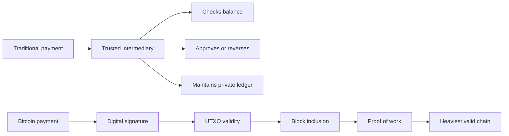

### Why this matters

For cryptography engineers, this section introduces the main design goal: **decentralized finality without a central timestamping authority**.

Bitcoin does not merely solve authentication. Digital signatures already solve authentication. The hard part is making a globally visible decision about **which valid signed transaction gets to spend a coin first**.

### Key takeaway

Digital cash requires more than signatures. It requires a decentralized mechanism for ordering signed state transitions.

---

## Slide 6 — Core challenge: double-spending

The deck correctly identifies double-spending as the fundamental problem.

Digital data is copyable. If a coin is represented as a file, a user can duplicate it. If ownership is represented by a signed message, the owner can sign two conflicting messages.

Example:

```text
TxA: Spend coin X to Merchant
TxB: Spend coin X to Attacker's second wallet
```

Both may be individually valid signatures. The problem is not local validity. The problem is **global uniqueness of state transition**.

In a centralized system, a bank prevents double-spending by maintaining a private ledger:

```text
if balance[alice] >= amount:
    balance[alice] -= amount
    balance[bob] += amount
else:
    reject
```

Bitcoin removes the bank and replaces it with a public append-only ledger whose history is expensive to modify.

### Threat model

The attacker can:

* create arbitrary network identities,
* broadcast conflicting transactions,
* delay messages,
* mine blocks,
* attempt to reorganize history,
* collude with other miners,
* eclipse victims from the honest network.

The attacker cannot, assuming cryptographic hardness:

* forge signatures without private keys,
* find SHA-256 preimages cheaply,
* create valid blocks without satisfying proof-of-work,
* spend outputs that do not exist,
* create coins beyond consensus rules.

### Key takeaway

Double-spend prevention is a consensus problem, not merely a cryptographic-signature problem.

---

## Slides 7–9 — Bitcoin’s solution and Byzantine consensus

The deck describes Bitcoin as a peer-to-peer distributed timestamp server. This is precise and important.

Bitcoin’s core innovation is not only the blockchain data structure. Hash chains existed before Bitcoin. Digital signatures existed before Bitcoin. Timestamping schemes existed before Bitcoin. Bitcoin’s contribution was combining:

* proof-of-work,
* longest/heaviest-chain consensus,
* economic mining incentives,
* peer-to-peer gossip,
* public transaction validation,
* and difficulty adjustment.

The deck also connects Bitcoin to the Byzantine Generals Problem. In classical Byzantine fault tolerance, a distributed system needs agreement despite faulty or malicious participants. Bitcoin gives a probabilistic, open-membership variant of Byzantine agreement.

Traditional BFT protocols, such as PBFT-style systems, usually assume:

* known validator set,
* bounded number of Byzantine nodes,
* authenticated channels,
* quorum voting.

Bitcoin instead assumes:

* open participation,
* Sybil resistance through proof-of-work,
* probabilistic finality,
* honest majority of hashpower,
* eventual network propagation.

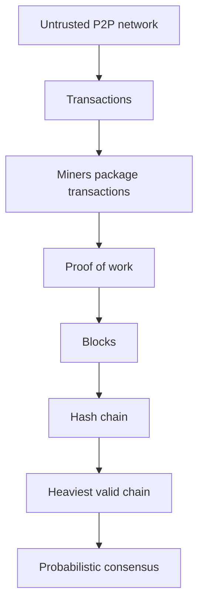

### Important nuance

Bitcoin’s security assumption is often stated as “honest nodes control the majority of CPU power.” In modern Bitcoin, this is more accurately:

> Honest miners control the majority of effective SHA-256 mining hashpower and follow consensus rules.

“CPU power” is historically accurate from the whitepaper era, but Bitcoin mining is now ASIC-dominated.

### Security implication

Bitcoin consensus is **not final in the deterministic BFT sense**. A transaction becomes increasingly hard to reverse as confirmations accumulate, but reversal probability is never mathematically zero.

### Key takeaway

Bitcoin achieves open-membership Byzantine consensus by making voting costly: one unit of mining work approximates one unit of consensus weight.

---

# Subsection 1.1 — Blockchains

## Slides 10–12 — What is a blockchain and why proof-of-work is needed?

The deck uses the notebook analogy:

* pages are blocks,
* pages contain transactions,
* each page references the previous page,
* rewriting history breaks later references.

Cryptographically, a blockchain is a **hash-linked append-only log**.

A simplified block header looks like:

```text
BlockHeader {
    version: uint32
    prev_block_hash: bytes32
    merkle_root: bytes32
    timestamp: uint32
    nBits: uint32
    nonce: uint32
}
```

The block hash commits to the header:

```text
block_hash = SHA256(SHA256(serialize(header)))
```

The `prev_block_hash` field creates the chain:

```text
Block N   commits to Block N-1
Block N-1 commits to Block N-2
...
Genesis block
```

### Why a blockchain alone is insufficient

A hash chain gives tamper evidence, but it does not solve leader election.

Without proof-of-work, an attacker can create many alternative histories cheaply:

```text
Chain A: Genesis -> B1 -> B2 -> B3
Chain B: Genesis -> X1 -> X2 -> X3 -> X4 -> X5
```

If blocks are free to create, “longest chain wins” is meaningless.

Proof-of-work gives blocks an objective external cost.

### Sybil attack resistance

The deck correctly highlights why identity-based voting fails in open systems. If votes are tied to accounts, an attacker can create thousands or millions of identities.

Bitcoin replaces:

```text
one identity = one vote
```

with:

```text
one unit of work = one vote
```

More precisely:

```text
one expected hash attempt = one lottery ticket
```

### Key takeaway

The blockchain is the data structure. Proof-of-work is the Sybil-resistance and leader-election mechanism that gives the chain security meaning.

---

# Subsection 1.2 — Proof-of-Work

## Slides 13–15 — Proof-of-work as a hash lottery

Bitcoin proof-of-work is based on finding a block header hash below a target value.

The deck describes the puzzle as finding a double-SHA-256 hash with many leading zeros. That is the intuitive presentation. The exact rule is:

```text
uint256(block_hash) <= target
```

The target is encoded compactly in the block header’s `nBits` field.

Mining pseudocode:

```python
def mine_block(header, target):
    extra_nonce = 0

    while True:
        coinbase = build_coinbase(extra_nonce)
        txs = [coinbase] + mempool_selection()
        header.merkle_root = merkle_root(txs)

        for nonce in range(0, 2**32):
            header.nonce = nonce
            h = double_sha256(serialize(header))

            if int_from_little_endian(h) <= target:
                return header, txs

        extra_nonce += 1
```

The slide says each attempt is independent. This property comes from the pseudorandom behavior of SHA-256. For a secure hash function, the miner cannot meaningfully steer toward a solution. The only strategy is brute-force search.

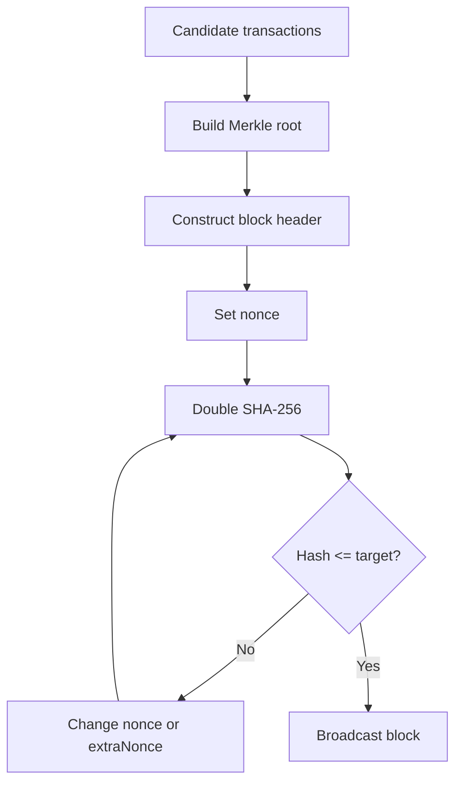

### Why double SHA-256?

Bitcoin commonly uses `SHA256(SHA256(x))`.

This design reduces exposure to certain length-extension concerns that apply to Merkle-Damgård hash constructions when raw `SHA256(x)` is used as a MAC-like primitive. In Bitcoin block hashing, length extension is not the dominant concern, but double hashing became a protocol convention.

### Implementation risks

Senior engineers care about details such as:

* byte order in block headers,
* compact target decoding from `nBits`,
* canonical serialization,
* Merkle root construction,
* coinbase `extraNonce`,
* transaction selection policy,
* timestamp validity,
* orphan/reorg handling,
* mempool policy versus consensus rules.

A miner can produce a block that is locally profitable but globally rejected if it violates consensus rules.

### Key takeaway

Proof-of-work is a public, non-interactive proof that a miner expended expected computational resources to produce a block candidate.

---

## Slides 16–17 — Difficulty and adjustment

The deck gives 2024-scale examples for Bitcoin difficulty and hash rate. The exact numerical values are time-dependent, but the mechanism is stable.

Bitcoin wants approximately one block every 10 minutes.

Every 2016 blocks, nodes retarget difficulty. Since:

```text
2016 blocks * 10 minutes = 20160 minutes ≈ 14 days
```

the protocol compares actual elapsed time against expected elapsed time.

A precise engineering distinction:

* Bitcoin adjusts the **target**.
* “Difficulty” is inversely proportional to target.

Conceptually:

```text
new_target = old_target * actual_time / expected_time
new_difficulty = old_difficulty * expected_time / actual_time
```

The deck’s formula for difficulty is therefore correct at the conceptual level, while implementation code usually manipulates the target.

### Bounded adjustment

Bitcoin limits retarget adjustment to a factor of 4 in either direction per period. This reduces instability if timestamps are manipulated or hashpower changes abruptly.

### Security implications

Difficulty adjustment is a feedback-control system. It protects the target block interval but introduces subtle assumptions:

* Miners can influence timestamps within consensus-accepted ranges.
* Sudden hashpower drops can slow block production until the next retarget.
* Sudden hashpower increases can temporarily accelerate blocks.
* Difficulty is not a direct measure of security unless paired with actual market cost of hashpower.

### Key takeaway

Difficulty adjustment is Bitcoin’s control loop: it normalizes block production time despite changes in global mining capacity.

---

## Slides 18–20 — Mining process and lottery fairness

The deck describes mining as finding a “golden ticket.” This is a good mental model.

Each hash attempt is a Bernoulli trial:

```text
Pr[success] = target / 2^256
```

If a miner controls fraction `q` of total network hashpower, then, in expectation:

```text
Pr[miner finds next block] = q
```

That proportionality is the basis of Bitcoin’s consensus fairness.

### But “fair” has limits

The deck says 10% hashpower gives 10% chance to win. That is true per block in expectation, but real systems introduce deviations:

* mining pools reduce variance,
* network latency gives propagation advantages,
* selfish mining can improve revenue above nominal hashpower under some conditions,
* block template construction affects fee revenue,
* ASIC supply chains can centralize mining power,
* cheap energy and regulation concentrate miners geographically.

### Mining-pool centralization

Most miners do not solo mine. They join pools. Pools coordinate block templates and distribute rewards. This changes the decentralization model:

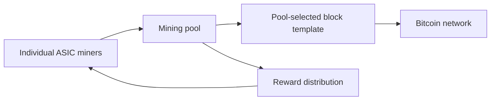

The underlying hashpower may be distributed, but block construction authority may be concentrated in pool operators.

### Key takeaway

Proof-of-work gives probabilistic leader election proportional to hashpower, but real-world mining economics can centralize block production.

---

## Slides 21–23 — Difficulty as thermostat and mining economics

The deck compares difficulty adjustment to a thermostat. That is accurate: it is a negative feedback loop.

If blocks are too fast, difficulty rises. If blocks are too slow, difficulty falls.

Mining economics can be summarized as:

```text
Expected mining revenue =
    block subsidy
  + transaction fees
  - electricity cost
  - hardware depreciation
  - cooling/facility cost
  - operational risk
```

A miner stays online when expected marginal revenue exceeds marginal cost.

### Block subsidy and fee transition

Bitcoin’s issuance schedule halves approximately every 210,000 blocks. This means Bitcoin’s security budget gradually shifts from subsidy-funded security to fee-funded security.

Security engineering concern:

> If block subsidies decline and transaction fees are insufficient, the cost of attacking the network may decline.

This is one of Bitcoin’s long-term open economic questions.

### Fee market implications

A fee-funded system creates additional behavior:

* miners prioritize high-fee transactions,
* users bid for block space,
* fee spikes can price out low-value payments,
* transaction batching becomes economically important,
* Layer 2 systems become more attractive.

### Key takeaway

Bitcoin’s security is not only cryptographic. It is funded by block rewards and transaction fees. The long-term fee market is part of the security model.

---

## Slides 24–25 — Energy use and alternative PoW designs

The deck discusses proof-of-work energy consumption and ASIC centralization.

From a cryptographic engineering perspective, proof-of-work deliberately converts electricity and hardware depreciation into consensus security. The “waste” criticism is therefore not a side effect; resource expenditure is the Sybil-resistance mechanism.

The real design question is:

> Is the externalized cost acceptable for the security guarantees obtained?

### ASIC resistance

Bitcoin’s SHA-256 proof-of-work is extremely ASIC-friendly. This has pros and cons.

Advantages:

* simple verification,
* mature hardware,
* high total security expenditure,
* narrow attack surface,
* predictable implementation.

Disadvantages:

* mining centralization,
* hardware supply-chain concentration,
* reduced accessibility for ordinary users,
* geographic concentration near cheap energy.

Memory-hard alternatives attempt to reduce ASIC advantage by requiring large memory bandwidth or random memory access. Examples include Ethash-style designs, Equihash-like designs, and RandomX-like designs.

### Trade-off

ASIC resistance often increases protocol complexity. Complexity can introduce:

* consensus bugs,
* hardware-specific optimizations anyway,
* denial-of-service risks,
* verification overhead,
* centralization around GPU or memory suppliers.

### Key takeaway

ASIC resistance is not a free win. Simple PoW favors specialized hardware; complex PoW may improve accessibility but increases protocol and implementation risk.

---

# Subsection 1.3 — From Blocks to Blockchain

## Slides 26–27 — Hash-linked blocks

Each block contains a previous block hash. This creates a tamper-evident chain.

If an attacker modifies a transaction in block `N`, then:

1. the transaction hash changes,
2. the Merkle root changes,
3. the block header hash changes,
4. block `N+1` no longer points to it,
5. all subsequent proof-of-work must be recomputed.

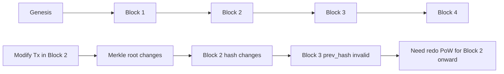

### Important nuance

The chain is not “unbreakable” in an absolute mathematical sense. It is economically and probabilistically resistant to rewriting under the honest-majority assumption.

A hash chain gives tamper evidence. Proof-of-work gives tamper resistance.

### Key takeaway

Bitcoin history becomes harder to rewrite as more proof-of-work accumulates on top of a block.

---

## Slides 28–29 — Temporary forks and longest-chain rule

Temporary forks occur naturally because networks are asynchronous.

Example:

1. Miner A finds block `H+1`.
2. Miner B finds a different block `H+1`.
3. Some nodes hear A first; others hear B first.
4. Both blocks are valid.
5. The next mined block extends one branch.
6. Nodes converge on the branch with more cumulative work.

The deck says “longest chain,” but production Bitcoin clients use the chain with the most cumulative proof-of-work, usually called the **heaviest chain** or **most-work chain**.

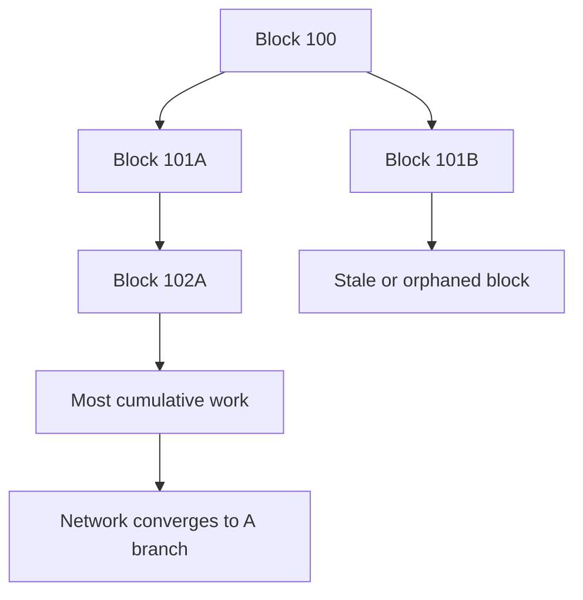

### Security implication

Forks are not necessarily attacks. They are expected in distributed systems. However, high fork rates reduce security because hashpower is wasted on stale branches.

Factors that influence fork rate:

* block propagation delay,
* block size,
* network topology,
* miner connectivity,
* relay protocols,
* compact block propagation.

### Key takeaway

Nakamoto consensus is eventual and probabilistic. Nodes converge on the valid chain with the greatest accumulated work.

---

## Slide 30 — The 51% attack

The deck correctly states what a majority-hashpower attacker can and cannot do.

A 51% attacker can:

* reorganize recent chain history,
* double-spend their own coins,
* censor transactions,
* exclude specific miners’ blocks,
* destabilize confirmation confidence.

A 51% attacker cannot directly:

* spend coins without private keys,
* create invalid coins,
* bypass signature checks,
* violate block subsidy rules,
* make invalid blocks accepted by full nodes.

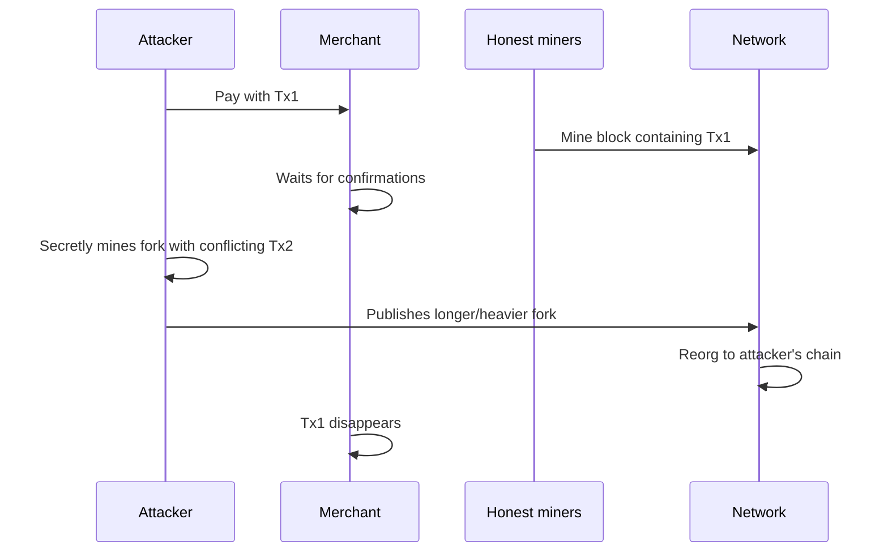

### Nuanced critique

The deck says attack cost exceeds any possible gain. That is the standard incentive argument, but it is not absolute.

Attackers may have non-economic motives:

* state-level disruption,
* market manipulation,
* short positions,
* sabotage,
* regulatory coercion,
* exchange-targeted double spends,
* cartel behavior.

Therefore, Bitcoin security should be described as **cryptoeconomic**, not purely cryptographic.

### Key takeaway

Majority hashpower does not break signatures or consensus validation. It breaks transaction finality and censorship resistance.

---

# Subsection 1.4 — Bitcoin Transactions and Ownership

## Slide 32 — Keys, public keys, and addresses

Bitcoin ownership is defined by the ability to satisfy spending conditions, usually by producing a valid digital signature.

A simplified key model:

```text
private key d: random integer in [1, n-1]
public key Q: Q = d * G
address: encoded hash of public key or script
```

Historically, Bitcoin primarily used ECDSA over the secp256k1 elliptic curve. Modern Bitcoin also supports Schnorr signatures through Taproot.

### ECDSA internals

For message hash `z`, private key `d`, curve generator `G`, and random nonce `k`:

```text
R = kG
r = R.x mod n
s = k^-1 * (z + r*d) mod n
signature = (r, s)
```

Verification checks that the signature corresponds to public key `Q = dG`.

### Critical implementation risk: nonce failure

ECDSA is extremely sensitive to nonce reuse.

If the same `k` is used to sign two different messages with the same private key, the private key can be recovered.

```text
s1 = k^-1(z1 + r*d)
s2 = k^-1(z2 + r*d)

=> k = (z1 - z2) / (s1 - s2)
=> d = (s1*k - z1) / r
```

Practical mitigations:

* deterministic ECDSA nonces, such as RFC 6979-style generation,
* high-quality CSPRNGs,
* constant-time scalar operations,
* hardened hardware wallets,
* side-channel resistance,
* secure seed backup.

### “Not your keys, not your coins”

This is not a slogan from a security perspective. It means custody equals signing authority. If an exchange controls the private keys, the user has a claim against the exchange, not direct protocol-level control over UTXOs.

### Key takeaway

Bitcoin ownership is not account ownership. It is control over private keys capable of satisfying script conditions.

---

## Slide 33 — UTXO model

Bitcoin uses the **Unspent Transaction Output** model.

A transaction consumes existing outputs and creates new outputs.

Data structure:

```text
OutPoint {
    txid: bytes32
    vout: uint32
}

TxInput {
    previous_output: OutPoint
    scriptSig: bytes
    sequence: uint32
    witness: optional bytes[]
}

TxOutput {
    value: int64
    scriptPubKey: bytes
}
```

Validation checks include:

```text
for each input:
    referenced output exists
    referenced output is unspent
    unlocking script satisfies locking script

sum(inputs) >= sum(outputs)
fee = sum(inputs) - sum(outputs)
```

The UTXO model naturally prevents double spends because each output can transition from:

```text
UNSPENT -> SPENT
```

only once in the valid ledger.

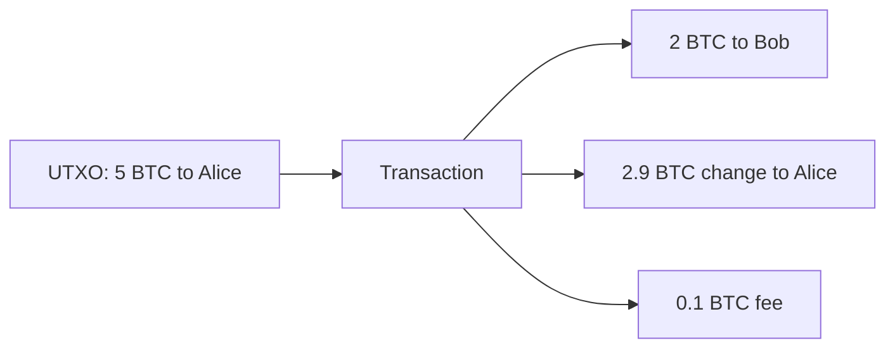

### Engineering benefits

The UTXO model has important properties:

* parallel validation of independent inputs,
* stateless ownership objects,
* explicit coin provenance,
* natural double-spend detection,
* simpler pruning of spent outputs,
* good fit for multi-input/multi-output transactions.

### Privacy downside

UTXO graphs leak metadata:

* common-input ownership heuristic,
* change-address detection,
* transaction amount linkage,
* timing analysis,
* address reuse exposure.

Wallet engineering must use:

* fresh change addresses,
* coin selection algorithms,
* output randomization,
* CoinJoin-style protocols when privacy matters.

### Key takeaway

Bitcoin tracks spendable objects, not balances. This gives strong double-spend semantics but creates graph-analysis privacy risks.

---

## Slide 34 — Coins as chains of signatures

The deck references the whitepaper model: an electronic coin is a chain of digital signatures.

Conceptually:

```text
Owner0 signs: coin -> Owner1 pubkey
Owner1 signs: previous transfer -> Owner2 pubkey
Owner2 signs: previous transfer -> Owner3 pubkey
```

This gives a verifiable authorization chain.

But signatures alone do not prevent equivocation:

```text
Owner1 signs coin -> Owner2
Owner1 also signs coin -> Owner3
```

Both signatures are valid. The ledger must decide which one counts.

### Practical Bitcoin distinction

Bitcoin does not literally track “coins” as mutable objects. It tracks transaction outputs. Each output has a locking script, and spending it requires satisfying that script.

A simplified P2PKH spend:

```text
scriptPubKey: OP_DUP OP_HASH160 <pubKeyHash> OP_EQUALVERIFY OP_CHECKSIG
scriptSig:    <signature> <publicKey>
```

Validation:

1. hash public key,
2. compare to address hash,
3. verify signature over transaction digest,
4. mark referenced UTXO spent.

### Key takeaway

Digital signatures prove authorization. The blockchain decides which authorized spend is first.

---

## Slide 35 — Coinbase transactions and monetary policy

A coinbase transaction creates new bitcoins. It has no normal inputs and appears as the first transaction in a block.

Consensus rules enforce:

```text
coinbase_output_value <= block_subsidy + transaction_fees
```

The miner cannot arbitrarily create more coins. Full nodes reject blocks with excessive coinbase rewards.

### Coinbase maturity

A practical consensus detail: coinbase outputs cannot be spent immediately. Bitcoin requires coinbase maturity, historically 100 blocks, before spending newly mined coins. This protects against reorgs invalidating recently mined rewards.

### Supply schedule

The halving schedule is deterministic. This creates predictable issuance and removes discretionary monetary policy from trusted administrators.

### Security-engineering concern

The subsidy is also the security budget. As it approaches zero, transaction fees must sustain miner incentives. This is a core long-term design trade-off.

### Key takeaway

Coinbase transactions are protocol-limited issuance plus fee collection. They fund proof-of-work security.

---

# Subsection 1.5 — Solving the Double-Spend Problem

## Slides 36–38 — Order without clocks

The deck correctly says the core problem is ordering without trusted clocks.

Distributed systems cannot rely on local timestamps because:

* clocks drift,
* network latency varies,
* messages can be delayed,
* malicious nodes can lie,
* there is no universal “first seen” view.

Bitcoin uses proof-of-work blocks as timestamp batches.

Important nuance: a Bitcoin block timestamp is not a precise real-world timestamp. It is bounded by consensus rules and peer policy, but it is not a cryptographic proof that a transaction existed at an exact wall-clock time.

What proof-of-work gives is:

> By the time a block is buried under later work, changing its contents requires redoing the expected work of that block and successors.

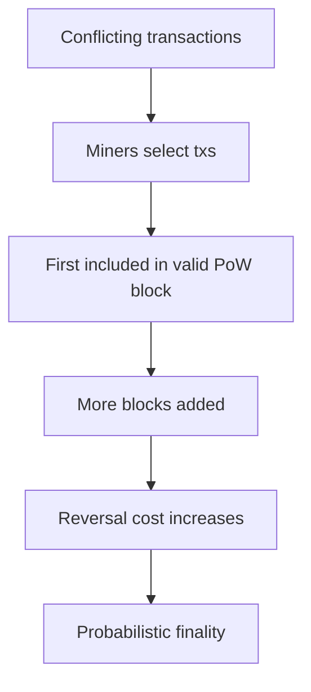

### Key takeaway

Bitcoin replaces trusted timestamps with costly ordering. “Time” in Bitcoin is represented by accumulated work.

---

## Slides 39–40 — Confirmations and double-spend probability

A confirmation means one block has been added including the transaction. Six confirmations means five additional blocks have been built on top of that block.

The security intuition:

* At 0 confirmations, transaction is only in the mempool.
* At 1 confirmation, attacker must produce an alternative block.
* At 6 confirmations, attacker must catch up from six blocks behind.

The whitepaper models attacker catch-up probability using a random walk where honest miners have probability `p` and attacker has probability `q`.

If `q < p`, the probability of catching up decreases rapidly with confirmation depth.

### Real-world considerations

Confirmation policy should depend on:

* transaction value,
* counterparty risk,
* observed network conditions,
* mempool conflicts,
* fee rate and replace-by-fee status,
* exchange deposit policy,
* recent reorg history,
* attacker hashpower assumptions.

### Zero-confirmation risk

For low-value payments, merchants may accept zero confirmations. This is not cryptographic finality. It is risk acceptance.

Risks include:

* replace-by-fee,
* double-spend propagation,
* eclipse attacks,
* miner-assisted double spends.

### Key takeaway

Confirmations are a probabilistic risk-control mechanism. More confirmations reduce reorg probability but increase settlement latency.

---

## Slide 41 — Putting Bitcoin together

The deck combines the full Bitcoin stack:

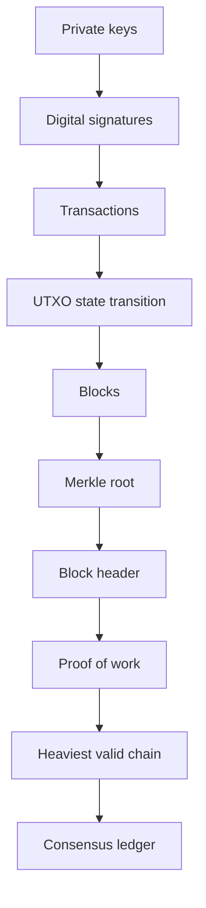

At senior-engineer depth, Bitcoin is a layered system:

| Layer             | Primitive      | Security role                 |
| ----------------- | -------------- | ----------------------------- |
| Key layer         | ECDSA/Schnorr  | Spending authorization        |
| Transaction layer | UTXO           | State transition model        |
| Commitment layer  | Merkle tree    | Block transaction commitment  |
| Consensus layer   | PoW            | Sybil resistance and ordering |
| Network layer     | P2P gossip     | Propagation and discovery     |
| Incentive layer   | Subsidy + fees | Miner alignment               |

### Key takeaway

Bitcoin security emerges from the composition of cryptography, distributed systems, and economic incentives. Weakness in any layer can affect the system.

---

# Subsection 1.6 — Merkle Trees

## Slides 42–45 — Scaling problem and Bitcoin block headers

Merkle trees solve a data-authentication problem:

> How can a verifier check that a transaction is included in a block without downloading every transaction?

Bitcoin block headers are only 80 bytes and include one Merkle root. That root commits to all transactions in the block.

The header contains:

```text
version          4 bytes
prev_block_hash  32 bytes
merkle_root      32 bytes
timestamp        4 bytes
nBits            4 bytes
nonce            4 bytes
```

The Merkle root is a cryptographic commitment:

* binding: cannot change transactions without changing root,
* compact: one 32-byte hash represents many transactions,
* efficiently provable: inclusion proof is logarithmic.

### Commitment interpretation

A Merkle root is not encryption. It does not hide transaction data if the transactions are known. It is a commitment to the exact transaction list and order.

### Key takeaway

Merkle roots let block headers commit compactly to full block contents.

---

## Slides 46–50 — Building and verifying Merkle proofs

The deck includes visual Merkle-tree diagrams on pages 46 and 49. The first shows a tree over eight transactions; the second highlights the proof path for proving inclusion of `Tx2`.

For transactions:

```text
L0 = H(Tx0)
L1 = H(Tx1)
L2 = H(Tx2)
L3 = H(Tx3)
...
```

Parent hashes are computed as:

```text
P01 = H(L0 || L1)
P23 = H(L2 || L3)
Root = H(P01 || P23)
```

Bitcoin uses double SHA-256 for transaction and internal node hashing.

A proof for `Tx2` includes sibling hashes needed to recompute the root.

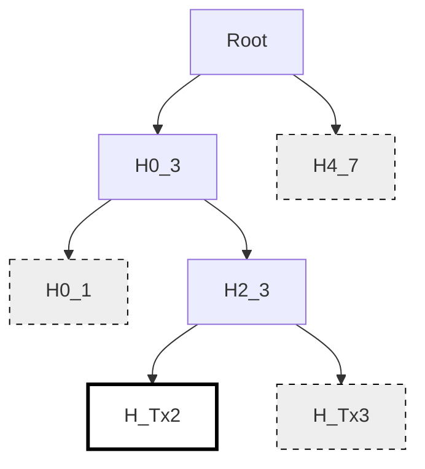

Verification pseudocode:

```python
def verify_merkle_proof(tx, proof, merkle_root):
    h = double_sha256(serialize(tx))

    for sibling_hash, direction in proof:
        if direction == "left":
            h = double_sha256(sibling_hash + h)
        else:
            h = double_sha256(h + sibling_hash)

    return h == merkle_root
```

The direction bit is important. Without knowing whether the sibling is left or right, the verifier cannot reconstruct the correct root.

### Security assumptions

Merkle inclusion security depends on:

* collision resistance,
* second-preimage resistance,
* unambiguous serialization,
* correct tree construction,
* correct proof ordering.

### Key takeaway

Merkle proofs reduce inclusion verification from `O(n)` data to `O(log n)` hashes.

---

## Slides 51–54 — Full nodes and SPV

A full node verifies everything:

* block proof-of-work,
* transaction syntax,
* signatures,
* scripts,
* UTXO availability,
* coinbase amount,
* block size/weight,
* consensus rules,
* Merkle root correctness.

An SPV client verifies:

* block headers,
* proof-of-work chain,
* Merkle inclusion proof for relevant transactions.

It does **not** fully verify:

* all transaction scripts,
* global UTXO validity,
* absence of inflation bugs in blocks,
* full block validity.

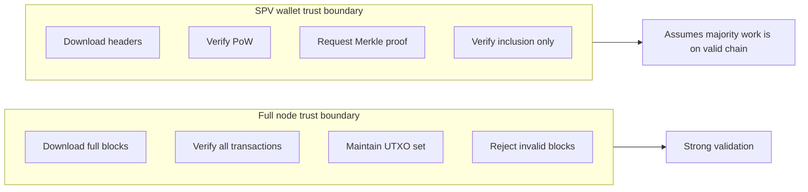

### SPV threat model

SPV clients are vulnerable to:

* eclipse attacks,
* dishonest peers withholding transactions,
* invalid block attacks if majority hashpower colludes,
* privacy leakage through address or bloom-filter queries,
* failure to detect consensus-invalid transactions included in invalid blocks.

### Best practices

For SPV/light clients:

* connect to multiple independent peers,
* use compact block filters where possible,
* verify headers from genesis or a trusted checkpoint,
* wait for sufficient confirmations,
* use full nodes for high-value operations,
* avoid leaking wallet address sets to random peers.

### Key takeaway

SPV gives efficient inclusion verification, not full validation. It is a performance/security trade-off.

---

## Slide 55 — Odd transaction counts

Bitcoin handles odd numbers of leaves by duplicating the final hash at a tree level.

Example with five transactions:

```text
H0 H1 H2 H3 H4
=> H01 H23 H44
=> H0123 H4444
=> Root
```

The transaction itself is not duplicated in the block. Only the hash is duplicated during tree construction.

### Subtle engineering issue

Bitcoin’s duplicate-last Merkle construction has historically had edge cases. If duplicate transaction identifiers or ambiguous tree shapes are mishandled, implementations may incorrectly cache invalidity or accept malformed structures. Robust implementations must detect duplicated txids and preserve exact consensus behavior.

### Key takeaway

Duplicating the final hash is simple and consensus-compatible, but Merkle-tree construction must be implemented exactly.

---

## Slides 56–59 — Security properties and Merkle trees beyond Bitcoin

Merkle trees are authenticated data structures. They provide:

* tamper evidence,
* compact commitments,
* logarithmic inclusion proofs,
* selective disclosure.

But they do not automatically provide:

* non-membership proofs unless designed for them,
* privacy against observers who know the leaves,
* correctness of transaction semantics,
* data availability.

### Beyond Bitcoin

The deck mentions Ethereum, Git, IPFS, Certificate Transparency, MLS TreeKEM, Verkle trees, sparse Merkle trees, and Merkle-sum trees.

Comparison:

| Structure                     | Main use                                   |
| ----------------------------- | ------------------------------------------ |
| Binary Merkle tree            | Inclusion proofs                           |
| Sparse Merkle tree            | Key-value state with non-membership proofs |
| Merkle Patricia trie          | Ethereum-style authenticated state         |
| Verkle tree                   | Smaller proofs using vector commitments    |
| Merkle-sum tree               | Proves inclusion plus aggregate values     |
| Certificate Transparency tree | Public append-only certificate log         |

### Key takeaway

Merkle trees are a foundational primitive for verifiable data structures, but each use case requires careful tree semantics.

---

## Slide 60 — Git as a blockchain-like structure

The deck compares Git to a blockchain. The comparison is useful but limited.

Git uses content-addressed objects:

* blobs,
* trees,
* commits,
* tags.

A commit hashes metadata and references parent commits. This creates a tamper-evident DAG.

However, Git lacks:

* proof-of-work,
* decentralized consensus,
* economic Sybil resistance,
* canonical global ordering,
* automatic fork resolution.

So Git is not a cryptocurrency blockchain. It is a content-addressed Merkle DAG with optional signatures and repository-level trust.

### Key takeaway

Hash-linked history is not enough to make a blockchain. Consensus and Sybil resistance are the differentiators.

---

# Section 2 — Ethereum and Smart Contracts

## Slides 61–64 — Ethereum as programmable state machine

The deck frames Ethereum as “Bitcoin plus programming.” More precisely:

> Ethereum is a replicated deterministic state machine secured by blockchain consensus.

Ethereum has two major account types:

1. **Externally Owned Accounts**
   Controlled by private keys.

2. **Contract Accounts**
   Controlled by EVM bytecode and persistent storage.

A transaction can:

* transfer ETH,
* deploy a contract,
* call a contract,
* trigger internal calls,
* modify global state.

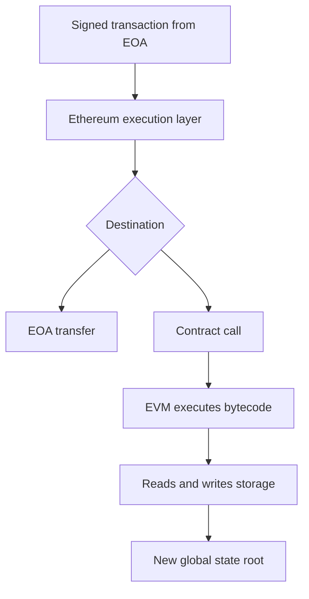

### Bitcoin versus Ethereum

| Property        | Bitcoin                | Ethereum                         |
| --------------- | ---------------------- | -------------------------------- |
| State model     | UTXO                   | Account/state model              |
| Script model    | Limited stack script   | EVM bytecode                     |
| Primary purpose | Digital cash           | General programmable settlement  |
| Execution       | Simple validation      | Arbitrary contract execution     |
| State           | UTXO set               | Account balances, code, storage  |
| Risk            | Consensus and key risk | Plus application-level code risk |

### Security implication

Ethereum expands the attack surface enormously. In Bitcoin, most transactions exercise a small set of mature script paths. In Ethereum, every deployed contract is a custom application with its own state machine and failure modes.

### Key takeaway

Ethereum moves from validating payments to validating arbitrary deterministic computation. That enables programmability but dramatically increases software risk.

---

# Subsection 2.1 — Smart Contracts

## Slides 65–68 — Smart contract definition and lifecycle

The deck defines smart contracts as code deployed to the blockchain that executes automatically.

A lifecycle:

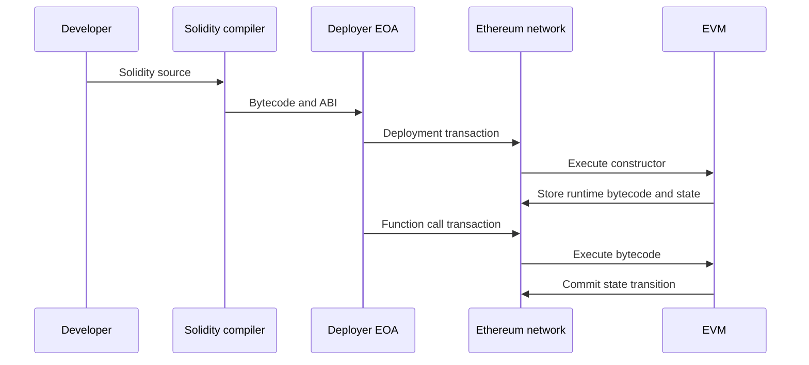

The example `SimpleStorage` contract stores a single `uint256`.

Important properties:

* **Deterministic**: all honest nodes must compute the same result.
* **Transparent**: bytecode and state are publicly observable.
* **Autonomous**: execution follows protocol rules.
* **Persistent**: state remains until changed or removed according to code.
* **Difficult to patch**: immutable contracts require upgrade patterns or migration.

### “Code is law” nuance

The slide says no one can change deployed code. That is true for immutable contracts, but many production systems use:

* proxy patterns,
* upgradeable contracts,
* admin-controlled parameters,
* timelocks,
* governance upgrades,
* emergency pause mechanisms.

So the real question is:

> Who controls the upgrade path?

A contract may appear decentralized while retaining powerful admin keys.

### Key takeaway

Smart contracts are deterministic replicated programs. Their security depends on code correctness, upgrade governance, and execution semantics.

---

## Slides 69–71 — Gas and transaction pricing

Gas is Ethereum’s resource-metering mechanism.

It solves several problems:

* prevents infinite loops,
* prices computation,
* prices storage,
* mitigates denial-of-service,
* allocates scarce blockspace,
* makes execution costs explicit.

A transaction specifies execution constraints and fee parameters. Post-EIP-1559 style pricing includes:

```text
base fee      burned by protocol
priority fee  paid to validator
max fee       user's maximum total willingness to pay
```

The simplified formula:

```text
effective_fee_per_gas = min(max_fee_per_gas, base_fee + max_priority_fee_per_gas)
total_cost = gas_used * effective_fee_per_gas
```

Unused gas is refunded, but execution that runs out of gas reverts state changes while still consuming gas.

### Security implications

Gas affects contract design:

* unbounded loops can make functions uncallable,
* storage writes are expensive,
* external calls forward gas and create reentrancy risk,
* griefing attacks can exploit gas limits,
* refund rules affect economic behavior,
* denial-of-service can arise from unexpectedly expensive state growth.

### “Solves halting problem with economics”

This is a good phrase from the slide, with nuance. Ethereum does not solve the theoretical halting problem. It bounds execution by making every step consume prepaid gas. If the program does not halt before gas runs out, the EVM halts it.

### Key takeaway

Gas is resource accounting plus DoS protection. Secure smart-contract engineering must treat gas as part of the protocol semantics.

---

## Slide 72 — Simple token contract

The slide shows a simple token contract with balances and transfer logic. The parsed text shows:

```solidity
require(balances[msg.sender] ^= amount, "Insufficient balance");
```

This should almost certainly be:

```solidity
require(balances[msg.sender] >= amount, "Insufficient balance");
```

If the code truly used `^=`, that would be a serious bug or compile-time/type issue depending on Solidity context, because `^=` is bitwise XOR assignment, not a comparison.

Corrected minimal version:

```solidity
function transfer(address to, uint256 amount) public returns (bool) {
    require(to != address(0), "Invalid recipient");
    require(balances[msg.sender] >= amount, "Insufficient balance");

    balances[msg.sender] -= amount;
    balances[to] += amount;

    return true;
}
```

### Senior engineering concerns

Even this simple token is incomplete compared with production ERC-20 expectations:

* emits no `Transfer` event,
* no allowance/approval mechanism,
* no total supply variable,
* no zero-address mint/burn semantics,
* no access-controlled minting,
* no permit/signature support,
* no pause or upgrade policy,
* no integration safety around non-standard tokens.

### Integer safety

Solidity 0.8+ includes checked arithmetic by default. Earlier versions required SafeMath to prevent overflows and underflows.

### Key takeaway

Small smart contracts look simple, but production token semantics require strict standards compliance and careful edge-case handling.

---

## Slide 73 — DAOs

A DAO is an organization whose governance and treasury operations are mediated by smart contracts.

Typical DAO architecture:

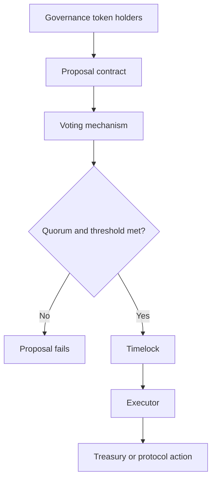

### Security concerns

DAO governance introduces its own threat model:

* token concentration,
* vote buying,
* flash-loan governance attacks,
* low-turnout capture,
* malicious proposals,
* compromised delegate keys,
* governance contract bugs,
* timelock bypass,
* emergency-admin abuse.

### Cryptographic concerns

Governance often uses signatures for off-chain voting or delegation. Engineers must ensure:

* domain separation,
* chain ID binding,
* contract address binding,
* nonce-based replay protection,
* EIP-712-style structured signing,
* signature malleability handling.

### Key takeaway

DAOs replace corporate/legal control with token-weighted protocol control, but governance itself becomes a security-critical subsystem.

---

## Slides 74–75 — The DAO hack and Ethereum Classic

The deck describes the DAO hack as a reentrancy vulnerability.

The core vulnerable pattern:

```solidity
function withdraw(uint256 amount) external {
    require(balances[msg.sender] >= amount);

    // Interaction before effect
    (bool ok,) = msg.sender.call{value: amount}("");
    require(ok);

    balances[msg.sender] -= amount;
}
```

An attacker contract can reenter before the balance is reduced.

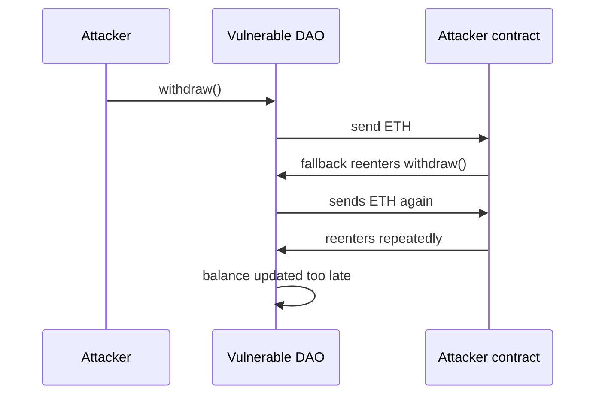

Correct pattern: **Checks-Effects-Interactions**.

```solidity
function withdraw(uint256 amount) external nonReentrant {
    require(balances[msg.sender] >= amount);

    balances[msg.sender] -= amount;

    (bool ok,) = msg.sender.call{value: amount}("");
    require(ok);
}
```

### Ethereum hard fork

The aftermath created Ethereum and Ethereum Classic. This is not just a historical dispute. It exposes a deep governance tension:

* immutability as a security property,
* social consensus as an emergency recovery layer,
* whether protocol communities should reverse catastrophic application-level failures.

### Key takeaway

Smart-contract immutability magnifies bugs. “Code is law” fails when the code does not encode the intended law.

---

## Slide 76 — Common smart-contract vulnerabilities

The deck lists major vulnerability classes. A senior engineer should expand them as follows.

### Reentrancy

Occurs when external calls allow control flow to return before internal state is finalized.

Mitigations:

* checks-effects-interactions,
* reentrancy guards,
* pull payment model,
* minimize external calls,
* explicit state machines.

### Access-control failures

Examples:

```solidity
function upgrade(address newImpl) external {
    implementation = newImpl; // missing onlyOwner
}
```

Mitigations:

* role-based access control,
* timelocks,
* multisig admin,
* least privilege,
* event logging,
* formal invariants.

### Integer bugs

Modern Solidity helps, but risks remain in:

* unchecked blocks,
* fixed-point math,
* rounding,
* precision loss,
* signed/unsigned conversions.

### Front-running and MEV

Transactions are visible before inclusion. Attackers can reorder, insert, or censor transactions.

Examples:

* sandwich attacks,
* liquidation races,
* NFT mint sniping,
* oracle update exploitation,
* governance proposal front-running.

Mitigations:

* commit-reveal schemes,
* batch auctions,
* private order flow,
* slippage controls,
* threshold encryption,
* fair sequencing protocols.

### Additional major classes

The slide does not list all critical classes. Important ones include:

* oracle manipulation,
* signature replay,
* unsafe delegatecall,
* proxy storage collision,
* initialization bugs,
* cross-chain bridge compromise,
* flash-loan economic exploits,
* unsafe randomness,
* denial-of-service through gas griefing.

### Key takeaway

Smart-contract security is application security under adversarial, transparent, irreversible execution.

---

## Slides 77–78 — Real-world applications and NFTs

The deck covers DeFi, NFTs, ENS, multisigs, DAOs, and prediction markets.

NFTs are typically represented by ERC-721-style contracts:

```text
ownerOf[tokenId] -> owner address
tokenURI[tokenId] -> metadata pointer
```

Important distinction:

> An NFT usually proves ownership of a token, not necessarily copyright, content custody, or legal ownership of the referenced asset.

### Metadata risks

NFT metadata may point to:

* centralized HTTP URLs,
* IPFS content identifiers,
* Arweave data,
* mutable server-hosted JSON,
* on-chain metadata.

Security concerns:

* link rot,
* mutable metadata,
* rug pulls,
* phishing approvals,
* marketplace signature replay,
* malicious token callbacks,
* royalty bypass,
* fake collections.

### Cryptographic interpretation

An NFT is an authenticated state entry in a smart contract. The cryptography proves control over the owning address and historical transfers. It does not inherently prove that the off-chain asset is unique, legally transferred, or permanently available.

### Key takeaway

NFTs are on-chain ownership records. Their real security depends heavily on metadata integrity, marketplace behavior, wallet UX, and legal interpretation.

---

# Subsection 2.2 — Proof-of-Stake: The Merge

## Slides 79–82 — Proof-of-stake model

The deck contrasts proof-of-work and proof-of-stake.

Proof-of-work security comes from external resource expenditure.

Proof-of-stake security comes from slashable collateral.

A validator stakes ETH, participates in consensus, and risks penalties for protocol violations.

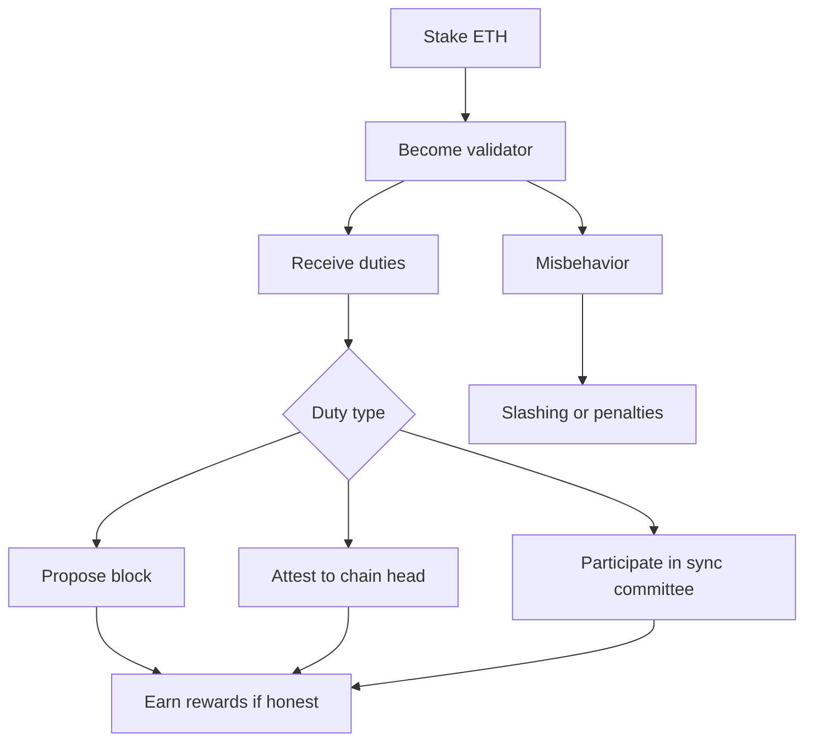

### Cryptographic components

Ethereum proof-of-stake uses several cryptographic mechanisms:

* validator signing keys,
* BLS signatures,
* aggregate signatures,
* randomness for committee selection,
* signed attestations,
* signed block proposals,
* slashable evidence.

### Trust assumptions

PoS assumes:

* enough stake follows protocol,
* slashable violations are detectable,
* social consensus can reject long-range attacks,
* validators can maintain key security,
* network liveness is sufficient for finality,
* clients implement consensus rules correctly.

### Key takeaway

Proof-of-stake replaces energy cost with capital-at-risk. Security depends on slashing, incentives, and social recovery assumptions.

---

## Slides 83–84 — Rewards, penalties, and detecting dishonesty

Validators receive rewards for correct participation and penalties for failures.

Misbehavior is detected through signed contradictory messages.

Examples:

### Double proposal

A validator signs two different blocks for the same slot.

```text
Sign(slot = 100, block_root = A)
Sign(slot = 100, block_root = B)
A != B
```

### Surround vote

A validator signs attestations that violate finality rules by surrounding another vote.

Simplified form:

```text
Vote1: source1 < source2 < target2 < target1
```

This creates cryptographic evidence because both messages are signed by the same validator key.

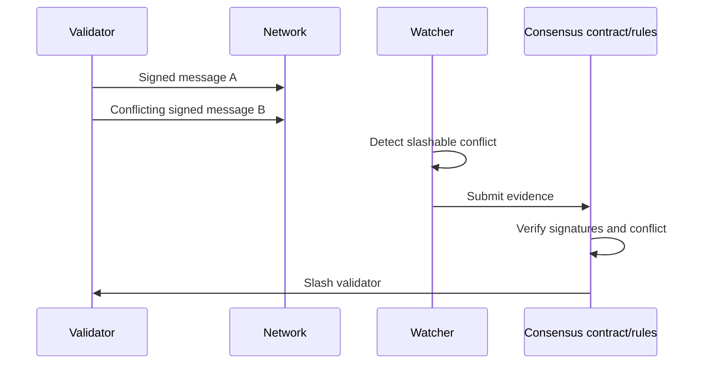

### Key-management concern

Validator keys are high-value online keys. They must sign frequently, so they cannot be kept entirely offline like cold storage.

Risks:

* duplicate validator instances,
* failover misconfiguration,
* cloud compromise,
* HSM latency or integration failure,
* slashing due to backup restoration,
* signing key theft,
* remote signer compromise.

### Key takeaway

PoS accountability depends on signed evidence. Key-management failures can become slashable consensus failures.

---

## Slide 85 — Critiques of proof-of-stake

The deck lists “nothing at stake” and wealth concentration.

### Nothing-at-stake

In naive PoS, validators could sign every fork because signing is cheap. Ethereum mitigates this through slashing conditions. The validator’s signature becomes liability.

### Long-range attacks

A PoS-specific concern is that old validator keys may be sold or compromised after withdrawal. Attackers could create an alternative history from far in the past.

Mitigation involves:

* weak subjectivity checkpoints,
* social consensus,
* clients not syncing from arbitrary ancient checkpoints without trusted context,
* finality rules and withdrawal delays.

### Wealth concentration

PoS rewards capital with more capital. Centralization risks include:

* staking pools,
* liquid staking derivatives,
* custodial exchanges,
* infrastructure providers,
* correlated client failures,
* governance capture.

### Comparison with PoW

| Property                | PoW                                      | PoS                                    |
| ----------------------- | ---------------------------------------- | -------------------------------------- |
| Sybil cost              | Energy and ASICs                         | Stake capital                          |
| Attack penalty          | External cost spent                      | Slashable collateral                   |
| Finality                | Probabilistic                            | Economic finality possible             |
| Energy use              | High                                     | Low                                    |
| Key risk                | Mining pool keys less directly slashable | Validator keys directly slashable      |
| Long-range risk         | Lower                                    | Higher, mitigated by weak subjectivity |
| Hardware centralization | ASIC supply chains                       | Staking providers/custodians           |

### Key takeaway

PoS is not simply “PoW without energy.” It has different failure modes: slashing safety, weak subjectivity, validator centralization, and key-management risk.

---

# Subsection 2.3 — Scaling: Layer 2s

## Slides 86–87 — Blockchain trilemma

The deck presents the trilemma: decentralization, security, scalability.

Ethereum’s base layer is slow because every full node must independently verify the chain. That redundancy is the source of decentralization and security.

If every node must execute every transaction, throughput is bounded by what ordinary validating hardware can process.

### Security-engineering framing

Scaling by increasing block size or computation limits may improve throughput but can reduce decentralization by increasing node requirements.

The core constraint:

```text
More throughput on L1
=> more CPU, bandwidth, storage
=> fewer independent validators
=> weaker decentralization
=> weaker censorship resistance
```

### Key takeaway

Base-layer scalability is constrained by the requirement that many independent nodes can verify the system.

---

## Slides 88–89 — Layer 2 architecture

The deck describes Layer 2 rollups as executing transactions elsewhere and posting results to Ethereum.

The visual on slide 89 shows Ethereum as the security and settlement layer, with L2s such as Arbitrum, Optimism, and zkSync executing transactions and posting data, state roots, or proofs back to L1.

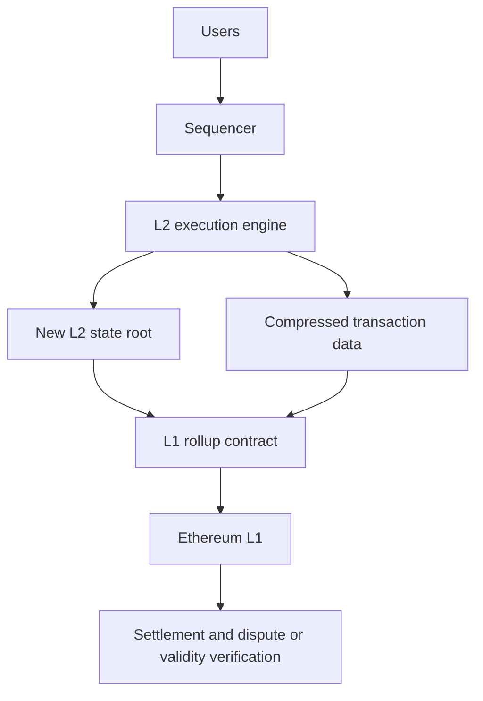

### Rollup security model

A rollup should provide:

* L1-enforced state commitments,
* data availability sufficient for users to reconstruct state,
* escape hatches or forced exits,
* fraud proofs or validity proofs,
* bridge correctness,
* censorship-resistance mechanisms,
* upgrade governance constraints.

### Critical trust boundary

The most important question for any L2 is:

> If the sequencer disappears, censors me, or lies, can I still recover or exit using L1 data?

If not, the system is not inheriting full L1 security.

### Key takeaway

Rollups scale execution by moving computation off L1 while anchoring correctness and settlement to L1.

---

## Slide 90 — Optimistic rollups versus ZK rollups

The deck compares optimistic and ZK rollups.

### Optimistic rollups

Optimistic rollups assume posted state transitions are valid unless challenged.

Flow:

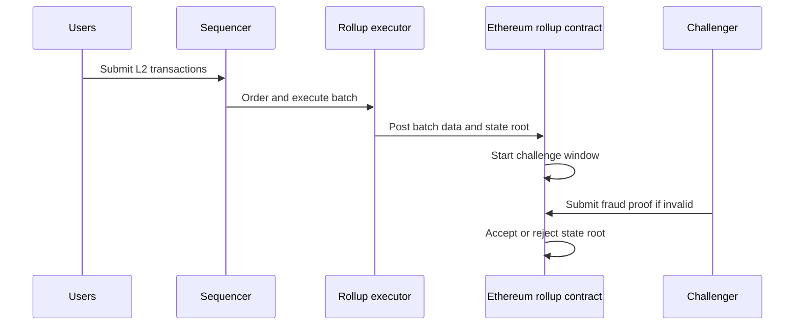

Security depends on at least one honest challenger being able to access data and submit fraud proofs within the challenge period.

Risks:

* data withholding,
* insufficient challenge participation,
* centralized sequencer censorship,
* bridge bugs,
* fraud-proof implementation bugs,
* governance upgrade capture.

### ZK rollups

ZK rollups post a cryptographic validity proof that the new state root follows from valid execution.

```mermaid
sequenceDiagram
    participant U as Users
    participant P as Prover
    participant L2 as L2 executor
    participant L1 as Verifier contract

    U->>L2: Submit transactions
    L2->>P: Execution trace
    P->>P: Generate validity proof
    P->>L1: Submit state root and proof
    L1->>L1: Verify proof
    L1->>L1: Accept new state root
```

Security depends on:

* soundness of the proof system,
* correctness of the circuit or zkVM,
* verifier contract correctness,
* data availability,
* trusted setup assumptions if applicable,
* prover liveness.

### Trade-off table

| Property              | Optimistic rollup                    | ZK rollup                       |
| --------------------- | ------------------------------------ | ------------------------------- |
| Correctness mechanism | Fraud proof                          | Validity proof                  |
| Finality latency      | Challenge window                     | Fast after proof verification   |
| Complexity            | Lower execution proof complexity     | Higher cryptographic complexity |
| Prover cost           | Lower                                | Higher                          |
| Withdrawal latency    | Longer                               | Shorter                         |
| Security assumption   | Honest challenger                    | Sound proof system              |
| Best fit              | EVM compatibility, simpler migration | Fast finality, strong validity  |

### Key takeaway

Optimistic rollups rely on dispute games. ZK rollups rely on cryptographic validity proofs. Both still depend critically on data availability and bridge correctness.

---

## Slides 91–92 — L2 revolution and remaining challenges

The deck correctly highlights that L2s improve throughput and reduce fees, but introduces major unresolved engineering challenges.

### Fragmentation

Multiple L2s create fragmented liquidity and UX:

* assets bridged to different domains,
* inconsistent finality assumptions,
* different sequencer policies,
* different bridge trust models,
* cross-rollup composability problems.

### Centralized sequencers

Many rollups begin with a centralized sequencer.

This creates risks:

* censorship,
* MEV extraction,
* downtime,
* transaction reordering,
* privileged latency,
* regulatory pressure.

Mitigations include:

* decentralized sequencer sets,
* shared sequencing,
* based sequencing,
* forced inclusion via L1,
* encrypted mempools,
* fair ordering protocols.

### Bridges

Bridges are often the highest-risk component.

Bridge failures can arise from:

* multisig compromise,
* light-client bugs,
* proof verifier bugs,
* replay attacks,
* chain reorg assumptions,
* upgrade-key compromise,
* message ordering bugs.

### Key takeaway

Layer 2 systems improve scalability but move complexity into bridges, sequencers, proof systems, and cross-domain security.

---

# Slide 93 — Closing

The closing slide returns to the deck title. The deck as a whole presents cryptocurrency as a practical composition of cryptographic primitives and economic mechanisms.

The most important meta-lesson is:

> Cryptocurrency security is compositional. Digital signatures, hashes, Merkle trees, consensus rules, economic incentives, wallet UX, and implementation correctness must all hold together.

---

# Deep technical synthesis

## Bitcoin protocol flow

```mermaid
sequenceDiagram
    participant Alice
    participant Wallet
    participant P2P as Bitcoin P2P network
    participant Miner
    participant Nodes as Full nodes
    participant Bob

    Alice->>Wallet: Create payment to Bob
    Wallet->>Wallet: Select UTXOs
    Wallet->>Wallet: Sign transaction inputs
    Wallet->>P2P: Broadcast transaction
    P2P->>Nodes: Gossip transaction
    Nodes->>Nodes: Validate signatures and UTXOs
    Miner->>Miner: Select transactions from mempool
    Miner->>Miner: Build block and mine PoW
    Miner->>P2P: Broadcast block
    P2P->>Nodes: Relay block
    Nodes->>Nodes: Verify PoW, Merkle root, transactions
    Nodes->>Bob: Transaction confirmed
```

## Bitcoin validation pipeline

```mermaid
flowchart TD
    A[Receive block] --> B[Parse block]
    B --> C[Check header format]
    C --> D[Check PoW target]
    D --> E[Check previous block known]
    E --> F[Recompute Merkle root]
    F --> G{Merkle root matches?}
    G -- No --> X[Reject]
    G -- Yes --> H[Validate coinbase]
    H --> I[Validate all transactions]
    I --> J[Update UTXO set]
    J --> K[Compute chainwork]
    K --> L{Best chain?}
    L -- Yes --> M[Activate chain tip]
    L -- No --> N[Store side branch]
```

## Ethereum execution pipeline

```mermaid
flowchart TD
    A[Signed Ethereum transaction] --> B[Verify signature and nonce]
    B --> C[Check sender balance]
    C --> D[Buy gas]
    D --> E{To field}
    E -- Empty --> F[Contract creation]
    E -- Address --> G[Message call]
    F --> H[EVM execution]
    G --> H
    H --> I{Execution success?}
    I -- Success --> J[Commit state changes]
    I -- Revert --> K[Revert state changes]
    J --> L[Charge gas used]
    K --> L
    L --> M[Update receipt and logs]
```

---

# Security weaknesses and design limitations

## Bitcoin

Major weaknesses and limitations:

1. **Probabilistic finality**
   Reorgs are always possible.

2. **51% attacks**
   Majority hashpower can censor and double-spend.

3. **Mining centralization**
   ASIC supply chains, mining pools, and energy markets concentrate power.

4. **Fee-market uncertainty**
   Long-term security depends on fees replacing subsidy.

5. **Privacy leakage**
   UTXO graph analysis can deanonymize users.

6. **Key loss is catastrophic**
   Lost private keys mean permanently unspendable coins.

7. **Wallet implementation risk**
   Bad RNG, nonce reuse, insecure seed storage, and phishing can defeat cryptography.

8. **Limited scripting**
   Bitcoin intentionally avoids general computation, reducing expressiveness.

## Ethereum

Major weaknesses and limitations:

1. **Smart-contract bugs**
   Application logic becomes consensus-enforced.

2. **MEV and ordering attacks**
   Transparent mempools enable front-running and sandwich attacks.

3. **Oracle dependency**
   Many contracts depend on off-chain price feeds.

4. **Upgrade governance risk**
   Admin keys and proxies can undermine immutability.

5. **Composability risk**
   Protocols depending on each other can fail recursively.

6. **Validator centralization**
   Staking pools and infrastructure providers create correlated risk.

7. **Cross-chain bridge risk**
   Bridges are complex and frequently security-critical.

## Rollups

Major weaknesses and limitations:

1. **Sequencer centralization**
2. **Bridge contract risk**
3. **Data availability dependency**
4. **Proof-system complexity**
5. **Fraud-proof liveness**
6. **Upgrade-key risk**
7. **Cross-domain message complexity**

---

# Engineering considerations for senior cryptography engineers

## Key management

For Bitcoin and Ethereum, key custody is protocol-level authority.

Engineering requirements:

* use CSPRNG-backed seed generation,
* use hardware-backed signing when possible,
* separate hot and cold keys,
* protect mnemonic backups,
* use multisig for institutional custody,
* use threshold signatures where appropriate,
* enforce domain-separated signing,
* avoid blind signing,
* monitor address reuse and approval risk.

## Signature engineering

Critical concerns:

* deterministic ECDSA nonces,
* low-S normalization,
* chain ID replay protection,
* EIP-712 structured data for Ethereum,
* Schnorr batch verification caveats,
* BLS rogue-key mitigation,
* signature aggregation validation.

## Consensus implementation

Consensus clients must be conservative:

* exact serialization,
* exact integer arithmetic,
* exact target decoding,
* exact fork-choice rules,
* exact gas accounting,
* exact edge-case compatibility,
* extensive differential testing,
* fuzzing,
* formal specs where possible.

## Smart-contract engineering

Production-grade process:

1. threat model,
2. invariants,
3. minimal trusted roles,
4. unit tests,
5. property-based tests,
6. fuzzing,
7. static analysis,
8. formal verification for critical invariants,
9. external audit,
10. bug bounty,
11. monitoring and incident response.

## Rollup engineering

Questions to ask:

* Who controls the sequencer?
* Can users force inclusion?
* Is data available on L1?
* What is the bridge trust model?
* Who can upgrade contracts?
* What is the proof system?
* Is there a trusted setup?
* What happens if the prover fails?
* What happens if the sequencer censors?
* Can users exit safely under adversarial conditions?

---

# Final executive summary

The slide deck explains how cryptocurrencies replace centralized financial trust with cryptographic authorization, public verifiability, distributed consensus, and economic incentives.

Bitcoin solves digital cash by combining digital signatures, the UTXO model, proof-of-work, Merkle trees, and the heaviest-chain rule. Its security is probabilistic and depends on honest majority hashpower, correct full-node validation, and economically rational miners.

Ethereum generalizes the blockchain into a programmable state machine. Smart contracts enable DeFi, DAOs, NFTs, and other applications, but they introduce a much larger attack surface because application bugs become irreversible state transitions.

Proof-of-stake replaces energy-based Sybil resistance with slashable capital. This reduces energy use but introduces different risks: validator key management, weak subjectivity, staking centralization, and slashing correctness.

Layer 2 rollups scale Ethereum by moving execution off-chain while using Ethereum for settlement and security. Optimistic rollups rely on fraud proofs and challenge windows; ZK rollups rely on cryptographic validity proofs. Both depend heavily on data availability, bridge correctness, and sequencer design.

---

# Final technical summary for senior engineers

Cryptocurrency systems are not secured by cryptography alone. They are secured by the composition of:

* signature unforgeability,
* hash collision and preimage resistance,
* authenticated data structures,
* deterministic state-transition validation,
* Sybil-resistance mechanisms,
* fork-choice rules,
* economic incentives,
* network propagation assumptions,
* key-management hygiene,
* and robust implementation.

Bitcoin’s most important primitive is not encryption but **ordered public state transition under proof-of-work**. Ethereum’s most important extension is **general-purpose deterministic replicated execution**. Rollups then split execution and settlement, introducing proof systems and cross-domain trust boundaries.

A senior cryptography engineer should treat every cryptocurrency architecture as a layered adversarial system. The correct question is never only “Is the cryptography sound?” The better question is:

> Under which cryptographic assumptions, consensus assumptions, network assumptions, economic assumptions, key-management assumptions, and governance assumptions does this system remain safe?


Below is a structured first pass over every reading. I normalized terms like “post quantum” instead of using hyphenated wording.

## Big picture

These readings form one coherent topic: quantum computers threaten RSA, finite field Diffie Hellman, and elliptic curve cryptography through Shor’s algorithm, while Grover’s algorithm mainly reduces symmetric security margins. The practical response is post quantum cryptography, especially lattice based key encapsulation and signatures, plus hybrid migration designs that combine classical and post quantum algorithms during the transition. NIST finalized ML KEM, ML DSA, and SLH DSA in August 2024, which is the standards anchor behind much of this reading list. ([NIST][1])

## Required readings

### 1. Jean Philippe Aumasson, Serious Cryptography, Chapter 14, Quantum and Post Quantum

**Core idea:** this chapter is the conceptual bridge from classical cryptography to the post quantum world. It explains why the hardness assumptions behind today’s public key cryptography may fail once large quantum computers exist, and why symmetric cryptography mostly survives with larger parameters.

**Detailed explanation:** the central distinction is between symmetric and asymmetric primitives. AES, SHA 2, SHA 3, HMAC, and modern authenticated encryption are not directly destroyed by quantum computers. Grover’s algorithm gives a quadratic search speedup, so a 128 bit brute force problem behaves more like a 64 bit search against an ideal quantum adversary. The conservative reaction is to use AES 256 and sufficiently long hash outputs when long term quantum resistance matters.

The more serious problem is public key cryptography. RSA depends on integer factorization. Diffie Hellman and elliptic curve Diffie Hellman depend on discrete logarithms. Shor’s algorithm gives an efficient quantum algorithm for both families, so RSA, classic DH, ECDH, DSA, and ECDSA are not acceptable for long term security in a world with cryptographically relevant quantum computers.

The chapter’s main engineering lesson is that post quantum migration is not only about replacing algorithms. Protocols need larger keys, larger ciphertexts, larger signatures, new failure handling, new validation rules, and side channel hardened implementations. This is why KEM based designs, hybrid handshakes, and protocol level agility matter. ([O'Reilly Media][2])

### 2. Gutmann and Neuhaus, Replication of Quantum Factorisation Records with an Eight Bit Home Computer, an Abacus, and a Dog

**Core idea:** this paper is a critique of misleading quantum factoring records. It argues that many publicized quantum factorization demonstrations do not show scalable Shor style cryptanalytic progress, because they exploit prior knowledge, compilation tricks, or problem simplifications.

**Detailed explanation:** the paper’s provocative claim is that some reported quantum factorization milestones can be replicated by absurdly weak classical systems, including a VIC 20, an abacus, and even a dog, because the demonstrations are not factoring in the cryptographically meaningful sense. They often encode the answer into the construction, reduce the instance using special algebraic properties, or solve a toy instance that has no relevance to RSA scale or ECC scale cryptanalysis. ([IACR Eprint Archive][3])

The cryptographic lesson is very important: “largest number factored on a quantum device” is a bad security metric. What matters is whether a fault tolerant quantum computer can run a scalable implementation of Shor’s algorithm with enough logical qubits, gates, error correction, and runtime to attack RSA or elliptic curves. The paper is therefore not saying quantum cryptanalysis is impossible. It is saying that toy factoring demos are poor evidence for cryptographic danger. ([Schneier on Security][4])

### 3. Google Quantum AI, Safeguarding Cryptocurrency by Disclosing Quantum Vulnerabilities Responsibly

**Core idea:** Google argues that quantum vulnerabilities in cryptocurrency should be disclosed like serious security vulnerabilities: enough detail to motivate migration, but not enough to hand attackers an optimized weapon.

**Correction:** I found the public Google Research Blog item dated March 31, 2026, not 2025. I am treating it as the intended reading. ([Google Research][5])

**Detailed explanation:** the blog is attached to a Google Quantum AI whitepaper on elliptic curve cryptocurrency risk. The central target is secp256k1 and related elliptic curve systems used in Bitcoin, Ethereum, and many other blockchain systems. If a public key is visible before a transaction finalizes, a sufficiently powerful quantum computer could derive the private key quickly enough to race or steal the transaction. This is different from the usual “old encrypted data can be decrypted later” story. In cryptocurrencies, the danger can become an active “on spend” attack against public mempool transactions. ([arXiv][6])

The whitepaper claims improved resource estimates for solving the 256 bit elliptic curve discrete logarithm problem, including circuits with fewer than 1200 logical qubits and fewer than 90 million Toffoli gates, or fewer than 1450 logical qubits and fewer than 70 million Toffoli gates. It also states that on certain superconducting assumptions, such attacks could run in minutes with fewer than half a million physical qubits. These are not current machines, but they materially affect migration urgency. ([arXiv][6])

The disclosure lesson is subtle: publish enough to let communities verify urgency and plan migration, but withhold details that would accelerate real attacks. That is why the paper uses a zero knowledge proof approach to validate parts of the resource estimate without fully disclosing the attack construction. ([arXiv][6])

## Optional readings

### 4. The Joy of Cryptography, Chapter 20, Post Quantum Cryptography

**Core idea:** this is likely the most proof oriented introduction in the list. It frames post quantum cryptography through formal security definitions and reductions rather than only engineering migration.

**Detailed explanation:** the public online table of contents confirms Chapter 20 is Post Quantum Cryptography, but the site says most chapters beyond the first few become available online in July 2026. So I cannot verify the full chapter text from the public source. Based on the book’s stated focus, expect the chapter to explain how to reason about post quantum schemes using the same provable security mindset used for encryption, signatures, key exchange, and zero knowledge. ([joyofcryptography.com][7])

The value of this chapter is conceptual discipline. Many engineers think “quantum safe” means “replace ECDH with ML KEM.” A provable security view asks sharper questions: what is the adversary model, what is the security game, what hardness assumption is used, how tight is the reduction, and what changes when the adversary has quantum computation?

### 5. Patton and Schwabe, Prepping for Post Quantum, Beginner’s Guide to Lattice Cryptography

**Core idea:** this is a practical lattice primer. It explains the intuition behind lattices, learning with errors, noisy linear equations, and why these problems are useful for encryption, key encapsulation, and signatures.

**Detailed explanation:** lattice cryptography hides secrets inside structured linear algebra with controlled noise. The rough idea is that solving exact linear equations is easy, but solving large modular linear equations with hidden errors is believed to be hard, even for quantum adversaries. Modern schemes such as ML KEM and ML DSA use module lattice structure to make the schemes efficient while preserving a strong hardness story. ([The Cloudflare Blog][8])

This reading is especially useful because it connects the math to implementation questions: why public keys and ciphertexts are larger than elliptic curve values, why noise must be sampled carefully, why decryption failure probabilities matter, and why constant time arithmetic is non negotiable.

### 6. Lyubashevsky, Basic Lattice Cryptography

**Core idea:** this is a deeper technical explanation of the concepts behind Kyber, now ML KEM, and Dilithium, now ML DSA.

**Detailed explanation:** Lyubashevsky’s tutorial focuses on the mathematical design decisions behind the two main lattice schemes standardized by NIST. It explains module learning with errors, module short integer solution style assumptions, polynomial rings, number theoretic transforms, rejection sampling, and the transform from underlying hard problems to practical KEMs and signatures. ([IACR Eprint Archive][9])

The core takeaway is that ML KEM and ML DSA are not arbitrary new algorithms. They are carefully engineered lattice constructions that trade some conservative simplicity for performance, compactness, and implementability. This is why they became primary standards.

### 7. Barbosa et al., X Wing, The Hybrid KEM You Have Been Looking For

**Core idea:** X Wing is a hybrid KEM that combines X25519 with ML KEM 768 to get security from both classical elliptic curve Diffie Hellman and post quantum lattice assumptions.

**Detailed explanation:** the purpose of a hybrid KEM is migration safety. If ML KEM were later weakened, X25519 still protects against classical adversaries. If a future quantum computer breaks X25519, ML KEM still protects against quantum adversaries. X Wing is designed as a concrete, efficient construction rather than a generic combiner bolted onto two independent KEMs. ([IACR Eprint Archive][10])

This is a deployment oriented paper. Its importance is not only the proof but the engineering shape: a single construction suitable for protocols that need a sensible default during the migration period.

### 8. Apple SEAR, iMessage with PQ3

**Core idea:** PQ3 is Apple’s large scale deployment of post quantum secure messaging, using hybrid initialization and ongoing post quantum rekeying inside conversations.

**Detailed explanation:** many systems add post quantum protection only at session start. Apple’s argument is stronger: long lived messaging conversations need continuous healing. PQ3 periodically injects new post quantum key material into the conversation so that future message keys can become safe again after a compromise. Apple describes this as post quantum rekeying and self healing after key compromise. ([Apple Security Research][11])

The protocol lesson is that secure messaging is harder than TLS style handshakes. Messaging needs asynchronous delivery, multiple devices, conversation state, forward secrecy, post compromise security, and metadata resistant operational behavior. PQ3 is important because it moves post quantum cryptography from theory into consumer scale deployment.

### 9. Linker, Sasse, and Basin, Formal Analysis of Apple’s iMessage PQ3 Protocol

**Core idea:** this paper formally models PQ3 and proves its intended security properties using symbolic verification.

**Detailed explanation:** Apple’s blog says PQ3 is secure, but a formal analysis asks whether the protocol actually satisfies precise properties under a defined adversary model. The paper presents formal verification of PQ3 as a device to device messaging protocol with security against quantum capable adversaries. It models Apple identity services, the post quantum initialization phase, and the ratchet design. ([USENIX][12])

The important lesson is that post quantum deployment must be verified at the protocol level. A secure KEM does not automatically imply a secure messaging protocol. State transitions, replay behavior, device identity, key updates, and compromise recovery all need formal treatment.

### 10. Bhargavan et al., Formal Verification of PQXDH

**Core idea:** this paper analyzes Signal’s PQXDH, the post quantum extension of X3DH for asynchronous secure messaging.

**Detailed explanation:** X3DH is the initial key agreement mechanism used to start Signal style conversations. PQXDH adds post quantum protection so that initial shared secrets remain confidential against “harvest now decrypt later” attacks. The paper formally specifies PQXDH and analyzes it with ProVerif and CryptoVerif. ([USENIX][13])

The key distinction from PQ3 is scope. PQXDH focuses on the initial asynchronous key agreement. PQ3 also emphasizes continuous post quantum rekeying inside the conversation. Both are necessary topics: one protects session start, the other protects long running conversation evolution.

### 11. Dodis et al., Triple Ratchet

**Core idea:** Triple Ratchet proposes a more bandwidth efficient hybrid secure Signal style protocol.

**Detailed explanation:** post quantum ratcheting is expensive because lattice public keys and ciphertexts are much larger than elliptic curve values. A naive post quantum ratchet can send large KEM material too frequently. Triple Ratchet tries to preserve hybrid security while reducing repeated transmission of post quantum material. ([IACR Eprint Archive][14])

The core contribution is efficiency under realistic messaging conditions. It treats bandwidth not as a secondary optimization but as a security deployment constraint. If a post quantum messenger is too heavy, platforms will delay deployment or silently weaken guarantees.

### 12. Westerbaan, The State of the Post Quantum Internet

**Core idea:** this reading surveys deployment reality. It explains what has actually changed on the Internet and what remains difficult.

**Detailed explanation:** Cloudflare’s 2024 update notes that the field changed quickly: Kyber became ML KEM, signature candidates evolved, and SIKE suffered a catastrophic attack. It also reports early deployment data, including that almost 2 percent of TLS 1.3 connections established with Cloudflare were protected with post quantum mechanisms at that point. ([The Cloudflare Blog][15])

This reading is valuable because it prevents a purely academic view. Real Internet deployment has constraints: packet size, handshake fragmentation, middlebox behavior, certificate chains, CPU cost, client compatibility, monitoring, and failure rollback.

### 13. Schmieg, Kölbl, and Endignoux, Google’s Threat Model for Post Quantum Cryptography

**Core idea:** Google’s threat model prioritizes migration based on actual risk, especially confidentiality loss from stored traffic and authenticity failure from broken signatures.

**Detailed explanation:** Google’s later hybrid deployment blog explicitly says its migration approach is driven by its post quantum threat model. The key idea is that confidentiality is already at risk for long lived secrets because adversaries can record encrypted traffic now and decrypt it later. Signatures are different: they usually do not expose old confidentiality, but broken signature schemes can create catastrophic authenticity failures once a quantum attacker exists. ([bughunters.google.com][16])

The practical takeaway is prioritization. First protect high value encrypted traffic using hybrid KEMs. Then migrate signatures before quantum computers arrive, because authentication roots, firmware signatures, certificates, package signing, and blockchains can have very long lifetimes.

### 14. Bernstein et al., KyberSlash

**Core idea:** KyberSlash shows that even standardized post quantum algorithms can be broken in practice by timing leakage if implementations are not constant time.

**Detailed explanation:** the attacks exploit secret dependent division timings in Kyber implementations, including reference style implementations. The authors demonstrate key recovery on platforms such as Raspberry Pi 2 and Arm Cortex M4, with recovery times ranging from minutes to hours depending on the variant. ([KyberSlash][17])

The lesson is severe: post quantum security is not only a math problem. Lattice schemes use modular arithmetic, compression, decompression, rejection sampling, and polynomial operations. If any operation branches, divides, indexes memory, or runs for variable time based on secret data, the implementation can leak the private key.

### 15. Ravi et al., Lattice Based Key Sharing Schemes, A Survey

**Core idea:** this survey maps the evolution of lattice based public key encryption, KEMs, and key exchange schemes.

**Detailed explanation:** it covers the design space of lattice based key sharing schemes, including theoretical assumptions, NIST candidates, algorithmic structure, and software and hardware performance considerations. ([IACR Eprint Archive][18])

Its value is comparative. Instead of learning only ML KEM, you see the family tree: LWE, Ring LWE, Module LWE, NTRU style constructions, reconciliation based key exchange, and KEM transforms. This helps you understand why some designs were standardized and others were not.

### 16. Mosca and Piani, Quantum Threat Timeline Report

**Core idea:** this is a risk management report about when cryptographically relevant quantum computers may arrive and how organizations should plan migration.

**Detailed explanation:** the 2024 report collected views from 32 global experts on quantum computing progress and cyber risk. Its role is not to predict an exact date. Its role is to convert uncertainty into planning pressure. ([Global Risk Institute][19])

The essential framework is: migration must finish before the threat arrives, and data confidentiality may need protection before that because of stored traffic. So the relevant question is not “do quantum computers exist today?” The relevant question is “will my data or trust anchor still matter when they do?”

### 17. Alwen, Hale, Mularczyk, and Tian, Flexible Hybrid PQ MLS Combiner

**Core idea:** this draft addresses post quantum migration for MLS, the group messaging protocol behind modern secure group communication.

**Detailed explanation:** MLS groups are more complex than two party messaging because group membership, commits, epochs, and sender state all evolve. The combiner design uses a traditional MLS session and a post quantum MLS session, then combines exported secrets to seed post quantum guarantees into the traditional session. This amortizes the cost of post quantum operations. ([Messaging Layer Security (MLS)][20])

The core deployment idea is amortization. You do not necessarily need to pay the full post quantum cost on every group operation. You can inject post quantum entropy periodically or strategically while keeping the main group protocol efficient.

### 18. Randriambololona, The Syzygy Distinguisher

**Core idea:** this is a cryptanalytic result against structured code based cryptography, especially alternant and Goppa codes.

**Detailed explanation:** the paper presents a new distinguisher for alternant and Goppa codes with subexponential complexity in the error correcting capability. It is notable because it applies to codes used in Classic McEliece, a major code based post quantum candidate. ([ACM Digital Library][21])

A distinguisher is not automatically a full key recovery attack. But it matters because code based cryptography often relies on the assumption that the public code hides exploitable structure. If a distinguisher detects structure more efficiently than expected, designers must reassess margins, parameters, and proof assumptions.

### 19. Miller, OpenSSH, Post Quantum Cryptography

**Core idea:** OpenSSH is already deploying post quantum key agreement by default and warning users when connections do not use it.

**Detailed explanation:** OpenSSH says it has offered post quantum key agreement by default since version 9.0 in April 2022 using sntrup761x25519 sha512. It later added mlkem768x25519 sha256 in OpenSSH 9.9 and made that the default in OpenSSH 10.0 in April 2025. OpenSSH 10.1 warns when a connection uses non post quantum key agreement. ([OpenSSH][22])

This is one of the clearest real world migration examples. It uses hybrid key agreement, so even if the post quantum component is later weakened, the classical X25519 component still preserves the previous classical security level. ([OpenSSH][22])

### 20. Craig Gidney, Why Have Quantum Computers Not Factored 21 Yet?

**Core idea:** factoring 21 is a misleading benchmark for quantum progress.

**Detailed explanation:** Gidney explains that factoring 15 had special shortcuts, while factoring 21 requires a much less forgiving circuit structure. The fact that machines have not cleanly factored 21 using a meaningful scalable approach does not imply there has been no quantum progress. It shows that toy factoring numbers are bad benchmarks. ([algassert.com][23])

This reading pairs well with Gutmann and Neuhaus. Both warn against benchmark theater. For cryptography, the important metrics are logical qubits, Toffoli count, circuit depth, error correction overhead, physical error rate, and wall clock runtime.

### 21. Babbush et al., Securing Elliptic Curve Cryptocurrencies Against Quantum Vulnerabilities

**Core idea:** this is the technical whitepaper behind Google’s cryptocurrency disclosure. It gives resource estimates and mitigation strategy for quantum attacks on elliptic curve based cryptocurrencies.

**Detailed explanation:** the paper estimates that Shor’s algorithm for 256 bit elliptic curve discrete logarithms can be implemented with fewer logical qubits and gates than previously appreciated. It focuses on secp256k1, the curve used by Bitcoin and many other systems. It distinguishes fast clock architectures such as superconducting and photonic machines from slow clock architectures such as neutral atom and ion trap machines, because attack feasibility depends heavily on runtime. ([arXiv][6])

The cryptocurrency specific insight is that vulnerability is not limited to abandoned coins. Active spending can reveal a public key before finality, creating a transaction race if a quantum attacker can derive the private key fast enough. The paper also discusses harder governance questions: dormant assets, smart contracts, proof of stake systems, data availability sampling, and whether communities need policy for quantum exposed abandoned funds. ([arXiv][6])

## The core idea of the whole reading set

The central message is this:

Classical public key cryptography is living on borrowed time, not because quantum computers can break it today, but because migration is slow, data lifetimes are long, and the engineering surface is huge. The winning strategy is not panic. It is staged migration: inventory cryptography, protect confidentiality first with hybrid KEMs, migrate signatures before quantum capable attackers arrive, verify protocols formally, harden implementations against side channels, and treat deployment constraints as first class cryptographic requirements.

[1]: https://www.nist.gov/news-events/news/2024/08/nist-releases-first-3-finalized-post-quantum-encryption-standards "NIST Releases First 3 Finalized Post-Quantum Encryption ..."
[2]: https://www.oreilly.com/library/view/serious-cryptography/9781492067511/xhtml/ch14.xhtml "Quantum and Post-Quantum - Serious Cryptography [Book]"
[3]: https://eprint.iacr.org/2025/1237 "Replication of Quantum Factorisation Records with an 8-bit ..."
[4]: https://www.schneier.com/blog/archives/2025/07/cheating-on-quantum-computing-benchmarks.html "Cheating on Quantum Computing Benchmarks"
[5]: https://research.google/blog/safeguarding-cryptocurrency-by-disclosing-quantum-vulnerabilities-responsibly/ "Safeguarding cryptocurrency by disclosing quantum ..."
[6]: https://arxiv.org/abs/2603.28846 "Securing Elliptic Curve Cryptocurrencies against Quantum Vulnerabilities: Resource Estimates and Mitigations"
[7]: https://joyofcryptography.com/preface/ "Preface"
[8]: https://blog.cloudflare.com/lattice-crypto-primer/ "Prepping for post-quantum: a beginner's guide to lattice ..."
[9]: https://eprint.iacr.org/2024/1287 "The concepts behind Kyber (ML-KEM) and Dilithium (ML-DSA)"
[10]: https://eprint.iacr.org/2024/039 "X-Wing: The Hybrid KEM You've Been Looking For"
[11]: https://security.apple.com/blog/imessage-pq3/ "iMessage with PQ3: The new state of the art in quantum- ..."
[12]: https://www.usenix.org/conference/usenixsecurity25/presentation/linker "A Formal Analysis of Apple's iMessage PQ3 Protocol"
[13]: https://www.usenix.org/conference/usenixsecurity24/presentation/bhargavan "Formal verification of the PQXDH Post-Quantum key ..."
[14]: https://eprint.iacr.org/2025/078 "Triple Ratchet: A Bandwidth Efficient Hybrid-Secure Signal ..."
[15]: https://blog.cloudflare.com/pq-2024/ "The state of the post-quantum Internet"
[16]: https://bughunters.google.com/blog/why-hybrid-deployments-are-key-to-secure-pqc-migration "Why Hybrid Deployments Are Key to Secure PQC Migration"
[17]: https://kyberslash.cr.yp.to/papers.html "Papers - KyberSlash"
[18]: https://eprint.iacr.org/2020/1276 "Lattice-based Key Sharing Schemes - A Survey"
[19]: https://globalriskinstitute.org/publication/2024-quantum-threat-timeline-report/ "Quantum Threat Timeline Report 2024"
[20]: https://messaginglayersecurity.rocks/mls-combiner/draft-ietf-mls-combiner.html "Amortized PQ MLS Combiner"
[21]: https://dl.acm.org/doi/10.1007/978-3-031-91095-1_12 "The syzygy Distinguisher | Advances in Cryptology"
[22]: https://www.openssh.com/pq.html "OpenSSH: Post-Quantum Cryptography"
[23]: https://algassert.com/post/2500 "Why haven't quantum computers factored 21 yet?"

