# Topic 2.8: Zero-Knowledge Proofs

## Assessment Window
- Final track

## Overview
Completeness/soundness/zero-knowledge, Sigma protocols, Fiat-Shamir, and real-world ZK deployments.

## Required Readings
- The Joy of Cryptography, Chapter 19: Zero-Knowledge Proofs.
- Amit Sahai, Computer Scientist Explains One Concept in 5 Levels of Difficulty, WIRED, 2022.

## Optional Readings
- Add optional reading links here.

## Materials
- [ ] Slides
- [ ] Quiz


I treat the PDF page number as the slide number. The deck is *Applied Cryptography, Part 2: Real-World Cryptography, 2.8: Zero-Knowledge Proofs*, covering Schnorr identification, Sigma protocols, AND/OR composition, Fiat-Shamir, circuit ZK, attacks on Fiat-Shamir/GKR-style systems, zkVMs, RISC Zero, ZK Battleship, Zcash, and real-world identity/privacy applications. 

# Slide-by-slide technical explanation

## Slides 1–2 — Framing: Zero-knowledge proofs

The deck frames zero-knowledge proofs as a real-world cryptographic primitive, not just a theoretical curiosity. A zero-knowledge proof lets a prover convince a verifier that a statement is true without revealing the witness that makes the statement true.

A formal way to state the setting is:

```text
Public instance: x
Private witness: w
Relation: R(x, w) = true
Language: L = { x | exists w such that R(x, w) = true }
```

The prover wants to prove:

```text
x is in L
```

without revealing `w`.

This distinction matters because most cryptographic systems do not merely need secrecy. They need **selective disclosure**: proving authorization, validity, balance, membership, age, solvency, computation correctness, or policy compliance while leaking as little as possible.

---

## Slides 3–5 — The core ZK properties: completeness, soundness, zero-knowledge

Slides 3–5 introduce the canonical triad:

1. **Completeness**
   If the statement is true and both parties follow the protocol, the verifier accepts.

2. **Soundness**
   If the statement is false, a malicious prover cannot convince the verifier except with negligible probability.

3. **Zero-knowledge**
   The verifier learns nothing beyond the fact that the statement is true.

From a senior cryptography-engineering perspective, these properties correspond to three failure modes:

| Property       | If broken          | Practical consequence                            |
| -------------- | ------------------ | ------------------------------------------------ |
| Completeness   | Honest proofs fail | Users get locked out, valid transactions fail    |
| Soundness      | False claims pass  | Forgery, inflation, invalid computation accepted |
| Zero-knowledge | Witness leaks      | Privacy loss, credential leakage, key compromise |

The deck’s password/vault example is useful, but in real systems the “password” is often a private key, credential attribute, note commitment opening, Merkle path, vote value, or computation trace.

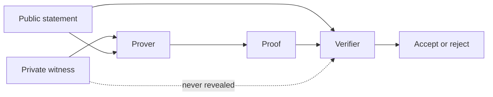

### Security implication

Zero-knowledge does **not** mean the verifier learns nothing at all. The verifier learns the truth of the statement. The point is that the verifier learns nothing *beyond* that.

For example:

```text
Statement: "I am over 18."
Leaked by design: The user is over 18.
Protected: Exact birthdate, name, ID number, address.
```

### Key takeaway

ZK is controlled information release. It converts “reveal the secret so I can check it” into “prove the property without revealing the secret.”

---

## Slide 6 — Knowledge soundness

Slide 6 introduces a critical distinction: ordinary soundness versus **knowledge soundness**.

Ordinary soundness says:

```text
A false statement cannot be proven.
```

Knowledge soundness says something stronger:

```text
If a prover convinces the verifier, then the prover must know a valid witness.
```

This is usually formalized with an **extractor**. If a prover can successfully produce accepting transcripts, an efficient extractor can recover the witness from that prover’s behavior.

This matters in protocols such as:

* identification,
* signatures,
* anonymous credentials,
* proof-of-reserve protocols,
* confidential transactions,
* verifiable computation,
* recursive proof systems.

For example, if someone proves knowledge of a private key corresponding to public key `A`, knowledge soundness means the protocol is not merely proving that such a key exists. It proves the prover actually knows it.

### Engineering insight

Many production failures in ZK systems are not due to broken zero-knowledge. They are due to broken **soundness** or broken **witness binding**. A proof that leaks nothing but proves the wrong thing is useless or dangerous.

### Key takeaway

For authentication and authorization, ordinary validity is insufficient. You usually need proof of knowledge.

---

## Slides 7–9 — Schnorr identification protocol

Slides 7–9 introduce Schnorr identification: the canonical Sigma protocol for proving knowledge of a discrete logarithm.

Let:

```text
G be a cyclic group of prime order q
g be a generator
a be the prover's secret
A = g^a be the public key
```

The prover wants to prove knowledge of `a` without revealing `a`.

Protocol:

```text
1. Prover samples y <- Z_q
2. Prover computes Y = g^y
3. Verifier samples challenge c <- Z_q
4. Prover responds r = y + c*a mod q
5. Verifier checks g^r == Y * A^c
```

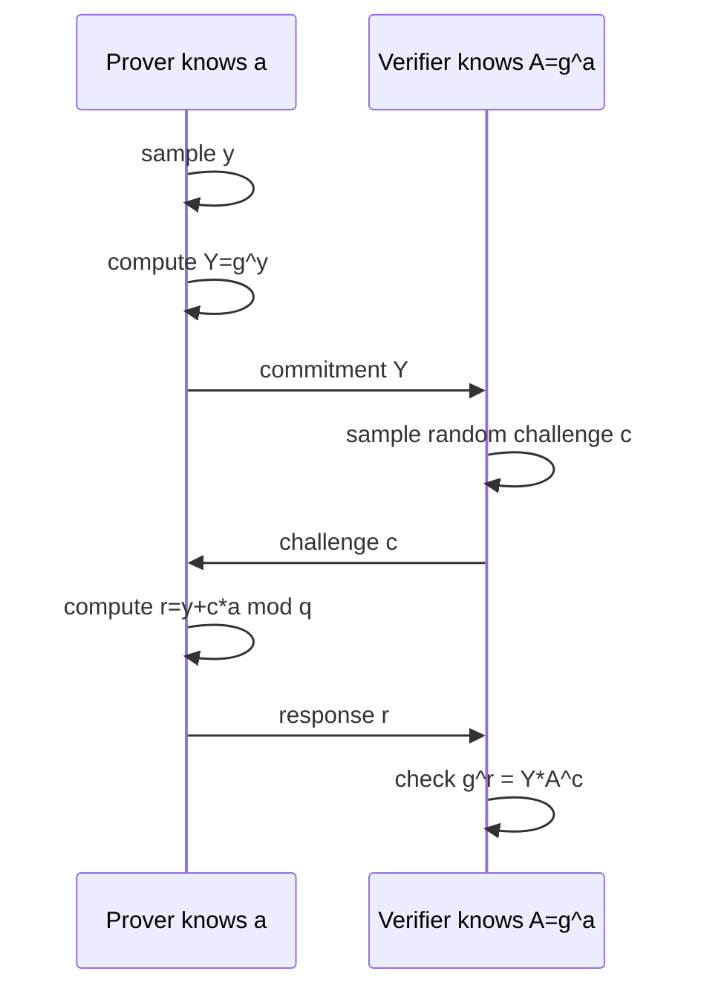

### Why verification works

The verifier checks:

```text
g^r = g^(y + c*a)
    = g^y * g^(c*a)
    = Y * (g^a)^c
    = Y * A^c
```

So an honest prover always succeeds.

### Why the secret is hidden

The response is:

```text
r = y + c*a mod q
```

Because `y` is uniformly random, it acts as a one-time mask over `c*a`. The response `r` is uniformly distributed from the verifier’s perspective.

### Why this matters

Schnorr identification is foundational because it gives the basic ZK pattern:

```text
commit -> challenge -> response
```

It also underlies Schnorr signatures after applying Fiat-Shamir.

### Implementation risks

A senior crypto engineer should care about:

* correct group selection,
* prime-order subgroup validation,
* challenge length,
* domain separation,
* randomness quality for `y`,
* constant-time scalar arithmetic,
* transcript binding,
* public-key validation,
* avoiding nonce reuse in signature variants.

If the same nonce `y` is reused in Schnorr signatures, the secret key can be recovered.

Given:

```text
r1 = y + c1*a
r2 = y + c2*a
```

then:

```text
a = (r1 - r2) / (c1 - c2) mod q
```

### Key takeaway

Schnorr identification proves knowledge of a discrete logarithm using randomness, challenge unpredictability, and algebraic verification.

---

## Slides 10–17 — Why Schnorr is zero-knowledge

Slides 10–17 explain the simulation argument. This is the core of the zero-knowledge property.

A real Schnorr transcript is:

```text
A = g^a
Y = g^y
c <- Z_q
r = y + c*a
Transcript = (A, Y, c, r)
```

A simulated transcript can be generated without knowing `a`:

```text
choose c <- Z_q
choose r <- Z_q
Y = g^r * (A^c)^-1
Transcript = (A, Y, c, r)
```

The simulated transcript verifies because:

```text
Y * A^c = g^r * (A^c)^-1 * A^c = g^r
```

So:

```text
g^r = Y * A^c
```

The verifier cannot distinguish real transcripts from simulated transcripts.

```mermaid
flowchart TD
    A[Pick challenge c] --> B[Pick response r]
    B --> C[Compute Y = g^r * inverse(A^c)]
    C --> D[Transcript Y,c,r verifies]
    D --> E[No witness was used]
    E --> F[Transcript carries no transferable evidence]
```

### Deniability

Interactive Schnorr transcripts are deniable. A verifier cannot later prove to a third party that the interaction happened with the real prover, because the verifier could have generated an indistinguishable transcript alone.

This is the point of the Robin Hood parable in slides 18–21: arrows already inside targets do not prove skill if someone could have painted the targets afterward. Likewise, an accepting Schnorr transcript does not prove to outsiders that the prover participated, because the verifier could have generated it.

### Important nuance

This zero-knowledge property is **honest-verifier zero-knowledge**. The simulator works because the challenge is assumed to be honestly random. Malicious-verifier zero-knowledge requires stronger treatment.

### Key takeaway

Zero-knowledge is usually proven by showing that whatever the verifier sees could have been simulated without the witness.

---

## Slides 18–21 — Parables: deniability and non-transferability

The Robin Hood and Alice/Bob/Charlie parables make one subtle point: an interactive ZK proof can convince the verifier during the interaction while leaving no transferable evidence afterward.

This property is valuable for authentication. If Bob authenticates Alice via interactive Schnorr, Bob should not be able to take the transcript and impersonate Alice elsewhere or convince Charlie that Alice authenticated.

### Security implication

Interactive ZK identification protocols resist replay if the verifier’s challenge is fresh and unpredictable. But they require careful session binding:

```text
challenge = random nonce bound to this session
```

If challenges are reused, predictable, or attacker-controlled in a bad way, identification protocols can become replayable or malleable.

### Key takeaway

Interactive ZK can provide authentication without creating reusable proof artifacts.

---

# Section 2 — Sigma protocols

## Slides 22–24 — ZK scales beyond authentication

Slides 23–24 emphasize that ZK is not limited to private-key knowledge. The deck mentions ZK virtual machines and a Battleship game where the server proves correct responses without revealing ship positions. 

This introduces a major transition:

```text
ZK as an identification primitive
        ->
ZK as a general verifiable-computation primitive
```

Examples:

* prove a ciphertext encrypts 0 or 1,
* prove a value is in a range,
* prove a program executed correctly,
* prove a valid vote without revealing the vote,
* prove solvency without revealing all assets,
* prove compliance without revealing identity.

### Key takeaway

The power of ZK is not “hiding secrets” in isolation. It is proving structured statements about secrets.

---

## Slides 25–30 — Sigma protocols as a general framework

A Sigma protocol abstracts the Schnorr pattern:

```text
1. Commitment
2. Challenge
3. Response
```

Formal components:

```text
Commit(X, W) -> (Y, sigma)
Challenge c <- C
Respond(sigma, c) -> r
Check(X, Y, c, r) -> true/false
```

Where:

```text
X = public instance
W = private witness
R(X, W) = true
```

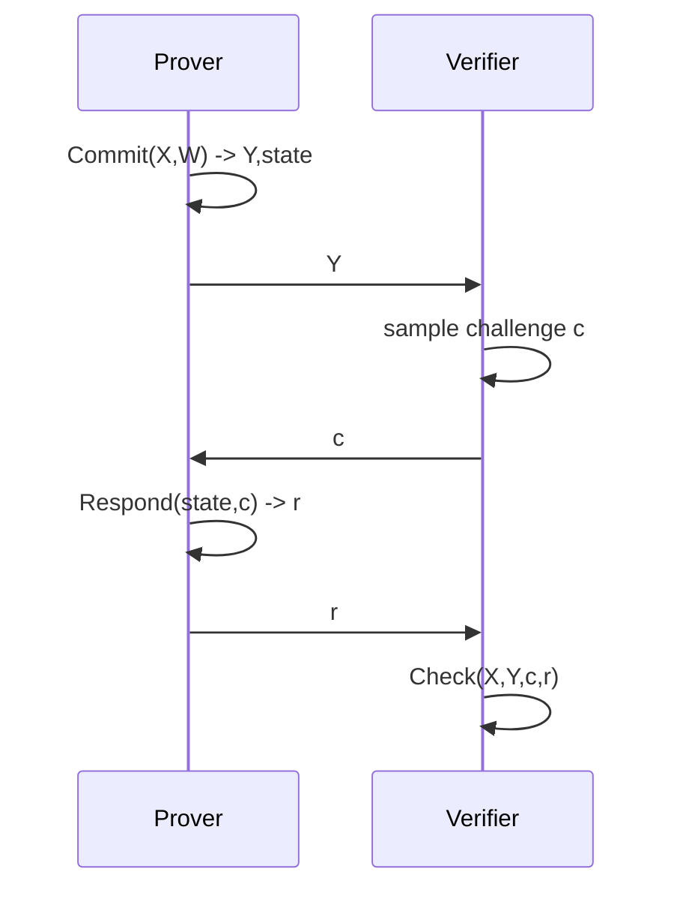

### Why Sigma protocols matter

Sigma protocols are modular. Once a protocol satisfies:

* completeness,
* special soundness,
* honest-verifier zero-knowledge,

it can often be composed into larger proofs.

### Schnorr as Sigma

For Schnorr:

```text
X = A = g^a
W = a
Y = g^y
c <- Z_q
r = y + c*a
Check: g^r == Y*A^c
```

### Key takeaway

Sigma protocols are the reusable three-message architecture behind many practical ZK systems.

---

## Slide 31 — Proof of representation / Pedersen-style relations

Slide 31 generalizes Schnorr to proving knowledge of a representation:

```text
X = g^a h^b
```

The prover wants to prove knowledge of `(a, b)` without revealing them.

Protocol:

```text
Commit:
    choose r, s
    Y = g^r h^s

Challenge:
    c

Respond:
    u = r + c*a
    v = s + c*b

Verify:
    g^u h^v == Y * X^c
```

Verification works because:

```text
g^u h^v = g^(r+c*a) h^(s+c*b)
        = g^r h^s * (g^a h^b)^c
        = Y * X^c
```

### Why this matters

This is closely related to **Pedersen commitments**:

```text
Com(m; r) = g^m h^r
```

If nobody knows the discrete-log relationship between `g` and `h`, Pedersen commitments are:

* perfectly hiding,
* computationally binding under discrete-log assumptions.

Proofs of representation are used in:

* confidential transactions,
* range proofs,
* e-voting,
* mix networks,
* anonymous credentials,
* commitment openings.

### Key takeaway

Representation proofs let us prove knowledge of committed values while preserving hiding.

---

## Slide 32 — “Any NP statement” and practical nuance

Slide 32 states that Sigma protocols can prove almost any statement and mentions graph problems, number theory, and cryptographic statements.

A careful formulation is:

> General zero-knowledge proof systems exist for NP statements, but not every NP statement has a simple, efficient, natural Sigma protocol.

For practical engineering:

* use custom Sigma protocols for algebraic statements,
* use circuit/SNARK/STARK systems for arbitrary computations,
* avoid forcing complex computations into hand-written Sigma protocols unless there is a strong efficiency reason.

### Key takeaway

ZK is general in theory, but efficiency depends heavily on the statement representation.

---

## Slides 33–43 — Formal Sigma protocol properties

Slides 34–43 cover completeness, special soundness, zero-knowledge, and honest-verifier zero-knowledge.

### Completeness

If the prover has a valid witness and follows the protocol, verification succeeds.

For Schnorr:

```text
r = y + c*a
g^r = g^(y+c*a) = g^y * g^(c*a) = Y * A^c
```

### Special soundness

If a prover can answer two different challenges for the same commitment, the witness can be extracted.

For Schnorr, suppose we have:

```text
r  = y + c*a
r' = y + c'*a
```

Subtract:

```text
r - r' = (c - c')*a mod q
```

Extract:

```text
a = (r - r') * inverse(c - c') mod q
```

```mermaid
flowchart TD
    T1[Transcript 1: Y,c,r] --> E[Extractor]
    T2[Transcript 2: same Y,c2,r2] --> E
    E --> D[Compute a = (r-r2)/(c-c2)]
    D --> W[Witness recovered]
```

### Why this implies soundness

A prover that does not know the witness can prepare for at most one challenge for a fixed commitment. If challenges are uniformly random from a large space, the cheating probability is negligible.

```text
Pr[cheat] <= 1 / |C|
```

For a 128-bit challenge space, this is about `2^-128`.

### Honest-verifier zero-knowledge

Sigma protocols are often only HVZK by default. The verifier must choose the challenge randomly. If the verifier chooses challenges maliciously, security may require additional transforms or stronger protocols.

### Key takeaway

Sigma protocol security comes from a tight triangle: honest provers can answer, cheating provers cannot answer multiple challenges, and transcripts can be simulated.

---

# Section 3 — Proving AND and OR

## Slides 44–47 — Composing statements

Slides 44–47 introduce logical composition:

```text
AND: prove all conditions hold.
OR: prove at least one condition holds without revealing which one.
```

This is essential in privacy-preserving systems.

Examples:

```text
"I know the private key for A1 OR A2 OR A3."
```

This enables anonymous authentication.

```text
"This encrypted vote is YES OR NO."
```

This enables vote validity without vote disclosure.

### Key takeaway

AND/OR composition turns simple proofs into expressive privacy-preserving policies.

---

## Slides 48–52 — OR proofs

An OR proof lets the prover prove:

```text
P0 OR P1
```

while only knowing a witness for one branch and hiding which branch is real.

Suppose the prover knows a witness for `P0`, but not `P1`.

The trick:

1. Generate a real commitment for `P0`.
2. Simulate a fake accepting transcript for `P1`.
3. Receive global challenge `C`.
4. Set:

```text
C0 = C - C1 mod q
```

5. Use the real witness to answer challenge `C0`.
6. Return both branch transcripts.

Verifier checks:

```text
C0 + C1 == C mod q
Verify branch 0
Verify branch 1
```

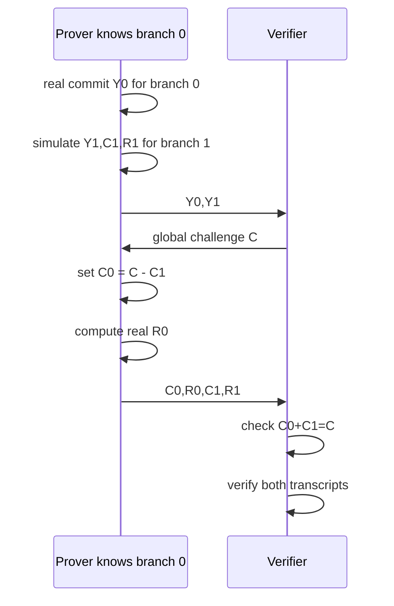

### Why it hides the branch

The simulated branch is indistinguishable from the real branch, because Sigma transcripts are simulatable. The verifier sees two accepting transcripts and cannot tell which one used a witness.

### Use cases

* ring signatures,
* anonymous credentials,
* group membership proofs,
* e-voting validity proofs,
* confidential transaction range proofs,
* policy proofs such as “member of one authorized class.”

### Misuse cases

OR proofs can fail if:

* challenge arithmetic is not modulo the right field,
* simulated transcripts are distinguishable,
* public instances are not domain-separated,
* branch ordering leaks metadata,
* witness-dependent timing leaks the real branch,
* Fiat-Shamir transcript binding omits a branch.

### Key takeaway

OR proofs give selective anonymity: the verifier learns that one condition is true but not which one.

---

## Slides 53–57 — AND proofs

An AND proof proves multiple statements simultaneously.

Naively running independent Sigma protocols can be safe in some settings, but the standard composition uses one common challenge across all subproofs.

For statements:

```text
P1 AND P2 AND ... AND Pk
```

the protocol is:

```text
1. Commit to all substatements: Y1,...,Yk
2. Verifier sends one challenge C
3. Prover responds to all subprotocols using C
4. Verifier checks every transcript
```

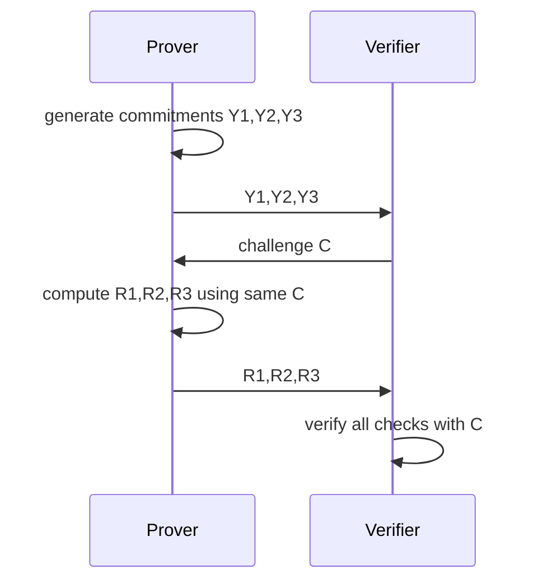

### Equality of discrete logs

Slide 56 gives a classic proof that the same secret exponent `a` is used across multiple public keys:

```text
A1 = g1^a
A2 = g2^a
A3 = g3^a
```

Protocol:

```text
choose y
Y1 = g1^y
Y2 = g2^y
Y3 = g3^y
receive C
R = y + C*a
verify:
    g1^R == Y1*A1^C
    g2^R == Y2*A2^C
    g3^R == Y3*A3^C
```

This proves all three public keys share the same discrete log without revealing it.

### Engineering relevance

Equality-of-discrete-log proofs are important in:

* Diffie-Hellman consistency checks,
* mixnets,
* threshold cryptography,
* credential systems,
* verifiable key generation,
* cross-domain identity binding,
* DLEQ proofs in VOPRF/Privacy Pass-style systems.

### Key takeaway

AND proofs enforce simultaneous truth; OR proofs provide privacy over which truth holds. Together, they build expressive ZK policies.

---

# Section 4 — Non-interactive zero-knowledge proofs

## Slides 58–63 — Fiat-Shamir transformation

Interactive Sigma protocols require the verifier to send a random challenge. Fiat-Shamir removes the verifier by deriving the challenge from a hash of the transcript.

Interactive:

```text
P -> V: Y
V -> P: c
P -> V: r
```

Fiat-Shamir:

```text
Y = Commit(X,W)
c = H(X, Y)
r = Respond(state, c)
proof = (Y, r)
```

Verifier recomputes:

```text
c = H(X, Y)
Check(X, Y, c, r)
```

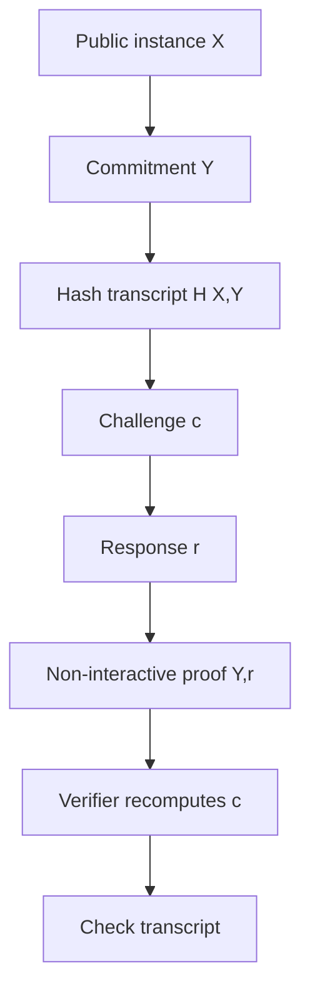

### Fiat-Shamir Schnorr as a signature

If the challenge includes a message:

```text
c = H(A, Y, m)
r = y + c*a
signature = (Y, r)
```

then verification checks:

```text
g^r == Y * A^c
```

This is essentially the Schnorr signature idea.

### Why transcript binding matters

A Fiat-Shamir hash must include every relevant context item:

```text
protocol_id
version
public key
commitment
public inputs
message
domain separator
curve/group identifier
statement encoding
```

Missing transcript fields cause replay, substitution, or cross-protocol attacks.

### Key takeaway

Fiat-Shamir converts interactive challenge-response proofs into portable proofs, signatures, and NIZKs by replacing verifier randomness with a hash-derived challenge.

---

## Slides 64–67 — Soundness, Forking Lemma, and loss of deniability

Slide 64 explains the central Fiat-Shamir ordering requirement:

```text
commitment first, challenge second
```

The hash function is intended to force this order because the challenge depends on the commitment.

### Forking Lemma

The Forking Lemma is a proof technique. If an adversary can produce a valid Fiat-Shamir proof, then in the random oracle model we can rewind it and answer the same hash query with a different challenge.

This gives two valid transcripts with the same commitment:

```text
(Y, c, r)
(Y, c', r')
```

Then special soundness extracts the witness.

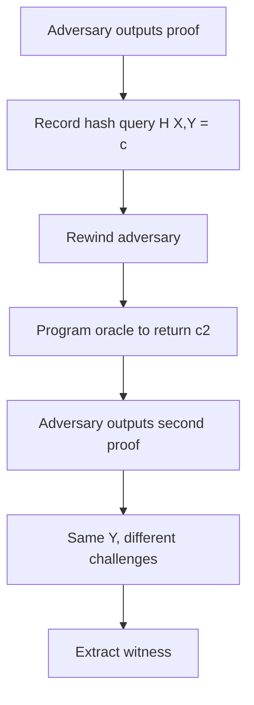

### Random oracle model nuance

In real life, SHA-256 or SHA-3 is deterministic. The extractor’s ability to “reprogram the hash” is a proof technique in the random oracle model, not an operational capability.

This means Fiat-Shamir proofs are often secure under idealized assumptions. Good engineering still requires:

* domain separation,
* canonical encoding,
* collision-resistant transcript construction,
* no ambiguous serialization,
* no omitted public input,
* no circular dependency in the transcript,
* protocol-specific Fiat-Shamir analysis.

### Deniability lost

Interactive Schnorr transcripts are deniable because anyone can simulate them. Fiat-Shamir proofs are publicly verifiable and transferable.

This is useful for signatures and blockchain proofs, but it changes the privacy semantics.

### Key takeaway

Fiat-Shamir buys non-interactivity and public verifiability, but it relies on careful transcript design and loses deniability.

---

## Slide 68 — Applications of Fiat-Shamir

The deck lists signatures, ring signatures, Bulletproofs, SNARKs, STARKs, and proof-of-knowledge systems.

From an engineering perspective, Fiat-Shamir is everywhere:

* Schnorr signatures,
* EdDSA-like signatures,
* Bulletproof range proofs,
* inner-product arguments,
* polynomial commitment opening proofs,
* STARK transcripts,
* many SNARK proof systems,
* ZK rollup validity proofs,
* proof-of-reserve systems.

### Implementation risks

Most practical Fiat-Shamir failures come from transcript mistakes:

```text
c = H(commitment)
```

when it should be:

```text
c = H(domain || statement || public_inputs || commitments || prior_messages)
```

Bad transcript binding can allow:

* proof replay,
* proof malleability,
* statement substitution,
* cross-chain replay,
* cross-protocol attacks,
* challenge grinding,
* recursive self-reference issues.

### Key takeaway

Fiat-Shamir is simple to describe but easy to implement unsafely.

---

# Section 4.2 — Fiat-Shamir circuits

## Slides 69–75 — From statements to circuits

Slides 70–75 transition from hand-designed protocols to circuit ZK.

The new paradigm is:

```text
Instead of designing a protocol for each relation,
encode the relation as a circuit and use a general-purpose proof system.
```

A circuit has:

* public inputs,
* private witnesses,
* gates,
* wires,
* constraints,
* outputs.

Example:

```text
y = (a + b) * c
```

can be represented as constraints:

```text
t = a + b
y = t * c
```

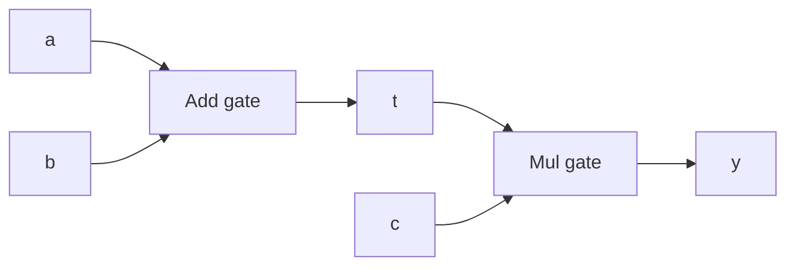

### Circuit ZK pipeline

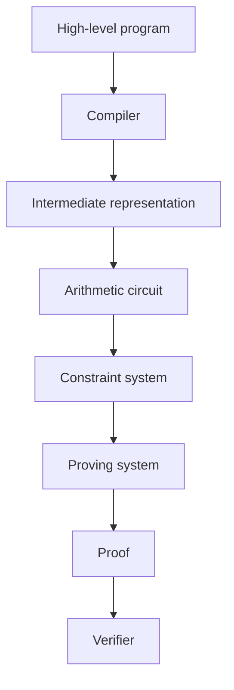

### Why SHA-256 is hard in circuits

Slide 73 uses hash preimage proof:

```text
I know x such that SHA256(x) = y
```

SHA-256 is efficient on CPUs, but expensive in arithmetic circuits because it uses:

* bitwise XOR,
* rotations,
* modular additions,
* bit decomposition,
* Boolean constraints.

For ZK-native systems, engineers often prefer algebraic hash functions such as Poseidon, Rescue, Griffin, or MiMC, depending on the proof system and security requirements.

### Slide 74 code artifact

The extracted Circom snippet appears visually mangled in the parsed text, showing symbols like `^/` and `^=`. Conceptually, the slide is explaining that high-level ZK languages compile constraints. In real Circom, implementing `IsZero` safely requires constraints that prevent underconstrained witnesses. A naive assignment is not enough.

### Cost of generality

Circuit ZK trades performance for universality.

| Approach              | Best for                    | Weakness                     |
| --------------------- | --------------------------- | ---------------------------- |
| Custom Sigma protocol | Simple algebraic statements | Not general                  |
| Circuit SNARK/STARK   | Arbitrary computation       | More expensive, complex      |
| zkVM                  | Normal programs             | Highest overhead, larger TCB |

### Key takeaway

Circuit ZK turns proof engineering into program/circuit engineering. The hard part moves from protocol design to constraint correctness.

---

# Section 4.3 — Attacks on Fiat-Shamir

## Slides 76–86 — Fiat-Shamir/GKR attack and self-reference

Slides 77–86 discuss a recent attack presented by the deck against Fiat-Shamir-transformed GKR-style proof systems. The deck describes this as a practical attack on a standard protocol, involving self-reference, circuit digests, and GKR-based systems. 

### GKR background

GKR, from Goldwasser-Kalai-Rothblum, is an interactive proof protocol for verifying layered arithmetic circuits efficiently.

At a high level, GKR uses:

* circuit arithmetization,
* multilinear extensions,
* sum-check protocols,
* verifier random challenges,
* reductions from one circuit layer to the next.

The verifier samples random points. The prover must convince the verifier that claimed values of multilinear extensions are consistent with correct circuit evaluation.

### The attack idea in the deck

The deck describes a circular dependency:

```text
Fiat-Shamir challenge = H(circuit description, output, commitment)
```

If the circuit can include its own digest as a witness, it may compute the challenge internally.

The attacking circuit roughly does:

```text
w = circuit_digest
alpha = commitment(w)
gamma = H(circuit_digest, claimed_output, alpha)
output = (gamma, gamma - 1)
```

The prover falsely claims the output is `(0, 0)`. The trick is that at the Fiat-Shamir-selected challenge point, the multilinear extension of the real output can coincide with the claimed output.

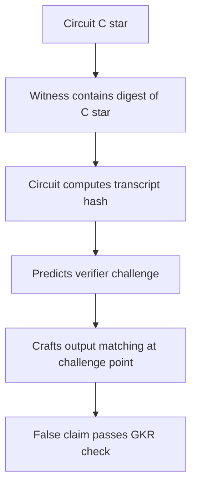

### Why this matters

The attack targets the assumption that Fiat-Shamir challenges are unpredictable to the prover. If the statement being proven can self-reference the challenge derivation, the prover may be able to construct pathological circuits that satisfy checks at exactly the verifier’s sampled point while being false globally.

### Engineering implications

This is a serious warning for modern proof systems:

* circuit implementation matters, not just circuit functionality;
* recursive proof systems amplify transcript risks;
* circuits containing hash functions or commitment logic need extra scrutiny;
* Fiat-Shamir security is protocol-specific, not automatic;
* canonical circuit representation matters;
* domain separation alone may not be sufficient if self-reference remains possible.

### Mitigation directions

The deck lists mitigations such as restricting circuit depth, avoiding circuits with cryptographic operations, using canonical representations, and domain separation. 

A senior engineering checklist would add:

```text
- Bind all public parameters into the transcript.
- Bind circuit identity and version.
- Use canonical serialization.
- Avoid prover-controlled circuit descriptions unless explicitly modeled.
- Separate program identity from witness data.
- For recursion, audit every Fiat-Shamir layer.
- Prefer proof systems with security proofs covering the exact transform.
- Use independent review for arithmetization and transcript code.
```

### Key takeaway

Fiat-Shamir is not a magic compiler from interactive security to practical security. Transcript structure, circuit self-reference, and arithmetization details can break soundness.

---

# Section 5 — zkVMs

## Slides 87–90 — What is a zkVM?

A zkVM is a virtual machine that executes a program and produces a proof that the execution was correct.

Statement:

```text
I ran program P on input X and private witness W,
and the output was Y.
```

The verifier checks the proof without re-executing the entire computation.

A zkVM typically contains:

* instruction set architecture,
* execution trace,
* memory model,
* constraint system,
* proof system,
* verifier,
* public input/output binding.

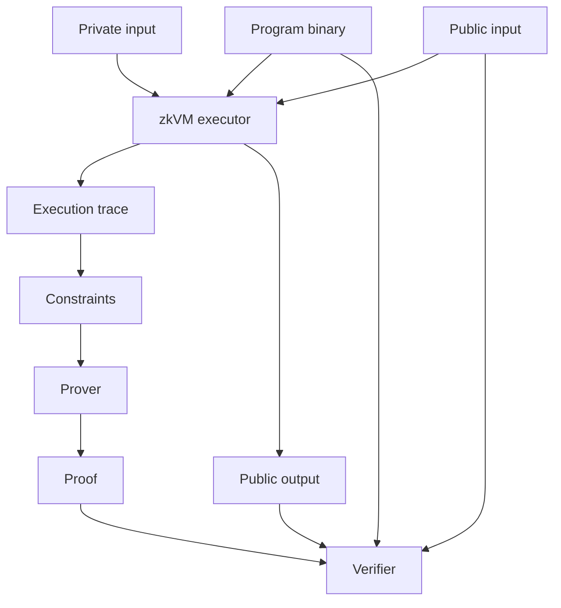

Slide 89 lists common designs using RISC-V, MIPS, or custom instruction sets, memory models with RAM, stack/heap, Merkle-tree-assisted memory, and an execution trace as witness. Slide 90 highlights applications such as rollups, verifiable cloud computation, private ML inference, private smart contracts, confidential databases, and compliance proofs. 

### Why zkVMs are attractive

They decouple developers from low-level circuit design:

```text
write normal code -> compile -> execute -> prove
```

This is powerful because manual circuit engineering is error-prone and expensive.

### Why zkVMs are risky

The trusted computing base becomes large:

* VM semantics,
* compiler correctness,
* guest binary identity,
* host/guest boundary,
* memory model,
* instruction constraints,
* syscall model,
* proof system,
* Fiat-Shamir transcript,
* verifier implementation.

### Performance warning

The deck states that proving can be 1,000x to 1,000,000x slower than native execution. That is the central trade-off: verification becomes cheap, but proving is expensive. 

### Key takeaway

zkVMs democratize ZK development but massively expand the implementation and verification surface.

---

## Slides 91–94 — RISC Zero

Slides 91–94 introduce RISC Zero as a concrete zkVM platform. The deck says it lets developers write ZK applications in Rust/C++, compile guest code to an ELF binary, execute it, generate a receipt, and verify it using an ImageID. It also contrasts local proving with remote Bonsai proving. 

A typical flow:

```text
1. Write guest program.
2. Compile guest to binary.
3. Compute program identity / ImageID.
4. Execute guest with private input.
5. Produce receipt/proof.
6. Verifier checks receipt against ImageID and public output.
```

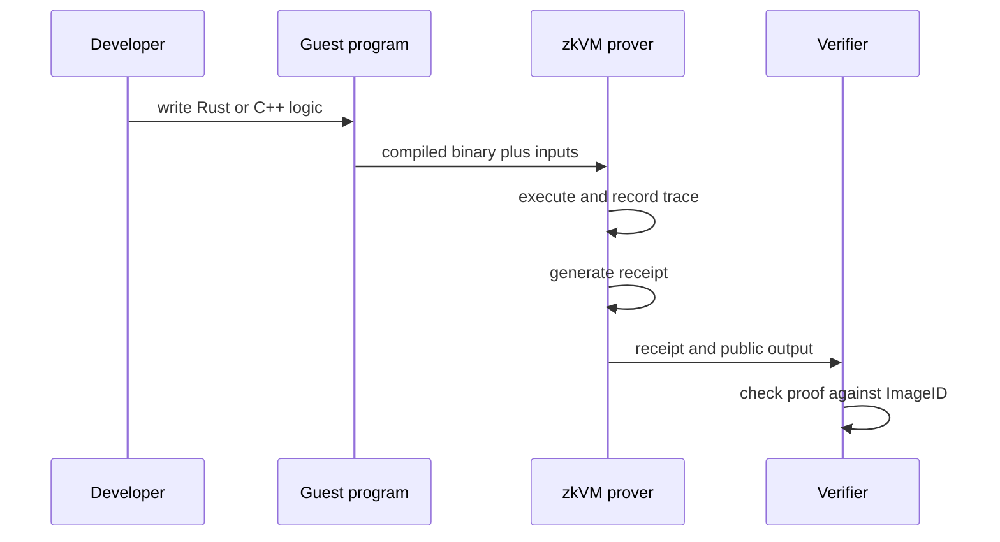

### Engineering concerns

The most important binding is:

```text
proof binds to exact program image
```

If the verifier checks the wrong ImageID, the proof may be valid for a different program.

Other concerns:

* guest input serialization,
* public/private input separation,
* deterministic execution,
* panic/error semantics,
* side effects not represented in proof,
* host-provided data integrity,
* remote prover trust boundaries,
* denial-of-service from expensive proofs.

### Local versus remote proving

Local proving gives more control but requires hardware resources. Remote proving improves usability but shifts metadata, availability, and confidentiality concerns to a service provider.

A remote prover generally should not learn private witness data unless the architecture explicitly protects it.

### Key takeaway

RISC Zero-style systems make ZK programmable, but verifiers must bind proofs to the exact guest image and public outputs.

---

## Slides 95–99 — ZK Battleship

Slides 95–99 use Battleship as a concrete zkVM example.

Problem:

* server has a secret board,
* player sends shots,
* server returns hit/miss/sunk,
* player wants assurance the server is honest,
* server does not want to reveal ship locations.

The ZK solution:

1. Server commits to a valid initial board.
2. Server proves the board is valid.
3. For each shot, server proves the response was computed correctly.
4. Each round links old state commitment to new state commitment.

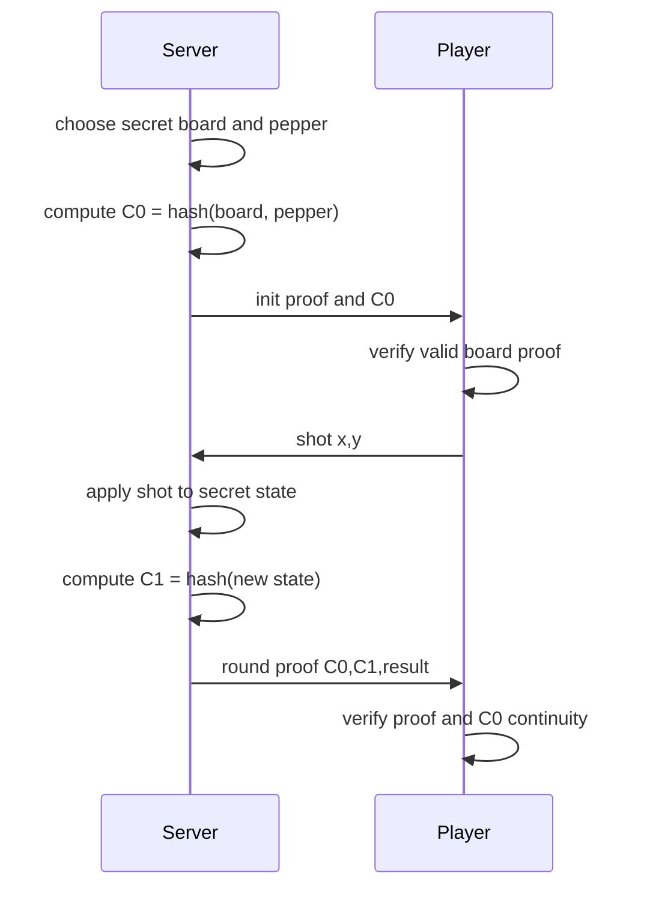

### Security guarantees

The protocol aims to provide:

* **privacy**: board remains hidden,
* **soundness**: server cannot lie about hit/miss,
* **state integrity**: server cannot move ships mid-game,
* **consistency**: each round links to the previous round.

### Important engineering details

The commitment must be hiding and binding:

```text
C = H(board || pepper)
```

The pepper prevents brute-force enumeration of the board if the board space is small.

The round proof must bind:

```text
old_state_commitment
new_state_commitment
shot coordinates
result
game rules
program identity
```

If the shot is not bound into the proof, a malicious server could prove a response to a different shot. If old/new state chaining is not enforced, the server could fork game history.

### Key takeaway

ZK Battleship is a clean example of private state plus public verifiable transitions.

---

## Slides 100–105 — Making zkVMs practical: promise versus reality

Slides 101–105 are intentionally skeptical. The deck states that zkVMs are still riddled with bugs, extremely slower than native execution, and years from secure production readiness. It gives a staged path: correct protocols, correct verifier, then correct prover. 

### Stage 1 — Correct protocols

Need to verify:

* PIOP soundness,
* polynomial commitment binding,
* Fiat-Shamir security,
* constraint-to-VM semantic equivalence,
* composition of all layers.

### Stage 2 — Correct verifier

The verifier is smaller than the prover but security-critical. A verifier bug can accept false proofs.

Formal verification of verifiers is realistic and high value.

### Stage 3 — Correct prover

A prover bug usually threatens completeness or zero-knowledge, but in some systems prover/verifier coupling can create deeper issues. If zero-knowledge is claimed, witness blinding and randomness must also be verified.

### Critical caveats

The deck highlights:

* Fiat-Shamir vulnerabilities,
* recursive circuit complications,
* bytecode correctness problem,
* sub-128-bit security shortcuts,
* performance-driven compromises.

### Engineering risk matrix

| Risk                            | Consequence                      | Mitigation                                      |
| ------------------------------- | -------------------------------- | ----------------------------------------------- |
| Underconstrained VM instruction | False program execution proof    | Constraint audits, fuzzing, formal specs        |
| Verifier bug                    | Accept invalid proof             | Formal verification, independent implementation |
| Fiat-Shamir transcript bug      | Soundness failure                | Canonical transcript API                        |
| Wrong ImageID                   | Proof for wrong program accepted | Strong program binding                          |
| Remote prover metadata leakage  | Privacy loss                     | local proving or encrypted/private proving      |
| Weak security parameter         | Practical forgery margin         | minimum 128-bit security target                 |

### Key takeaway

zkVMs are promising, but production security requires formal methods, conservative parameters, and end-to-end semantic verification.

---

# Section 6 — Zero-knowledge proofs in the real world

## Slides 106–111 — Zcash

Slides 108–111 discuss Zcash as a major production deployment of zk-SNARKs for privacy-preserving cryptocurrency. The deck contrasts Bitcoin’s transparent transaction graph with Zcash shielded transactions that hide sender, receiver, and amount. 

### Zcash shielded transaction model

At a high level, Zcash uses notes. A note represents value controlled by a spending key. Instead of revealing which note is spent, the spender reveals a **nullifier** proving that some valid note is being spent exactly once.

Conceptual components:

```text
note commitment: commits to recipient, value, randomness
Merkle tree: contains note commitments
nullifier: unique spend tag derived from note secret
ZK proof: proves valid spend without revealing note
```

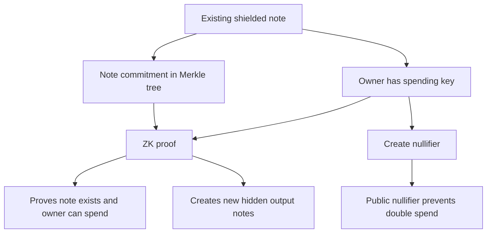

### What the proof proves

A shielded spend proves roughly:

```text
- I know a note opening.
- The note commitment is in the commitment tree.
- I know the spending key or authorization.
- The nullifier is correctly derived.
- The value balance is preserved.
- New output notes are well formed.
```

without revealing:

```text
- which old note was spent,
- who sent funds,
- who received funds,
- how much was transferred.
```

### Viewing keys and auditability

Viewing keys allow selective disclosure for auditing, compliance, or wallet recovery. This is an important practical compromise: privacy systems often need user-controlled disclosure.

### Optional privacy problem

The deck correctly notes that optional privacy limits adoption. If only a minority uses shielded transactions, privacy sets are smaller and metadata leakage grows.

### Key takeaway

Zcash proves that advanced ZK can secure real value, but usability, performance, regulation, and anonymity-set adoption are as important as cryptography.

---

## Slides 112–116 — ZK goes mainstream: Google, age assurance, EUDI-style identity

Slides 113–116 discuss Google open-sourcing ZKP libraries, a partnership with Sparkasse, EU age assurance, and the broader regulatory landscape. The deck frames age verification as a mainstream ZK use case. 

### Age verification as a ZK credential problem

The desired statement:

```text
I possess a valid credential issued by an authority,
and the birthdate in that credential implies age >= 18.
```

The verifier should not learn:

```text
name
birthdate
document number
address
issuer-specific tracking identifier
other attributes
```

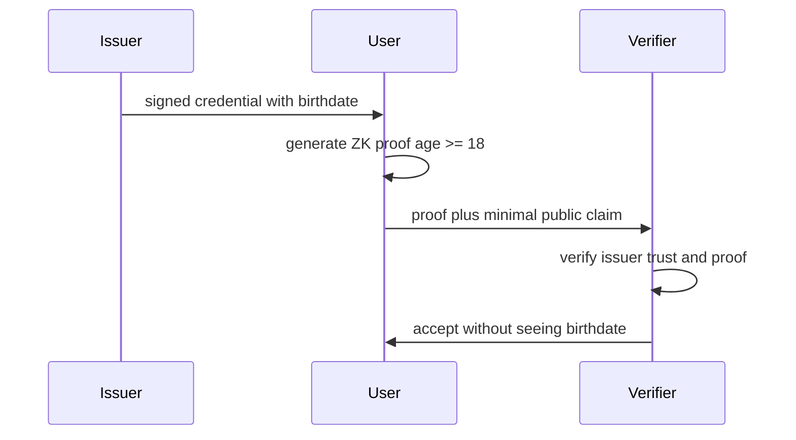

### Trust boundaries

ZK does not eliminate trust. It moves and minimizes trust.

Important questions:

```text
Who issues credentials?
Who controls revocation?
Can presentations be linked?
Does the wallet leak metadata?
Can verifiers collude?
Does the issuer learn where credentials are used?
Can governments revoke or blacklist proofs?
Is the implementation open and audited?
```

### Metadata risk

Even perfect ZK proofs do not hide:

* IP address,
* browser fingerprint,
* timing,
* verifier identity,
* credential ecosystem identifiers,
* wallet telemetry,
* revocation-check queries.

A privacy-preserving identity system requires more than ZK. It needs careful network, wallet, revocation, and UX design.

### Open-source angle

Open sourcing helps with:

* reviewability,
* interoperability,
* reduced vendor lock-in,
* academic scrutiny,
* ecosystem development.

But open source alone does not guarantee:

* safe deployment,
* decentralized governance,
* privacy-preserving infrastructure,
* absence of coercive policy,
* secure implementations.

### Key takeaway

ZK age verification can minimize disclosure, but the trust model includes issuers, wallets, revocation infrastructure, verifiers, and metadata channels.

---

## Slides 117–121 — Future of real-world ZK systems

Slides 118–121 broaden the future use cases: financial services, healthcare, social platforms, government services, technical challenges, and possible privacy futures. 

### High-value use cases

ZK can support:

```text
Financial:
    prove income threshold without revealing salary
    prove solvency without revealing all positions
    prove KYC status without exposing identity everywhere

Healthcare:
    prove vaccination status
    prove insurance eligibility
    prove trial eligibility

Social:
    prove human uniqueness
    prove community membership
    prove reputation threshold

Government:
    prove voting eligibility
    prove license validity
    prove benefits qualification
```

### Technical challenges

The deck lists:

* proof generation time,
* verification complexity,
* key management,
* trusted setup ceremonies,
* quantum resistance,
* recursive proof composition,
* hardware acceleration,
* post-quantum ZK,
* universal circuits,
* UX challenges.

From an engineering point of view, the main deployment blockers are:

1. **Witness custody**
   Users must protect credential secrets and wallet keys.

2. **Revocation privacy**
   Revocation checks can become tracking beacons.

3. **Linkability**
   Proofs must avoid stable identifiers unless intentional.

4. **Trusted setup**
   Some proving systems require ceremonies or structured reference strings.

5. **Performance**
   Mobile proof generation remains a major constraint for complex statements.

6. **Standardization**
   Interoperability requires common credential formats, proof formats, and trust registries.

7. **Post-quantum migration**
   Pairing-based SNARKs are not post-quantum. Hash-based STARK-like systems have better post-quantum plausibility but are larger and more expensive.

### Key takeaway

The future of ZK depends as much on systems engineering, governance, standards, and UX as on proof-system theory.

---

## Slide 122 — Closing

The final slide closes the lecture. The deck’s full arc is:

```text
Schnorr identification
    -> Sigma protocols
    -> composition with AND/OR
    -> Fiat-Shamir non-interactivity
    -> circuit ZK
    -> Fiat-Shamir/GKR attacks
    -> zkVMs
    -> real-world privacy systems
```

The most important conceptual progression is:

```text
prove knowledge of a number
    ->
prove logical combinations of statements
    ->
prove arbitrary computation
    ->
deploy proof systems in adversarial real-world infrastructure
```

---

# Deep technical synthesis

## 1. The ZK security stack

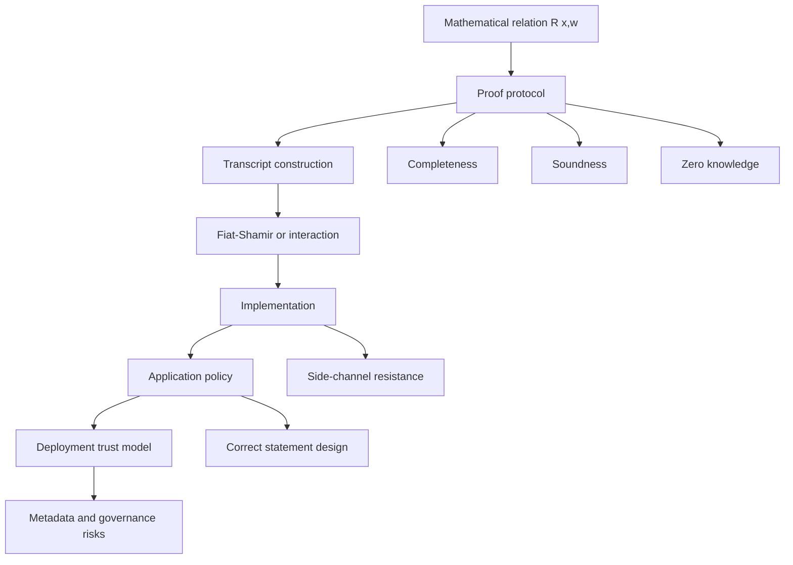

A proof system can be mathematically sound and still fail in deployment if:

* the statement is wrong,
* the circuit is underconstrained,
* the verifier checks the wrong public inputs,
* the transcript omits domain separation,
* the wallet leaks metadata,
* the issuer can track presentations,
* the proving key or setup is compromised,
* the implementation has parser ambiguity.

---

## 2. Proofs, arguments, and trust assumptions

In theory, a **proof** is sound even against computationally unbounded provers. An **argument** is sound only against computationally bounded provers.

Most practical SNARKs are arguments, relying on assumptions such as:

* discrete logarithm hardness,
* pairing assumptions,
* knowledge-of-exponent assumptions,
* collision resistance,
* random oracle model,
* polynomial commitment binding,
* low-degree testing soundness.

A senior engineer should always ask:

```text
Is this statistical or computational soundness?
Is zero-knowledge perfect, statistical, or computational?
Does it need a trusted setup?
Is Fiat-Shamir proven for this exact protocol?
What are the concrete security parameters?
```

---

## 3. Common ZK implementation failure modes

### Underconstrained circuits

A constraint system may not fully enforce the intended computation.

Example:

```text
out <-- in == 0
```

If `<--` is assignment but not a constraint, the prover may choose arbitrary `out`.

Correct circuits must constrain every claimed relationship.

### Missing public input binding

A proof may be valid but not tied to the intended statement.

Bad:

```text
verify(proof)
```

Good:

```text
verify(proof, public_inputs, program_id, domain)
```

### Transcript ambiguity

If serialization is ambiguous:

```text
H("ab", "c") == H("a", "bc")
```

an attacker may create cross-statement collisions.

Use length-prefixing or canonical encodings.

### Unsafe Fiat-Shamir

Bad:

```text
c = H(commitment)
```

Better:

```text
c = H(protocol_id || version || statement || public_inputs || commitment)
```

### Weak challenge size

A 64-bit challenge may be brute-forceable in high-value systems. Use at least 128-bit soundness margins unless the protocol analysis justifies otherwise.

---

# Engineering considerations by topic

## Sigma protocols

Use Sigma protocols when:

* the relation is algebraic,
* custom efficiency matters,
* the statement is small,
* interaction is acceptable or Fiat-Shamir is well understood.

Checklist:

```text
- Validate group elements.
- Ensure prime-order subgroup membership.
- Use constant-time scalar operations.
- Generate fresh randomness.
- Bind all context into challenges.
- Avoid nonce reuse.
- Use canonical encodings.
- Analyze composition if using AND/OR.
```

## Fiat-Shamir

Checklist:

```text
- Domain-separate every protocol.
- Include protocol version.
- Include all public inputs.
- Include all commitments in order.
- Include circuit/program identity.
- Use canonical serialization.
- Avoid prover-controlled transcript structure.
- Analyze recursive/self-referential uses separately.
```

## Circuit ZK

Checklist:

```text
- Define the exact relation before coding.
- Treat public/private input separation as security-critical.
- Test for underconstrained signals.
- Use property-based tests.
- Use known-good libraries for common gadgets.
- Prefer ZK-friendly primitives when possible.
- Review constraint counts and security parameters.
- Audit witness generation separately from constraints.
```

## zkVMs

Checklist:

```text
- Verify exact program ImageID.
- Bind public input and output.
- Understand host/guest boundary.
- Treat syscalls as part of the statement.
- Check memory model soundness.
- Confirm security level.
- Avoid assuming privacy from remote proving.
- Monitor project maturity and audit status.
```

## Real-world identity ZK

Checklist:

```text
- Prevent proof linkability.
- Use unlinkable presentations.
- Design privacy-preserving revocation.
- Minimize issuer callbacks.
- Avoid stable verifier-visible identifiers.
- Consider network anonymity.
- Make recovery safe but not centralized.
- Provide transparent trust registries.
```

---

# Final executive summary

This slide deck explains zero-knowledge proofs from first principles and then follows the path to real-world deployment.

It begins with Schnorr identification, where a prover demonstrates knowledge of a discrete logarithm without revealing it. That protocol illustrates the three central ZK properties: completeness, soundness, and zero-knowledge. It also introduces knowledge soundness and simulation, which are essential for understanding why the verifier learns nothing useful beyond the truth of the statement.

The deck then generalizes Schnorr into Sigma protocols, a three-message proof framework built from commitment, challenge, and response. Sigma protocols support composition: AND proofs show multiple conditions are true, while OR proofs show that at least one condition is true without revealing which one.

Fiat-Shamir removes interaction by replacing the verifier’s random challenge with a hash of the transcript. This enables non-interactive proofs and signatures, but it also changes the security model: deniability is lost, transcript binding becomes critical, and random-oracle assumptions become central.

The deck then moves to circuit ZK, where arbitrary computations are encoded as circuits or constraint systems. This enables proofs of program execution, hash preimages, transaction validity, and eventually zkVMs. The cost is complexity: circuits can be huge, underconstrained, slow, and hard to audit.

The later slides are deliberately skeptical about modern zkVMs. They emphasize that zkVMs are powerful but immature, with serious performance, formal verification, Fiat-Shamir, recursion, and implementation challenges.

Finally, the deck examines real-world systems such as Zcash and ZK age verification. The main lesson is that ZK can provide strong privacy and correctness guarantees, but only if the broader system handles metadata, revocation, key management, trust infrastructure, and usability correctly.

---

# Final technical summary for senior engineers

Zero-knowledge systems are best understood as layered adversarial systems:

```text
Relation design
-> arithmetization or protocol design
-> proof-system soundness
-> Fiat-Shamir transcript security
-> implementation correctness
-> key and witness management
-> deployment metadata model
-> governance and trust infrastructure
```

The core engineering questions are:

```text
What exactly is being proven?
What is public and what is private?
What assumptions give soundness?
What assumptions give zero-knowledge?
Can the witness be extracted in the proof model?
Is Fiat-Shamir safe for this protocol?
Are all public inputs bound into the transcript?
Is the circuit fully constrained?
Is the verifier checking the intended program?
What metadata leaks outside the proof?
Who controls setup, issuance, revocation, and upgrades?
```

For simple algebraic relations, custom Sigma protocols remain efficient and analyzable. For arbitrary computation, circuit ZK and zkVMs are more expressive but far more complex. Fiat-Shamir is indispensable but dangerous when used casually. zkVMs are promising, but the deck’s central warning is correct: they should not be treated as mature security infrastructure without formal protocol analysis, verifier verification, constraint audits, and conservative deployment assumptions.

The highest-value mindset for a senior cryptography engineer is:

> A ZK proof proves only the exact formal statement encoded in the protocol. It does not prove the developer’s intention, the safety of the surrounding system, the privacy of metadata, or the correctness of governance.


Below is the same style analysis: core idea, detailed explanation, and how each reading fits into the zero knowledge proof stack.

## Big picture

Zero knowledge proofs let a prover convince a verifier that a statement is true without revealing the secret witness that makes it true. The three core properties are completeness, soundness, and zero knowledge. Completeness means honest proofs verify. Soundness means false statements cannot be proven except with negligible probability. Zero knowledge means the verifier learns nothing beyond the truth of the statement.

In modern systems, zero knowledge has two major roles. First, privacy: prove age, solvency, membership, transaction validity, or credential possession without exposing identity or private data. Second, verifiable computation: prove that a program executed correctly without forcing the verifier to rerun the whole computation. This second use is why SNARKs, STARKs, zkVMs, and blockchain proving systems are so important.

## Required readings

### 1. The Joy of Cryptography, Chapter 19, Zero Knowledge Proofs

**Core idea:** this chapter introduces zero knowledge through the provable security mindset: define the security goal precisely, model the prover and verifier, then show that whatever a verifier sees can be simulated without the witness.

A key note: the public online edition lists Chapter 19 as Zero Knowledge Proofs, but the site says only the first three chapters are currently available online and that the remaining chapters become available in July 2026. So I cannot verify the exact chapter text publicly. I will explain the standard content that this chapter is meant to teach, based on its table of contents and the book’s focus on provable security. ([Joy of Cryptography][1])

**Detailed explanation:** the most important idea is the simulator definition. A protocol is zero knowledge if every possible verifier interaction can be reproduced by a simulator that knows only the public statement, not the private witness. This is stronger than saying “the verifier probably cannot learn the secret.” It says that the verifier’s entire view gives no extra useful information because the same view could have been generated without the secret.

The chapter likely builds from simple interactive proofs to proof systems for NP statements. In NP, a statement has a short witness that can be checked efficiently. For example, “I know a password whose hash is this value,” “this committed number is over 18,” or “this transaction preserves balance.” Zero knowledge lets the prover demonstrate the existence of such a witness without revealing it.

The senior engineering takeaway is that zero knowledge is not magic privacy dust. You must define the exact statement. If the statement is too weak, the proof may be true but useless. If the public inputs leak too much, the proof may be zero knowledge in the formal sense while the application still leaks sensitive metadata.

### 2. Amit Sahai, Computer Scientist Explains One Concept in Five Levels of Difficulty, WIRED, 2022

**Core idea:** Sahai gives a layered explanation of zero knowledge, moving from intuition to expert level abstraction.

**Detailed explanation:** the simple version is that a prover convinces a verifier that something is true while revealing no reason why it is true. WIRED’s description says Sahai explains zero knowledge proofs to five audiences, from a child to an expert, and frames them as important both for their mathematical structure and their practical applications. ([WIRED][2])

The value of this video is pedagogical. It teaches that the same primitive can be understood at several levels. At the beginner level, zero knowledge feels like a puzzle: show that you know where the hidden object is without pointing to it. At the undergraduate level, it becomes an interaction between a prover and verifier. At the graduate level, the discussion shifts toward simulation, reductions, commitments, randomness, and proof composition.

For you as a senior engineer, the important bridge is from story to system design. In production, “I know a secret” becomes “I know a witness satisfying this arithmetic circuit.” A compiler turns business logic into constraints. A proving system generates a proof. A verifier checks the proof against public inputs. The story remains simple, but the implementation pipeline is highly technical.

## Optional readings

### 3. Bellovin, Privacy Preserving Age Verification and Its Limitations

**Core idea:** privacy preserving age verification is technically plausible, but legal, economic, deployment, identity, and usability constraints make it much harder than policy discussions usually admit.

**Detailed explanation:** Bellovin’s abstract says that a privacy preserving credential based age verification system is straightforward as a first technical approximation, but that the legal, economic, and social obstacles are formidable and possibly insurmountable in some countries. 

The cryptographic idea is anonymous credentials. A trusted identity provider issues a primary credential. The user derives unlinkable subcredentials that can prove attributes such as “over 18” or “over 21” using zero knowledge proofs. The verifier learns that the credential is valid and that the attribute holds, but should not learn the user’s identity or link multiple presentations together. 

The limitation is not mainly cryptography. The hard problems are credential issuance, access for people without documents, fraud from multiple identity sources, device sharing, credential transfer, certificate authority separation, and network level linkage through IP addresses. Bellovin explicitly notes that identity providers and certificate authorities need organizational separation and that Tor like transport may be needed to prevent linkage. 

The practical lesson: zero knowledge can hide the attribute disclosure, but it cannot solve the whole identity governance problem. If the issuer ecosystem is unfair, centralized, expensive, or easy to abuse, the protocol can be cryptographically elegant and still socially dangerous.

### 4. Klarreich, Computer Scientists Figure Out How To Prove Lies, Quanta Magazine

**Core idea:** the article explains a 2025 result showing that some Fiat Shamir transformed proof systems can be manipulated into accepting false statements, challenging the comfort engineers place in random oracle based security arguments.

**Detailed explanation:** Quanta describes an attack on a fundamental proof technique with implications for blockchains and digital encryption systems. The article explains that many cryptographic systems use hash functions as substitutes for true randomness under the random oracle model, and that the new work demonstrates a way to trick a commercially available proof system into certifying false statements even though the system is secure in the random oracle model. ([Quanta Magazine][3])

The main point is not “all zero knowledge is broken.” The point is more precise: transforming an interactive proof into a non interactive one with Fiat Shamir is subtle. A proof that is secure when the verifier sends true random challenges may not remain secure when challenges are generated by hashing the transcript, especially if the prover can adapt the statement or circuit in malicious ways.

The engineering lesson is severe. Do not treat Fiat Shamir as a harmless compiler step. You need domain separation, careful transcript binding, explicit soundness arguments, circuit restrictions where needed, and preferably a proof that matches the concrete protocol actually deployed.

### 5. Khovratovich, Rothblum, and Soukhanov, How to Prove False Statements, Practical Attacks on Fiat Shamir

**Core idea:** this is the technical paper behind the Quanta article. It gives practical attacks against Fiat Shamir applied to a standard interactive succinct argument based on GKR.

**Detailed explanation:** the ePrint abstract states that the authors attack a standard and popular interactive succinct argument based on the GKR protocol for verifying computation. ([IACR Eprint Archive][4]) Matthew Green’s technical commentary emphasizes that the paper touches the theoretical models behind real proving systems and demonstrates a real, although contrived, attack on proof systems used in blockchain settings. ([Cryptographic Engineering Insights][5])

The attack targets a mismatch between the ideal random oracle model and concrete Fiat Shamir use. In an interactive protocol, the verifier’s randomness arrives after the prover commits to parts of the transcript. Fiat Shamir replaces that verifier randomness with hash outputs. If the prover can shape the statement, transcript, or circuit to influence future challenges, the security intuition can fail.

The core lesson is that soundness is fragile under compilation. A proof system can be sound interactively, and the hash function can be cryptographically strong, yet the combined non interactive system can still be vulnerable if the transform’s assumptions do not match the application.

### 6. Ilango, Gödel in Cryptography, Effectively Zero Knowledge Proofs for NP with No Interaction, No Setup, and Perfect Soundness

**Core idea:** Ilango revisits an old impossibility barrier and shows that a relaxed notion, called effectively zero knowledge, can recover many useful properties without interaction, setup, or imperfect soundness.

**Detailed explanation:** the ePrint page states that classical impossibility results force zero knowledge proofs to sacrifice either perfect soundness or non interaction, but the paper defines and constructs a relaxation where every falsifiable security property of classical zero knowledge can be achieved with no interaction, no setup, and perfect soundness. ([IACR Eprint Archive][6]) The paper is listed among the accepted FOCS 2025 papers. ([focs.computer.org][7])

The conceptual move is subtle. Classical zero knowledge is usually simulation based: the verifier’s view must be simulatable. Ilango shifts focus toward game based or falsifiable security properties, asking whether anything practically breakable about zero knowledge can still be protected even if the classical simulation definition is relaxed.

The significance is theoretical but important. It questions whether the traditional definition is stronger than necessary for many applications. If this line of work matures, it may change how cryptographers design setup free and interaction free privacy proofs.

### 7. Galal, The Curves of ZoKrates

**Core idea:** this reading explains why elliptic curve choices matter inside SNARK tooling, especially when using ZoKrates and Groth16.

**Detailed explanation:** Galal starts from a practical ZoKrates example: prove knowledge of a private SHA 256 input that hashes to a public output. The post explains that high level syntax must compile into an arithmetic circuit compatible with a SNARK proving system, and that field types in SNARK DSLs behave differently from normal integers. ([tgalal.com][8])

The deeper point is curve compatibility. SNARKs operate over finite fields. A computation is cheap only when its arithmetic is native to the proving field. If you verify a signature over a curve whose field is not native to the proving system, the circuit becomes expensive. Galal explains that Groth16 needs pairing friendly curves for verification, while efficient circuit arithmetic benefits from circuit friendly curves. Embedded curves connect these requirements. ([tgalal.com][8])

The engineering takeaway: when you build ZK applications, “which curve?” is not an implementation detail. It affects circuit size, proof cost, verification cost, compatibility with Ethereum precompiles, and security assumptions.

### 8. Hopwood, Bowe, Hornby, and Wilcox, Zcash Protocol Specification

**Core idea:** Zcash is the canonical deployed example of zero knowledge used for private payments.

**Detailed explanation:** the Zcash specification describes Zcash as an implementation of Zerocash that bridges Bitcoin style transparent payments with shielded payments secured by zero knowledge succinct non interactive arguments of knowledge. ([zips.z.cash][9])

Zcash uses commitments, nullifiers, Merkle trees, signatures, and zero knowledge proofs together. A shielded spend proves that the spender owns an unspent note, that the note exists in the commitment tree, that the value balance is correct, and that the same note has not been spent before. The nullifier prevents double spending while hiding which note was spent.

The specification is valuable because it shows that privacy is a protocol architecture, not just a proof. The proof statement must be linked to transaction encoding, consensus rules, note encryption, viewing keys, and double spend prevention. Orchard Actions, for example, combine spends and outputs and use zk SNARK proofs while enabling balance enforcement through commitments and binding signatures. ([zips.z.cash][9])

### 9. Penumbra Labs, Penumbra Protocol Specification

**Core idea:** Penumbra extends shielded asset privacy beyond simple payments into a multi asset Cosmos based system with private trading, staking, and governance design goals.

**Detailed explanation:** the Penumbra protocol specification says Penumbra records all value in a single multi asset shielded pool based on the Zcash Sapling design, while allowing private transactions in any IBC asset. ([protocol.penumbra.zone][10]) The project repository describes Penumbra as a fully shielded zone for the Cosmos ecosystem where users can transact, stake, swap, or market make without broadcasting personal information. ([GitHub][11])

The ZK role is to let validators enforce state transitions without seeing the private values behind those transitions. A public audit report notes that Penumbra uses zero knowledge proofs for privacy features, specifically Groth16 over BLS12 377, with transactions proving correct statements to validators. ([ZK/SEC Quarterly][12])

The architectural lesson is that private DeFi requires more than private transfers. You need hidden balances, private swaps, shielded positions, commitment based accounting, and careful separation between public liquidity mechanisms and private user intent.

### 10. Stapelberg, Opening up Zero Knowledge Proof Technology to Promote Privacy in Age Assurance, Google Blog

**Core idea:** Google open sourced ZK libraries for age assurance so developers can verify attributes like age with less identity disclosure.

**Detailed explanation:** Google’s July 2025 blog says it open sourced its zero knowledge proof libraries, building on a partnership with Sparkasse to support EU age assurance and digital identity applications. ([blog.google][13]) A related Google Wallet post says Google is integrating ZK technology into Wallet to ensure there is no way to link the age back to the user’s identity when using supported digital credential flows. ([blog.google][14])

The cryptographic idea is selective disclosure. Instead of sending full ID data, the user proves a predicate about a credential, such as “age is at least 18.” The relying party should learn the predicate result, not the birth date, address, document number, or identity.

The caution is that this should be read together with Bellovin. Google’s technology may reduce disclosure during verification, but the full system still depends on issuer trust, device security, account linkage, ecosystem governance, and abuse resistance.

### 11. Angel, Celi, Margolin, Mishra, Sander, and Woods, Coral, Fast Succinct Non Interactive Zero Knowledge CFG Proofs

**Core idea:** Coral proves that a committed byte stream parses correctly under a context free grammar, enabling privacy preserving proofs about structured data.

**Detailed explanation:** the Coral project page says Coral is designed for parsing and can prove that a commitment to a byte stream is correctly parsed into a structured object. It lists applications such as parsing in zk TLS and authorization systems, proving JSON Web Tokens are correctly constructed, and enhancing systems that need to understand structured formats like JSON. ([Computer and Information Science][15])

This fills an important gap. Many real privacy applications start with a private document, token, API response, certificate, or web response. Before proving a semantic claim about that object, the system must prove that the bytes actually parse as the claimed structure. If parsing is wrong or ambiguous, the higher level claim can be meaningless or exploitable.

The engineering lesson: ZK systems need trustworthy front ends. It is not enough to prove arithmetic constraints. You must prove that the private input was parsed, decoded, canonicalized, and interpreted exactly as intended.

### 12. RISC Zero, zkVM Overview

**Core idea:** RISC Zero lets developers prove correct execution of ordinary programs compiled for a RISC V style virtual machine.

**Detailed explanation:** the RISC Zero docs say the zkVM lets users prove correct execution of arbitrary Rust code and build applications using existing Rust packages. ([dev.risczero.com][16]) The execution model is guest program to ELF binary, executor records a session, prover proves the session, and the output is a receipt that anyone can verify against an ImageID, which identifies the expected binary. ([dev.risczero.com][17])

This is a major abstraction shift. Traditional SNARK development requires writing circuits or using domain specific languages. zkVMs let developers write normal code, then prove that the VM executed it correctly. This dramatically improves developer experience but moves complexity into the VM, instruction constraints, memory model, recursion, and verifier implementation.

The core risk is that a zkVM is a large trusted proving stack. Bugs in instruction semantics, memory consistency, constraint generation, transcript construction, or verifier code can break soundness even if the underlying proof system is mathematically strong.

### 13. Thaler, The Path to Secure and Efficient zkVMs, How to Track Progress

**Core idea:** zkVMs are promising but not yet mature enough to treat as simple drop in trust engines. Security and performance need staged, measurable progress.

**Detailed explanation:** Thaler writes that zkVMs promise to democratize SNARKs by letting non specialists prove correct execution of arbitrary programs, but they face enormous security and performance challenges. He states that proving execution can be hundreds of thousands of times slower than native execution and that the ecosystem is still years away from basic secure and performant goals. ([a16z crypto][18])

The technical structure he gives is useful: a SNARK based zkVM usually has a polynomial interactive oracle proof layer, a polynomial commitment scheme, a constraint system encoding VM execution, and Fiat Shamir if made non interactive. Each layer needs formal verification or at least rigorous assurance. ([a16z crypto][18])

The most important senior level lesson: zkVM security is compositional. You do not only verify the cryptographic paper. You must verify that the bytecode semantics match the constraints, that the verifier matches the protocol, that recursion is sound, that Fiat Shamir is applied safely, and that implementation bugs cannot let false executions verify.

## The core idea of the whole reading set

This reading set is about the transition from zero knowledge as a beautiful theoretical primitive to zero knowledge as deployed infrastructure.

At the theory layer, zero knowledge is about simulation, soundness, interaction, setup, and definitions. At the systems layer, it is about circuits, fields, curves, Fiat Shamir, parsing, virtual machines, verifier implementations, and protocol integration. At the application layer, it enables private payments, age assurance, digital credentials, private trading, and verifiable computation.

The main warning is this: zero knowledge proofs can hide witnesses, but they cannot automatically fix bad statements, weak protocol design, unsafe Fiat Shamir usage, buggy zkVMs, ambiguous parsing, poor identity governance, or metadata leakage. The cryptographic proof is only one part of the security boundary.

[1]: https://joyofcryptography.com/ "The Joy of Cryptography"
[2]: https://www.wired.com/video/watch/5-levels-zero-knowledge-proof "Computer Scientist Explains One Concept in 5 Levels of ..."
[3]: https://www.quantamagazine.org/computer-scientists-figure-out-how-to-prove-lies-20250709/ "Computer Scientists Figure Out How To Prove Lies | Quanta Magazine"
[4]: https://eprint.iacr.org/2025/118 "How to Prove False Statements: Practical Attacks on Fiat-Shamir"
[5]: https://blog.cryptographyengineering.com/2025/02/04/how-to-prove-false-statements-part-1/ "How to prove false statements? (Part 1) – A Few Thoughts on Cryptographic Engineering"
[6]: https://eprint.iacr.org/2025/1296 "Gödel in Cryptography: Effectively Zero-Knowledge Proofs for NP with No Interaction, No Setup, and Perfect Soundness"
[7]: https://focs.computer.org/2025/accepted-papers/ "Accepted Papers – FOCS 2025"
[8]: https://tgalal.com/blog/the-curves-of-zokrates "The Curves of ZoKrates | tgalal"
[9]: https://zips.z.cash/protocol/protocol.pdf "Zcash Protocol Specification, Version 2025.6.3-271-gab5759 [NU6.1]"
[10]: https://protocol.penumbra.zone/main/index.html "Penumbra - The Penumbra Protocol"
[11]: https://github.com/penumbra-zone/penumbra "GitHub - penumbra-zone/penumbra: Penumbra is a privacy-preserving decentralized exchange for all of crypto · GitHub"
[12]: https://blog.zksecurity.xyz/posts/penumbra/ "Public report of auditing Penumbra's circuits - ZK/SEC Quarterly"
[13]: https://blog.google/innovation-and-ai/technology/safety-security/opening-up-zero-knowledge-proof-technology-to-promote-privacy-in-age-assurance/ "Now open source: our Zero-Knowledge Proof (ZKP) libraries for age assurance"
[14]: https://blog.google/products-and-platforms/platforms/google-pay/google-wallet-age-identity-verifications/ "Google Wallet launches new age and identity verification features"
[15]: https://www.cis.upenn.edu/~sga001/projects/zklang.html "ZK Lang"
[16]: https://dev.risczero.com/api/zkvm/ "zkVM Overview | RISC Zero Developer Docs"
[17]: https://dev.risczero.com/api/zkvm/ "zkVM Overview | RISC Zero Developer Docs"
[18]: https://a16zcrypto.com/posts/article/secure-efficient-zkvms-progress/ "The path to secure and efficient zkVMs: How to track progress - a16z crypto"
