# Topic 2.9: Secure Multiparty Computation

## Assessment Window
- Final track

## Overview
MPC security models, garbled circuits, secret sharing, OT, and practical frameworks.

## Required Readings
- David Evans, Vladimir Kolesnikov and Mike Rosulek, A Pragmatic Introduction to Secure Multi-Party Computation (Chapter 1), 2020.

## Optional Readings
- Add optional reading links here.

## Materials
- [ ] Slides
- [ ] Quiz


## Executive overview

The uploaded file is **not a slide deck** in the usual sense. It is a 181-page PDF monograph titled **“A Pragmatic Introduction to Secure Multi-Party Computation”** by David Evans, Vladimir Kolesnikov, and Mike Rosulek. I therefore interpret “slide-by-slide” as **page/section-cluster analysis** rather than inventing nonexistent slide boundaries. The PDF itself states that it introduces MPC protocols, surveys efficiency techniques, and explains how threat models and assumptions affect practicality. 

At a high level, the document teaches **secure multi-party computation (MPC)** as a method for mutually distrusting parties to compute a function over private inputs while revealing only the prescribed output. The main technical arc is:

1. Define MPC using the **real/ideal paradigm**.
2. Establish threat models: **semi-honest**, **malicious**, **covert**, **honest-majority**, and **asymmetric trust**.
3. Present core protocols: **Yao garbled circuits**, **GMW**, **BGW**, **preprocessed triples**, **BMR**, **GESS**, **OT**, and **PSI**.
4. Explain practical optimization: **garbled-row reduction**, **FreeXOR**, **half gates**, circuit optimization, execution scheduling, and programming frameworks.
5. Discuss malicious hardening: **cut-and-choose**, **zero-knowledge**, **authenticated secret sharing**, **BDOZ/SPDZ**, and authenticated garbling.
6. Close with deployment and engineering challenges: cost, output leakage, access-pattern leakage, custom protocols, and secure hardware tradeoffs.

---

## Slide-by-slide / page-cluster analysis

### 1. Title, abstract, and contents

**What the PDF says.**
The document is an introduction to MPC for practitioners and researchers. It emphasizes practical solvability, protocol tradeoffs, threat models, and assumptions. Its table of contents covers introduction, formal definitions, fundamental protocols, implementation techniques, oblivious data structures, malicious security, alternative threat models, conclusion, and references. 

**Cryptographic concept.**
The document treats MPC as a general-purpose privacy-preserving computation abstraction. Instead of trusting a central server, parties emulate an **ideal trusted functionality** using cryptographic protocols.

**Relevant primitives.**

* Secret sharing
* Oblivious transfer
* Commitments
* Zero-knowledge proofs
* Garbled circuits
* Random oracles / PRFs
* Homomorphic encryption as a comparison point
* Authenticated shares / MACs

**Security guarantee.**
The target guarantee is not “no information is ever revealed”; rather, it is:

> Nothing is leaked beyond what follows from the function output and the corrupted parties’ own inputs.

That distinction is critical. MPC protects **inputs and intermediate values**, but **outputs may still leak sensitive information**.

---

### 2. Introduction and outsourced computation

**What the PDF says.**
The introduction distinguishes **outsourced computation** from **multi-party computation**. Outsourced computation has one data owner and one compute server operating over encrypted data, often using homomorphic encryption. MPC instead has multiple data owners who all participate in the protocol. The text notes that FHE can offer asymptotic communication advantages, but at significant computational cost in typical settings. 

**Underlying concept.**
This is the distinction between:

* **FHE-style outsourced privacy**: one party encrypts data; another evaluates.
* **MPC-style joint privacy**: several mutually distrusting parties jointly emulate a trusted computation.

**Mechanism.**

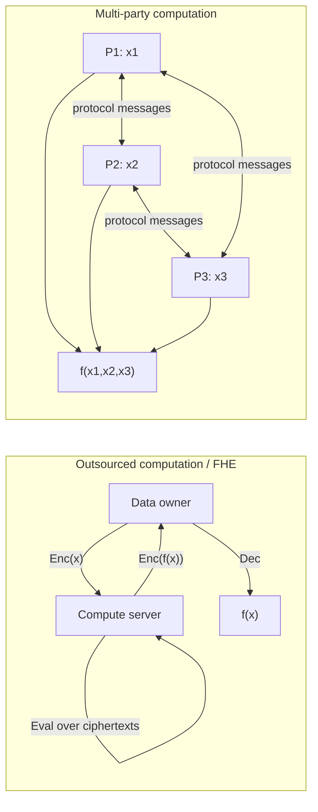

**Threat model and pitfalls.**

* FHE protects data against the compute server but usually assumes the decryptor is trusted.
* MPC removes the central trusted compute server but introduces network, synchronization, protocol-state, and active-cheating risks.
* In practical deployments, output leakage and metadata leakage often dominate pure cryptographic leakage.

**Engineering considerations.**

* MPC is usually attractive in **high-bandwidth, low-latency environments**.
* FHE may be better when communication is scarce and computation is cheap or batched.
* Hybrid systems often combine MPC, HE, and custom protocols.

---

### 3. MPC applications and deployments

**What the PDF says.**
The PDF discusses Yao’s Millionaires Problem, secure auctions, voting, secure machine learning, private set intersection, privacy-preserving genomics, ad conversion, spam filtering, key management, and several deployments including Danish sugar beet auctions, the Estonian student study, Boston wage equity, and key-management hardening. 

**Underlying concept.**
MPC is useful when parties need **joint computation without data pooling**. It is often deployed not as a privacy add-on, but as an **enabler** for computations that would otherwise be legally, organizationally, or commercially impossible.

**Ambiguity / inconsistency.**
In the key-management example, the PDF discusses shared-key authentication but also refers to retrieving a user’s “public key `sk_U`.” The notation `sk` conventionally means **secret key**, not public key. The most likely interpretation is that the text means **sensitive authentication key material**, not a literal public key.

**Security implications.**

* Auctions require bid privacy, non-malleability, and correctness.
* Voting requires privacy, correctness, and additionally coercion resistance, which is explicitly outside ordinary MPC definitions.
* Secure ML inference protects both the client input and server model, depending on output policy.
* Key-management MPC changes the attacker’s task from compromising one key server to compromising enough MPC key-share holders.

**Key-management trust boundary.**

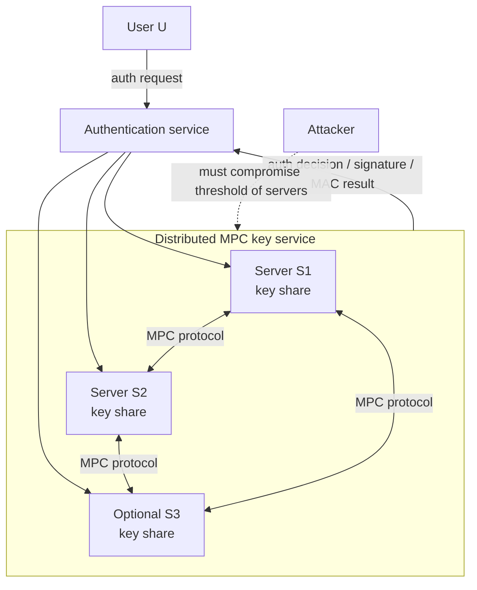

**Engineering considerations.**

* Use independent administrative domains where possible.
* Use heterogeneous software stacks to reduce common-mode compromise.
* Never reconstruct long-term key material in one process.
* Audit output semantics carefully: the final answer may itself leak private data.

---

### 4. Formal MPC definitions

**What the PDF says.**
The PDF introduces notation, computational/statistical security parameters, indistinguishability, secret sharing, random oracles, the real/ideal paradigm, semi-honest security, malicious security, security with abort, adaptive corruption, hybrid worlds, universal composability, oblivious transfer, commitments, and zero-knowledge proofs. 

**Underlying concept.**
MPC security is defined by simulation:

* In the **ideal world**, a trusted party receives inputs and returns outputs.
* In the **real world**, parties run a protocol.
* A protocol is secure if every real-world adversarial view can be simulated from only the ideal-world leakage.

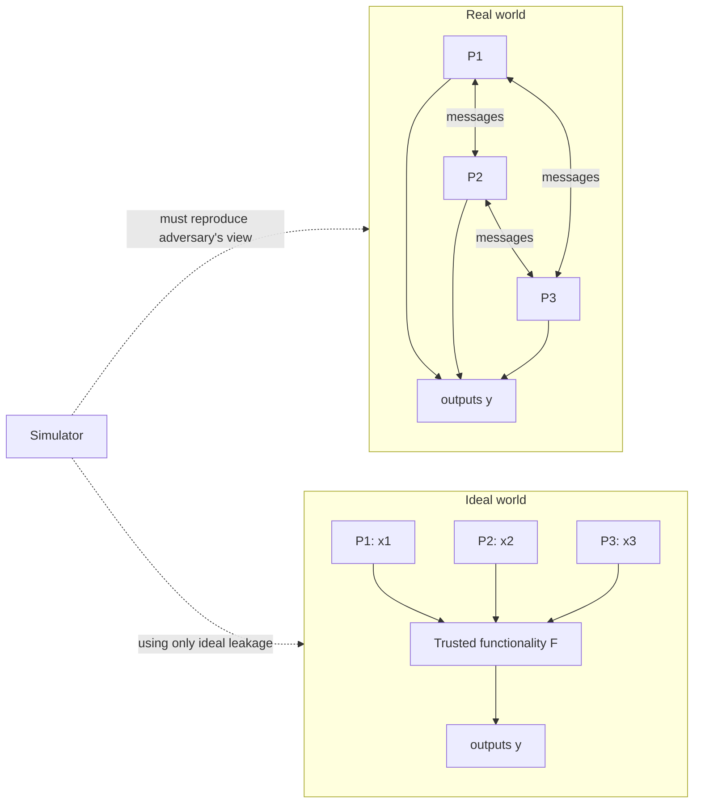

**Relevant assumptions.**

* Computational security parameter `κ`, typically 128 or 256 bits.
* Statistical security parameter `σ`, often 40 or 80 bits.
* Secure point-to-point channels are assumed by the text.
* Some protocols use the **random oracle model**, though PRFs may suffice in certain constructions.

**Pitfalls.**

* Semi-honest security does **not** protect against malformed messages.
* Malicious security often gives **security with abort**, not fairness.
* UC security is stronger and supports concurrent composition, but not every proof model gives UC security.
* Adaptive corruption is harder than static corruption and is mostly outside the document’s scope.

---

### 5. Secret sharing and basic primitives

**What the PDF says.**
Secret sharing is introduced as a core primitive: a `(t,n)` scheme splits a secret into `n` shares such that fewer than `t` shares reveal nothing, while `t` shares reconstruct the secret. The PDF also defines random oracles, oblivious transfer, commitment, and zero-knowledge proof functionalities. 

**Mechanism.**

For additive sharing over a field:

```text
Share(x):
    choose x1, ..., x_{n-1} uniformly
    set xn = x - Σ xi
    return (x1, ..., xn)

Reconstruct(x1, ..., xn):
    return Σ xi
```

For XOR sharing over bits:

```text
Share(b):
    choose b1, ..., b_{n-1} uniformly
    set bn = b XOR b1 XOR ... XOR b_{n-1}
    return (b1, ..., bn)
```

**Guarantee.**

* Any strict subset of additive/XOR shares is information-theoretically independent of the secret.
* Reconstruction requires enough shares.
* In malicious settings, plain sharing is insufficient; shares must be authenticated or consistency-checked.

---

### 6. Yao’s garbled circuits

**What the PDF says.**
Yao’s garbled circuit protocol is presented as a major two-party MPC technique. It is constant-round and avoids the circuit-depth latency of protocols like GMW. The PDF explains the lookup-table intuition, point-and-permute, wire labels, garbled gates, OT for evaluator inputs, and evaluation by decrypting exactly one row per gate. 

**Core idea.**
Represent a Boolean circuit so that each wire value is encoded as a random-looking label:

```text
wire w:
    label_0 = random κ-bit key
    label_1 = random κ-bit key
```

The evaluator learns exactly one label per input wire and can evaluate gate by gate, but cannot decode intermediate semantic bits.

**Protocol trace.**

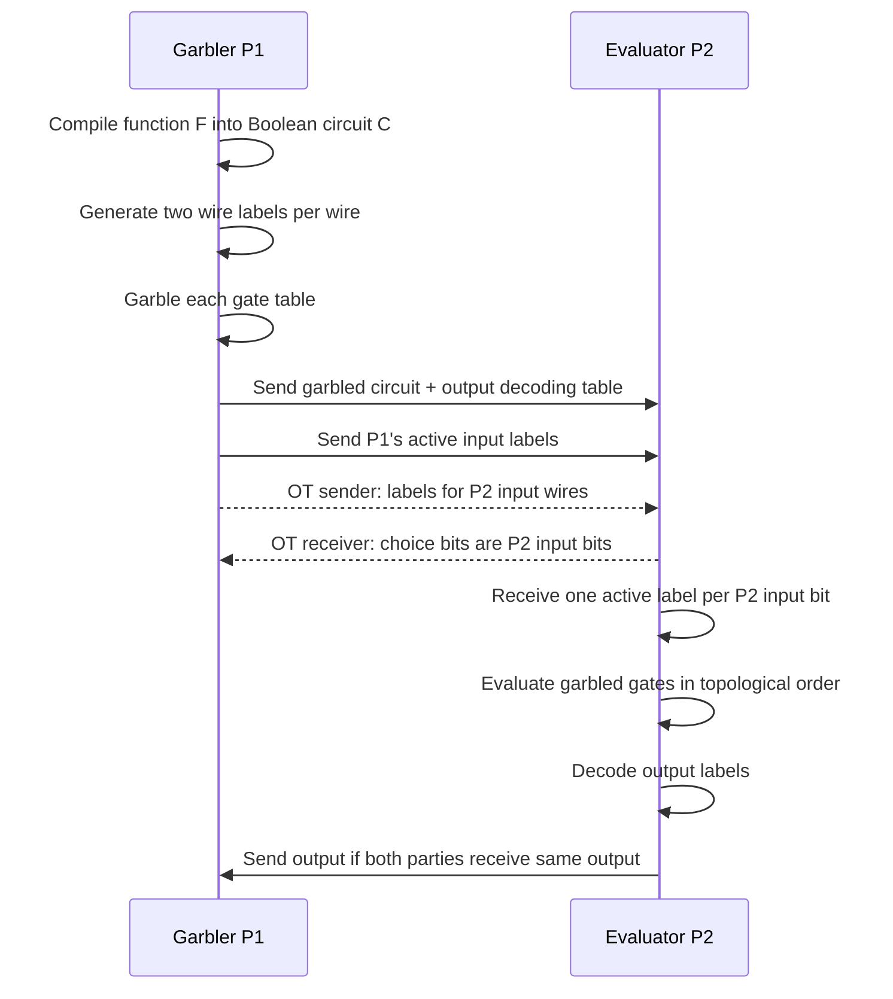

**Internal mechanism.**

For gate `g(a,b) -> c`:

```text
entry[p_a][p_b] = H(k_a || k_b || gate_id) XOR label_c[g(a,b)]
```

The point bits `p_a`, `p_b` tell the evaluator which row to try without revealing whether the underlying semantic bit is 0 or 1.

The PDF’s protocol description explicitly uses OT for the evaluator’s input labels and a random oracle-style hash for garbled table encryption. 

**Security guarantees.**

In the semi-honest model:

* P1 learns no information about P2’s input because OT hides P2’s choices.
* P2 learns only one label per wire and cannot evaluate alternative paths.
* Intermediate values remain hidden because labels are random encodings.
* Output leakage is exactly what the decoded output reveals.

**Attack surfaces and pitfalls.**

* **Selective failure attack** if malicious garbler gives invalid labels depending on evaluator input.
* **Malformed garbled circuit** if P1 cheats.
* **Insecure hash/PRF domain separation** can cause label collisions or related-key attacks.
* **Label reuse across circuits** can destroy privacy.
* **Output decoding ambiguity** if labels are not authenticated or checked correctly.
* **Side channels** in evaluator code can leak which gates/rows are accessed if implementation is not constant-time.

**Engineering considerations.**

* Yao GC is attractive for low-round WAN settings.
* Cost scales mostly with number of non-free gates and garbled-table bandwidth.
* Boolean circuits are natural for bitwise logic but inefficient for large arithmetic unless optimized.
* Use fixed-key AES/hash-based correlation-robust primitives carefully with domain separation.
* Avoid ad hoc serialization; protocol transcript formats must be unambiguous and versioned.

---

### 7. GMW protocol

**What the PDF says.**
The GMW protocol works over Boolean and arithmetic circuits. The PDF presents the two-party Boolean version and explains how inputs are secret-shared, XOR gates are local, and AND gates require interaction, usually via OT. The number of communication rounds scales with circuit depth. 

**Concept.**
GMW computes directly on secret shares.

For Boolean sharing:

```text
x = x1 XOR x2
y = y1 XOR y2
```

XOR is local:

```text
z = x XOR y
z1 = x1 XOR y1
z2 = x2 XOR y2
```

AND requires interaction because:

```text
z = x AND y
  = (x1 XOR x2) AND (y1 XOR y2)
```

The cross terms require secure multiplication.

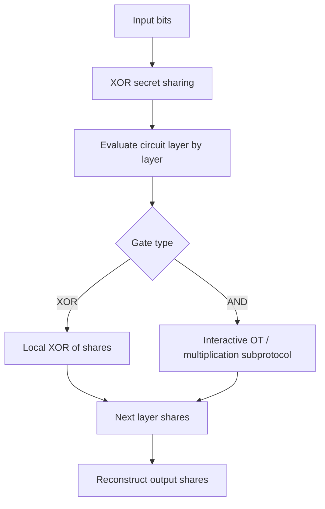

**Security guarantees.**

* Semi-honest privacy follows from the randomness of shares plus OT security.
* The round complexity is proportional to multiplicative depth.
* Communication can be high for deep circuits.

**Engineering considerations.**

* Prefer GMW for circuits with low multiplicative depth.
* Use batching and OT extension aggressively.
* Circuit synthesis should minimize AND depth, not just gate count.
* Latency dominates in WAN environments.

---

### 8. BGW protocol

**What the PDF says.**
The PDF presents BGW as a many-party MPC protocol over arithmetic or Boolean circuits, based on secret sharing. It is in the family of foundational MPC protocols summarized in the fundamental protocols chapter. 

**Concept.**
BGW uses polynomial secret sharing, typically Shamir sharing. Addition is local. Multiplication increases polynomial degree and therefore requires degree reduction.

**Internal mechanism.**

```text
Secret x is encoded as polynomial f where f(0)=x.
Party Pi receives share f(i).

Addition:
    [z]_i = [x]_i + [y]_i

Multiplication:
    local product share h(i) = f(i) * g(i)
    h has degree 2t
    run degree-reduction protocol to restore degree t
```

**Security assumptions.**

* Honest-majority thresholds are central.
* Information-theoretic security is possible under suitable corruption bounds.
* Synchronous communication and authenticated channels are generally required.

**Engineering considerations.**

* Excellent for honest-majority deployments.
* Poor fit for two-party dishonest-majority settings.
* Requires careful field selection, interpolation, and threshold management.
* Degree reduction can dominate communication.

---

### 9. MPC from preprocessed multiplication triples

**What the PDF says.**
The PDF covers MPC using preprocessed multiplication triples. This is a major paradigm where expensive cryptography is moved offline and the online phase becomes lightweight. 

**Concept.**
A Beaver triple is:

```text
[a], [b], [c] where c = a * b
```

To multiply secret values `[x]` and `[y]`:

```text
d = open([x] - [a])
e = open([y] - [b])
[z] = [c] + d[b] + e[a] + de
```

**Why it works.**
Opening `d` and `e` is safe because `a` and `b` are random masks. The product expands as:

```text
xy = (a+d)(b+e)
   = ab + db + ea + de
```

**Mermaid data flow.**

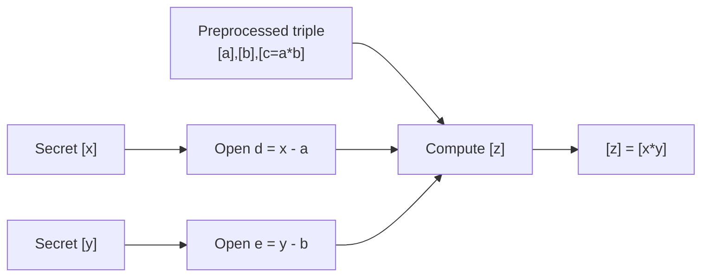

**Engineering considerations.**

* Preprocessing enables low-latency online inference.
* Triple generation must be audited; bad triples break correctness and possibly privacy.
* Triple storage is sensitive operational material.
* Consumption counters must prevent reuse.

---

### 10. BMR and constant-round MPC

**What the PDF says.**
The PDF includes BMR as a constant-round multi-party computation protocol over Boolean circuits. It appears in the fundamental protocols chapter’s list of generic approaches. 

**Concept.**
BMR generalizes garbled circuits to multiple parties. Instead of one garbler, all parties contribute randomness to wire labels and garbled tables.

**Security intent.**

* Reduce round complexity.
* Avoid trusting a single circuit generator.
* Support many-party computation.

**Engineering considerations.**

* More complex than two-party Yao.
* Requires careful distributed garbling and consistency.
* Communication can be heavy.
* Implementation bugs in label composition are particularly dangerous.

---

### 11. Information-theoretic garbled circuits / GESS

**What the PDF says.**
The PDF discusses information-theoretic garbled circuits, including GESS, as another fundamental MPC construction. 

**Concept.**
The construction aims to obtain garbling-like behavior using information-theoretic techniques, typically at the cost of growth in shares or formula-specific constraints.

**Security assumptions.**

* Unlike computational garbling, security can be statistical/information-theoretic.
* Usually less efficient or less general than computational garbling.

**Engineering considerations.**

* Useful mostly for conceptual grounding or niche trust models.
* Less likely to be the default practical engineering choice than Yao/GMW/SPDZ-family protocols.

---

### 12. Oblivious transfer

**What the PDF says.**
OT is presented as an essential building block. In 1-out-of-2 OT, the sender has `x0, x1`; the receiver has choice bit `b`; the receiver learns `xb` and nothing about `x1-b`; the sender learns nothing about `b`. 

**Workflow.**

```mermaid
sequenceDiagram
    participant S as Sender
    participant R as Receiver

    S->>S: Inputs x0, x1
    R->>R: Choice bit b
    S<->>R: OT protocol
    R->>R: Learns xb only
    S->>S: Learns nothing about b
```

**Security guarantees.**

* Receiver privacy: sender does not learn `b`.
* Sender privacy: receiver learns only one message.
* OT completeness: receiver obtains the selected message.

**Implementation pitfalls.**

* Base OT must be secure; OT extension inherits its root trust.
* Correlation-robust hashing is required in OT extension variants.
* Reusing OT seeds incorrectly can break privacy.
* Malicious OT extension requires extra consistency checks.

---

### 13. Private set intersection and custom protocols

**What the PDF says.**
The PDF treats PSI as a particularly important specialized MPC functionality and notes that custom protocols may outperform generic MPC for specific tasks. 

**Concept.**
PSI lets parties compute:

```text
A ∩ B
```

without revealing non-intersecting elements.

**Threat model nuance.**

* Revealing the intersection itself may leak sensitive information.
* Cardinality leakage, set-size leakage, and frequency leakage may matter.
* Malicious PSI must prevent one party from using malformed encodings to test arbitrary predicates.

**Engineering considerations.**

* Use domain-separated hashing and canonical encoding.
* Consider PSI-cardinality if full intersection is excessive.
* Rate-limit or audit repeated PSI queries.
* For large sets, memory locality and network streaming dominate.

---

### 14. Implementation techniques: cheaper garbling

**What the PDF says.**
The PDF explains that GC cost is dominated by garbled-table bandwidth and generation/evaluation computation. It surveys point-and-permute, garbled row reduction, FreeXOR, and half gates. A table compares ciphertexts and hash calls per XOR/AND gate across techniques. 

**Key optimizations.**

| Optimization          | Main idea                                  | Engineering impact                  |
| --------------------- | ------------------------------------------ | ----------------------------------- |
| Point-and-permute     | Add selection bits to labels               | Avoid trial decryptions             |
| Garbled row reduction | Omit one ciphertext per gate               | Reduces bandwidth                   |
| FreeXOR               | XOR gates require no ciphertexts           | Huge savings for XOR-heavy circuits |
| Half gates            | AND gates use two ciphertexts with FreeXOR | Modern efficient garbling baseline  |

**Important assumption.**
The PDF notes that FreeXOR relies on stronger-than-standard assumptions, and half gates depend on FreeXOR. 

**Misuse risks.**

* FreeXOR’s global offset `Δ` must be generated and handled correctly.
* Do not reuse garbling labels across sessions.
* Hash/AES calls must include gate IDs and roles for domain separation.
* Fixed-key AES optimizations must not accidentally create related-input weaknesses.

---

### 15. Circuit optimization

**What the PDF says.**
Because circuit-based MPC cost scales with circuit size, reducing circuit size directly reduces protocol cost. The PDF discusses manual circuit design, automated tools, low-depth circuits, and examples such as oblivious permutation and conditional swappers. 

**Ambiguity / likely typo.**
In the conditional swapper discussion, the snippet says swapped outputs are `(b1 = a2 and b2 = b1)`. The likely intended expression is `(b1 = a2 and b2 = a1)`, because otherwise both outputs would depend on `b1`.

**Engineering implications.**

* For Yao, optimize **non-free gate count**.
* For GMW, optimize **multiplicative depth**.
* For arithmetic MPC, optimize field multiplications and conversions.
* For mixed protocols, optimize representation changes.

**Conditional swapper.**

```text
t  = p AND (a1 XOR a2)
b1 = a1 XOR t
b2 = a2 XOR t
```

If `p=0`, outputs are unchanged. If `p=1`, outputs swap.

---

### 16. Protocol execution and programming tools

**What the PDF says.**
The PDF discusses execution-level optimizations and programming tools for MPC. It notes that modern frameworks improved dramatically over Fairplay and can execute millions of gates per second, scaling to very large circuits. 

**Engineering considerations.**

* Pipeline garbling, transmission, and evaluation.
* Avoid storing the entire circuit if streaming is possible.
* Batch OTs and cryptographic operations.
* Use deterministic circuit compilation for auditability.
* Version circuits and transcript encodings.
* Separate offline preprocessing from online execution.

**State machine.**

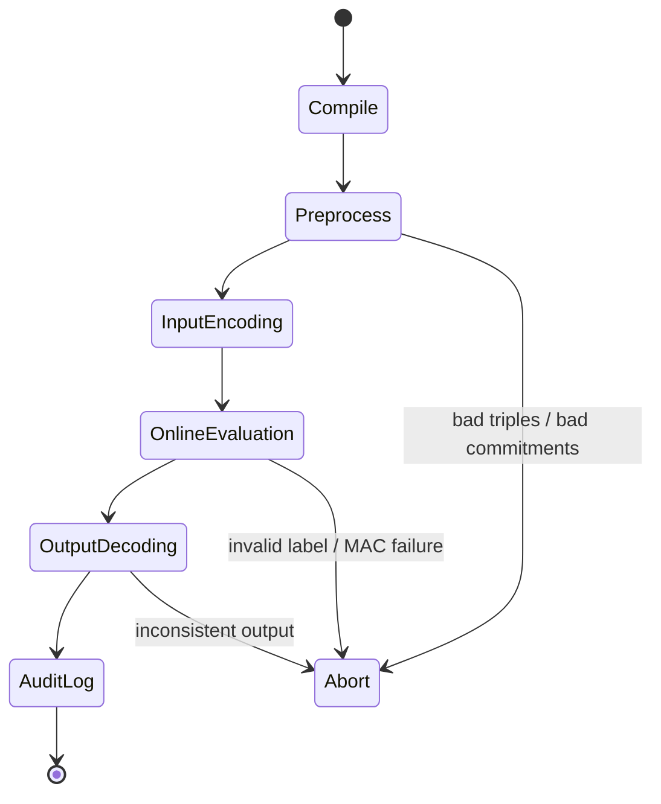

---

### 17. Oblivious data structures and RAM-MPC

**What the PDF says.**
The PDF has a full chapter on oblivious data structures, including tailored oblivious data structures, RAM-based MPC, tree-based RAM-MPC, square-root RAM-MPC, and Floram. 

**Concept.**
Circuit MPC naturally evaluates fixed circuits. RAM programs introduce secret-dependent memory access, which leaks unless made oblivious.

**Threat.**

```text
if secret_bit:
    read A[i]
else:
    read A[j]
```

Even if data values are encrypted/shared, the memory address may reveal `secret_bit`.

**Oblivious access goal.**

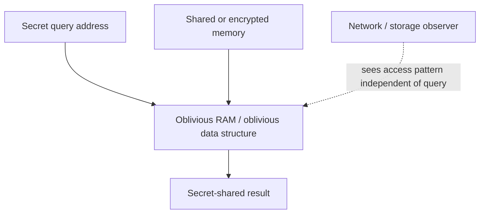

**Engineering considerations.**

* ORAM reduces leakage but adds bandwidth and latency.
* Tree-based ORAM has eviction/stash complexity.
* Square-root approaches trade periodic reshuffling for lower overhead in some regimes.
* Oblivious data structures should be selected based on access locality, batch size, and leakage budget.

---

### 18. Malicious security: cut-and-choose

**What the PDF says.**
The malicious-security chapter covers cut-and-choose, input recovery, batched cut-and-choose, LEGO, zero-knowledge proofs, BDOZ/SPDZ, and authenticated garbling. 

**Concept.**
Cut-and-choose hardens garbled circuits by making the garbler produce many circuits. The evaluator randomly opens some for checking and evaluates the rest.

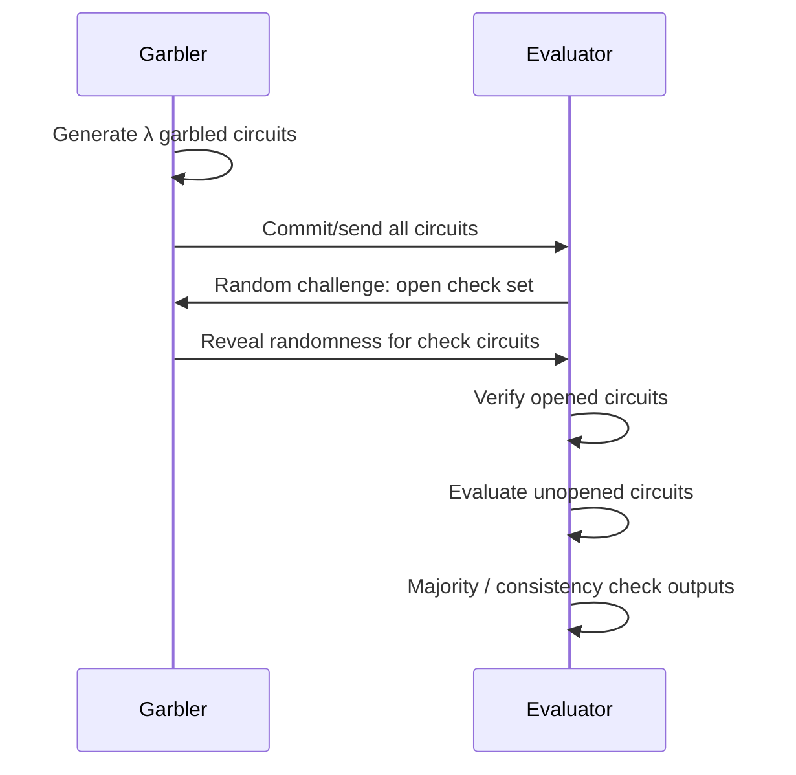

**Security guarantee.**

* A cheating garbler must guess which circuits will be evaluated.
* Detection probability grows with replication factor.

**Pitfalls.**

* Selective failure on evaluator input.
* Inconsistent input encoding across evaluated circuits.
* Improper challenge generation.
* Weak commitments.
* Reusing circuits or challenge randomness.

---

### 19. LEGO gate-level cut-and-choose

**What the PDF says.**
The LEGO paradigm performs cut-and-choose at the garbled-gate level, assembling checked gates into fault-tolerant circuit components. The PDF explains soldering wire labels and notes that LEGO can improve over circuit-level cut-and-choose for large circuits, though soldering adds cost. 

**Mechanism.**

If wire `u` and wire `v` represent the same semantic bit, solder value:

```text
σ_uv = k_u^0 XOR k_v^0
```

Then evaluator maps:

```text
k_u^b XOR σ_uv = k_v^b
```

assuming FreeXOR-style label structure.

**Engineering considerations.**

* LEGO is complex and implementation-risky.
* Soldering metadata must be authenticated.
* Bucket construction must be statistically sound.
* Majority decoding must handle malformed gates safely.

---

### 20. Zero-knowledge-based malicious security

**What the PDF says.**
The PDF presents zero-knowledge proofs as an alternative to cut-and-choose: parties prove they followed the semi-honest protocol correctly without revealing their secrets. 

**Concept.**
Instead of sampling many circuits, prove correct construction or correct protocol behavior.

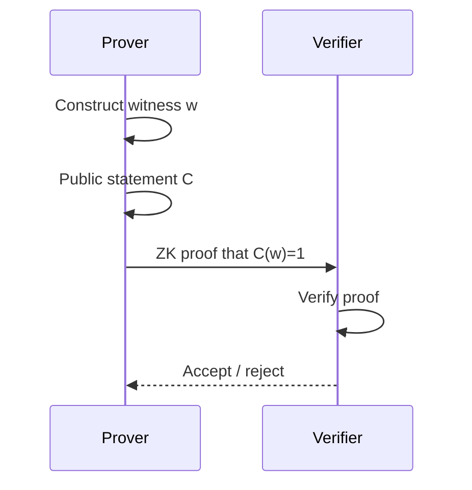

**Security properties.**

* Completeness: honest prover convinces verifier.
* Soundness / knowledge soundness: cheating prover cannot prove false statements except negligibly.
* Zero knowledge: proof leaks no witness beyond statement validity.

**Engineering considerations.**

* ZK can be expensive.
* Statement encoding must exactly match protocol correctness.
* Fiat-Shamir transforms require careful domain separation.
* Proof systems must be selected based on circuit size, setup assumptions, and batching.

---

### 21. Authenticated secret sharing: BDOZ and SPDZ

**What the PDF says.**
The malicious-security chapter covers authenticated secret sharing, including BDOZ and SPDZ. 

**Concept.**
Each secret share is protected by a MAC so parties cannot tamper with shares undetected.

Simplified SPDZ-style invariant:

```text
MAC(x) = α * x
```

where `α` is a global secret MAC key shared among parties.

Each party holds:

```text
[x]_i and [γ(x)]_i
```

At opening, parties reveal shares and check that the reconstructed MAC is consistent.

**Threat addressed.**

* Malicious parties modifying shares.
* Incorrect multiplication.
* Output forgery.

**Pitfalls.**

* Reusing preprocessing material.
* Leaking the global MAC key.
* Failing to batch-check openings safely.
* Incorrect finite-field modulus choices.
* Bad randomness in preprocessing.

**Engineering considerations.**

* SPDZ-family protocols are strong for arithmetic circuits.
* Preprocessing can be expensive but amortized.
* Excellent fit for ML-style linear algebra if representation is arithmetic.
* Conversion between Boolean and arithmetic shares is costly and must be minimized.

---

### 22. Authenticated garbling

**What the PDF says.**
The PDF includes authenticated garbling as another malicious-secure technique. 

**Concept.**
Attach authentication to garbled values so malformed labels or inconsistent transitions are detected.

**Threats addressed.**

* Malicious garbler/evaluator deviations.
* Label substitution.
* Output manipulation.
* Selective aborts.

**Engineering considerations.**

* Authentication metadata increases bandwidth.
* Must be compatible with garbling optimizations.
* Failure handling matters: abort reason must not leak secret-dependent information.

---

### 23. Honest-majority protocols

**What the PDF says.**
Alternative threat models include honest majority. The PDF specifically covers honest-majority variants and three-party secret sharing. 

**Concept.**
If fewer than half, or in some protocols fewer than one third, of parties are corrupt, information-theoretic or highly efficient MPC becomes possible.

**Engineering implications.**

* Very high throughput is achievable.
* Requires trust distribution: corruption threshold assumptions must be organizationally credible.
* Best for consortia, internal split-trust services, and cross-organization analytics.

**Pitfalls.**

* “Three servers” does not automatically imply honest majority.
* Cloud co-location can collapse independence.
* Shared administrators or shared CI/CD pipelines may invalidate trust assumptions.

---

### 24. Asymmetric trust

**What the PDF says.**
The PDF discusses asymmetric trust as an alternative model. 

**Concept.**
Some parties may be more trusted, or a helper/server may be assumed non-colluding or semi-honest.

**Engineering use cases.**

* Server-aided PSI
* Analytics with independent auditors
* Split-control key services
* Regulated cross-domain computation

**Risk.**

The model must be documented precisely. “Non-colluding” is an operational assumption, not a cryptographic fact.

---

### 25. Covert security and publicly verifiable covert security

**What the PDF says.**
The PDF covers covert security and publicly verifiable covert security. PVC allows an honest party to publish a certificate of cheating verifiable by a third party. The PDF discusses signed messages and signed OT in this context. 

**Concept.**

* Malicious security: cheating should not help.
* Covert security: cheating may succeed, but is detected with some probability.
* PVC: detected cheating produces transferable evidence.

```mermaid
sequenceDiagram
    participant A as Party A
    participant B as Party B
    participant J as Judge / Third Party

    A->>B: Signed protocol messages
    A<->>B: Signed OT / committed transcript
    B->>B: Detect inconsistency
    B->>J: Certificate of cheating
    J->>J: Verify signatures/transcript
    J-->>B: Publicly verifies culprit
```

**Engineering considerations.**

* Useful where reputation, contracts, or legal penalties deter cheating.
* Requires durable transcript logging.
* Key management for signing keys becomes part of the security boundary.
* Evidence format must be stable and independently verifiable.

---

### 26. Reducing communication and leakage/efficiency tradeoffs

**What the PDF says.**
The PDF discusses reducing communication in cut-and-choose and trading leakage for efficiency, including dual execution and memory-access leakage. 

**Concept.**
Some protocols intentionally leak limited information to gain large performance improvements.

**Senior engineering interpretation.**

This is acceptable only if leakage is:

1. Explicitly modeled.
2. Bounded.
3. Reviewed against the application’s privacy requirement.
4. Documented in the system security case.

**Pitfall.**

A protocol that leaks “only one bit” per run may leak the full secret under repeated adaptive queries.

---

### 27. Conclusion

**What the PDF says.**
The conclusion states that MPC has progressed from theoretical curiosity to practical privacy-preserving technology, with major cost reductions and modern frameworks reaching very high gate rates. It also highlights remaining challenges: cost, custom protocols, secure hardware, access-pattern leakage, and output leakage. 

**Engineering takeaway.**

MPC is practical, but not automatic. The hard problems are usually:

* Selecting the right protocol family.
* Encoding the function efficiently.
* Choosing a realistic adversary model.
* Controlling output leakage.
* Operating preprocessing securely.
* Explaining the trust model to non-cryptographers.

---

## Deep cryptographic explanation

### MPC as ideal-functionality emulation

The core abstraction is:

```text
Parties P1...Pn hold x1...xn.
They want y = F(x1,...,xn).
They should learn y and nothing else.
```

The real/ideal paradigm says a protocol is secure if an adversary’s real transcript can be simulated from ideal-world information only.

This is stronger than informal confidentiality because it captures:

* Input privacy
* Correctness
* Independence of adversarial inputs
* Output consistency, depending on model
* Abort behavior
* Composition behavior, if UC-secure

### Yao vs GMW vs secret-sharing MPC

| Protocol family  | Best fit                              |    Round complexity | Main cost                   | Security model in PDF chapter  |
| ---------------- | ------------------------------------- | ------------------: | --------------------------- | ------------------------------ |
| Yao GC           | 2PC Boolean circuits                  |            Constant | Bandwidth / garbled gates   | Semi-honest first              |
| GMW              | Low-depth Boolean/arithmetic circuits |       Circuit depth | Interactive multiplications | Semi-honest first              |
| BGW              | Honest-majority many-party            |       Circuit depth | Degree reduction            | Foundational                   |
| Triple-based MPC | Arithmetic circuits, online speed     |          Low online | Preprocessing               | Semi-honest/malicious variants |
| BMR              | Constant-round many-party Boolean     |            Constant | Distributed garbling        | Foundational                   |
| SPDZ-style       | Malicious arithmetic MPC              | Preprocess + online | Triple/MAC generation       | Malicious                      |

---

## Security and threat-model analysis

### Threat model matrix

| Threat model     | Adversary behavior                 | Typical guarantee                       | Main residual risk                       |
| ---------------- | ---------------------------------- | --------------------------------------- | ---------------------------------------- |
| Semi-honest      | Follows protocol, tries to learn   | Privacy against transcript analysis     | No protection against malformed messages |
| Malicious        | Arbitrary deviation                | Privacy/correctness, usually with abort | Fairness usually not guaranteed          |
| Covert           | May cheat if unlikely to be caught | Detection with probability              | Cheating can succeed                     |
| PVC              | Covert + public evidence           | Transferable blame                      | Requires signed/auditable transcripts    |
| Honest majority  | Threshold of corruptions bounded   | Very efficient MPC                      | Organizational independence assumption   |
| Asymmetric trust | Some helper/server trust           | Efficiency                              | Collusion breaks model                   |

### Principal attack surfaces

1. **Input encoding attacks**: malformed labels, inconsistent shares, selective failure.
2. **Preprocessing attacks**: bad triples, reused triples, corrupted MAC material.
3. **Circuit attacks**: wrong function compiled, malicious garbling, incorrect output decoding.
4. **Protocol-state attacks**: replay, transcript confusion, session mix-up.
5. **Side channels**: timing, memory access, branch behavior, abort reasons.
6. **Output attacks**: repeated queries, differencing, reconstruction from aggregate outputs.
7. **Operational attacks**: common admin domain, shared infrastructure, weak key custody.

---

## Implementation guidance

### Protocol selection

Use this decision rule:

```text
if two-party and Boolean-heavy and WAN-latency-sensitive:
    prefer Yao GC / optimized garbling
elif Boolean and low-depth:
    consider GMW
elif arithmetic-heavy and preprocessing acceptable:
    consider SPDZ / triple-based MPC
elif honest-majority deployment is credible:
    consider BGW / 3PC secret-sharing protocols
elif set operation:
    prefer specialized PSI
elif secret memory access dominates:
    evaluate ORAM / RAM-MPC / leakage-tolerant design
```

### Engineering checklist

* Define the exact functionality `F` before choosing a protocol.
* Specify the adversary model in writing.
* Separate cryptographic security from output privacy.
* Use domain-separated hashes/PRFs.
* Never reuse wire labels, triples, masks, or OT correlations.
* Authenticate protocol messages.
* Bind transcripts to session IDs, circuit hashes, party IDs, and protocol versions.
* Use constant-time cryptographic operations.
* Make abort behavior non-secret-dependent where possible.
* Log enough for audit, but never log shares, labels, seeds, or preprocessing secrets.
* Treat preprocessing stores as cryptographic key material.
* Validate generated circuits against a high-level specification.
* Add differential privacy or query controls if outputs are aggregate statistics.

---

## Mermaid diagrams

### Yao garbled-circuit pipeline

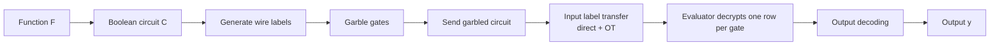

### Beaver triple multiplication

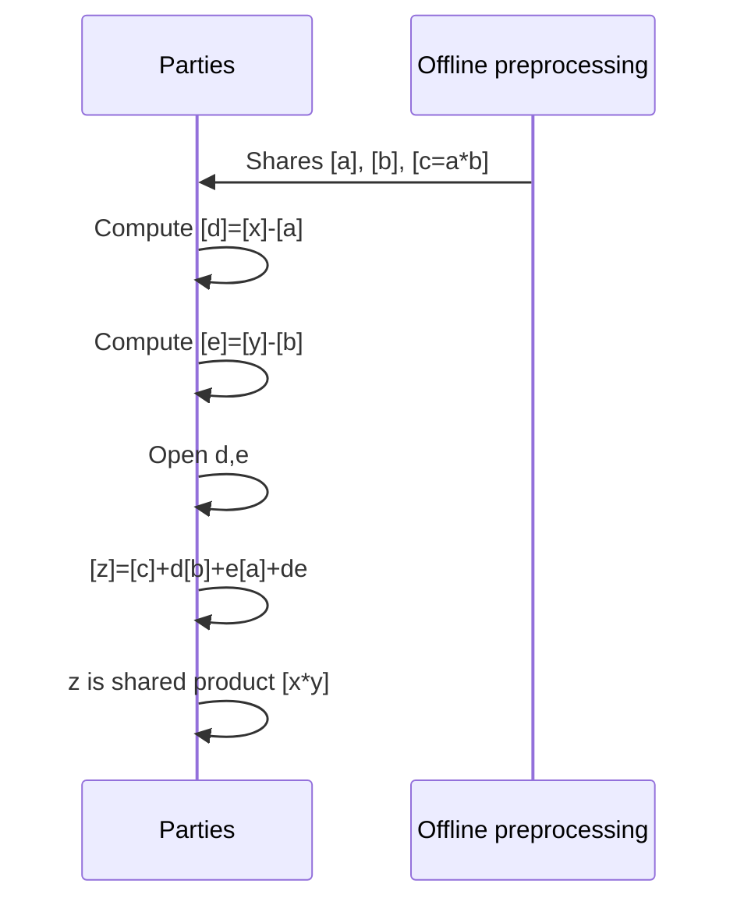

### Threat boundary

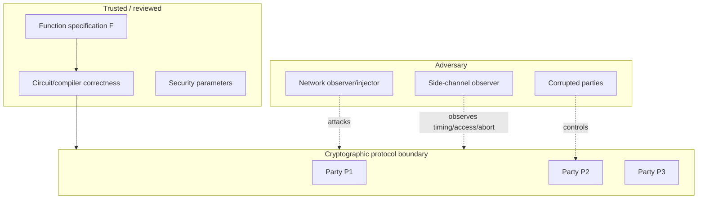

---

## Key takeaways

1. MPC security is best understood as **simulation-based ideal-functionality emulation**, not merely encryption.
2. Yao GC, GMW, BGW, triple-based MPC, BMR, and SPDZ solve different engineering problems; there is no universally best protocol.
3. Semi-honest protocols are useful foundations but unsafe against active adversaries without hardening.
4. Malicious security usually costs significantly more and often provides **security with abort**, not guaranteed fairness.
5. Practical performance depends more on circuit representation, batching, preprocessing, network behavior, and leakage policy than on asymptotic protocol labels alone.
6. Output leakage and access-pattern leakage are outside the simplest MPC confidentiality story and must be analyzed explicitly.
7. Operational trust assumptions are as important as cryptographic assumptions.

---

## Final technical summary

This PDF is a rigorous practitioner-oriented survey of MPC. Its central message is that MPC can replace a trusted third party with a cryptographic protocol, but only under carefully specified assumptions. The document proceeds from formal security definitions to concrete protocol families, then to implementation optimizations and stronger adversarial models.

For a senior cryptography/security engineering audience, the most important lesson is that MPC deployment is a **systems-security exercise**, not just a protocol choice. Correctness of the computed function, circuit compilation, parameter selection, preprocessing hygiene, side-channel behavior, output governance, auditability, and organizational trust boundaries are all part of the security argument.
